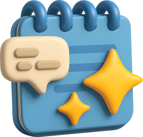

# PowerPad

*Aplicación para la gestión de conversaciones y notas con inteligencia artificial local mediante Ollama*

**Universidad Politécnica de Madrid**\
Escuela Técnica Superior de Ingeniería de Sistemas Informáticos

**TRABAJO FIN DE GRADO EN INGENIERÍA DEL SOFTWARE**

**Desarrollado por**: Bruno Camilo Grillo Cruz\
**Dirigido por**: Agustín Yagüe Panadero\
Madrid, 24 de Julio de 2025

## Resumen

El presente trabajo se centra en el desarrollo de una aplicación de escritorio que permite la interacción con modelos de lenguaje de gran tamaño (LLMs) de forma local, combinando accesibilidad, personalización y eficiencia. La solución propuesta utiliza Ollama como motor de ejecución local, eliminando la dependencia de servicios en la nube, garantizando así privacidad y control sobre los datos almacenados.

El sistema se concibe como una herramienta productiva con una interfaz moderna basada en el SDK de aplicaciones de Windows, a través de la cual los usuarios pueden realizar conversaciones o ediciones asistidas por IA, con la posibilidad de configurar agentes personalizados para resumir, traducir o mejorar textos. Además, facilita la gestión de modelos de IA de forma sencilla, permitiendo su búsqueda y descarga sin necesidad de conocimientos avanzados, e incluye un diálogo emergente de edición rápida que mejora la experiencia del usuario. Adicionalmente, se ofrece la opción de un entorno híbrido, almacenando las conversaciones y notas en local, pero utilizando servicios de IA en la nube.

En cuanto al marco teórico, el proyecto incluye documentación sobre el estado del arte de la IA generativa, su historia, una introducción técnica a su funcionamiento y un análisis de la competencia, identificando los factores diferenciadores del proyecto frente a herramientas similares. También se abordan los aspectos sociales, éticos y ambientales de la inteligencia artificial generativa, así como el papel de proyectos como este en la democratización del acceso a modelos de código abierto.

En conclusión, este trabajo presenta una solución que integra la IA en el flujo de trabajo del usuario, sin comprometer la privacidad ni la seguridad de los datos. Con su enfoque modular y escalable, la aplicación sienta las bases para futuras extensiones y mejoras, presentándose como una herramienta clave para la productividad asistida por IA en entornos locales.

## Documentación

Puedes encontrar la documentación completa del proyecto en el directorio `/Wiki` de este repositorio.

## Licencia

Este proyecto está licenciado bajo los términos de la [GNU General Public License v3.0](LICENSE).
