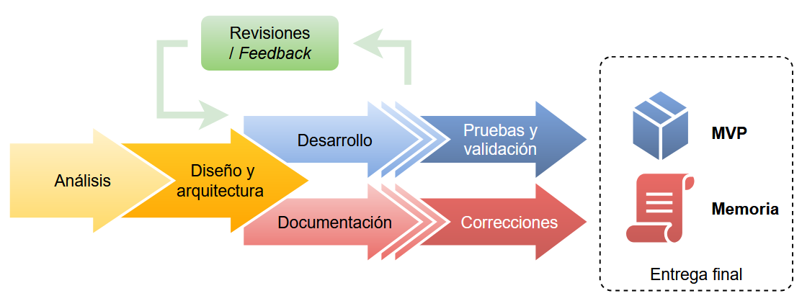

## 1.1 Contexto y motivación del proyecto

El entorno actual en el que se desarrolla la inteligencia artificial (IA) ha experimentado una enorme evolución en los últimos años, especialmente en el ámbito de la IA generativa y los asistentes conversacionales. Habitualmente, la mayoría de las soluciones basadas en modelos de lenguaje de gran tamaño (**LLMs**) se ejecutan en la nube, lo que implica una dependencia importante de la conectividad y, en muchos casos, preocupaciones en torno a la privacidad de los datos. Sin embargo, la aparición de *frameworks* como **llama.cpp** [@llama_cpp_2025] ha abierto la posibilidad de ejecutar modelos generativos potentes en ordenadores domésticos [@connatser], permitiendo una gestión directa y segura de la información. No obstante, la mayoría de las soluciones construidas sobre llama.cpp requieren conocimientos técnicos para su utilización y, en general, no son todavía muy conocidas.

En este contexto, herramientas como **Ollama** [@ollama] han simplificado la ejecución de modelos locales al actuar como un *wrapper* (envoltorio) que abstrae la complejidad técnica de llama.cpp. Ollama cuenta con una gran comunidad y ofrece un amplio repositorio de modelos *open source* recientes para su descarga y ejecución mediante línea de comandos. Además, su API ha posibilitado la aparición de diversas interfaces gráficas [@ollama_integrations], la mayoría implementaciones web que también requieren ciertos conocimientos para su configuración en servidores locales, y que normalmente no incluyen la posibilidad de buscar y descargar modelos de forma integrada.

Esta situación me ha llevado a plantear la necesidad de desarrollar una solución conjunta que gestione la ejecución de modelos locales de manera eficiente y, a la vez, ofrezca una experiencia de usuario accesible y amigable. La idea es crear una aplicación de escritorio que asista en la instalación y configuración de Ollama, integrando, además de la gestión conversacional habitual de estas herramientas, funcionalidades adicionales como la edición inteligente de notas y accesos directos para activar funciones específicas preconfiguradas como, por ejemplo, resumir, traducir o corregir textos.

Asimismo, la propuesta busca democratizar el acceso a modelos generativos *open source* en entornos locales, permitiendo que usuarios sin conocimientos técnicos altos puedan beneficiarse de las ventajas de la inteligencia artificial sin sacrificar el control sobre sus datos. La posibilidad de optar por un uso híbrido —que combine el **almacenamiento local** de nuestra información con el procesamiento en la nube o en redes privadas— amplía el espectro de aplicación y permite adaptar la solución a distintos contextos de trabajo, incluso utilizando modelos de inteligencia artificial de última generación.

Como profesional y usuario en el ámbito de la ingeniería de *software*, he identificado en mi experiencia y en el análisis del ecosistema actual una clara oportunidad para impulsar un proyecto que actúe como herramienta de productividad. La integración de asistentes conversacionales y funciones de edición de notas en un único entorno facilitará el flujo de trabajo diario, permitiendo transformar ideas en notas o conversaciones sin necesidad de cambiar de aplicación.

En definitiva, este proyecto se presenta como una respuesta a las limitaciones de las soluciones actuales y como una oportunidad para impulsar el aprendizaje y la investigación en el uso local de la inteligencia artificial. La combinación de una ejecución local robusta, una interfaz accesible y la integración de funcionalidades avanzadas no solo mejora la experiencia del usuario, sino que también sienta las bases para un ecosistema colaborativo y en constante evolución, alineado con las necesidades reales del sector.

## 1.2 Objetivos del proyecto

Este proyecto busca transformar la experiencia de interacción con modelos de lenguaje locales, ofreciendo una solución que combine facilidad de uso, funcionalidad avanzada y garantías de privacidad. Los objetivos se pueden agrupar en los siguientes apartados:

1.  **Desarrollar una aplicación de escritorio accesible**

    Crear una interfaz intuitiva y amigable que permita a usuarios sin conocimientos técnicos profundos interactuar con modelos de IA generativa de forma local, asegurando la privacidad, a través de Ollama, simplificando su instalación y configuración.

2.  **Facilitar la gestión de modelos locales y permitir opción híbrida**

    Facilitar la descarga, actualización y manejo de modelos locales a través del repositorio de Ollama u otras fuentes con formato compatible, permitiendo adicionalmente la opción de trabajar de forma híbrida: gestionando localmente las conversaciones con posibilidad de conexión a modelos en la nube o redes privadas.

3.  **Integrar funcionalidades avanzadas para la productividad**

    Incorporar herramientas adicionales como la edición inteligente de notas y accesos directos para funciones específicas y personalizables: resumir, traducir, corregir textos, etc., que potencien el flujo de trabajo diario.

4.  **Fomentar la personalización y la colaboración *open source***

    Desarrollar una plataforma modular y de código abierto que invite a la comunidad a aportar mejoras, personalizar la solución y ampliar sus funcionalidades de acuerdo con las necesidades emergentes del sector.

## 1.3 Metodología y enfoque de trabajo

El desarrollo de este proyecto se enmarca en un enfoque metodológico ágil e iterativo, que combina la investigación en el estado del arte con la implementación práctica de la solución. Debido a la naturaleza académica del trabajo, se ha optado por una metodología que permita adaptarse a cambios y aprovechar el *feedback* continuo, garantizando la calidad y la coherencia de la aplicación final.

El proceso se estructura en las siguientes fases:

1.  **Análisis y definición de requisitos**

    Se realizará una revisión exhaustiva de la literatura y del estado del arte en el ámbito de la IA generativa y la ejecución local de LLMs. A partir de esta investigación, se definirán los requisitos funcionales y no funcionales de la solución, asegurando que la propuesta responde a las necesidades detectadas.

2.  **Diseño y arquitectura del sistema**

    Con base en los requisitos, se establecerá una arquitectura que permita integrar de forma eficiente las distintas funcionalidades, tales como la gestión de modelos, la interfaz de usuario (UI) y los módulos de productividad (edición inteligente de notas y los accesos directos para funciones específicas), utilizando el patrón *Model-View-ViewModel* [@john_MVVM_2005] (**MVVM**), habitual en aplicaciones de escritorio.

3.  **Desarrollo e implementación**

    Se adoptará una metodología ágil, trabajando en *sprints* cortos que permitan iterar y refinar la solución de manera continua. Durante esta fase se implementará la aplicación utilizando el SDK de Windows [@windows_sdk] (**WinUI 3**) para la interfaz de escritorio (con C# y **.NET 8**) [@net_8], integrando el recubrimiento de Ollama y añadiendo paulatinamente las funcionalidades adicionales que optimicen el flujo de trabajo.

4.  **Pruebas y validación**

    Se realizarán pruebas tipo UAT exhaustivas para garantizar la estabilidad y usabilidad de la aplicación. Depurando posibles errores hasta validar la versión MVP (*minimum viable product*) como lista para la entrega.

5.  **Documentación**

    Paralelamente al desarrollo, se mantendrá una documentación detallada de toda la implementación en apartados específicos de la memoria, facilitando la comprensión de la solución desarrollada y permitiendo la incorporación de mejoras futuras.

6.  **Revisiones, *feedback* y entrega final**

    Durante las iteraciones de desarrollo y documentación se realizarán revisiones tanto por parte del desarrollador como del tutor del proyecto, retroalimentando la solución con el *feedback* recibido para la mejora y la conclusión de la entrega final.

