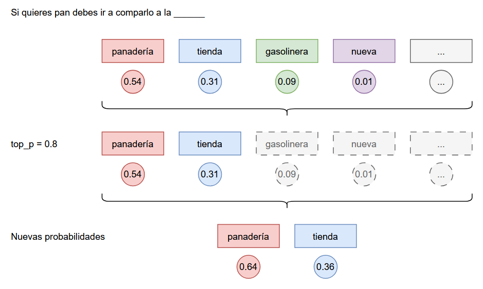

# 2. Estado del arte y fundamentos teóricos

## 2.1. Conceptos de IA generativa

### 2.1.1. Historia y evolución de la IA generativa

La inteligencia artificial generativa ha tenido un proceso evolutivo largo y fascinante, marcado por hitos importantes en el aprendizaje automático y la creación de distintos modelos computacionales. Desde los primeros pasos en las décadas de 1950 y 1960, hasta los sofisticados modelos actuales basados en transformadores (_transformers_), la IA generativa ha redefinido profundamente cómo producimos contenido textual, visual y multimedia, automatizando procesos y ampliando nuestras capacidades creativas [@article_aigc_survey_2023].

A lo largo de este recorrido, tecnologías clave como las redes neuronales recurrentes (RNNs), las redes generativas antagónicas (GANs) o los _transformers_ han sido responsables de algunos de los mayores avances en esta disciplina. Cada una de estas etapas ha supuesto innovaciones significativas que han aumentado las posibilidades de aplicación de esta tecnología.

#### De los 50 a los 2000s: Primeros pasos


-   **1950: Inicio de la investigación en redes neuronales**

    Surge la idea de emular el cerebro humano mediante algoritmos artificiales. Los primeros modelos, como el perceptrón, establecen la base para el desarrollo de redes más complejas [@press_historia_ia_2018].

-   **1960: Primeros algoritmos de aprendizaje automático**

    Se elaboran los primeros algoritmos diseñados para aprender patrones a partir de muestras de datos, un hito crucial para el aprendizaje automático. Destacan conceptos como descenso del gradiente [@book_ai_robotics_2000].

-   **1990: Avances en RNNs y _autoencoders_**

    Las redes neuronales recurrentes (RNNs) [@article_time_series_ann_2018] permitieron manejar datos secuenciales, como texto y audio. Por otro lado, los _autoencoders_ introdujeron formas eficientes de compresión y reconstrucción de datos, imprescindibles en aplicaciones como el reconocimiento de imágenes.

-   **2000: Introducción al aprendizaje profundo**

    Con el aumento de la capacidad computacional y la disponibilidad de grandes volúmenes de datos, se hicieron populares las arquitecturas de redes de aprendizaje profundo (_deep learning_). Algoritmos como el _Deep Belief Network_ [@article_deep_belief_nets_2006] y las primeras aplicaciones de convoluciones en visión por ordenador (CNNs) [@press_cnn_ibm_2021] abren el camino para las redes modernas.

#### De 2011 a 2020: Surgen los modelos generativos


-   **2014: Introducción de las GANs por Ian Goodfellow**

    Las redes generativas antagónicas (GANs) [@article_gan_2014] fueron una revolución para la generación de contenido al utilizar un par de redes que compiten entre sí: una generadora y una discriminadora.

-   **2017: Publicación de “Attention is All You Need” [@article_attention_2023], introducción de los *transformers***

    Este artículo presentó la arquitectura *Transformer*, basada en mecanismos de atención que priorizan las relaciones contextuales de los datos. Este hito marcó un antes y un después en el procesamiento de lenguaje natural (NLP).

-   **2019: Generación de texto avanzado con GPT2**

    OpenAI introduce GPT-2 [@press_gpt2_release_2024], un modelo con capacidad para generar texto coherente y relevante en diferentes contextos. Este modelo mostró el verdadero potencial de los _transformers_ para tareas de generación de texto a gran escala.

-   **2020: Modelos como _DALL-E_ generan contenido visual coherente**

    DALL-E (OpenAI) [@press_dalle_2022] combina el procesamiento del lenguaje y la generación de imágenes para crear representaciones visuales basadas en descripciones, mostrando por primera vez una integración única entre texto y contenido visual generado.

#### De 2021 a la actualidad: El BOOM de la IA generativa


-   **2021: GPT-3 establece nuevos estándares en generación de texto**

    GPT-3 [@press_gpt3_apps_2024], con 175 mil millones de parámetros, lleva las capacidades de generación de texto a un nivel nunca visto antes, destacando por su habilidad para contextualizar, interpretar y crear contenido coherente y específico.

-   **2022: Auge de modelos *open source* en IA generativa**

    Modelos como BLOOM (BigScience) [@press_bloom_2022] o Stable Diffusion (Runway) [@press_stable_diffusion_2022] contribuyeron a la democratización de la IA generativa, ofreciendo alternativas personalizables y locales a las soluciones comerciales, una aportación importante para la investigación. Muchos otros modelos *open source* surgieron desde entonces.

-   **2023: Popularización de los *small language models* (SLMs)**

    Los SLMs, como TinyLlama [@repo_tinyllama] y otras variantes compactas de LLaMA [@press_llama_history_2023], o Phi-2 (Microsoft) [@press_phi2_2023], ganaron popularidad por su capacidad de ofrecer buenos resultados con menor consumo de recursos [@article_small_lm_2024]. Se popularizaron técnicas como la destilación del conocimiento, que permiten entrenar modelos pequeños a partir de modelos grandes, reteniendo gran parte de su capacidad a un menor coste [@destilación_2024].

-   **2024: Modelos que razonan: IA explicativa y precisa**

    Modelos como o1 (OpenAI) [@press_reasoning_llm_openai_2024] y avances en Claude 3 (Anthropic) [@press_claude3_2024] producen un punto de inflexión en el razonamiento contextual y explicable, ya que no solo generan contenido, sino que emplean tiempo en razonar de forma interna antes de responder. Estas soluciones representan un paso importante hacia contenidos más seguros y confiables.

-   **2025: Explosión de nuevos modelos y servicios de IA generativa**

    El año 2025 arranca con una oleada de integraciones: DeepSeek lanza su modelo R1 [@press_deepseek_r1_2025] que asombra a la comunidad con su capacidad de razonamiento y bajo coste, Google termina de desplegar Gemini en los dispositivos Android [@press_gemini_android_2025], Microsoft incluye Copilot en la familia de productos Microsoft 365 [@press_copilot_msft_2025], Meta logra lanzar en Europa MetaAI en WhatsApp [@press_metaai_europe_2025], y xAI habilita Grok de forma gratuita en su red social X [@press_grok_ai_xataka_2024]. La IA generativa se consolida como herramienta de uso cotidiano.

### 2.1.2. Principios de los modelos generativos

Los modelos generativos se basan en aprender patrones y características a partir de datos existentes para luego crear contenido nuevo que sea coherente y relevante. A lo largo de los años, se han desarrollado distintas técnicas, arquitecturas y enfoques que han marcado hitos importantes en este campo. En este apartado, veremos algunos de los conceptos más destacados.

#### *Tokens*

Los _tokens_ son la unidad mínima de texto que procesa un determinado modelo de lenguaje. Dependiendo del enfoque, un *token* puede representar una palabra completa, una parte de una palabra (por ejemplo, "auto", "re", "mente") o incluso una sola letra o signo. La forma en que se realiza esta segmentación (también llamada *tokenización*) puede influir mucho en la eficiencia y precisión del modelo [@doc_tokenization_mistral].

El conjunto de reglas utilizadas para convertir las entradas de textos a tokens se llama *encoding*, diferentes modelos de IA generativa pueden utilizar diferentes _encodings_ [@doc_tiktoken_encoding_2022]. Al conjunto de _tokens_ reconocidos por un modelo se le denomina vocabulario. Al finalizar la _tokenización_, cada fragmento correspondiente a un _token_ es representado mediante un número entero entre cero y el tamaño total del vocabulario menos uno.

#### *Embeddings*

Para que los modelos generativos puedan entender datos como texto o incluso imágenes, es necesario convertir esa información en representaciones numéricas (vectores de números reales). En el caso del lenguaje, esto se logra a través de los llamados _embeddings_. Estas son básicamente representaciones vectoriales de palabras o *tokens*, donde cada dimensión refleja alguna característica semántica o contextual. En otras palabras, si dos palabras tienen significados similares, sus *embeddings* estarán más "cerca" en el espacio vectorial.

La generación de _embeddings_ se realiza mediante modelos específicos diseñados para esta tarea [@press_embeddings_hf_2022]. Mientras que los primeros modelos generaban vectores de cientos de dimensiones, los modelos actuales pueden producir representaciones de hasta varios miles de dimensiones, capturando matices más complejos del significado y el contexto.

#### *Transformers*

Un _transformer_ es un modelo o arquitectura de aprendizaje profundo desarrollado por científicos trabajadores de Google y publicados en el artículo de investigación *“Attention is All You Need”* [@article_attention_2023]. Su novedad reside en el mecanismo de atención, que permite detectar y priorizar las partes más relevantes del texto de entrada. Gracias a este enfoque, se logra una comprensión del contexto mucho más profunda en comparación a arquitecturas anteriores. En el siguiente apartado, se verá en detalle cómo funciona internamente esta arquitectura y por qué ha sido clave en la evolución de los modelos generativos actuales.

#### *Prompt*

El *prompt* es el texto de entrada que se proporciona a un modelo generativo para producir una salida, y su diseño influye en la calidad, precisión y relevancia de la respuesta generada, un proceso conocido como *prompt engineering*. Un buen *prompt* puede guiar al modelo en tareas específicas como responder preguntas, resumir textos, traducir, generar código o mantener una conversación coherente. Técnicas avanzadas como los *few-shot* prompts y los *chain-of-thought prompts* mejoran el rendimiento del modelo sin modificar su arquitectura [@article_fewshot_medical_2024].

#### *Fine-tuning*

El ajuste fino (_fine-tuning_) aprovecha el conocimiento adquirido por un modelo preentrenado y lo adapta a un dominio o tarea específica, reduciendo costos y tiempo de entrenamiento en comparación con empezar desde cero [@doc_finetuning_hf]. En entornos empresariales, el *fine-tuning* adquiere gran relevancia al facilitar la personalización de modelos generativos para necesidades específicas, como automatizar flujos de trabajo, procesar información, facilitar información a cliente o usuarios, convirtiéndose así en un recurso esencial para la personalización de la IA generativa.

## 2.2. Funcionamiento de la IA generativa

### 2.2.1. La arquitectura *Transformer*

La aparición de la arquitectura *Transformer* significó un punto de inflexión en el campo del procesamiento del lenguaje natural. Hasta entonces, los sistemas "leían" los textos de forma limitada, por palabras, y los *embeddings* resultantes tenían poca información de contexto. Los *transformers* son un tipo especial de red neuronal que, gracias al **mecanismo de atención** [@press_attention_ibm_2024], añaden un alto nivel de información contextual a los vectores, aumentando enormemente la precisión de las operaciones semánticas que podemos realizar con los mismos.


Con el **mecanismo de atención** es como si todas las palabras de un texto se miraran a unas las otras y se preguntaran a cuál debe prestar más atención, esto ocurre de forma paralela con todas las palabras procesadas (**Figura 2.2**), como si todas se sentasen en una mesa redonda y hablasen entre ellas. Cada vector ya no representa solo a un token independiente, sino que posee un poco de información de cuánto ese token se relaciona con cada palabra del contexto.


#### Del *embedding* al texto: propabilidad y muestreo

Tras pasar por múltiples capas, los *embeddings* finales se proyectan a una capa lineal y se aplica una función *softmax* para obtener una distribución de probabilidad sobre el vocabulario. Este proceso es la base de la **generación de texto**: cada *token* generado se selecciona considerando su probabilidad. Así podemos completar un texto a partir de información puramente estadística [@book_speech_language_2009].


Los principales parámetros para la generación son:

- **Temperatura** (T): Se aplica reescalando las probabilidades. Si T < 1, la distribución se concentra, favoreciendo *tokens* altamente probables y haciendo el texto más determinista. Si T > 1, se "aplana" la distribución y aumenta la aleatoriedad.
- **Top‑p** (muestreo del núcleo o *nucleus sampling*): Se selecciona el menor número de tokens que conforman un acumulado de probabilidad de al menos p y luego se normalizan esas probabilidades. Esto garantiza que solo se consideran los *tokens* más plausibles, pero sin limitarse a un conjunto fijo (**Figura 2.4**).



Además, existen otros parámetros como la _repetition penalty_ o la _presence penalty_, que ayudan a evitar repeticiones innecesarias y fomentan la diversidad en la salida, ajustando aún más el comportamiento creativo o técnico del modelo según el caso de uso.

#### Características de los modelos generativos

Los modelos generativos basados en *Transformers* se caracterizan principalmente por su **número de parámetros**, en este caso en referencia a la cantidad de **pesos** y conexiones que se ajustan durante su entrenamiento. Este número es clave porque determina la capacidad del modelo para aprender patrones complejos: modelos pequeños pueden tener decenas de millones de parámetros, mientras que los más avanzados llegan a cientos de miles de millones. Es importante no confundir estos “parámetros del modelo” con los parámetros de generación como temperatura o top-p, ya que los primeros definen la arquitectura y el conocimiento aprendido, mientras que los segundos controlan el comportamiento durante la generación de texto.

Otra característica fundamental es el **tamaño de la ventana de contexto** (_context window_), que indica cuántos *tokens* puede "ver" el modelo a la vez para tomar decisiones. Una ventana pequeña limita la cantidad de información reciente que el modelo puede tener en cuenta, lo que afecta la coherencia en textos largos (el modelo empezará a "olvidar"). Por eso, los modelos modernos han ido ampliando este límite, permitiendo mantener conversaciones más largas o procesar documentos extensos de una sola vez, mejorando notablemente la experiencia de usuario.

En los últimos años, junto con el crecimiento de los modelos, ha surgido un ecosistema de modelos ***open source*** y ***open weight***, que ofrecen acceso al conocimiento aprendido en sus parámetros. Un modelo *open weight* publica sus pesos entrenados, pero no necesariamente su código fuente. Por otro lado, un modelo *open source* proporciona los pesos, el código y detalles sobre el proceso de entrenamiento, lo que permite estudiarlo, adaptarlo y reentrenarlo según las necesidades. Esta apertura ha hecho más accesibles los grandes modelos de lenguaje, incluyendo los progresos en la generación local de texto.

### 2.2.2. Generación conversacional

Los modelos de lenguaje se entrenaron inicialmente para generar texto libre a partir de un *prompt*, pero para mantener interacciones coherentes y útiles en conversaciones la mayoría de modelos generativos actuales también son entrenados con datos estructurados en forma de **diálogos**. Para ello, en lugar de usar simplemente cadenas de texto planas, estos entrenamientos utilizan plantillas (_templates_) que representan las conversaciones como secuencias de mensajes con roles definidos [@doc_templates_hf], lo que ayuda al modelo a entender el contexto conversacional, identificar quién está hablando y responder de forma adecuada según su papel.

Cuando enviamos una conversación al modelo, esta se codifica siguiendo una plantilla interna que incluye *tokens* especiales de control. Por ejemplo, en los modelos basados en el formato de OpenAI, Mistral o LLaMA, se usan *tokens* como `<|start|>`, `<|user|>`, `<|assistant|>` o similares, dependiendo del *tokenizador* y del modelo. Una versión simplificada de cómo se representa una conversación para el modelo podría ser algo así:

```
<|system|>
Eres un asistente útil.
<|user|>
¿Cuál es la capital de Francia?
<|assistant|>
...
```

A medida que avanza una conversación, esta plantilla se va completando siguiendo un patrón que intercala los mensajes de _user_ y _assistant_, y finaliza con el mensaje más reciente del usuario. Este texto completo es el que realmente se utiliza como *prompt* del modelo para generar su continuación, en un proceso conocido como **inferencia**, momento en el que se le pide al modelo de IA generativa que aplique lo aprendido para realizar una predicción [@press_ai_inferencing_ibm_2021].

La plantilla y los tokens exactos dependen del modelo específico y su *tokenizador*, que aunque muchas veces no son públicos, siguen un esquema similar. Esto es lo que permite al modelo "saber" quién habla y qué tipo de respuesta se espera. Los **roles** más comunes utilizados en estas plantillas son:

- ***system***: Define el contexto general o las instrucciones para toda la conversación. Suele estar presente al inicio y no cambia durante el intercambio.
- ***user***: Representa lo que escribe el usuario. Puede ser una pregunta, una orden, o simplemente una afirmación.
- ***assistant***: Contiene la respuesta generada por el modelo. Este es el rol que se quiere predecir en la mayoría de los casos.

#### Estandarización a través del API de OpenAI

Aunque no existe un estándar oficial universal para este tipo de estructuración, lo cierto es que el API de OpenAI (en especial el *endpoint* `chat/completions`) se ha convertido en una especie de estándar de facto. Su forma de representar conversaciones y el contrato que utiliza ha sido adoptado, o replicado con variaciones mínimas, por otros proveedores como Azure OpenAI, Google Gemini, Mistral, o incluso implementaciones locales como Ollama.

Este es un ejemplo típico de llamada a un *endpoint* `chat/completions` *OpenAI-compatible*.

```json
{
    "messages": [
        { "role": "system",    "content": "Eres un asistente útil."         },
        { "role": "user",      "content": "¿Cuál es la capital de Francia?" },
        { "role": "assistant", "content": "La capital de Francia es París." },
        { "role": "user",      "content": "¿Y a qué distancia está de Madrid?" }
    ],
    "model": "mistral-small-latest",
    "temperature": 0.5
}
```

Este hecho ha permitido que muchos *frameworks* y bibliotecas de cliente puedan trabajar con múltiples proveedores simplemente cambiando la dirección URL o la clave de API, sin tener que reescribir la lógica de integración. Este grado de compatibilidad facilita mucho tanto el desarrollo de herramientas como la experimentación con distintos modelos, lo que beneficia especialmente a proyectos de código abierto o con recursos limitados.


## 2.2.3. IA generativa local

Uno de los aspectos clave para ejecutar modelos de lenguaje en local es entender cómo deben prepararse para que funcionen de forma eficiente en dispositivos domésticos. A diferencia del entorno en la nube, donde se dispone de una gran cantidad de recursos, en local tenemos que optimizar tanto el tamaño como el rendimiento del modelo sin comprometer demasiado su capacidad de generación de texto. Para lograr esto, existen distintos formatos y técnicas que permiten empaquetar y adaptar los modelos de forma adecuada.
#### Técnicas de optimización

-   **Cuantización**:

    Uno de los pasos más importantes en la preparación de modelos para uso local es la *cuantización*. Esta técnica consiste en reducir la precisión numérica de los pesos del modelo (por ejemplo, pasar de 32 *bits* en coma flotante a 4 u 8 *bits*). Aunque podría parecer que esto degrada la calidad del modelo, en la práctica se logra un buen equilibrio entre eficiencia y rendimiento [@doc_quantization_hf].
    Los tipos de cuantización más comunes incluyen `Q8_0` / `Q8_K`, que utilizan 8 *bits* y mantienen una alta precisión, pero con una notable reducción del tamaño y del consumo de memoria; `Q6_K` / `Q5_K`, que ofrecen un punto intermedio con buena calidad y menor peso; y `Q4_0` / `Q4_K` / `Q2_K`, que son más agresivos y están pensados para dispositivos con recursos muy limitados.
    
-   **Destilación**:  

    La *destilación* es otra técnica muy utilizada para optimizar modelos de lenguaje. Consiste en entrenar un modelo más pequeño (con menos menos parámetros) a partir del comportamiento de uno grande [@press_knowledge_distillation_ibm_2023]. En vez de aprender directamente de los datos originales, el modelo más pequeño (llamado estudiante) aprende a imitar las respuestas del modelo más grande (profesor). Esto permite obtener modelos mucho más ligeros, que mantienen buena parte del rendimiento original, pero con tiempos de carga e inferencia mucho menores.
    
Gracias a la combinación de **cuantización** y **destilación**, es posible ejecutar modelos que originalmente ocupaban decenas de gigas (como LLaMA o Mistral) en un ordenador personal con 8 o 16 GB de RAM, manteniendo tiempos de respuesta razonables y consumo moderado de CPU/GPU. Estas optimizaciones son clave para hacer viable el uso de IA generativa en local sin necesidad de infraestructura especializada.

#### Formatos más comunes para modelos locales

Existen varios formatos utilizados para almacenar modelos de lenguaje optimizados para ejecución local. Entre los más conocidos están:

- **Raw Formats** (TensorFlow/PyTorch): Formatos nativos de los populares *frameworks* de *machine learning* como TensorFlow o PyTorch, surgidos a partir de 2015. Están pensados para entrenamiento y no optimizados para inferencia local, ya que no incluyen cuantización y consumen muchos recursos [@press_gguf_guide_2024].

- **ONNX** (*Open Neural Network Exchange*): Introducido en 2017 como un formato abierto y optimizado para inferencia multiplataforma [@product_onnx], compatible con muchos motores de ejecución (como ONNX Runtime, DirectML o TensorRT). Se trata de un formato para modelos de IA de propósito general.

- **FP16** (_Half Precision Floating Point_): Representación en coma flotante de 16 *bits* que reduce el tamaño del modelo y mejora el rendimiento en GPU sin pérdida significativa de precisión. Ampliamente adoptado a partir de 2020, es común en modelos preparados para inferencia en dispositivos con soporte para aceleración por hardware.

- **GGML** (_GPT Graph Machine Learning_): Formato introducido en 2023, diseñado para ejecutar modelos LLM de forma eficiente en CPU [@press_gguf_guide_2024]. Fue el precursor de GGUF, con soporte básico de cuantización y muy utilizado junto a herramientas como llama.cpp.

- **GGUF** (*GPT Grammar Unified Format*): Es el formato utilizado en Ollama. Publicado a mediados de 2023 como evolución directa del formato GGML, diseñado específicamente para modelos cuantizados y listos para ejecución eficiente en CPU y GPU sin necesidad de bibliotecas pesadas [@press_gguf_vs_ggml_2024]. GGUF incluye metadatos estructurados, soporte para múltiples cuantizaciones, y compatibilidad con llama.cpp.


En el ámbito de este proyecto utilizaremos modelos locales en formato **GGUF**, obtenidos principalmente a través de la biblioteca de **Ollama**, aunque también podremos utilizar modelos convertidos disponibles en la comunidad de **Hugging Face** [@company_huggingface_2025].

## 2.3. Aplicaciones de IA generativa

### 2.3.1. Aplicaciones conversacionales

Las aplicaciones conversacionales han transformado profundamente la forma en la que los usuarios interactúan con la tecnología. Desde los sistemas básicos de respuesta automática hasta los actuales asistentes avanzados impulsados por modelos de lenguaje, su evolución ha sido marcada por la búsqueda de interacciones más naturales, personalizadas y eficientes. Hoy en día, estas aplicaciones no solo generan texto, sino que también comprenden el contexto, ejecutan acciones específicas y permiten generar y editar contenido de forma colaborativa.
#### Definición y contexto histórico

Las aplicaciones conversacionales son sistemas diseñados para interactuar mediante lenguaje natural, ya sea escrito o hablado. Sus primeros antecedentes se remontan a los años 60 con programas como **ELIZA** [@book_computer_power_1976], un *chatbot* que simulaba a una psicoterapeuta mediante reglas simples y respuestas predefinidas. Sin embargo, estos sistemas eran limitados y carecían de comprensión real.

El verdadero salto cualitativo ocurrió con la introducción de técnicas avanzadas de *deep learning* y la aparición de la arquitectura *Transformer*, que revolucionaron el procesamiento del lenguaje natural. Gracias a estos avances, hoy en día existen diversas aplicaciones conversacionales que abarcan desde asistentes virtuales, *chatbots* de atención al cliente, e incluso empiezan a surgir interfaces conversacionales integradas en diversas aplicaciones móviles y de escritorio.

#### Principales aplicaciones web actuales

-   **ChatGPT** [@company_openai] (OpenAI): Ha sido clave en la revolución del acceso a los modelos generativos avanzados. Sus grandes capacidades de generación contextual permiten responder preguntas complejas, ofrecer soporte técnico y facilitar la creación de contenido creativo.

-   **Gemini** [@press_gemini_2023] (Google): En su intento por competir en el mercado, Google ha desarrollado un modelo que no solo genera texto, sino que también se integra con el ecosistema de aplicaciones de Google. Esto facilita tareas como búsquedas mejoradas o asistencia en la edición de documentos.

-   **Claude** [@product_claude_anthropic] (Anthropic): Este asistente destaca por su enfoque en la **seguridad y la ética**, con capacidades diseñadas para minimizar la generación de respuestas erróneas o perjudiciales. Su razonamiento explicativo permite ofrecer respuestas justificadas y confiables.

-   **Otras aplicaciones**: Otras herramientas similares que han cobrado importancia recientemente son **DeepSeek** [@company_deepseek_ai] (*startup* china que impresionó al mundo con un modelo de razonamiento de bajo coste en enero de 2025), la francesa **Mistral** [@company_mistral_ai] con Le Chat, herramientas conversacionales integradas en aplicaciones como GitHub Copilot [@press_github_copilot_2025] (integrada en Visual Studio Code), **Copilot** de Microsoft (integrada en diversas aplicaciones de Microsoft y también herramienta conversacional independiente), Meta AI integrada en WhatsApp [@press_metaai_whatsapp_2025], o Grok de xAI [@product_grok_xai] integrada en la red social X.


#### Características esenciales de las aplicaciones conversacionales modernas

1.  **Conversación dinámica y persistente**

    Las aplicaciones actuales son capaces de mantener conversaciones fluidas y recordar el contexto. Por ejemplo, en herramientas como ChatGPT, es posible retomar temas anteriores sin necesidad de repetir información, lo que mejora la coherencia y la experiencia del usuario.

2.  **Agentes especializados**

    Un aspecto clave es la creación de agentes personalizados mediante *prompts* predefinidos. Estos agentes son configuraciones del modelo adaptadas a tareas concretas mediante instrucciones específicas, como el análisis de textos legales, la detección de errores gramaticales, escritura de correos electrónicos, etc.

3.  **Interfaces de edición conversacional**

    Inspiradas en herramientas como Copilot y Notion AI [@product_notion_ai], estas interfaces van más allá del chat tradicional, permitiendo al usuario interactuar directamente sobre documentos. Por ejemplo, se pueden solicitar correcciones, ampliaciones de contenido o mejora en el formato.

4.  **Búsqueda y acceso a bases de conocimiento**

    Los sistemas modernos se integran con diversas fuentes externas, como bases de datos, ficheros informáticos o búsquedas web. Este tipo de integración es esencial en entornos empresariales, donde la disponibilidad de información relevante puede agilizar procesos de trabajo.

![Figura 2.8. Debido al éxito de ChatGPT, su diseño se convirtió rápidamente en un estándar adoptado por multitud de herramientas. Además de la conversación en el bloque principal, casi todas replican la misma disposición: un menú lateral izquierdo con opciones como "nuevo chat" y el historial de conversaciones anteriores. Fuente: Capturas de Gemini -@product_gemini_webapp, Copilot -@product_copilot_2025, Le Chat -@product_lechat_mistral_2025, Claude -@product_claude_webapp, DeepSeek -@product_deepseek_webapp y Meta AI -@company_metaai_2025.](./Pictures/Pasted-image-20250614180406.png)

#### Nuevas tendencias

* **Razonamiento y ediciones contextualizadas**

  La investigación en modelos avanzados, como **o3** y **o4** (OpenAI) [@press_openai_o3o4_2025] y **DeepSeek R1** [@repo_deepseek_r1_2025], sugiere que las futuras aplicaciones conversacionales no se limitarán a generar respuestas inmediatas. En cambio, incorporarán capacidades de razonamiento previas a la generación del texto, lo que permitirá ofrecer respuestas más precisas y argumentadas.

- **Edición contextualizada y colaboración en tiempo real**

  Cada vez más herramientas integran modelos de lenguaje dentro de entornos de edición interactivos, donde la IA actúa como asistente contextual. Ejemplos como el _lienzo_ de ChatGPT [@press_canvas_openai_2024] o **GitHub Copilot** [@press_github_copilot_2025] en editores de código muestran cómo la generación y modificación de contenido se vuelve una experiencia fluida y continua. Estas soluciones permiten una coedición en tiempo real, sensible al contenido y a la intención del usuario, acercándose a un modelo de trabajo colaborativo entre humano y máquina.

- **Herramientas externas y protocolos conversacionales**

  Modelos recientes incorporan la capacidad de usar herramientas externas o _tools_ (como navegadores, ejecución de código o buscadores) [@doc_tools_hf], integrándolas como funciones adicionales disponibles durante la conversación. El modelo se entrena para comprender que puede tener herramientas a su disposición y que debe deducir cuándo utilizarlas a partir de su descripción y del contexto de la tarea. Además, surgen protocolos conversacionales como _Model Context Protocol_ (MCP) [@doc_modelcontextprotocol_2025], que permiten estandarizar la forma en la que los modelos descubren y conectan con estas herramientas.

#### Privacidad con aplicaciones locales

Impulsados por una demanda cada vez mayor por parte de los usuarios por tener un mayor control sobre sus datos y garantizar la privacidad, las aplicaciones conversacionales locales están experimentando últimamente un gran crecimiento. A diferencia de los servicios en la nube, estas aplicaciones permiten ejecutar los modelos de lenguaje directamente en ordenadores y dispositivos domésticos, eliminando la necesidad de transmitir información personal a servidores externos. Este enfoque proporciona beneficios claros: desde una **confidencialidad** reforzada hasta la eliminación de la dependencia de una conexión a internet, ya que estas aplicaciones se ejecutan **fuera de línea**.

En los últimos años, han surgido proyectos innovadores que han sentado las bases para el desarrollo de aplicaciones conversacionales locales, como **llama.cpp**, un proyecto que ha sido fundamental para permitir la ejecución eficiente de LLMs en hardware común. Por otro lado, **Ollama** se destaca por proporcionar una interfaz sencilla para gestionar modelos locales mediante líneas de comando o llamadas API, simplificando el proceso de integración, convirtiéndose en una alternativa atractiva para desarrolladores.

Además, la aparición de **NPUs** [@doc_npus_microsoft] _(Neural Processing Units)_ en ordenadores personales y dispositivos móviles está acelerando esta transformación tecnológica. Diseñadas para optimizar el procesamiento de tareas relacionadas con la IA, las NPUs ofrecen una ejecución más eficiente y menos demandante en cuanto a consumo energético frente a los procesadores convencionales. Empresas como Apple, Intel, AMD y Qualcomm, ya han integrado esta tecnología [@press_npu_pcworld_2025].

### 2.3.2. Revisión de soluciones existentes

La evolución de los LLMs ha dado lugar a la aparición de numerosas herramientas y plataformas que permiten su uso en distintos entornos. Desde soluciones en la nube hasta herramientas que posibilitan la ejecución de modelos localmente, cada una ofrece ventajas y limitaciones según el caso de uso. En esta sección, se presentan las principales soluciones actuales, su enfoque y una comparativa de sus capacidades en términos de privacidad, accesibilidad y funcionalidad.

#### Herramientas conversacionales en la nube

Las plataformas en la nube han dominado el espacio de la inteligencia artificial generativa gracias a su accesibilidad y escalabilidad. Estas soluciones permiten a los usuarios interactuar con modelos de lenguaje sin necesidad de gestionar infraestructura local, ya que todo el procesamiento se realiza en servidores remotos.

Algunas de las soluciones más destacadas —mencionadas en el apartado anterior— son ChatGPT, Gemini, Claude o DeepSeek, que encabezan el ranking de _chatbots_ con mayor número de usuarios. ChatGPT lidera cómodamente este mercado desde su lanzamiento, con una cuota estimada del 75-80 % [@press_ranking_chatbots_2025] [@press_top_chatbots_2025]. Además, propuestas como Meta AI, integrada en la popular aplicación móvil WhatsApp, o Grok de xAI, disponible en la red social X, están ganando protagonismo recientemente.

Si bien estos modelos ofrecen capacidades muy avanzadas, dependen completamente de la conectividad a internet y, en muchos casos, presentan limitaciones importantes para usuarios sin una suscripción de pago mensual. La mayoría de estas aplicaciones poseen versiones de escritorio o aplicaciones móviles que se conectan a sus servicios en la nube, lo que no evita que se generen preocupaciones relacionadas con la privacidad de los datos del usuario.


#### Herramientas para ejecutar LLMs localmente

La mayoría de las soluciones locales se basan en llama.cpp, un *framework* en C++ optimizado para la ejecución de modelos en equipos domésticos. Sobre esta base, surgió **Ollama**, que recubre llama.cpp ofreciendo una gestión simplificada de modelos, una API de alto nivel y funciones adicionales (como la configuración de un servidor local) que facilitan la integración con diversos clientes e interfaces de usuario. En esencia, Ollama abstrae la complejidad técnica de llama.cpp para que los desarrolladores puedan enfocarse en la interacción con la IA generativa sin preocuparse por los detalles de bajo nivel.
##### Interfaces para Ollama

Al contar con una gran comunidad de desarrolladores, existen decenas de herramientas que buscan ofrecer una interfaz gráfica para Ollama, la mayoría de estos interfaces son aplicaciones web que requieren ciertos conocimientos para su configuración como servidor local. Se destacan algunas de las opciones más relevantes:

-   **Open WebUI** [@product_openwebui]: Ofrece una interfaz web muy similar a ChatGPT para modelos locales con Ollama con *tools* adicionales como búsqueda en internet.
-   **Hollama** [@repo_hollama_2025]: Interfaz web minimalista, que busca ofrecer una opción simple que puede ejecutarse dentro del navegador sin instalación.
-   **LibreChat** [@product_librechat]: Un clon de ChatGPT de código abierto, con soporte multiusuario y que ofrece instalación y configuración como interfaz web.
-   **Enchanted** [@repo_enchanted_2025]: Aplicación de escritorio para macOS, muy cuidada visualmente, compatible con Ollama.

##### Herramientas de escritorio basadas en llama.cpp

En cuanto a herramientas de escritorio que integran directamente llama.cpp existen algunas soluciones interesantes que también ofrecen la opción de mantener conversaciones con modelos locales de forma relativamente sencilla:

-   **LM Studio** [@product_lmstudio]: Aplicación de escritorio enfocadas en gestionar y ejecutar modelos GGUF, con opciones de personalización y compatibilidad con múltiples arquitecturas (no es de código abierto).
-   **Msty** [@product_msty]: Muy similar a LM Studio, también de código propietario.
-   **GPT4All** [@repo_gpt4all_2025]: Proporciona una experiencia similar a ChatGPT, completamente local, con posibilidad de gestión de modelos.
-   **Jan.ai** [@product_jan_ai]: Alternativa *open source* con una interfaz optimizada. Utiliza cortex.cpp, un *fork* propio de llama.cpp.
-   **AnythingLLM** [@product_anythingllm]: Otra opción *open source* interesante basada en llama.cpp.

##### Herramientas de productividad de escritorio

Algunas herramientas de IA no solo se limitan a las conversaciones, sino que también han sido integradas en flujos de trabajo para mejorar la productividad y la automatización. Algunas de las soluciones más utilizadas incluyen:

-   **Microsoft Copilot 365**: Extiende la IA a herramientas como Word, Excel y Teams, ofreciendo asistencia en redacción, análisis de datos y generación de contenido.
-   **GitHub Copilot**: Asistente de programación basado en modelos de OpenAI, integrado en entornos de desarrollo para sugerencias de código en tiempo real.
-   **Notion AI**: Integrado en la popular plataforma de gestión de conocimiento, permite generar texto, resumir, traducir o reescribir contenido directamente en páginas y bases de datos.
-   **Grammarly**: Extensión del conocido corrector gramatical, que ahora ofrece generación y reescritura de texto contextualizada dentro de aplicaciones de escritorio y web.

(AÑADIR CITAS)

Estas son solo algunas herramientas diseñadas para mejorar la eficiencia en distintos ámbitos, pero dependen de la conectividad a la nube y pueden presentar limitaciones en cuanto a la personalización y privacidad, sobre todo en las modalidades sin pago de subscripción.

### 3.3.4. Comparativa de enfoques, ventajas y limitaciones

Frente a las soluciones existentes, el proyecto que proponemos integra en una sola aplicación múltiples funcionalidades que actualmente no están combinadas en ninguno de los competidores analizados. Entre sus características diferenciadoras se incluyen:

-   **Cliente de escritorio sencillo y accesible**, sin necesidad de configuraciones complejas, que además guía al usuario en la instalación y configuración de Ollama.
-   **Gestión de conversaciones y edición de notas**, permitiendo una interacción fluida con modelos de IA en modo *chatbot* o dentro de un bloc de notas.
-   **Soporte completo para la ejecución y gestión de modelos**, facilitando la búsqueda, descarga, actualización y eliminación de modelos locales.
-   **Compatibilidad con servidores privados o en la nube**, permitiendo al usuario elegir un enfoque mixto, con almacenamiento de conversaciones y notas en local, pero utilizando procesamiento en red privada o en la nube.
-   **Accesos directos a agentes preconfigurados**, que pueden ejecutarse sin salir del contexto actual, optimizando la productividad mediante un diálogo de edición rápida.

Con esta propuesta, se busca ofrecer una alternativa equilibrada entre **potencia, privacidad y facilidad de uso**, adaptándose a diferentes necesidades sin imponer limitaciones tecnológicas o de acceso.