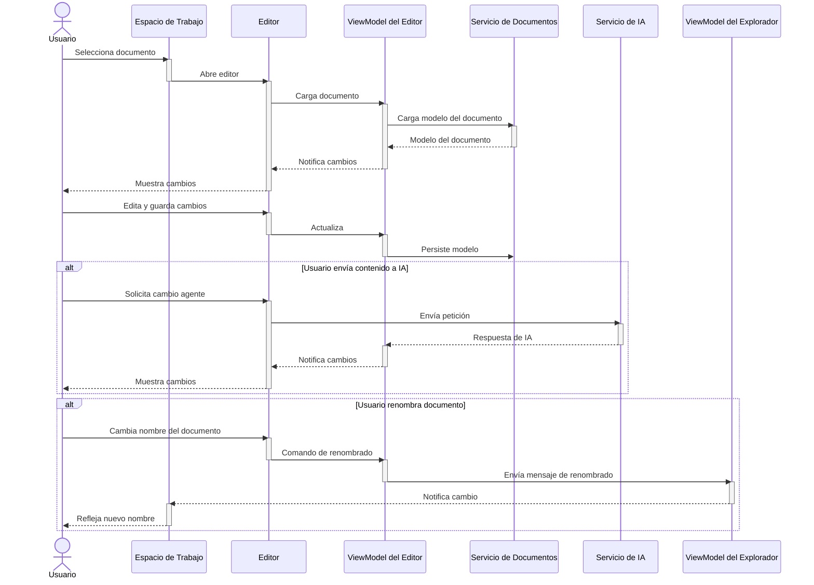
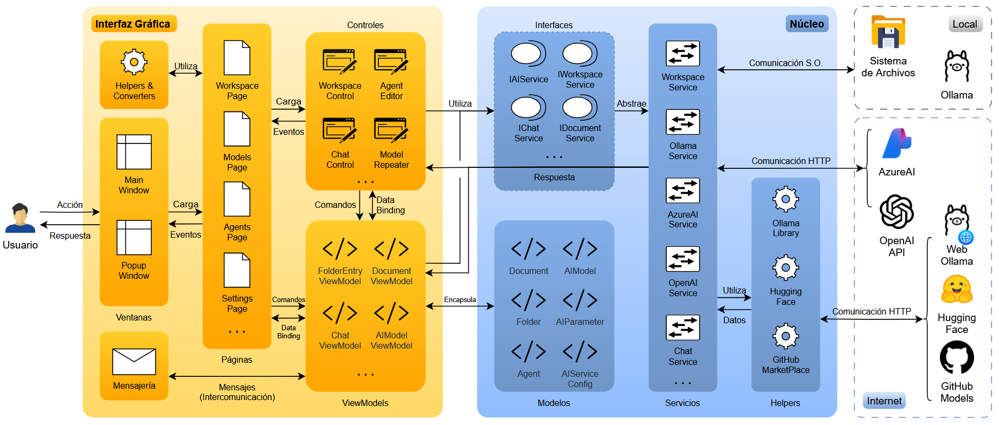
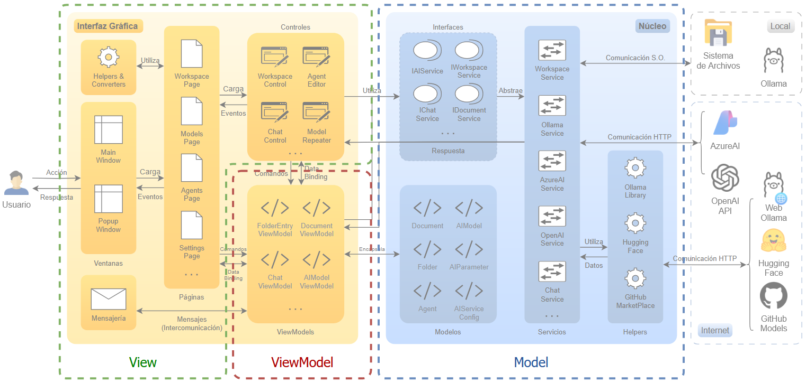

# 4. Arquitectura de la solución

La arquitectura de PowerPad está diseñada para ofrecer una experiencia de usuario moderna, flexible y extensible, permitiendo la integración de servicios de inteligencia artificial y la gestión eficiente de conversaciones y documentos. La solución se apoya en una separación clara de responsabilidades, siguiendo los principios SOLID [@doc_solid_2024] y aprovechando patrones arquitectónicos ampliamente reconocidos en el desarrollo de aplicaciones de escritorio modernas.

En este apartado se describen los componentes principales que conforman la solución, junto con los patrones de diseño empleados y la organización general de la interfaz y el núcleo de la aplicación. Además, se detallan los flujos de comunicación interna que permiten una coordinación eficaz entre los distintos módulos, así como la estrategia adoptada para mantener una arquitectura desacoplada y mantenible. Se incluyen también algunos diagramas representativos de alto nivel que permiten visualizar la estructura general del sistema. Los aspectos más específicos de la implementación, incluyendo detalles técnicos y diagramas de menor nivel, se abordarán en el apartado **6. Detalle de la implementación**.

## 4.1. Descripción de los componentes principales

### 4.1.1. Patrones de diseño utilizados

Para el desarrollo de PowerPad se ha apostado por una arquitectura basada en el patrón **MVVM**, que resulta especialmente adecuado para aplicaciones con interfaces ricas y dinámicas como las que se desarrollan con el marco de trabajo de WinUI. MVVM permite separar de forma clara la lógica de presentación (*viewmodel*) de la interfaz de usuario (*view*), facilitando el mantenimiento, la escalabilidad y la prueba de la aplicación. Habitualmente los modelos (*Model*) encapsulan los datos y la lógica de negocio, aunque en ocasiones se separa la lógica de negocio en servicios específicos, como en el caso de PowerPad. El pricipal elemento diferenciador de esta arquitectura son los *viewmodels* que actúan como intermediarios, exponiendo propiedades y comandos que pueden ser enlazados directamente desde la interfaz.

Además de MVVM, se han incorporado otros patrones y prácticas recomendadas, como la **inyección de dependencias**, que permite desacoplar la creación y gestión de servicios y facilita la extensión y el testeo de la solución. Para la comunicación entre componentes desacoplados, se utiliza el patrón de mensajería, lo que permite que distintos elementos de la aplicación se notifiquen cambios o eventos sin depender directamente unos de otros.

El uso de comandos es otra pieza clave, permitiendo que las acciones de la interfaz (como pulsar un botón o seleccionar un elemento) se gestionen de manera desacoplada y *testable*. Por otro lado, la gestión de recursos y la liberación de memoria se aborda mediante el patrón *Disposable*, especialmente relevante en una aplicación que maneja múltiples páginas, editores, archivos y servicios externos.

Finalmente, se hace un uso intensivo del patrón **Observador** a través de colecciones y propiedades *observables*, lo que permite que la interfaz se actualice automáticamente ante cualquier cambio en los datos subyacentes, mejorando la reactividad y la experiencia de usuario.

En resumen, estos serían los principales patrones utilizados:

- **MVVM** (*model-view-viewmodel*): Estructura principal de la aplicación, separando interfaz, lógica de presentación y datos para facilitar el mantenimiento y la escalabilidad.
- **Inyección de dependencias**: Permite desacoplar la creación y gestión de servicios, facilitando la extensión y el testeo de la solución.
- **Patrón de mensajería**: Comunicación desacoplada entre componentes mediante mensajes.
- ***Disposable***: Gestión y liberación de recursos, especialmente útil para manejar múltiples páginas, editores y servicios externos.
- **Observador**: Uso de colecciones y propiedades observables para que la interfaz se actualice automáticamente cuando cambian los datos.

(AÑADIR CITAS EXPLICATIVAS)
Por ejemplo: https://martinfowler.com/articles/injection.html
### 4.1.2. Núcleo

El núcleo de PowerPad, agrupado en el proyecto **PowerPad.Core**, es el encargado de encapsular la lógica de negocio, la gestión de servicios externos y la definición de los modelos de datos fundamentales. Este núcleo está diseñado para ser completamente independiente de la interfaz, lo que facilita su reutilización, testeo y posible extensión a otras plataformas en el futuro.

![[Pasted-image-20250619191436.png]]

Uno de los pilares del núcleo son los servicios de inteligencia artificial, que abstraen la interacción con proveedores externos como Ollama, OpenAI, Azure AI, Hugging Face y GitHub. Los servicios implementan contratos comunes (por ejemplo, `IAIService`), lo que permite a la aplicación tratar de forma unificada la gestión de modelos, el envío de *prompts* y la recepción de respuestas, independientemente del proveedor subyacente. Esta capa de abstracción es clave para la extensibilidad de la solución, permitiendo añadir nuevos proveedores o modificar los existentes sin impactar en la interfaz ni en el resto de la lógica de negocio.

Junto a los servicios de IA, el núcleo incluye la gestión de documentos y espacio de trabajo. Los documentos y carpetas se representan mediante modelos que encapsulan tanto los datos (contenido, información del archivo, estado de guardado) como la lógica asociada (operaciones de guardado, renombrado, ordenación). La gestión de la estructura jerárquica de carpetas y documentos, así como el soporte para operaciones como arrastrar y soltar, se implementa en servicios especializados que garantizan la integridad y la persistencia de la información.

Otro aspecto relevante del núcleo es la gestión de agentes y modelos AI. Los agentes se definen mediante modelos que incluyen información sobre el *prompt* inicial, los parámetros de generación y la asociación con modelos específicos. Esto permite a los usuarios crear y personalizar agentes adaptados a distintos contextos de uso, desde asistentes generales hasta agentes especializados en tareas concretas.

La configuración y la persistencia de datos se gestionan mediante servicios que abstraen la lectura y escritura de ficheros JSON, garantizando la concurrencia segura y la integridad de los datos guardados. Estos servicios permiten almacenar y recuperar la configuración de la aplicación, los modelos disponibles, los agentes definidos por el usuario, el estado del espacio de trabajo, etc. Facilitando la personalización y la continuidad entre sesiones.

Para facilitar la interacción con APIs externas y la gestión de modelos, el núcleo incluye una serie de *helpers* para la integración con Hugging Face, GitHub Marketplace o la biblioteca de Ollama.com, lo que permite la búsqueda de nuevos modelos que pueden utilizarse en la aplicación.

### 4.1.3. Interfaz

La interfaz, agrupada en el proyecto **PowerPad.WinUI**, está construida sobre WinUI 3, lo que permite aprovechar las capacidades más modernas de diseño y experiencia de usuario en el ecosistema Windows. La aplicación se estructura en torno a una ventana principal (`MainWindow`) que actúa como punto de entrada y contenedor de la navegación lateral, la barra de título y el área de trabajo principal. Esta ventana principal es responsable de gestionar la navegación entre las distintas páginas y se apoya en un sistema de menús lateral que permite acceder rápidamente a las funcionalidades clave: espacio de trabajo, gestión de modelos, agentes y configuración (**Figura 4.4**).

![[Pasted-image-20250619194301.png]]

Uno de los aspectos más destacables de la interfaz es la modularidad y reutilización de controles personalizados. Por ejemplo, el control de selección de agentes (`AgentSelector`) y el selector de modelos (`ModelSelector`) permiten al usuario elegir de manera intuitiva entre los agentes y modelos de IA disponibles, mostrando información relevante y facilitando la interacción. El control de chat (`ChatControl`) es otro ejemplo relevante, ya que integra la lógica de conversación con IA, el *streaming* (CITA: STREAMING) de mensajes y la gestión de parámetros de generación, todo ello presentando una experiencia fluida y visualmente atractiva.

La gestión de documentos y carpetas se realiza a través de un control específico (`WorkspaceControl`), que permite visualizar y manipular la jerarquía de carpetas y documentos mediante operaciones de arrastrar y soltar, renombrado y orden personalizado. Además, la aplicación incluye ventanas emergentes (`PopupWindow`) y diálogos personalizados para tareas como la edición rápida de documentos, la confirmación de acciones o la entrada de texto, mejorando la usabilidad y la productividad.

El diseño visual se apoya en diccionarios de recursos XAML [@doc_xaml_2025] para garantizar la coherencia de estilos, soportando temas claro y oscuro, así como efectos visuales modernos como el fondo acrílico, que contribuyen a una experiencia de usuario actual y agradable. La integración de WebView2 [@doc_webview2_2025], el componente navegador de Microsoft, permite mostrar información detallada de modelos AI directamente de su página web de origen, enriqueciendo la experiencia sin necesidad de salir de la aplicación.

En cuanto a la interacción, se han implementado atajos de teclado globales (*hotkeys*) mediante PInvoke [@doc_pinvoke_2024], permitiendo acciones rápidas como copiar contenido o mostrar ventanas emergentes desde cualquier parte del sistema. Todo esto se orquesta a través de *viewmodels* específicos para cada área funcional —agentes, modelos, chat, documentos o configuración— (**Figura 4.5**), que exponen las propiedades y comandos necesarios para que la interfaz reaccione de manera dinámica a las acciones del usuario y a los cambios en los datos.

En resumen, el núcleo de PowerPad actúa como el motor de la aplicación, gestionando la lógica de negocio, la interacción con servicios externos y la persistencia de datos, mientras que la interfaz se encarga de presentar esta información de manera intuitiva y atractiva al usuario. Esta separación de responsabilidades, junto con el uso de patrones de diseño descritos, permite que PowerPad sea una solución robusta, escalable y preparada para evolucionar en el futuro.

### 4.1.4. Flujo de datos y comunicación interna

El flujo de datos en PowerPad está diseñado para garantizar una comunicación eficiente, desacoplada y reactiva entre los distintos componentes de la aplicación. Esta arquitectura permite que la información fluya de manera coherente desde la interacción del usuario en la interfaz hasta la lógica de negocio y los servicios externos, y viceversa, manteniendo siempre la integridad y la sincronización del estado de la aplicación.

##### Comunicación entre la interfaz y el núcleo

La interacción típica comienza cuando el usuario realiza una acción en la interfaz, como crear un nuevo documento, enviar un mensaje a un agente IA, o modificar la configuración de un servicio. Estas acciones se capturan en los controles y ventanas de la interfaz, que a su vez están enlazados a los *viewmodels* correspondientes mediante *data binding*, el mecanismo que ofrece WinUI para la representación y actualización de información en los controles de interfaz. Los *viewmodel* actúan como mediadores, exponiendo propiedades y comandos que reflejan el estado de los modelos de datos y encapsulan la lógica necesaria para responder a las acciones del usuario (**Figura 4.7**).

Figura 4.7. (IMAGEN DATABINDING / COMANDOS)

Por ejemplo, al enviar un mensaje en un chat, el control de chat notifica al ViewModel, que valida la entrada, actualiza la colección de mensajes y delega la generación de respuesta al servicio de IA correspondiente. El resultado de la operación (la respuesta generada por IA) se propaga de vuelta al ViewModel, que actualiza la interfaz añadiendo el nuevo mensaje a la conversación. Este flujo se apoya en **colecciones y propiedades observables**, lo que permite que la interfaz se actualice automáticamente sin necesidad de lógica específica para ello.

Para la implementación de estas colecciones y propiedades observables se utilizan bibliotecas de `CommunityToolkit.Mvvm` de Microsoft que añade a las colecciones y propiedades la lógica necesaria para la comunicar cambios al interfaz mediante código autogenerado (CITA SOBRE CODIGO AUTOGENERADO POR TOOLKIT MVVM).

![[Pasted-image-20250619231055.png]]
##### Mensajería interna

Otro aspecto importante en la comunicación interna de PowerPad es el uso del patrón de mensajería, implementado mediante `CommunityToolkit.Mvvm.Messaging`. Este sistema permite que distintos componentes de la aplicación se comuniquen entre sí de manera desacoplada, publicando y suscribiéndose a mensajes o eventos de interés (**Figura 4.8).

![[Pasted-image-20250619232233.png]]

Este enfoque permite que componente de interfaz distintos respondan de forma coordinada a un cambio en el modelo, aunque no compartan la misma instancia de objeto *viewmodel*. Un ejemplo claro es cuando modificamos el nombre de un documento, independientemente de que lo hagamos en el editor o en el explorador del espacio de trabajo, se verá reflejado en ambos gracias a que los *viewmodels* `FolderEntryViewModel` y `DocumentViewModel` se comunican mediante un mensaje de tipo `FolderEntryChanged`, para ello, los *viewmodel* interesados solo tienen que registrarse como receptores de ese tipo de mensaje.

##### Flujo de datos con servicios externos

La comunicación con servicios externos, como los proveedores de IA (Ollama, Azure AI, OpenAI, etc.), se gestiona a través de servicios especializados que implementan interfaces comunes. Cuando el usuario solicita una operación que requiere interacción con un servicio externo (por ejemplo, enviar un *prompt* a un modelo de IA), el ViewModel correspondiente delega la operación al servicio adecuado, que se encarga de construir la petición, enviarla mediante HTTP y procesar la respuesta.

Durante este proceso, se gestionan estados intermedios como la carga o el *streaming* de respuestas, notificando a la interfaz mediante propiedades observables para mostrar indicadores de progreso o actualizar el contenido en tiempo real. Este flujo también contempla la gestión de errores, permitiendo que la interfaz muestre mensajes claros y ayude al usuario a resolver posibles incidencias como problemas de conexión o autenticación.

##### Edición múltiple

La arquitectura soporta la apertura simultánea de múltiples editores y la gestión de estados independientes para cada uno, persistiendo los editores y gestionando su autoguardado en segundo plano.

De este modo nos aseguramos que, si el usuario abandona una conversación o edición para acudir a otro documento, o incluso a otra parte de la aplicación, como la gestión de modelos, al regresar, no solo verá su documento en el mismo estado, sino que los controles estarán tal y como los dejó, conservando, por ejemplo, un mensaje que haya empezado a escribir pero todavía no se haya enviado.

##### Ejemplo de comunicación

Un caso típico de flujo de datos sería el siguiente:

1. El usuario selecciona un documento en el espacio de trabajo, lo que dispara la apertura del editor correspondiente.
2. El ViewModel del editor carga el modelo del documento utilizando el servicio de documentos y lo expone a la interfaz.
3. El usuario edita el contenido y guarda los cambios, lo que acciona el comando de guardado del ViewModel, que actualiza el modelo y persiste la información mediante el servicio.
4. Si el usuario decide enviar el contenido a un agente IA, el ViewModel del editor delega la operación al servicio de IA, recibe la respuesta y actualiza la interfaz.
5. El usuario cambia el nombre del documento, lo que acciona el comando de renombrado en el ViewModel, que se comunica al resto de la aplicación mediante un mensaje interno.
6. El ViewModel del control explorador del espacio de trabajo recibe el mensaje y notifica el cambio.
7. El control explorador del espacio de trabajo refleja el nuevo nombre modificado.

### 4.1.5. Persistencia

La persistencia de datos en PowerPad es un aspecto fundamental que garantiza la continuidad del trabajo del usuario, la recuperación del estado entre sesiones y la integridad de la información gestionada por la aplicación. El diseño de la persistencia se basa en:

* Ficheros de texto para espacio de trabajo. Los espacios de trabajo corresponden a carpetas del sistema, por defecto se crea una carpeta llamada PowerPad dentro de la ubicación habitual de documentos del usuario, pero el usuario puede cambiar de espacio de trabajo eligiendo otra carpeta.
* Ficheros especiales dentro del espacio de trabajo como los ficheros de autoguardado o el fichero que almacena la ordenación de cada carpeta.
* Ficheros con formato JSON para almacenar la configuración de la aplicación.

##### Persistencia de documentos y espacio de trabajo

Cada documento y carpeta gestionado por PowerPad se almacena en el sistema de archivos del usuario, siguiendo una estructura jerárquica que refleja la organización del espacio de trabajo. Los documentos pueden ser de dos tipos —nota o chat— y se guardan como archivos individuales, incluyendo el contenido y, para las conversaciones, las opciones seleccionadas (modelo, parámetros, etc.). Las carpetas se representan como directorios en el sistema de archivos, permitiendo operaciones como la creación, renombrado, eliminación y movimiento mediante operaciones estándar del sistema.

El servicio de gestión de documentos se encarga de abstraer estas operaciones, proporcionando métodos para cargar, guardar y actualizar documentos y carpetas, también se encarga de gestionar el orden personalizado de las entradas en cada carpeta a través de un fichero especial que almacena esa información (fichero `.order`). Adicionalmente, se implementa un sistema de guardado automático que asegura que los cambios realizados por el usuario se persisten de manera transparente, minimizando el riesgo de pérdida de información (ficheros `.autosave`).

##### Persistencia de configuración y parámetros

La configuración global de la aplicación, que incluye aspectos como la lista de modelos y agentes definidos, las claves y URLs de servicios de IA, los parámetros predeterminados de generación y las preferencias de usuario (tema, atajos de teclado, etc.), se almacena en archivos JSON de forma segura en la carpeta de aplicación dentro del perfil del usuario (carpeta `.powerpad`). Esto permite que la configuración sea editable, portable y recuperable en caso de necesidad, solamente por el usuario propietario del perfil. Estos son los ficheros de configuración:

- `CurrentDocumentPath.json`: Ruta del documento abierto actual.
- `RecentlyWorkspaces.json`: Colección con los últimos espacios de trabajo abiertos.
- `GeneralSettings.json`: Configuración general (información de servicios habilitados, configuración del aspecto visual, etc.).
- `ModelsSettings.json`: Configuración de modelos (modelo y parámetros predeterminados, colecciones de modelos disponibles, su estado, etc.).
- `Agents.json`: Colección de agentes con su configuración.

El servicio de configuración implementa mecanismos para la lectura y escritura concurrente de estos archivos, evitando problemas de corrupción o acceso simultáneo. Además, se emplean técnicas de serialización y deserialización eficientes mediante las capacidades nativas de .NET, con contextos personalizados que optimizan el rendimiento y mejoran la seguridad.

Al iniciar la aplicación, los servicios de persistencia cargan la configuración, los documentos y el estado del espacio de trabajo desde los archivos correspondientes, reconstruyendo la estructura y el contenido tal y como se encontraba al cerrar la sesión anterior. Cualquier cambio realizado durante el uso de la aplicación se persiste de forma automática.

El enfoque basado en archivos JSON y estructura jerárquica en el sistema de archivos ofrece varias ventajas:

- **Portabilidad**: Los datos pueden ser fácilmente respaldados, transferidos o sincronizados entre dispositivos.
- **Transparencia**: Un usuario avanzado puede acceder y modificar los archivos directamente si lo desea.
- **Escalabilidad**: La estructura soporta un gran número de documentos y configuraciones sin pérdida de rendimiento.
- **Simplicidad**: Se evita la complejidad de bases de datos externas, facilitando el mantenimiento y la depuración.
- **Rendimiento**: El guardado de la configuración se realiza de forma periódica cuando hay cambios pendientes, en segundo plano, sin interrumpir la actividad del usuario en la interfaz.

## 4.2. Diagrama general de arquitectura

En el siguiente diagrama se representa de forma resumida la arquitectura interna de PowerPad.

Principales elementos del diagrama:

- **El usuario interactúa con la aplicación** mediante acciones en la interfaz gráfica, recibiendo respuestas en tiempo real.
- **La interfaz gráfica** está compuesta por ventanas principales (`MainWindow` y `PopupWindow`) que cargan diferentes páginas funcionales como el espacio de trabajo, gestión de modelos, agentes y configuración.
- **Las páginas** agrupan y presentan la información y herramientas relevantes para cada área (*Workspace*, *Models*, *Agents*, *Settings*, etc.).
- **Controles reutilizables** como editores de agentes, chats o repetidores de modelos facilitan la interacción con los datos y los servicios, y se comunican con los *viewmodels* mediante comandos.
- ***Helpers* y convertidores** proporcionan utilidades y adaptaciones visuales/funcionales dentro de la interfaz.
- **El sistema de mensajería** gestiona la intercomunicación entre *viewmodels* para sincronización de la información representada.
- **Los *viewmodels*** actúan como intermediarios entre la interfaz y la lógica de negocio, encapsulando el estado y lógica de las entidades principales (documentos, carpetas, chats, modelos IA, etc.).
- **Interfaces de servicios** (como IAIService, IWorkspaceService) permiten la abstracción y desacoplamiento entre la interfaz gráfica y los servicios del núcleo.
- **El núcleo** de la aplicación contiene la lógica de negocio central, organizada en servicios para la gestión de documentos, comunicación con servicios de IA, chats, etc.
- **Los servicios principales** se comunican con fuentes locales e Internet según corresponda.
- ***Helpers* de integración** permiten la conexión y gestión de modelos desde diversas fuentes (Ollama Library, Hugging Face, GitHub Marketplace), filtrando y procesando los datos obtenidos.
- **La comunicación con servicios externos** (Ollama local, AzureAI y OpenAI) se realiza vía API HTTP, permitiendo la generación de texto por IA de cada proveedor.
- **La persistencia de los datos** se gestiona a través del sistema de archivos local.
- **Toda la arquitectura sigue un enfoque modular** y desacoplado, facilitando la extensibilidad, el mantenimiento y la integración de nuevos servicios o funcionalidades en el futuro.

### 4.2.1. Representación por capas

Desde el punto de vista de la **arquitectura MVVM**, esta sería la división de las capas (**Figura 4.12**).

* **View**: Incluye las ventanas, páginas y controles de WinUI.
* **ViewModel**: Incluye a los ViewModel, las clases que encapsulan la información y sirven de enlace de datos (_data binding_) con la interfaz.
* **Model**: Esta capa incluye tanto a las modelos propiamente (clases POCO), como a toda la lógica de servicios.