La presente sección recoge una serie de ejemplos prácticos y flujos de trabajo habituales en PowerPad, con el propósito de demostrar de manera práctica las funcionalidades implementadas y su aplicabilidad en escenarios reales.
Cada caso de uso se describe de forma estructurada, detallando los pasos que debe seguir el usuario, los elementos visuales involucrados y la trazabilidad de las acciones a nivel de código. Además, se incluyen capturas de pantalla y las anotaciones técnicas más relevantes para cada caso.

## 5.1. Instalación de Ollama

#### Caso de uso

El usuario quiere instalar y utilizar Ollama, y por eso recurre a PowerPad que, además se servirle de interfaz gráfica para el uso de inteligencia artificial en local, también le facilita el acceso a la descarga, instalación y verificación del servicio de Ollama.

#### Pasos para el usuario

1. Usuario: Abre la aplicación PowerPad (sin haber instalado previamente Ollama).
	a. PowerPad: Aparece diálogo de descarga de Ollama.
2. Usuario: Pulsa el botón `Descargar Ollama`.
	b. PowerPad: Se inicia descarga de Ollama.
	c. PowerPad: Muestra progreso de descarga.
	d. PowerPad: Al finalizar la descarga, se inicia el instalador.
	e. PowerPad: El diálogo muestra botón de confirmación de la instalación.
3. Usuario: Finaliza el instalador independiente.
4. Usuario: Pulsa el botón `Instalación finalizada`.
	f. PowerPad: Comprueba si el servicio de Ollama responde.
	g. PowerPad: El diálogo muestra botón para acceder a la instalación de modelos.
5. Usuario: Pulsa el botón `Ir a modelos`.

#### Interfaces implicados

1) Al abrir PowerPad por primera vez se detecta que Ollama no está instalado: **MainWindow** y **OllamaDownloadHelper**

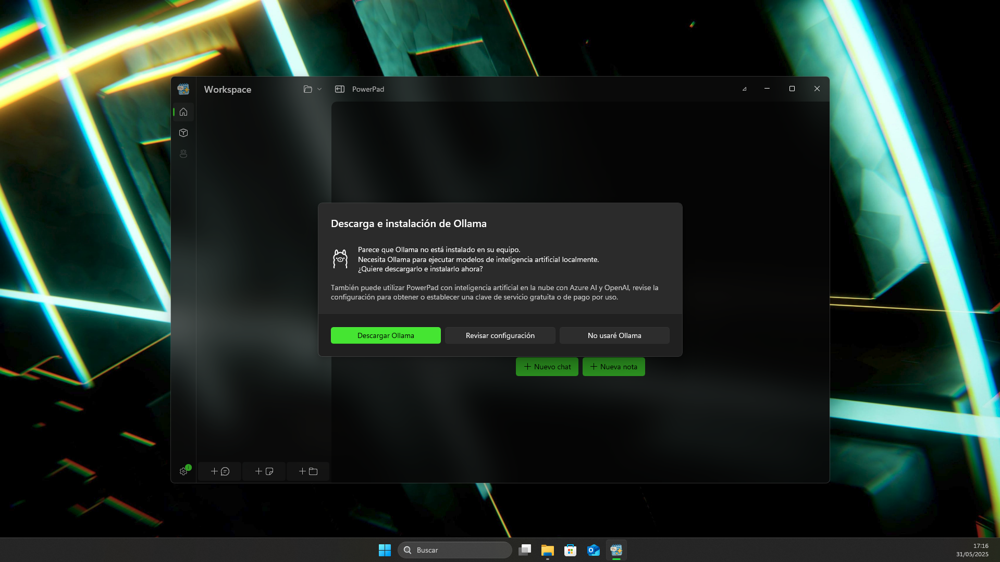

2) El diálogo mostrado guía el usuario durante la descarga e instalación Ollama: **OllamaDownloadHelper**

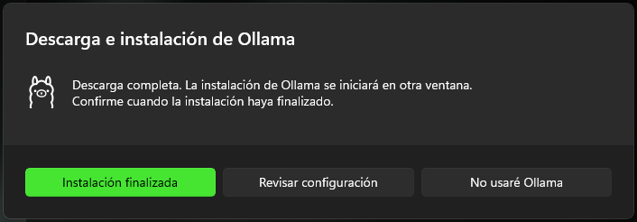

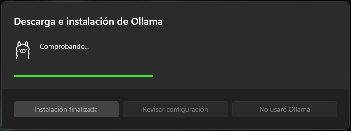

#### Clases implicadas

- `App`: Clase principal de la aplicación.
- `MainWindow`: Ventana principal.
- `SettingsViewModel`: Comprueba y guarda los estados de conexión.
- `OllamaService`: Comprueba el estado del servicio de Ollama.
- `OllamaDownloadHelper`: Gestiona el diálogo y proceso de descarga/instalación.

#### Secuencia simplificada

##### Parte 1

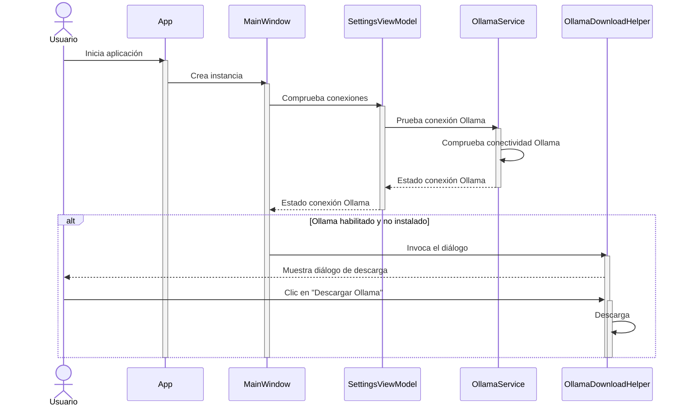
```mermaid
sequenceDiagram
    actor U as Usuario
    participant A as App
    participant M as MainWindow
    participant S as SettingsViewModel
    participant OS as OllamaService
    participant OD as OllamaDownloadHelper

    U->>A: Inicia aplicación
    activate A
    A->>M: Crea instancia
    activate M
    M->>S: Comprueba conexiones
    activate S
    S->>OS: Prueba conexión Ollama
    activate OS
    OS->>OS: Comprueba conectividad Ollama
    OS-->>S: Estado conexión Ollama
    deactivate OS
    S-->>M: Estado conexión Ollama
    deactivate S
    alt Ollama habilitado y no instalado
        M->>OD: Invoca el diálogo
        activate OD
        OD-->>U: Muestra diálogo de descarga
        U->>OD: Clic en "Descargar Ollama"
        activate OD
        OD->>OD: Descarga
    end
    deactivate OD
    deactivate OD
    deactivate M
    deactivate A
```

- Usuario inicia `App`
- `App` crea instancia de `MainWindow`
- `MainWindow` comprueba el estado de las conexiones en `SettingsViewModel`
- `SettingsViewModel` prueba la conexión de Ollama con `OllamaService`
- `OllamaService` comprueba la conectividad de Ollama
- *Si Ollama está habilitado y no está instalado*: `MainWindow` invoca el diálogo de instalación a `OllamaDownloadHelper`
- `OllamaDownloadHelper` muestra al usuario el diálogo de descarga de Ollama
- *Si usuario hace clic en* `Descargar Ollama`: `OllamaDownloadHelper` inicia la descarga

##### Parte 2

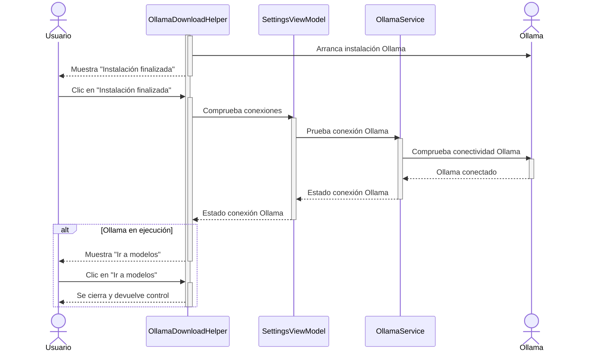
```mermaid
sequenceDiagram
    actor U as Usuario
    participant OD as OllamaDownloadHelper
    participant S as SettingsViewModel
    participant OS as OllamaService
    actor SO as Ollama

    activate OD
    activate OD
    OD->>SO: Arranca instalación Ollama
    OD-->>U: Muestra "Instalación finalizada"
    deactivate OD
    U->>OD: Clic en "Instalación finalizada"
    activate OD
    OD->>S: Comprueba conexiones
    activate S
    S->>OS: Prueba conexión Ollama
    activate OS
    OS->>SO: Comprueba conectividad Ollama
    activate SO
    SO-->>OS: Ollama conectado
    deactivate SO
    OS-->>S: Estado conexión Ollama
    deactivate OS
    S-->>OD: Estado conexión Ollama
    deactivate S
    alt Ollama en ejecución
        OD-->>U: Muestra "Ir a modelos"
        deactivate OD
        U->>OD: Clic en "Ir a modelos"
        activate OD
        OD-->>U: Se cierra y devuelve control
    end
    deactivate OD
    deactivate OD
```

- *Cuando la descarga ha finalizado*: `OllamaDownloadHelper` arranca el instalador de Ollama y muestra botón `Instalación finalizada`
- *Si usuario completa instalación y hace clic en* `Instalación finalizada`: `OllamaDownloadHelper` comprueba el estado del servicio en `SettingsViewModel`
- `SettingsViewModel` prueba la conexión de Ollama con `OllamaService`
- `OllamaService` comprueba la conectividad de Ollama
- *Si Ollama está en ejecución*: `OllamaDownloadHelper` muestra botón `Ir a modelos`
- *Si usuario hace clic en* `Ir a modelos`: `OllamaDownloadHelper` se cierra y devuelve el control a `MainWindow`

## 5.2. Añadir modelo de IA a Ollama

#### Caso de uso

El usuario quiere añadir un modelo a Ollama para poder utilizarlo a través de Powerpad para sus conversaciones y edición de texto asistido por inteligencia artificial de forma local.

#### Pasos para el usuario

1. Usuario: Abre la aplicación PowerPad.
	a. PowerPad: Muestra la ventana principal.
2. Usuario: Pulsa sobre `Modelos`.
	b. PowerPad: Muestra la página de modelos disponibles de Ollama.
3. Usuario: Pulsa sobre `Añadir modelos`.
	c. PowerPad: Muestra la página de añadir modelos de Ollama.
4. Usuario: Escribe el nombre del modelo buscado.
	d. PowerPad: Muestra los resultados de la búsqueda.
5. Usuario: Pulsa sobre el botón de descarga en el modelo deseado.
	e. PowerPad: Inicia la descarga.
	f. PowerPad: Muestra el progreso de la descarga.
	g. PowerPad: Muestra el modelo como añadido.
6. Usuario: Pulsa sobre `Workspace` para salir de `Modelos`.

#### Interfaces implicados

1) El usuario navega desde la ventana principal a la página de modelos: **MainWindow** y **ModelsPage**

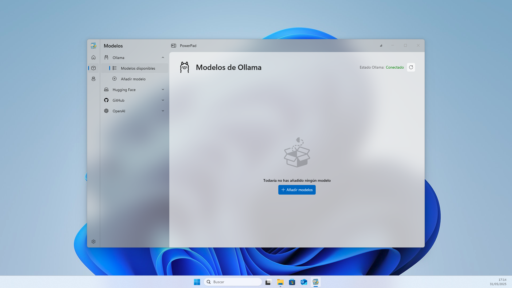

2) El usuario pulsa en `Añadir modelos` y accede a la página de búsquedas de modelos: **OllamaAddModelPage**

#### Clases implicadas

- `App`: Clase principal de la aplicación.
- `MainWindow`: Ventana principal.
- `ModelsPage`: Página que muestra las opciones de gestión de modelos.
- `OllamaAddModelPage`: Página para buscar y añadir nuevos modelos de Ollama.
- `OllamaModelsViewModel`: Gestiona la lógica de modelos de Ollama y el estado de los mismos.
- `OllamaService`: Gestiona la comunicación con servicio de Ollama.
- `OllamaLibraryHelper`: Realiza operaciones de búsqueda sobre la biblioteca de modelos de Ollama.
- `ModelsSettingsViewModel`: Gestiona la configuración y el estado de los modelos.

#### Secuencia simplificada

##### Parte 1

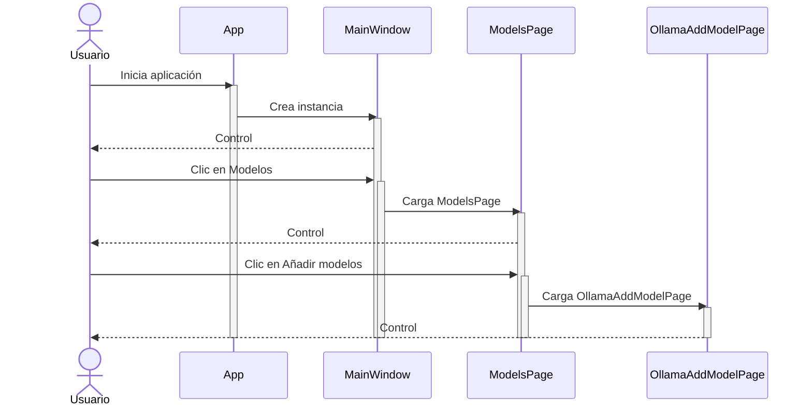
```mermaid
sequenceDiagram
    actor U as Usuario
    participant A as App
    participant M as MainWindow
    participant MP as ModelsPage
    participant OAMP as OllamaAddModelPage

    U->>A: Inicia aplicación
    activate A
    A->>M: Crea instancia
    activate M
    M-->>U: Control
    U->>M: Clic en Modelos
    activate M
    M->>MP: Carga ModelsPage
    activate MP
    MP-->>U: Control
    U->>MP: Clic en Añadir modelos
    activate MP
    MP->>OAMP: Carga OllamaAddModelPage
    activate OAMP
    OAMP-->>U: Control
    deactivate OAMP
    deactivate MP
    deactivate MP
    deactivate M
    deactivate M
    deactivate A
```

- Usuario inicia `App`
- `App` crea instancia de `MainWindow`
- Usuario hace clic en `Modelos` en `MainWindow`
- `MainWindow` carga `ModelsPage`
- `ModelsPage` muestra opciones para gestión de modelos
- Usuario hace clic en `Añadir modelos` en `ModelsPage`
- `ModelsPage` carga `OllamaAddModelPage`

##### Parte 2

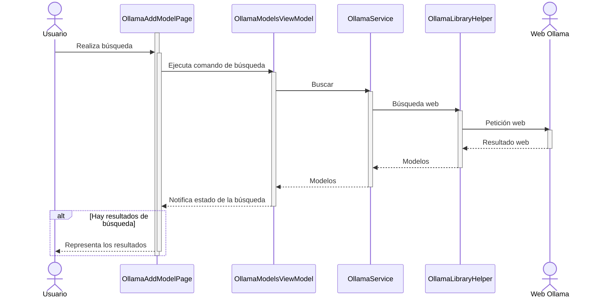
```mermaid
sequenceDiagram
    actor U as Usuario
    participant OAMP as OllamaAddModelPage
    participant OMVM as OllamaModelsViewModel
    participant OS as OllamaService
    participant OLH as OllamaLibraryHelper
    actor WO as Web Ollama

    activate OAMP
    U->>OAMP: Realiza búsqueda
    activate OAMP
    OAMP->>OMVM: Ejecuta comando de búsqueda
    activate OMVM
    OMVM->>OS: Buscar
    activate OS
    OS->>OLH: Búsqueda web
    activate OLH
    OLH->>WO: Petición web
    activate WO
    WO-->>OLH: Resultado web
    deactivate WO
    OLH-->>OS: Modelos
    deactivate OLH
    OS-->>OMVM: Modelos
    deactivate OS
    OMVM-->>OAMP: Notifica estado de la búsqueda
    deactivate OMVM
    alt Hay resultados de búsqueda
        OAMP-->>U: Representa los resultados
        deactivate OAMP
    end
    deactivate OAMP
```

- Usuario realiza búsqueda en `OllamaAddModelPage`
- `OllamaAddModelPage` ejecuta comando de búsqueda en `OllamaModelsViewModel`
- `OllamaModelsViewModel` solicita búsqueda en `OllamaService`
- `OllamaService` realiza búsqueda a través de `OllamaLibraryHelper`
- `OllamaLibraryHelper` traslada la búsqueda a la web de Ollama.com y recibe los resultados
- `OllamaLibraryHelper` devuelve resultados a `OllamaService`
- `OllamaService` devuelve resultados a `OllamaModelsViewModel`
- `OllamaModelsViewModel` notifica cambios en estado de la búsqueda a `OllamaAddModelPage`
- *Si hay resultados de búsqueda*: `OllamaAddModelPage` representa los resultados

##### Parte 3

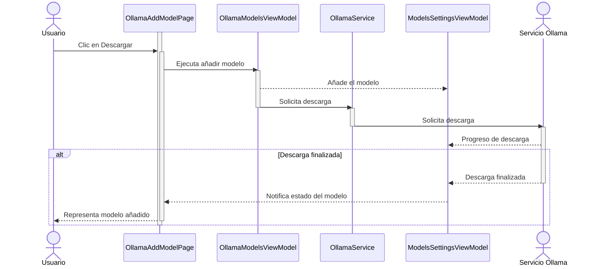
```mermaid
sequenceDiagram
    actor U as Usuario
    participant OAMP as OllamaAddModelPage
    participant OMVM as OllamaModelsViewModel
    participant OS as OllamaService
    participant MSVM as ModelsSettingsViewModel
    actor OLL as Servicio Ollama

        activate OAMP
        U->>OAMP: Clic en Descargar
        activate OAMP
        OAMP->>OMVM: Ejecuta añadir modelo
        activate OMVM
        OMVM-->>MSVM: Añade el modelo
        OMVM->>OS: Solicita descarga
        activate OS
        deactivate OMVM
        OS->>OLL: Solicita descarga
        activate OLL
        deactivate OS
        OLL-->>MSVM: Progreso de descarga

        alt Descarga finalizada
            OLL-->>MSVM: Descarga finalizada
            deactivate OLL
            MSVM-->>OAMP: Notifica estado del modelo
            OAMP-->>U: Representa modelo añadido
            deactivate OAMP
        end
        deactivate OAMP
```

- *Si el usuario hace clic en* `Descargar`: `OllamaAddModelPage` ejecuta comando de añadir modelo en `OllamaModelsViewModel`
- `OllamaModelsViewModel` añade el modelo a `ModelsSettingsViewModel`
- `OllamaModelsViewModel` solicita descarga en `OllamaService`
- `OllamaService` solicita a `Ollama` la descarga del modelo
- `OllamaService` notifica actualizaciones de la descarga al modelo en `ModelsSettingsViewModel`
- *Cuando la descarga ha finalizado*: `ModelsSettingsViewModel` notifica cambios en estado del modelo a `OllamaAddModelPage`
- `OllamaAddModelPage` representa el modelo como añadido
- *Si usuario hace clic en* `Workspace`: `MainWindow` carga `WorkspacePage`

## 5.3. Creación de un agente

#### Caso de uso

El usuario desea crear un agente de inteligencia artificial personalizado para responder correos electrónicos con estilo formal a partir de unas indicaciones, utilizando un modelo de IA generativa previamente configurado.

#### Pasos para el usuario

1. Usuario: Abre la aplicación PowerPad.
	a. PowerPad: Muestra la ventana principal.
2. Usuario: Pulsa sobre `Agentes`.
	b. PowerPad: Muestra la página de agentes.
3. Usuario: Pulsa sobre `Añadir agente`.
	c. PowerPad: Muestra la página de añadir agentes.
4. Usuario: Elige un icono para el agente.
5. Usuario: Escribe el nombre del agente.
6. Usuario: Escribe la descripción del agente.
7. Usuario: Escribe elige el modelo del agente.
8. Usuario: Pulsa el botón `Guardar`.
	d. PowerPad: Muestra el nuevo agente guardado.
9. Usuario: Pulsa sobre `Workspace` para salir de `Agentes`.

#### Interfaces implicados

1) El usuario navega desde la ventana principal a la página de agentes: **MainWindow** y **AgentsPage**

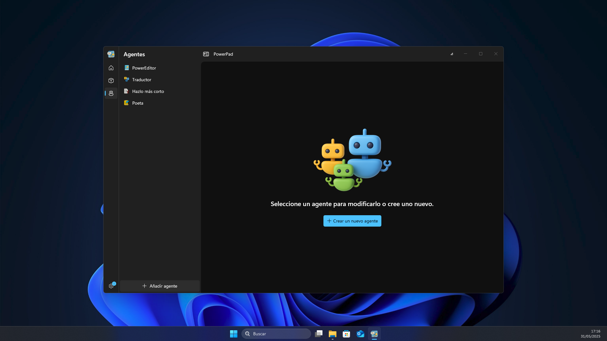

2) El usuario pulsa en `Añadir agente` y accede al componente de creación de agentes: **AgentEditor**

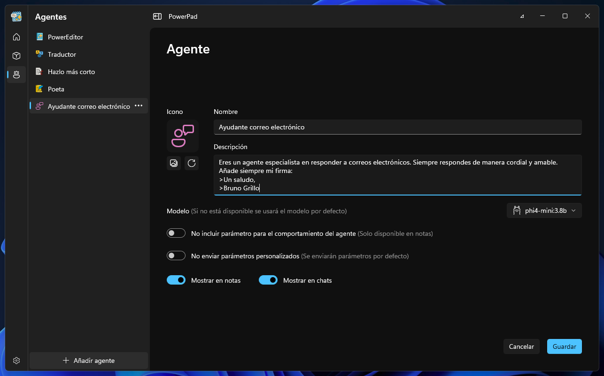
#### Clases implicadas

- `App`: Clase principal de la aplicación.
- `MainWindow`: Ventana principal.
- `AgentsPage`: Página que muestra las opciones de gestión de agentes.
- `AgentEditor`: Componente para editar agentes.
- `AgentsCollectionViewModel`: Gestiona la lógica de agentes y la persistencia de los mismos.
- `ModelsSettingsViewModel`: Gestiona la configuración y el estado de los modelos.

#### Secuencia simplificada

##### Parte 1

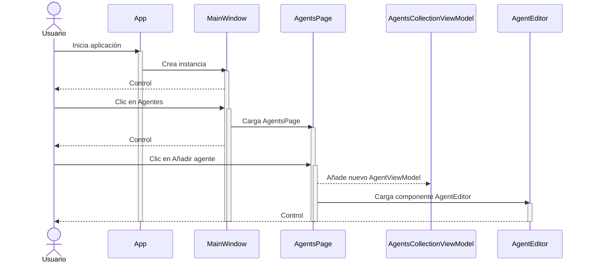
```mermaid
sequenceDiagram
    actor U as Usuario
    participant A as App
    participant M as MainWindow
    participant AP as AgentsPage
    participant ACVM as AgentsCollectionViewModel
    participant AE as AgentEditor

    U->>A: Inicia aplicación
    activate A
    A->>M: Crea instancia
    activate M
    M-->>U: Control
    U->>M: Clic en Agentes
    activate M
    M->>AP: Carga AgentsPage
    activate AP
    M-->>U: Control
    U->>AP: Clic en Añadir agente
    activate AP
    AP-->>ACVM: Añade nuevo AgentViewModel
    AP->>AE: Carga componente AgentEditor
    activate AE
    AE-->>U: Control
    deactivate AE

    deactivate A
    deactivate M
    deactivate M
    deactivate AP
    deactivate AP
```

- Usuario inicia `App`
- `App` crea instancia de `MainWindow`
- Usuario hace clic en `Agentes` en `MainWindow`
- `MainWindow` carga `AgentsPage`
- `AgentsPage` muestra opciones para gestión de agentes
- Usuario hace clic en `Añadir agente` en `AgentsPage`
- `AgentsPage` añade un nuevo `AgentViewModel` en `AgentsCollectionViewModel`
- `AgentsPage` carga el componente `AgentEditor`

##### Parte 2

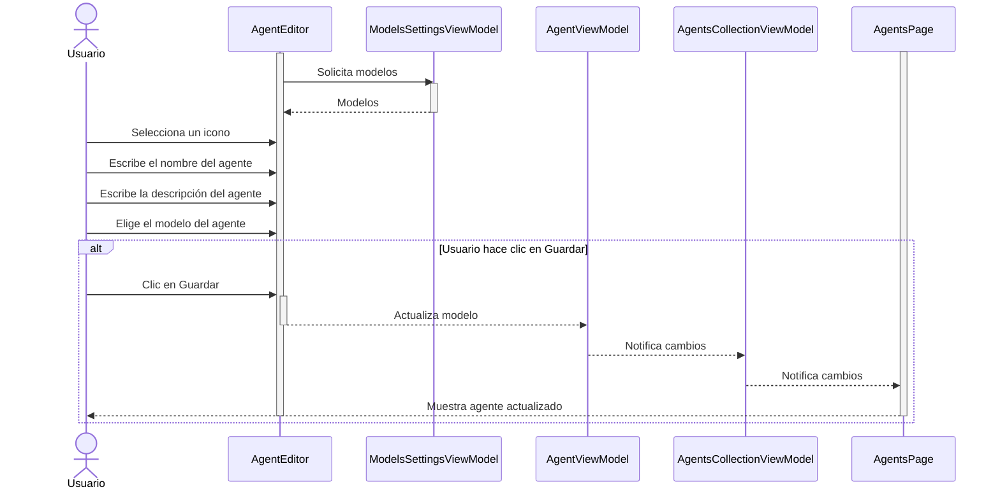
```mermaid
sequenceDiagram
    actor U as Usuario
    participant AE as AgentEditor
    participant MSVM as ModelsSettingsViewModel
    participant AVM as AgentViewModel
    participant ACVM as AgentsCollectionViewModel
    participant AP as AgentsPage

    activate AP
    activate AE

	AE->>MSVM: Solicita modelos
	activate MSVM
	MSVM-->>AE: Modelos
	deactivate MSVM
    U->>AE: Selecciona un icono
    U->>AE: Escribe el nombre del agente
    U->>AE: Escribe la descripción del agente
    U->>AE: Elige el modelo del agente

    alt Usuario hace clic en Guardar
        U->>AE: Clic en Guardar
        activate AE
        AE-->>AVM: Actualiza modelo
        deactivate AE
        AVM-->>ACVM: Notifica cambios
        ACVM-->>AP: Notifica cambios
        AP-->>U: Muestra agente actualizado
            deactivate AP
    deactivate AE
    end
```

- `AgentEditor` carga los datos del `AgentViewModel` creado
- `AgentEditor` carga los modelos desde `ModelsSettingsViewModel`
- Usuario selecciona un icono en `AgentEditor`
- Usuario escribe el nombre del agente en `AgentEditor`
- Usuario escribe la descripción del agente en `AgentEditor`
- Usuario elige un modelo para el agente en `AgentEditor`
- *Si el usuario hace clic en* `Guardar`: `AgentEditor` actualiza `AgentViewModel`
- `AgentViewModel` notifica cambios en estado del modelo a `AgentsCollectionViewModel`
- `AgentsCollectionViewModel` notifica cambios en estado del modelo a `AgentsPage`
- `AgentsPage` actualiza la lista y muestra el nuevo agente actualizado
- *Si usuario hace clic en* `Workspace`: `MainWindow` carga `WorkspacePage`

## 5.4. Conversación con un agente

#### Caso de uso

El usuario desea mantener una conversación con un agente de inteligencia artificial previamente creado, utilizando un modelo de IA generativa. Su objetivo es recibir ayuda para la redacción de un correo formal a su supervisor en el trabajo.

#### Pasos para el usuario

1. Usuario: Abre la aplicación PowerPad.
	a. PowerPad: Muestra la ventana principal.
	b. PowerPad: Muestra la página de espacio de trabajo.
2. Usuario: Pulsa sobre `Nuevo chat`.
	c. PowerPad: Muestra el componente de conversaciones.
3. Usuario: Pulsa sobre el selector de agentes y elige el agente deseado.
4. Usuario: Escribe un mensaje en el área de entrada de chat.
5. Usuario: Pulsa el botón `Enviar` o presiona `Intro`.
	d. PowerPad muestra el mensaje del usuario en el chat.
	e. PowerPad envía el mensaje, junto al historial de la conversación y el prompt del agente, al servicio de IA correspondiente al modelo del agente.
	f. PowerPad muestra un indicador de respuesta.
	g. PowerPad muestra la respuesta generada por la IA a medida que la va recibiendo del servicio de IA.
6. Usuario: Pulsa el botón `Copiar` en el mensaje recibido
	h. PowerPad guarda en el portapapeles el contenido del menaje recibido.

#### Interfaces implicados

1) El usuario accede a la ventana principal: **MainWindow** y **WorkspacePage**

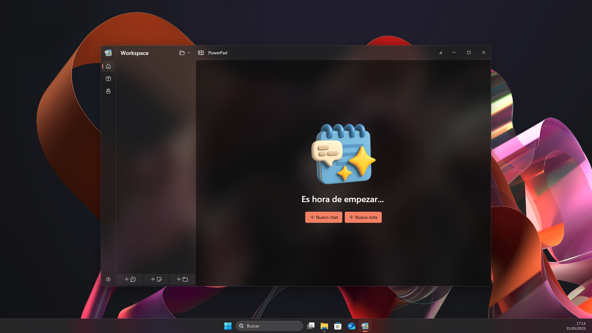

2) El usuario pulsa en `Nuevo chat` y accede a la nueva conversación: **ChatEditorControl**

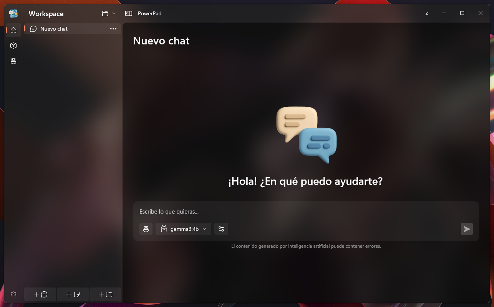

3) El usuario escribe su mensaje, lo envía, y recibe la respuesta a medida que se genera: **ChatEditorControl**

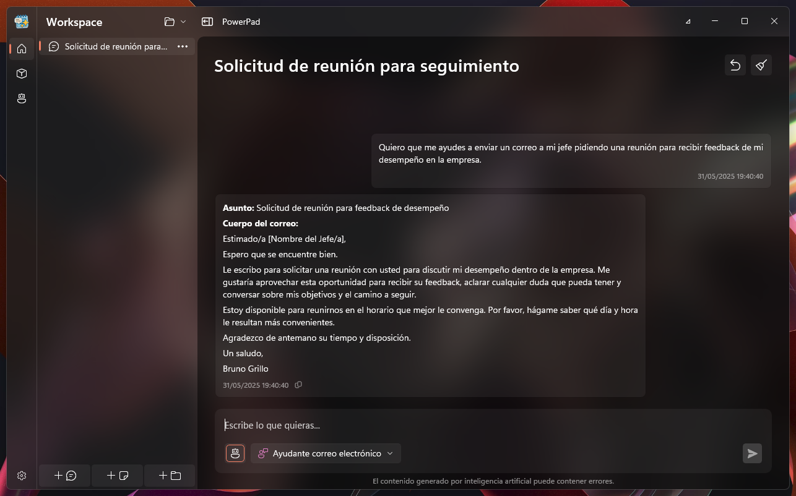

#### Clases implicadas

- `App`: Clase principal de la aplicación.
- `MainWindow`: Ventana principal.
- `WorkspacePage`: Página de gestión de documentos y chats.
- `WorkspaceViewModel`: Lógica de presentación y gestión del espacio de trabajo.
- `ChatEditorControl`: Control de edición y visualización de chats.
- `ChatViewModel`: Lógica de presentación y gestión del estado del chat.
- `ChatControl`: Control para interactuar con la conversación.
- `AgentsCollectionViewModel`: Gestión de agentes.
- `ChatService`: Responsable de la comunicación con los servicios de IA.

#### Secuencia simplificada

##### Parte 1

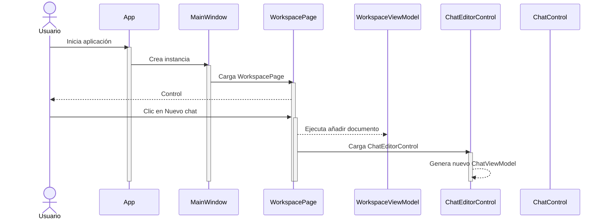
```mermaid
sequenceDiagram
    actor U as Usuario
    participant A as App
    participant M as MainWindow
    participant WP as WorkspacePage
    participant WV as WorkspaceViewModel
    participant CEC as ChatEditorControl
    participant CC as ChatControl

    U->>A: Inicia aplicación
    activate A
    A->>M: Crea instancia
    activate M
    M->>WP: Carga WorkspacePage
    activate WP
    WP-->>U: Control

    U->>WP: Clic en Nuevo chat
    activate WP
    WP-->>WV: Ejecuta añadir documento
    WP->>CEC: Carga ChatEditorControl
    activate CEC
    CEC-->>CEC: Genera nuevo ChatViewModel

	deactivate WP
    deactivate CEC
    deactivate WP
    deactivate M
    deactivate A
```

- Usuario inicia `App`
- `App` crea instancia de `MainWindow`
- `MainWindow` carga `WorkspacePage`
- Usuario hace clic en `Nuevo chat` en `WorkspacePage`
- `WorkspacePage` ejecuta comando de añadir documento en `WorkspaceViewModel`
- `WorkspacePage` carga `ChatEditorControl`
- `ChatEditorControl` genera nuevo `ChatViewModel`

##### Parte 2

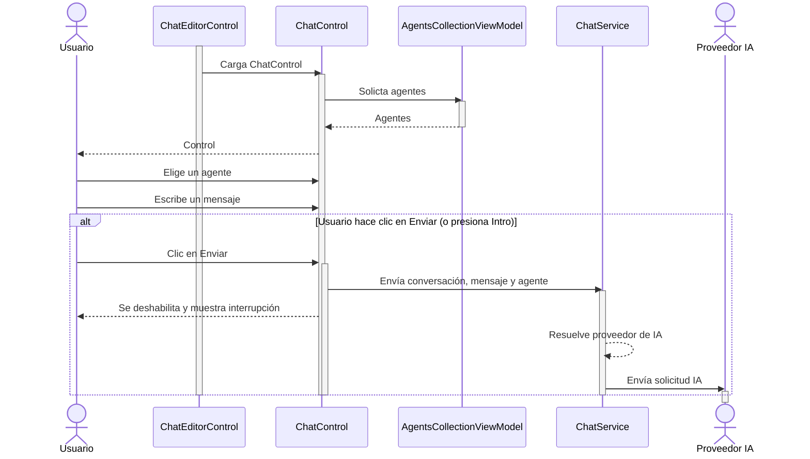
```mermaid
sequenceDiagram
    actor U as Usuario
    participant CEC as ChatEditorControl
    participant CC as ChatControl
    participant ACVM as AgentsCollectionViewModel
    participant CS as ChatService
    actor IA as Proveedor IA

    activate CEC

    CEC->>CC: Carga ChatControl
    activate CC
    CC->>ACVM: Solicta agentes
    activate ACVM
    ACVM-->>CC: Agentes
	deactivate ACVM

    CC-->>U: Control
    U->>CC: Elige un agente
    U->>CC: Escribe un mensaje

    alt Usuario hace clic en Enviar (o presiona Intro)
        U->>CC: Clic en Enviar
        activate CC
        CC->>CS: Envía conversación, mensaje y agente
        activate CS
        CC-->>U: Se deshabilita y muestra interrupción
        CS-->>CS: Resuelve proveedor de IA
        CS->>IA: Envía solicitud IA
        activate IA
    end

    deactivate IA
    deactivate CS
    deactivate CC
    deactivate CC
    deactivate CEC

```

- `ChatEditorControl` carga `ChatControl`
- `ChatControl` carga los agentes desde `AgentsCollectionViewModel`
- Usuario elige un agente en `ChatControl`
- Usuario escribe un mensaje en `ChatControl`
- *Si el usuario hace clic en* `Enviar` *o presiona* `Intro` *en* `ChatControl`: `ChatControl` envía conversación, mensaje y agente a `ChatService`
- `ChatControl` se deshabilita y muestra botón de interrupción del proceso
- `ChatService` resuelve el proveedor de IA del modelo del agente
- `ChatService` envía al proveedor de IA conversación, mensaje y prompt del agente

##### Parte 3

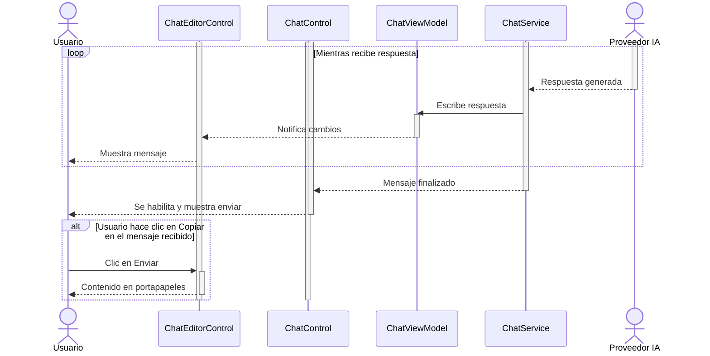
```mermaid
sequenceDiagram
    actor U as Usuario
    participant CEC as ChatEditorControl
    participant CC as ChatControl
    participant CVM as ChatViewModel

    participant CS as ChatService
    actor IA as Proveedor IA

    activate CEC
    activate CC
    activate CC
    activate CS
    activate IA

    loop Mientras recibe respuesta
        IA-->>CS: Respuesta generada
        deactivate IA
        CS->>CVM: Escribe respuesta
        activate CVM
        CVM-->>CEC: Notifica cambios
        deactivate CVM
        CEC-->>U: Muestra mensaje
    end
    CS-->>CC: Mensaje finalizado
    deactivate CS
    CC-->>U: Se habilita y muestra enviar
    deactivate CC

    alt Usuario hace clic en Copiar en el mensaje recibido
        U->>CEC: Clic en Enviar
        activate CEC
        CEC-->>U: Contenido en portapapeles
        deactivate CEC
    end

    deactivate CC
    deactivate CEC

```

- `ChatService` recibe del proveedor de IA la respuesta generada (en streaming)
- `ChatService` devuelve la respuesta a `ChatControl` mientras la recibe
- `ChatControl` escribe la respuesta en `ChatViewModel` mientras la recibe
- `ChatViewModel` notifica cambios a `ChatEditorControl`
- `ChatEditorControl` muestra mensaje al usuario
- *Cuando se finaliza la respuesta* : `ChatControl` vuelve a habilitarse y muestra el botón de enviar mensaje
- *Si el usuario hace clic en* `Copiar` *en el mensaje recibido*: `ChatEditorControl` copia el contenido del mensaje en el portapapeles

## 5.5. Edición de una nota con IA

#### Caso de uso

El usuario desea tomar notas durante una llamada donde le van a dar detalles de un nuevo proyecto, posteriormente quiere solicitar a la IA que corrija y ordene el texto para que puede guardarlo y consultar con su contenido en otro momento.

#### Pasos para el usuario

1. Usuario: Abre la aplicación PowerPad.
	a. PowerPad: Muestra la ventana principal.
	b. PowerPad: Muestra la página de espacio de trabajo.
2. Usuario: Pulsa sobre `Nueva nota`.
	c. PowerPad: Muestra el componente de editor de texto.
3. Usuario: Escribe sus notas sin prestar atención a la corrección y al formato.
4. Usuario: Pulsa sobre el selector de agentes y elige el agente `PowerEditor`.
5. Usuario: Escribe la acción `Corregir y ordenar`
6. Usuario: Pulsa el botón `Enviar` o presiona `Intro`.
	d. PowerPad envía la nota, junto a la acción y el prompt del agente `PowerEditor`, al servicio de IA predeterminado.
	e. PowerPad muestra un indicador de respuesta.
	f. PowerPad recibe la respuesta generada por la IA con las notas modificadas.
	g. PowerPad actualiza la nota.
7. Usuario: Pulsa el botón `Guardar` en el editor de texto
	h. PowerPad guarda la nota en el documento del espacio de trabajo.

#### Interfaces implicados

1) El usuario accede a la ventana principal: **MainWindow** y **WorkspacePage**

2) El usuario pulsa en `Nuevo nota`, introduce sus anotaciones y solicita la edición: **TextEditorControl**

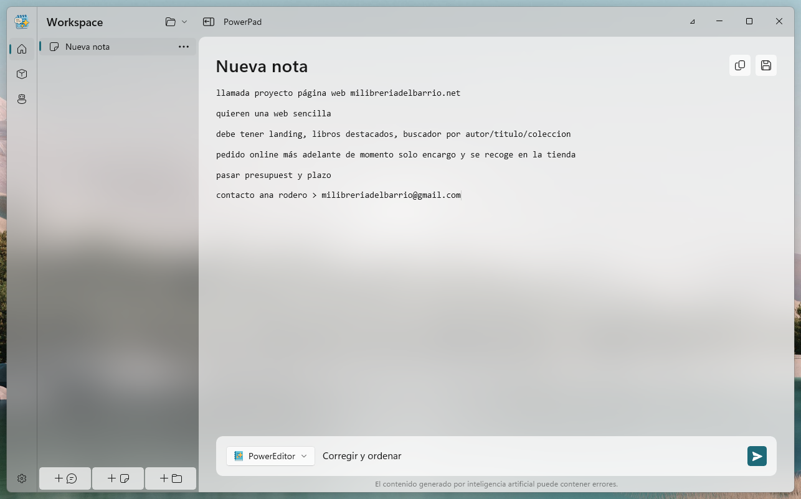

3) El usuario pulsa en visualiza las anotaciones corregidas: **TextEditorControl**

#### Clases implicadas

- `App`: Clase principal de la aplicación.
- `MainWindow`: Ventana principal.
- `WorkspacePage`: Página de gestión de documentos y chats.
- `WorkspaceViewModel`: Lógica de presentación y gestión del espacio de trabajo.
- `TextEditorControl`: Control de edición de texto.
- `DocumentViewModel`: Lógica de presentación y gestión de documentos.
- `NoteAgentControl`: Control para interactuar con la nota a través de los agentes.
- `AgentsCollectionViewModel`: Gestión de agentes.
- `ChatService`: Responsable de la comunicación con los servicios de IA.
- `DocumentService`: Responsable de la carga y guardado de documentos.

#### Secuencia simplificada

##### Parte 1

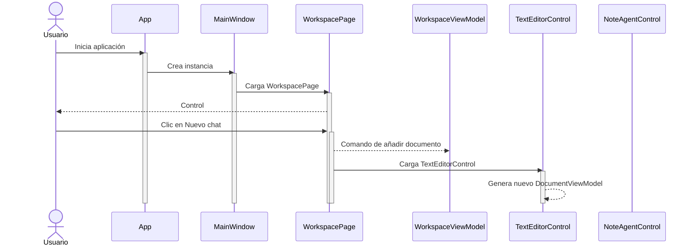
```mermaid
sequenceDiagram
    actor U as Usuario
    participant A as App
    participant M as MainWindow
    participant WP as WorkspacePage
    participant WV as WorkspaceViewModel
    participant TEC as TextEditorControl
    participant CC as NoteAgentControl

    U->>A: Inicia aplicación
    activate A
    A->>M: Crea instancia
    activate M
    M->>WP: Carga WorkspacePage
    activate WP
    WP-->>U: Control

    U->>WP: Clic en Nuevo chat
    activate WP
    WP-->>WV: Comando de añadir documento
    WP->>TEC: Carga TextEditorControl
    activate TEC
    TEC-->>TEC: Genera nuevo DocumentViewModel

    deactivate WP
    deactivate TEC
    deactivate WP
    deactivate M
    deactivate A
```

- Usuario inicia `App`
- `App` crea instancia de `MainWindow`
- `MainWindow` carga `WorkspacePage`
- Usuario hace clic en `Nuevo chat` en `WorkspacePage`
- `WorkspacePage` ejecuta comando de añadir documento en `WorkspaceViewModel`
- `WorkspacePage` carga `TextEditorControl`
- `TextEditorControl` genera nuevo `DocumentViewModel`
- `TextEditorControl` carga `NoteAgentControl`

##### Parte 2

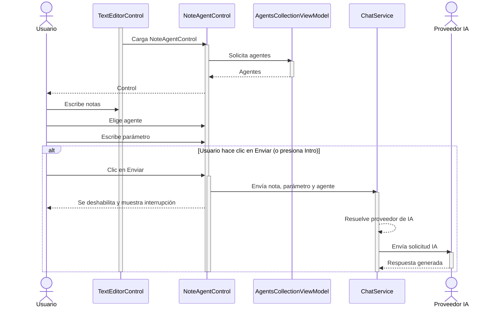
```mermaid
sequenceDiagram
    actor U as Usuario
    participant TEC as TextEditorControl
    participant NAC as NoteAgentControl
    participant ACVM as AgentsCollectionViewModel
    participant CS as ChatService
    actor IA as Proveedor IA

    activate TEC
    TEC->>NAC: Carga NoteAgentControl
    activate NAC
    NAC->>ACVM: Solicita agentes
    activate ACVM
    ACVM-->>NAC: Agentes
    deactivate ACVM

    NAC-->>U: Control
    U->>TEC: Escribe notas
    U->>NAC: Elige agente
    U->>NAC: Escribe parámetro

    alt Usuario hace clic en Enviar (o presiona Intro)
        U->>NAC: Clic en Enviar
        activate NAC
        NAC->>CS: Envía nota, parámetro y agente
        activate CS
        NAC-->>U: Se deshabilita y muestra interrupción
        CS-->>CS: Resuelve proveedor de IA
        CS->>IA: Envía solicitud IA
        activate IA
        IA-->>CS: Respuesta generada
	    deactivate IA
    end

    deactivate CS
    deactivate NAC
    deactivate NAC
    deactivate TEC
```

- `NoteAgentControl` carga los agentes desde `AgentsCollectionViewModel`
- Usuario escribe sus notas en `TextEditorControl`
- Usuario elige un agente en `NoteAgentControl`
- Usuario escribe un parámetro en `NoteAgentControl`
- *Si el usuario hace clic en* `Enviar` *o presiona* `Intro` *en* `NoteAgentControl`: `NoteAgentControl` envía nota, parámetro de acción y agente a `ChatService`
- `NoteAgentControl` se deshabilita y muestra botón de interrupción del proceso
- `ChatService` resuelve el proveedor de IA del modelo del agente
- `ChatService` elabora y envía al proveedor de IA un prompt con la acción requerida
- `ChatService` recibe del proveedor de IA la respuesta generada

##### Parte 3

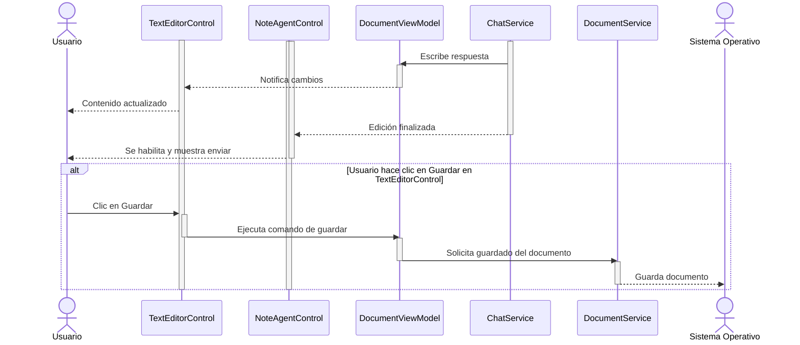
```mermaid
sequenceDiagram
    actor U as Usuario
    participant TEC as TextEditorControl
    participant NAC as NoteAgentControl
    participant DVM as DocumentViewModel
    participant CS as ChatService
    participant DS as DocumentService
    actor OS as Sistema Operativo

    activate TEC
    activate NAC
    activate NAC
    activate CS

    CS->>DVM: Escribe respuesta
    activate DVM
    DVM-->>TEC: Notifica cambios
    deactivate DVM
    TEC-->>U: Contenido actualizado
    CS-->>NAC: Edición finalizada
    deactivate CS
    NAC-->>U: Se habilita y muestra enviar
    deactivate NAC

    alt Usuario hace clic en Guardar en TextEditorControl
        U->>TEC: Clic en Guardar
        activate TEC
        TEC->>DVM: Ejecuta comando de guardar
        deactivate TEC
        activate DVM
        DVM->>DS: Solicita guardado del documento
        deactivate DVM
        activate DS
        DS-->>OS: Guarda documento
        deactivate DS
    end

    deactivate NAC
    deactivate TEC
```

- `ChatService` devuelve la respuesta a `NoteAgentControl`
- `NoteAgentControl` escribe la respuesta en `DocumentViewModel`
- `DocumentViewModel` notifica cambios a `TextEditorControl`
- `TextEditorControl` muestra mensaje al usuario
- `NoteAgentControl` vuelve a habilitarse y muestra el botón de enviar
- *Si el usuario hace clic en* `Guardar` *en* `TextEditorControl`: `TextEditorControl` ejecuta comando de guardar en `DocumentViewModel`
- `DocumentViewModel` solicita el guardado del documento a `DocumentService`
- `DocumentService` guarda el documento utilizando el interfaz del sistema operativo

## 5.6. Edición rápida desde aplicación externa

#### Caso de uso

El usuario está consultando información en internet y necesita rápidamente traducir un fragmento de texto utilizando las capacidades de edición con IA de PowerPad, sin necesidad de cambiar completamente de contexto o abrir la aplicación principal.

#### Pasos para el usuario

1. Usuario: Abre la aplicación PowerPad.
	a. PowerPad: Registra los atajos de teclado (`hotkeys`).
2. Usuario: Minimiza la aplicación PowerPad a la bandeja de sistema.
3. Usuario: Selecciona un texto en una aplicación externa (correo electrónico).
4. Usuario: Utiliza el atajo de teclado `Ctrl+Shift+C` para invocar la edición rápida.
	b. PowerPad: Detecta el atajo de teclado.
	c. PowerPad: Simula la combinación de teclas de copiar (`Ctrl+C`).
	d. PowerPad: Muestra la ventana emergente de edición rápida con el contenido del portapapeles.
5. Usuario: Pulsa sobre el selector de agentes y elige el agente `Traductor`.
6. Usuario: Escribe el idioma de destino.
7. Usuario: Pulsa el botón `Enviar`.
	e. PowerPad envía la nota, junto a la acción y el prompt del agente `PowerEditor`, al servicio de IA predeterminado.
	f. PowerPad muestra un indicador de respuesta.
	g. PowerPad recibe la respuesta generada por la IA con las notas modificadas.
	h. PowerPad actualiza la nota.
8. Usuario: Pulsa el botón `Volver y aplicar`.
	i. PowerPad: Copia el texto editado al portapapeles.
	j. PowerPad: Oculta la ventana emergente.
	k. PowerPad: Simula la combinación de teclas de pegar (`Ctrl+V`)

#### Interfaces implicados

1) El usuario selecciona el texto y pulsa la combinación de teclas para acceder a la edición rápida: **PopupWindow** y **PopupEditorPage**

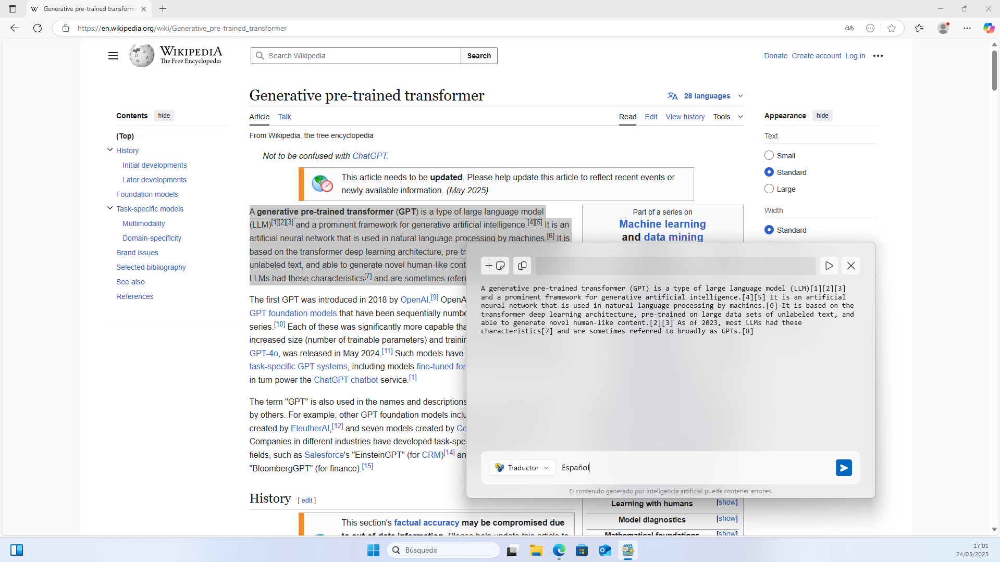

2) El usuario selecciona el agente, escribe sus indicaciones y pulsa en enviar para ver el texto traducido: **PopupEditorPage**

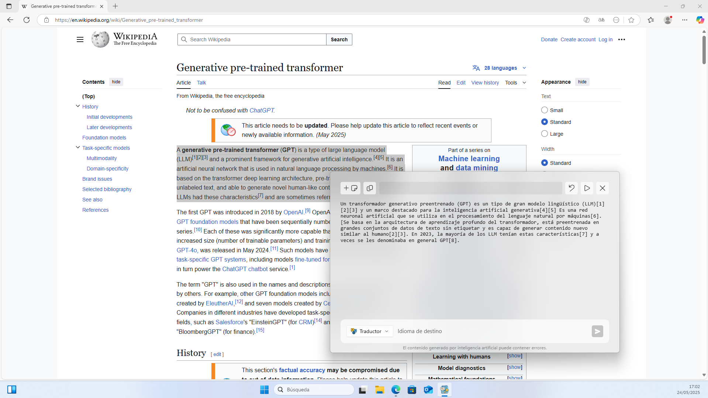

#### Clases implicadas

- `App`: Clase principal de la aplicación.
- `HotKeyHelper`: Responsable de registrar los atajos y simular combinaciones de tecla en el sistema operativo para copiar y pegar.
- `PopupWindow`: Ventana emergente.
- `PopupEditorPage`: Página de edición rápida.
- `DraftDocumentViewModel`: Almacenamiento del estado de la nota temporal
- `NoteAgentControl`: Control para interactuar con la nota a través de los agentes.
- `AgentsCollectionViewModel`: Gestión de agentes.
- `ChatService`: Responsable de la comunicación con los servicios de IA.

#### Secuencia simplificada

##### Parte 1

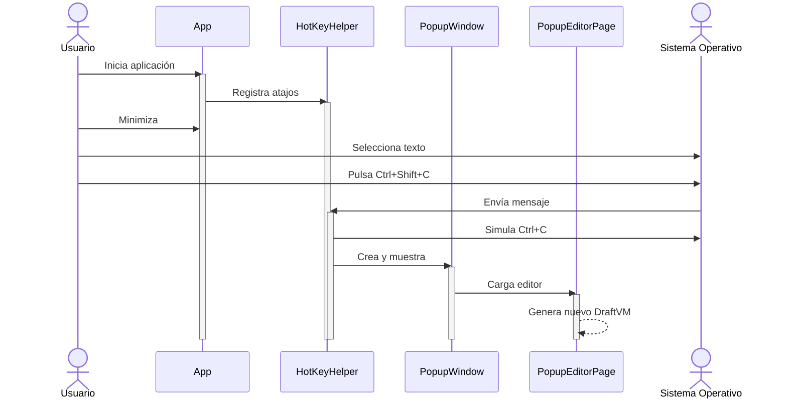
```mermaid
sequenceDiagram
    actor U as Usuario
    participant A as App
    participant H as HotKeyHelper
    participant P as PopupWindow
    participant PEP as PopupEditorPage
    actor SO as Sistema Operativo

    U->>A: Inicia aplicación
    activate A
    A->>H: Registra atajos
    activate H
    U->>A: Minimiza
    U->>SO: Selecciona texto
    U->>SO: Pulsa Ctrl+Shift+C
    SO->>H: Envía mensaje
    activate H
    H->>SO: Simula Ctrl+C
    H->>P: Crea y muestra
    activate P
    P->>PEP: Carga editor
    activate PEP
    PEP-->>PEP: Genera nuevo DraftVM

    deactivate PEP
    deactivate P
    deactivate H
    deactivate H
    deactivate A
```

- Usuario inicia `App`
- `App` registra los atajos de teclado (`hotkeys`) utilizando `HotKeyHelper`
- Usuario minimiza `App` a la bandeja del sistema
- Usuario selecciona texto en una aplicación externa
- Usuario pulsa el atajo `Ctrl+Shift+C`
- El sistema operativo envía un mensaje a `HotKeyHelper` por el atajo registrado
- `HotKeyHelper` detecta el atajo de teclado
- `HotKeyHelper` simula la combinación de teclas `Ctrl+C`
- `HotKeyHelper` crea y muestra `PopupWindow`
- `PopupWindow` carga `PopupEditorPage`
- `PopupEditorPage` genera nuevo `DraftDocumentViewModel`

##### Parte 2

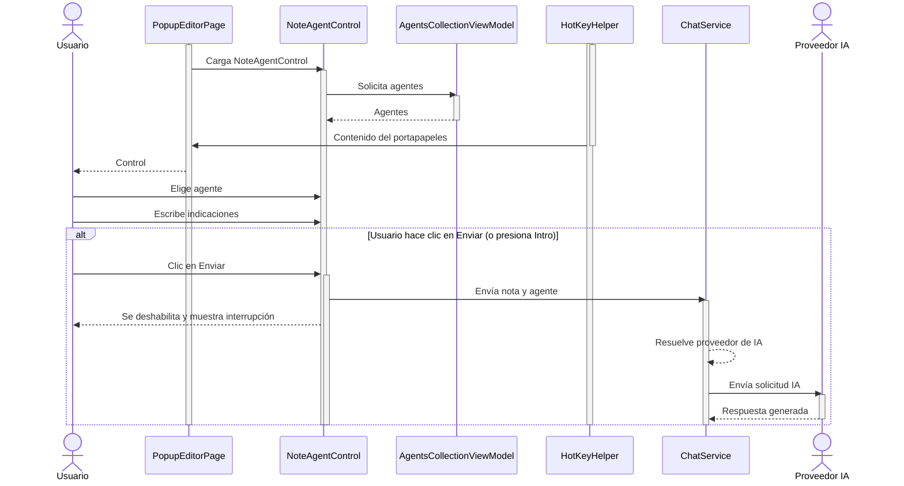
```mermaid
sequenceDiagram
    actor U as Usuario
    participant PEP as PopupEditorPage
    participant NAC as NoteAgentControl
    participant ACVM as AgentsCollectionViewModel
    participant HKH as HotKeyHelper
    participant CS as ChatService
    actor IA as Proveedor IA

    activate HKH
    activate HKH
    activate PEP
    PEP->>NAC: Carga NoteAgentControl
    activate NAC
    NAC->>ACVM: Solicita agentes
    activate ACVM
    ACVM-->>NAC: Agentes
    deactivate ACVM

    HKH->>PEP: Contenido del portapapeles
    deactivate HKH
    PEP-->>U: Control
    U->>NAC: Elige agente
    U->>NAC: Escribe indicaciones

    alt Usuario hace clic en Enviar (o presiona Intro)
        U->>NAC: Clic en Enviar
        activate NAC
        NAC->>CS: Envía nota y agente
        activate CS
        NAC-->>U: Se deshabilita y muestra interrupción
        CS-->>CS: Resuelve proveedor de IA
        CS->>IA: Envía solicitud IA
        activate IA
        IA-->>CS: Respuesta generada
        deactivate IA
    end

    deactivate NAC
    deactivate HKH
    deactivate CS
    deactivate NAC
    deactivate PEP
```

- `PopupEditorPage` carga `NoteAgentControl`
- `NoteAgentControl` carga los agentes desde `AgentsCollectionViewModel`
- `HotKeyHelper` introduce el contenido del portapapeles en `PopupEditorPage`
- Usuario elige un agente en `NoteAgentControl`
- Usuario escribe indicaciones en `NoteAgentControl`
- *Si el usuario hace clic en* `Enviar` *o presiona* `Intro` *en* `NoteAgentControl`: `NoteAgentControl` envía nota y agente a `ChatService`
- `NoteAgentControl` se deshabilita y muestra botón de interrupción del proceso
- `ChatService` resuelve el proveedor de IA del modelo del agente
- `ChatService` elabora y envía al proveedor de IA un prompt con la acción requerida
- `ChatService` recibe del proveedor de IA la respuesta generada

##### Parte 3

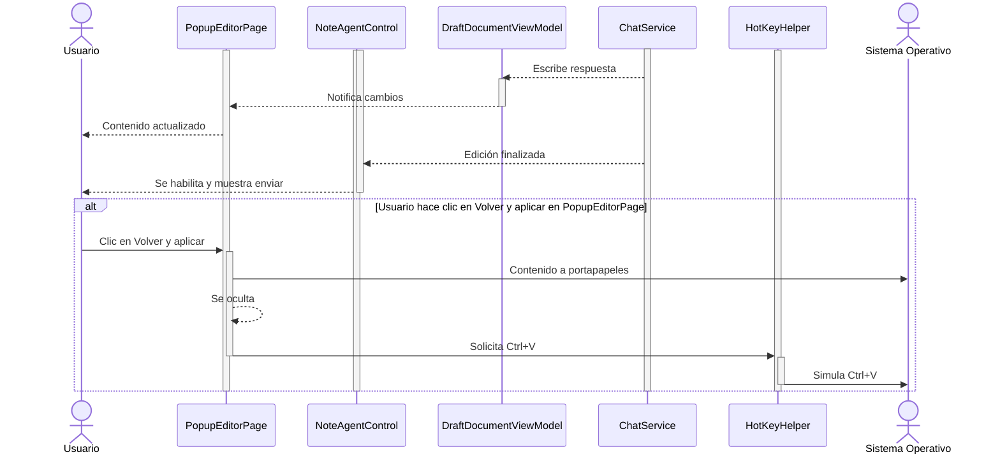
```mermaid
sequenceDiagram
    actor U as Usuario
    participant PEP as PopupEditorPage
    participant NAC as NoteAgentControl
    participant DVM as DraftDocumentViewModel
    participant CS as ChatService
    participant HKH as HotKeyHelper
    actor SO as Sistema Operativo

    activate CS
    activate NAC
    activate NAC
    activate PEP
    activate HKH

    CS-->>DVM: Escribe respuesta
    activate DVM
    DVM-->>PEP: Notifica cambios
    deactivate DVM
    PEP-->>U: Contenido actualizado
    CS-->>NAC: Edición finalizada
    NAC-->>U: Se habilita y muestra enviar
    deactivate NAC

    alt Usuario hace clic en Volver y aplicar en PopupEditorPage
        U->>PEP: Clic en Volver y aplicar
        activate PEP
        PEP->>SO: Contenido a portapapeles
        PEP-->>PEP: Se oculta
        PEP->>HKH: Solicita Ctrl+V
        deactivate PEP
        activate HKH
        HKH->>SO: Simula Ctrl+V
        deactivate HKH
    end

    deactivate CS
    deactivate NAC
    deactivate PEP
    deactivate HKH
```

- `ChatService` devuelve la respuesta a `NoteAgentControl`
- `NoteAgentControl` escribe la respuesta en `DraftDocumentViewModel`
- `NoteAgentControl` vuelve a habilitarse y muestra el botón de enviar
- *Si el usuario hace clic en* `Volver y aplicar` *en* `PopupEditorPage`:
- `PopupEditorPage` copia el texto al portapapeles
- `PopupEditorPage` se oculta
- `PopupEditorPage` utiliza `HotKeyHelper` para simular la combinación de teclas `Ctrl+V`