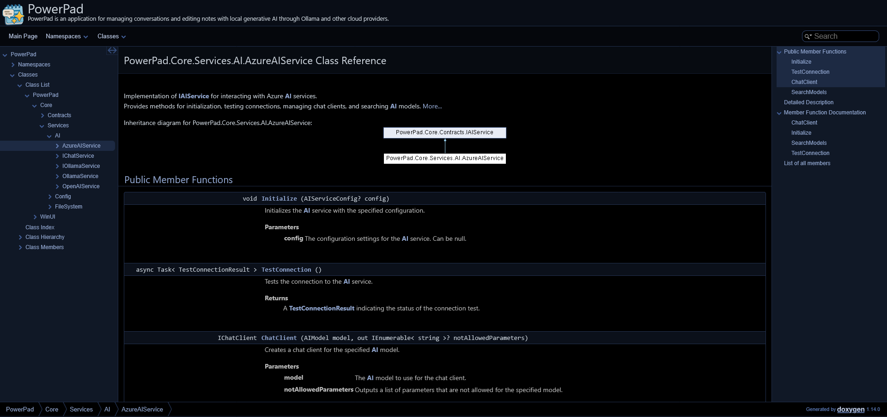
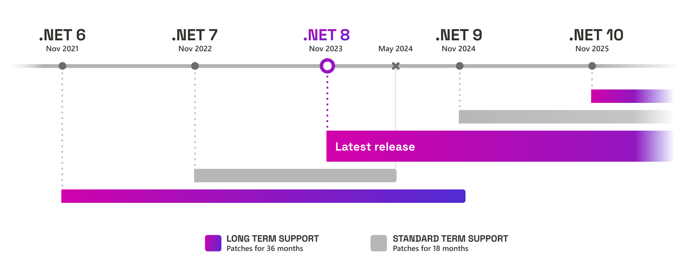
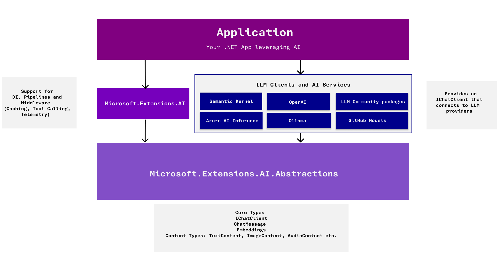
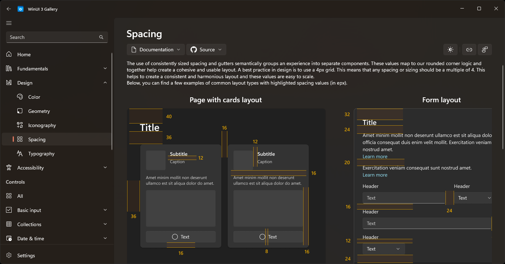
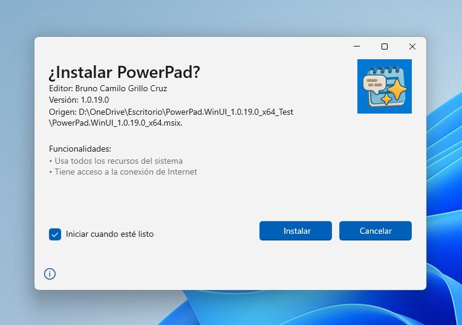

## 6.1. Estructura de la solución

```
/PowerPad.Core
    /Contracts
    /Helpers
    /Models
        /AI
        /FileSystem
    /Services
        /AI
        /Config
        /FileSystem
    PowerPad.Core.csproj
/PowerPad.WinUI
    /Assets
        /Background
        /Icons
    /Components
        /Chat
        /Controls
        /Editors
        /Models
        /Selectors
        /Workspace
    /Configuration
    /Converters
    /Helpers
    /Messages
    /Pages
        /Providers
    /Properties
        /PublishProfiles
    /Styles
    /ViewModels
        /Agents
        /AI
            /Providers
        /Chat
        /FileSystem
        /Settings
    PowerPad.WinUI.csproj
    ...
/Wiki
PowerPad.sln
...
```

El código fuente de la solución está dividido en dos proyectos: `PowerPad.Core`, que ofrece la lógica de negocio, modelos y servicios base; y `PowerPad.WinUI`, que contiene la interfaz de usuario (UI), controles, *viewmodels* y recursos visuales. Esta separación facilita el mantenimiento, *testing* y la extensión a otras plataformas si fuera necesario en el futuro.
En la raíz encontramos principalmente el fichero principal de la solución para Visual Studio. También encontramos en el mismo repositorio la carpeta `Wiki` con la documentación completa en formato Markdown. (CITA ESPECIFICACION MARKDOWN)

#### PowerPad.Core

Este proyecto engloba todo el núcleo lógico de la aplicación, gestionando los modelos de datos, contratos de servicios (interfaces), lógica de IA, configuración y manipulación de documentos. En la raíz está el archivo de proyecto, y dentro de las subcarpetas se distribuyen las distintas responsabilidades lógicas.

- **Contracts**: Define las interfaces y contratos fundamentales que deben implementar los servicios principales como los de IA, editores, chats y gestión de archivos. Permite desacoplar la lógica y facilitar futuras implementaciones o testeo.
- **Helpers**: Utilidades y clases auxiliares para interacción con APIs externas (como Hugging Face o GitHub) y parseo de la web de Ollama.com para búsqueda de modelos.
- **Models**: Contiene los modelos de datos utilizados en el dominio de la aplicación, estructurados a su vez en subcarpetas como `AI` (para agentes, modelos, parámetros de IA) y `FileSystem` (para documentos, carpetas, estados de archivo).
- **Services**: Implementa la lógica de negocio central organizada en varias áreas:
    - **AI**: Servicios que permiten interactuar con los diferentes proveedores de inteligencia artificial (por ejemplo, Ollama o Azure AI).
    - **Config**: Lógica para la gestión, almacenamiento y recuperación de la configuración de la aplicación.
    - **FileSystem**: Servicios para la manipulación del sistema de archivos interno de la aplicación, gestión de documentos, carpetas y su orden.

#### PowerPad.WinUI

Este proyecto es responsable de la interfaz de usuario, integrando WinUI 3 y MVVM. Incluye los ficheros de recursos gráficos, controles personalizados, páginas, estilos y los viewmodels que enlazan la UI con el *core* de la aplicación.

- **Assets**: Almacena todos los recursos visuales: iconos, imágenes (por secciones), temas y fondos empleados en la app.
    - **Background**: Imágenes de fondo para diferentes apartados.
    - **Icons**: Conjunto de iconos SVG y PNG usados en la interfaz.
- **Components**: Reúne los controles personalizados reutilizables organizados por función.
	- **Chat**: Controles reutilizables para la interacción de chat.
	- **Controls**: Otros controles visuales personalizados, como selectores y botones especiales.
	- **Editors**: Controles de edición tanto para notas como para chats y agentes.
	- **Models**: Controles para gestionar, buscar y añadir modelos de IA.
	- **Workspace**: Controles relacionados con la gestión y visualización del espacio de trabajo y editores.
- **Configuration**: Contiene clases auxiliares y modelos para cargar y manejar la configuración de la app, como ficheros JSON, contextos de serialización y constantes.
- **Converters**: Clases para convertir valores entre tipos, especialmente útiles en el data binding de XAML (por ejemplo, convertir un modelo AI a su fuente visual).
- **Helpers**: Extensiones y utilidades específicas para la UI, como helpers para fondos acrílicos, conversiones, o helpers para la gestión de colecciones observables.
- **Messages**: Define los mensajes y notificaciones usados en el sistema de mensajería interna (por ejemplo, para cambios en carpetas o archivos).
- **Pages**: Todas las páginas y vistas principales de la app, junto con páginas específicas para la gestión de modelos según el proveedor.
    - **Providers**: Páginas especializadas para los distintos proveedores de modelos IA.
- **Properties**: Configuraciones propias del proyecto, como el manifiesto y ajustes de publicación.
    - **PublishProfiles**: Perfiles para publicar en distintas arquitecturas de Windows.
- **Styles**: Diccionarios de estilos y temas XAML reutilizados en toda la app para garantizar una apariencia coherente.
- **ViewModels**: Implementación de la capa MVVM, con subcarpetas para cada área funcional.
	- **Agents**: ViewModels específicos para la gestión y visualización de agentes IA.
	- **AI**: ViewModels para modelos IA, parámetros y menús de selección de modelos.
	- **Providers**: ViewModels especializados para cada proveedor (OpenAI, Ollama, GitHub, HuggingFace...).
	- **Chat**: ViewModels que gestionan la lógica de los chats y mensajes.
	- **FileSystem**: ViewModels ligados a la gestión y presentación de documentos y carpetas.
	- **Settings**: ViewModels dedicados a la configuración general, de IA y de modelos.

Adicionalmente, en la raiz del proyecto se encuentran algunos ficheros importantes, destacando los siguientes:

- **App.xaml / App.xaml.cs**: Definición y lógica del punto de entrada de la aplicación.
- **MainWindow.xaml / PopupWindow.xaml**: Ventanas principales de la aplicación.
- **app.manifest**: Manifiesto de la aplicación para especificar privilegios, compatibilidad y configuración básica en Windows.
- **Package.appxmanifest**: Archivo de configuración del paquete de instalación, usado para definir capacidades, identidad y recursos para el despliegue en Windows.
- **NativeMethods.txt**: El contenido de este archivo informa a la biblioteca `CsWin32` [@cswin32_2025] las funciones nativas para las que debe generar el código fuente.

## 6.2. Buenas prácticas

Durante el desarrollo de PowerPad se ha prestado especial atención a la adopción de buenas prácticas de ingeniería de software, tanto para maximizar la calidad del código como para asegurar su mantenibilidad, escalabilidad y robustez a largo plazo. En esta sección se detallan los principales enfoques y estándares aplicados en el proyecto.

#### Documentación exhaustiva

Desde las primeras fases del proyecto, uno de los objetivos clave fue garantizar que todo el código fuente estuviera correctamente documentado. Así, cada clase, método, enumeración e interfaz incluye **documentación XML** siguiendo el estándar de documentación de .NET (**Figura X.X**). Este enfoque permite no solo facilitar la comprensión del código a otros desarrolladores, sino también aprovechar herramientas de generación automática de documentación (como DocFX [@docfx], Sandcastle [@sandcastle] o Doxygen [@doxygen]) en caso de necesitar publicar documentación técnica para usuarios o contribuyentes futuros del proyecto.

Figura X.X. (CAPTURAS DEL CÓDIGO DOCUMENTADO)

Esta documentación exhaustiva resulta especialmente valiosa en un contexto como PowerPad, donde existen numerosos componentes (servicios de IA, modelos, *helpers*, etc.) que interactúan entre sí. La claridad en la definición de parámetros, contratos y excepciones facilita la comprensión global del sistema y disminuye la curva de aprendizaje para nuevos colaboradores.

Se ha incluido como anexo la documentación generada con Doxygen a partir del código fuente con esta técnica (**Figura X.X**).



#### Cumplimiento de reglas de calidad (SonarQube y análisis estático)

A lo largo de todo el ciclo de vida del desarrollo se ha utilizado SonarQube IDE [@SonarQube] (anteriormente SonarLint) como herramienta principal de análisis estático de código. SonarQube ha permitido detectar y solucionar de forma temprana posibles errores, *code smells*, vulnerabilidades de seguridad y problemas de mantenibilidad en el código C#. El proyecto se mantiene en todo momento sin advertencias ni mensajes de error, lo cual es indicativo de la rigurosidad aplicada en la revisión de la calidad del código.

Más allá del uso básico, se han seguido todas las recomendaciones sugeridas por SonarQube y el analizador de código integrado de Visual Studio, incluyendo aquellas relacionadas con la disposición de miembros, convenciones de nomenclatura, uso adecuado de variables y detección de potenciales fugas de recursos.

#### Adopción del estilo y directrices .NET

Todo el código de PowerPad sigue el **estándar de estilo y recomendaciones de .NET** [@net_conventions] [@net_naming], lo que incluye la convención de nombres para clases (*PascalCase*), métodos, interfaces (I-prefijo), y campos privados (\_*underscore* para campos privados). Además, la estructura de los archivos y las carpetas en la solución replica el dominio lógico de la aplicación, lo que favorece la localización rápida de cualquier funcionalidad.

#### Gestión correcta de recursos y uso de *disposables*

Un aspecto fundamental del desarrollo en .NET es la correcta gestión de recursos no administrados o recursos que requieren liberación explícita (por ejemplo, *streams*, objetos que acceden a sistema de archivos, etc.). En PowerPad se han implementado los patrones de *Disposable* [@iDisposable], asegurándose de liberar correctamente los recursos en todos los objetos que lo requieran, como páginas, controladores de editores y *helpers* que hacen uso de recursos externos.

#### Uso de las últimas características del lenguaje C#

PowerPad hace uso extensivo de las capacidades más recientes del lenguaje C#, incorporando ***record*** y ***record struct*** (CITA REFERENCIA ESTOS TIPOS DE ELEMENTOS) para la declaración de modelos inmutables allí donde tiene sentido. Estas estructuras permiten ventajas como la semántica de valor, igualdad estructural y una sintaxis más declarativa, facilitando la implementación de *viewmodels*, mensajes o contratos de datos que contentan o encapsulen estos registros.

También se ha hecho aprovechamiento de los constructores primarios, la inicialización de propiedades y las expresiones lambda simplificadas para mejorar la legibilidad, reducir el código y minimizar la complejidad innecesaria.

#### Serialización robusta y contextualizada

Para la persistencia de datos y configuración, se ha optado por la capacidad nativa de .NET `System.Text.Json` con contextos personalizados mediante la directiva `JsonSerializable` [@json_serializable] y constructores especiales para deserialización (`JsonConstructor`), lo que permite una serialización y deserialización más robusta, controlada y eficiente, aprovechando además el *source generator* (código autogenerado) para minimizar costes y riesgos del uso de reflexión, mejorando el rendimiento.

Esto es importante en proyectos que en un futuro puedan ser trasladados a distintas plataformas, ya que el uso de reflexión genera advertencias y errores en función de cómo está construida la solución. Con la serialización contextualizada el código de serialización y deserialización es generado en tiempo de compilación, garantizando su funcionamiento en todas las plataformas de destino.

#### Gestión segura de la concurrencia

En los servicios de configuración y persistencia se ha puesto especial cuidado en asegurar la **concurrencia segura**. Los accesos a los archivos de configuración están diseñados para evitar condiciones de carrera y sobreescritura accidental de datos, empleando mecanismos de bloqueo (`lock` / `async lock`) donde ha sido necesario.

#### Preparación para la escalabilidad y futuras extensiones

Finalmente, todo el diseño arquitectónico y las buenas prácticas adoptadas están pensadas para permitir la **escalabilidad** futura del proyecto. El desacoplamiento de servicios, la modularidad y la generalización de contratos e interfaces permiten que futuros proveedores de IA, agentes personalizados o nuevas funcionalidades puedan integrarse en PowerPad con el menor esfuerzo posible y sin necesidad de reescribir capas existentes.

## 6.3. *Framework* y dependencias

## 6.3.1 Plataforma .NET 8

El proyecto PowerPad está construido sobre la plataforma **.NET 8**, la versión con soporte a largo plazo (LTS) más moderna y optimizada del *framework* de desarrollo de Microsoft en el momento de la realización del proyecto (INCLUIR CITA INDICANDO ESTO). .NET 8 representa una evolución significativa respecto a versiones anteriores, con mejoras tanto en rendimiento como en productividad, seguridad y compatibilidad multiplataforma.

La elección de .NET 8 garantiza acceso a las últimas características de C#. Además, .NET 8 también pone especial foco en aplicaciones de escritorio modernas gracias a su integración nativa con WinUI 3, permitiendo aprovechar al máximo tanto las APIs tradicionales de Windows como las nuevas tecnologías gráficas y de interfaz de usuario.



En PowerPad, .NET 8 es clave para que la aplicación pueda ofrecer una experiencia rica visualmente, rápida y escalable, además de facilitar la integración con bibliotecas de terceros y servicios *cloud* o locales enfocados a la inteligencia artificial. El soporte a largo plazo (LTS) de .NET 8 también aporta seguridad y estabilidad de cara a despliegues en entornos de producción y futuras ampliaciones del proyecto.

## 6.3.2. Dependencias externas

En este apartado se revisarán las dependencias expertas de los proyectos de la solución PowerPad. Además, se revisarán las más importantes destacando su utilidad general y su importancia y aplicación dentro de la aplicación. Todas las dependencias del proyecto se gestionan mediante el sistema gestor de paquetes NuGet [@nuget] estándar del ecosistema de .NET.

#### Microsoft.Extensions.AI (Abstractions, AzureAIInference y OpenAI)



Las bibliotecas bajo el espacio de nombres `Microsoft.Extensions.AI` [@microsoft.extensions] proporcionan una base robusta y extensible para interactuar con diferentes servicios de IA. Estas librerías abstraen la complejidad de trabajar directamente con las APIs REST de los principales proveedores de LLMs, permitiendo una integración sencilla, segura y mantenible desde aplicaciones .NET.

- **Microsoft.Extensions.AI.Abstractions** [@extensions.ai.abstractions]: Define las interfaces y contratos necesarios para desacoplar la lógica de negocio de los detalles concretos de cada proveedor de IA. Esto ofrece gran flexibilidad y facilita el soporte a múltiples servicios en un mismo código.
- **Microsoft.Extensions.AI.AzureAIInference** [@azure.extensions]: Implementa el acceso a modelos desplegados en Azure AI, incluyendo los modelos de GitHub Models.
- **Microsoft.Extensions.AI.OpenAI** [@microsoft.extensions.openai]: Permite consumir los servicios de la API de OpenAI a través de las abstracciones.

En PowerPad, estas dependencias son clave para la funcionalidad de chat con IA, ya que abstraen el acceso a los diferentes modelos y servicios, logrando que el usuario final pueda seleccionar proveedores, agentes y modelos sin preocuparse por las diferencias técnicas entre ellos. Además, la integración facilita configurar claves, *endpoints* y parámetros de inferencia desde la propia app, incrementando la versatilidad para distintos perfiles de usuario.

#### OllamaSharp

**OllamaSharp** [@ollamasharp_2025] es una biblioteca C# creada para facilitar el acceso local a modelos de IA a través del servidor Ollama. En PowerPad, OllamaSharp es fundamental para ofrecer la experiencia de "IA local". Permite buscar modelos disponibles, descargarlos y gestionarlos automáticamente desde la aplicación, además de lanzar inferencias en tiempo real para responder las consultas del usuario o enriquecer documentos con ayuda de la IA. Su uso aporta una capa importante de autonomía y privacidad para los usuarios avanzados, complementando los proveedores en la nube.

#### HtmlAgilityPack

HtmlAgilityPack [@agility] es una librería para análisis, edición y navegación de documentos HTML, similar a cómo funcionan los selectores DOM en navegadores web. Es especialmente útil para extraer datos estructurados de páginas web que no proveen API, o para procesar contenido HTML en bruto.

En PowerPad se utiliza principalmente en los helpers de búsqueda de modelos, ya que para algunos servicios de búsqueda, como la biblioteca de modelos de Ollama.com, no siempre existe un *endpoint* REST sencillo de consultar. Mediante HtmlAgilityPack, la aplicación puede *parsear* las páginas, extraer información clave sobre los modelos y mostrarla al usuario de manera estructurada.

#### CommunityToolkit

La suite **CommunityToolkit** [@community_toolkit] es un conjunto de librerías ampliamente adoptado en el desarrollo .NET y, especialmente, de aplicaciones modernas de UI como WinUI. En PowerPad destacan los siguientes paquetes:

- **CommunityToolkit.Mvvm** [@toolkit_mvvm]: Facilita la implementación del patrón MVVM con comandos, propiedades observables, mensajería desacoplada, y utilidades para la inyección de lógica en interfaces reactivas. Facilita la escalabilidad, mantenibilidad y *testabilidad* de la app, separando estrictamente la lógica de UI del núcleo funcional.
- **CommunityToolkit.WinUI** [@toolkit.winui]: Incluye controles personalizados, primitivas visuales, convertidores de datos y extensiones muy útiles en la construcción de interfaces modernas y responsivas con WinUI 3.
- **CommunityToolkit.WinUI.Converters [@toolkit.converters], Controls.Primitives [@controls.primitives], SettingsControls, UI.Controls.Markdown**: Diversos módulos que añaden funcionalidad extra, por ejemplo, soporte avanzado para controles de opciones/configuración, renderizado de Markdown en la propia app, y extensiones para manipular la visualización y el comportamiento de los elementos UI.

Estos paquetes permiten que PowerPad tenga una interfaz limpia, atractiva y flexible, además de soportar la edición y renderizado de texto enriquecido, y mantener una experiencia consistente en todo el flujo de trabajo del usuario.

#### H.NotifyIcon.WinUI [@notifyicon]

Esta biblioteca introduce soporte para iconos en la bandeja del sistema en aplicaciones WinUI, algo que no está cubierto de forma nativa en la plataforma. Permite mostrar notificaciones, menús contextuales y gestionar el ciclo de vida de la ventana minimizada.

(INCLUIR IMAGEN DE LA APLICACIÓN MINIMIZADA EN LA BANDEJA DE SISTEMA)

En PowerPad, se utiliza para ofrecer una mejor integración con el sistema operativo, permitiendo que la app permanezca activa en segundo plano con acceso rápido desde la bandeja, ideal para productividad y multitarea.

#### Microsoft.Extensions.DependencyInjection [@extensions.dependencyinjection]

Biblioteca estándar de .NET para la inyección de dependencias, un patrón central en la arquitectura moderna y desacoplada. Permite registrar servicios o *viewmodels*, y resolverlos dinámicamente durante la ejecución.

Su uso en PowerPad es esencial para orquestar la composición de servicios (como los de IA, configuración o almacenamiento) y garantizar un flujo limpio y mantenible en el código, donde los componentes dependen de interfaces y no de implementaciones concretas.

#### Microsoft.WindowsAppSDK

**Microsoft.WindowsAppSDK** [@windowsAppSDK] es el *framework* principal para el desarrollo moderno de aplicaciones Windows nativas con WinUI 3. Ofrece acceso actualizado a APIs de Windows, compatibilidad con nuevos controles, soporte de temas, composición avanzada y mucho más.

PowerPad se apoya totalmente en este SDK para desarrollar su interfaz, aprovechar efectos visuales, la personalización del sistema de ventanas y la integración profunda con el sistema operativo Windows 11, brindando una experiencia fluida y moderna.



WinUI 3 provee a los desarrolladores de multitud de controles y recomendaciones de diseño para aplicaciones modernas para Windows (**Figura X.X**). PowerPad se ha diseñado teniendo en cuenta estas recomendaciones, con algunas diferencias propias, pero siguiendo la línea de estilos del sistema operativo de Microsoft en la mayoría de páginas y controles.
#### WinUIEx

WinUIEx [@winUIEx] es una colección de utilidades y extensiones que amplía las capacidades nativas de WinUI. Facilita la manipulación avanzada de ventanas, eventos, drag&drop, y customización de la experiencia de usuario más allá de lo que la SDK oficial permite.

En PowerPad se utiliza para enriquecer la interacción del usuario con la ventana principal y los popups, proporcionando una experiencia visual más pulida y adaptable. Por ejemplo modificando la barra de título en la ventana principal o generando la ventana de edición rápida sin barra de título.

#### Otras dependencias

- **Microsoft.Windows.CsWin32** [@cswin32_2025]: Genera automáticamente los enlaces necesarios para invocar el API de Win32 desde C#. Es útil para integrar ciertas funcionalidades del sistema operativo, como el registro de atajos de teclado (`HotKeys`), la simulación de combinaciones de tecla, etc.
- **Microsoft.Windows.SDK.BuildTools** [@buildtools]: Incluye las herramientas y cabeceras necesarias para compilar y empacar aplicaciones Windows modernas dirigidas a la última versión del sistema.

#### Listado resumen de dependencias
##### PowerPad.Core

- HtmlAgilityPack (1.12.1)
- Microsoft.Extensions.AI.Abstractions (9.4.3-preview.1.25230.7)
- Microsoft.Extensions.AI.AzureAIInference (9.4.3-preview.1.25230.7)
- Microsoft.Extensions.AI.OpenAI (9.4.3-preview.1.25230.7)
- OllamaSharp (5.1.14)

##### PowerPad.WinUI

- CommunityToolkit.Mvvm (8.4.0)
- CommunityToolkit.WinUI.Controls.Primitives (8.2.250402)
- CommunityToolkit.WinUI.Controls.SettingsControls (8.2.250402)
- CommunityToolkit.WinUI.Converters (8.2.250402)
- CommunityToolkit.WinUI.Extensions (8.2.250402)
- CommunityToolkit.WinUI.UI.Controls.Markdown (7.1.2)
- H.NotifyIcon.WinUI (2.3.0)
- Microsoft.Extensions.DependencyInjection (9.0.4)
- Microsoft.Windows.CsWin32 (0.3.183)
- Microsoft.Windows.SDK.BuildTools (10.0.26100.3916)
- Microsoft.WindowsAppSDK (1.7.250401001)
- WinUIEx (2.5.1)

## 6.4. Empaquetado y distribución

En la solución desarrollada también se ha contemplado el proceso de empaquetado y distribución de la aplicación. Para ello se hace uso de la funcionalidad de crear paquetes de instalación desde el entorno de desarrollo **Visual Studio** (ENLACE IDE VISUAL STUDIO GRANDE, NO ES VS CODE). Esta funcionalidad ofrece al desarrollador la posibilidad de empaquetar su desarrollo en un instalador con formato **MSIX** (CITA FORMATO MSIX) firmado, lo que facilitaría una potencial publicación de la aplicación en **Microsoft Store** (CITA ENLACE MICROSOFT STORE) a futuro.

El generador de paquetes crea un fichero de manifiesto específico para el instalador llamado `Package.appxmanifest` [@manifest] y lo completa con las opciones elegidas en el diálogo, como título y descripción de la aplicación, icono para la tienda de Microsoft, capacidad o permisos, direcciones URL o el número de versionado.  Además, en el paquete se incluyen automáticamente las dependencias necesarias para el correcto funcionamiento de la aplicación, como los *runtime* de **Windows App** (WinUI 3) o de **.NET 8**.



Debido a la naturaleza académica del proyecto, el instalador anexo a la memoria está firmado con una clave temporal que también se adjunta. Para poder utilizarlo en un equipo es necesario instalar el certificado como de confianza (simplemente haciendo doble clic sobre el certificado y seleccionando "Instalar en el almacén de confianza del sistema local"), ya que de otro modo Windows podría bloquear la instalación por desconocer al emisor de la firma.