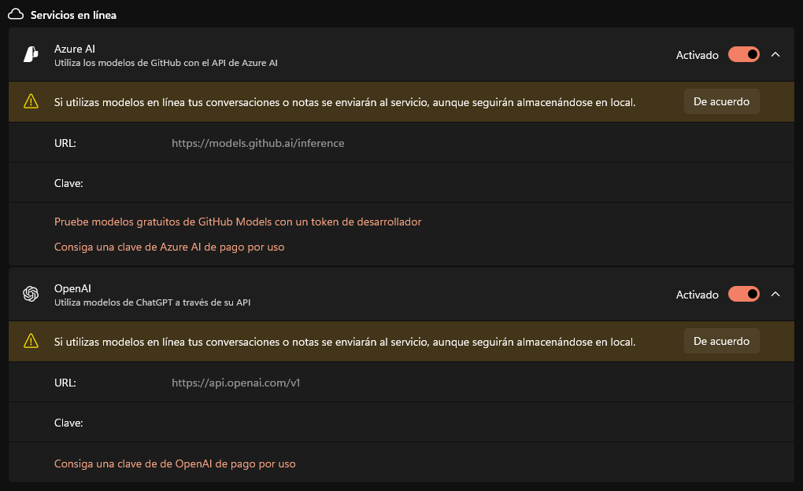

# 7. Impactos sociales, ambientales y éticos

## 7.1. Impacto social y ambiental

El desarrollo y adopción de aplicaciones basadas en inteligencia artificial, como PowerPad, conllevan una serie de implicaciones sociales y ambientales que merecen un análisis detallado y crítico. Las herramientas de IA generativa, más allá de ser herramientas técnicas, tienen el potencial de influir significativamente en la forma en que las personas y organizaciones interactúan con la generación y edición de contenidos, el trabajo colaborativo y la automatización de procesos. A continuación se expone una reflexión sobre los principales puntos tanto a nivel social como ambiental derivados del proyecto.

### 7.1.1. Impacto social

#### Transformación del trabajo y accesibilidad

El uso de la IA generativa en aplicaciones de productividad representa una evolución en el acceso a asistentes inteligentes de última generación, facilitando tareas que antes requerían mucho más tiempo. En el caso de PowerPad, el hecho de centralizar chats, notas y colaboración con IA en una única aplicación accesible desde Windows, democratiza el uso de inteligencia artificial en entornos cotidianos como oficinas, centros educativos e, incluso, contextos domésticos.

La posibilidad de emplear servicios locales como Ollama permite que usuarios que no disponen de conectividad estable o desean mantener autonomía respecto a servicios en la nube, puedan beneficiarse de forma sencilla de la IA generativa. Poder hacerlo con modelos de código abierto desde aplicaciones con una interfaz sencilla rebaja barreras de entrada y fomenta la inclusión, ya que usuarios sin grandes recursos y sin conocimientos significativos pueden beneficiarse de la automatización de tareas, generación de texto, organización inteligente de la información y resolución de dudas.

#### Riesgos en la adquisición de habilidades y experiencia

El uso de herramientas como PowerPad en entornos educativos y profesionales puede transformar positivamente la productividad, pero también plantea retos en el desarrollo de habilidades cognitivas. Un estudio reciente (CITA MÁS ABAJO) evidencia que el uso prolongado de LLMs como ChatGPT en tareas de redacción puede reducir la actividad cerebral relacionada con la memoria, el razonamiento y el pensamiento crítico, en comparación con quienes no usan asistencia o solo emplean motores de búsqueda.

Estos hallazgos sugieren que una dependencia excesiva de la IA puede afectar la apropiación del contenido generado y limitar el aprendizaje profundo. PowerPad busca mitigar este riesgo promoviendo un uso asistido pero no automático, que incentive la participación activa del usuario. Aun así, es fundamental acompañar el uso de estas tecnologías con enfoques pedagógicos y profesionales que fomenten la reflexión y el desarrollo de competencias, asegurando que la IA complemente, y no reemplace, los procesos de aprendizaje y experiencia laboral.

CITA: https://arxiv.org/pdf/2506.08872

#### Fomento de comunidades y colaboración abierta

PowerPad se plantea como una futura herramienta de código abierto, que fomente una comunidad participativa, donde cualquier usuario interesado puede contribuir al desarrollo, proponer mejoras, compartir agentes y modelos o adaptar la herramienta a nuevas necesidades. Este enfoque de software libre potencia la transparencia, la innovación colaborativa y la educación tecnológica, pilares clave para una sociedad digital más equitativa y resiliente.

Al abrir la posibilidad de gestionar y compartir modelos, agentes y futuras extensiones, PowerPad puede facilitar la creación de comunidades temáticas (por ejemplo, educativas, técnicas o creativas) donde se compartan recursos, casos de uso y mejores prácticas. Así, la aplicación no solo es una herramienta, sino una posible plataforma para el intercambio de conocimiento y el aprendizaje colectivo.

#### Inclusión y retos sociales

La integración de funcionalidades de personalización avanzada, como los temas visuales, accesos rápidos y la gestión flexible del espacio de trabajo, es un paso hacia soluciones más inclusivas. Sin embargo, sigue siendo necesario seguir abordando aspectos relacionados con la accesibilidad (por ejemplo, soporte para discapacidad visual o motora), para asegurar que el impacto social positivo alcance a toda la población potencialmente beneficiaria. El desafío de la brecha digital sigue presente y requiere una atención continua, por ello se ha incluido un apartado específico a la accesibilidad en capítulo **8. Conclusiones y trabajos futuros**.

### 7.1.2. Impacto ambiental

#### Consumo energético durante la ejecución de modelos IA

Uno de los aspectos ambientales más relevantes de PowerPad reside en la posibilidad de ejecutar modelos avanzados de IA de manera local, mediante Ollama. Si bien esto evita el tráfico constante de datos hacia servidores remotos y propicia la soberanía tecnológica, también implica cierto consumo energético asociado al procesamiento local de inferencias de modelos de lenguaje (LLMs).

Sin embargo, es importante matizar que el **consumo energético durante la inferencia local** —es decir, el uso del modelo ya entrenado para generar respuestas— suele ser moderado, especialmente cuando se utilizan modelos de tamaño medio o pequeño. Además, este impacto normalmente será **inferior al causado por los grandes centros de datos** empleados en servicios en la nube, sobre todo si el uso es esporádico o ajustado a las necesidades reales del usuario. (INCLUIR ALGUN ENLACE QUE JUSTIFIQUE ALGUNAS DE ESTAS AFIRMACIONES)

Por otro lado, el uso local incentiva la selección de **modelos óptimos para tareas sencillas**, evitando el uso innecesario de modelos excesivamente grandes y contribuyendo así a una mayor eficiencia energética. En PowerPad, el usuario tiene la libertad de elegir modelos más eficientes o modos de operación que minimicen aún más el consumo.

#### Modularidad y extensión de la vida útil de equipos

PowerPad, al ser una aplicación ligera y modular orientada a la eficiencia, puede alargar la vida útil de los equipos, ya que no obliga al usuario a actualizar *hardware* para tareas básicas de inteligencia artificial. Ollama permite la inferencia con modelos de IA incluso en equipos sin GPU, además, permite seleccionar modelos acordes a las capacidades del sistema, pudiendo emplear alternativas ligeras en lugar de modelos de mayor demanda computacional.

El hecho de evitar *software* sobredimensionado contribuye a una reducción de la obsolescencia, aunque siempre existe la tentación de usar los modelos más avanzados, lo que puede tener el efecto contrario. Se debe trabajar en concienciar a los usuarios sobre el equilibrio entre calidad de resultados y sostenibilidad.

#### *Open source* y economía circular digital

El carácter *open source* de PowerPad favorece la reutilización del *software*, la interoperabilidad y la colaboración comunitaria. Estas cualidades están alineadas con los principios de la economía circular digital, que persigue minimizar el desperdicio digital y maximizar el valor de los recursos tecnológicos ya existentes. Al permitir que el código sea auditado, adaptado y mantenido por comunidades, se mitiga el riesgo de obsolescencia programada y se favorece el reciclaje de ideas y componentes.

En resumen, PowerPad tiene potencial para crear un impacto social positivo, facilitando el acceso a la inteligencia artificial, promoviendo la colaboración y autonomía, y fomentando principios de comunidad abierta. No obstante, requiere una vigilancia constante para evitar desigualdades y dependencia tecnológica, además de una gestión responsable del impacto ambiental ligado al procesamiento de IA. El diseño modular y el enfoque *open source* son puntos favorables para maximizar el impacto social y minimizar el ambiental.

## 7.2. Responsabilidad ética y profesional

El desarrollo, distribución y uso de una aplicación como PowerPad, orientada al aprovechamiento de la inteligencia artificial, trae consigo un conjunto de responsabilidades y consideraciones éticas y profesionales que deben ser asumidas tanto por los desarrolladores como por los usuarios, colaboradores y la comunidad que lo emplea. En esta sección, se aborda cómo estas responsabilidades se ponen en práctica y cuáles son los retos principales derivados del desarrollo y despliegue de PowerPad en un contexto abierto y cada vez más influido por tecnologías inteligentes.

### 7.2.1. Responsabilidad en el desarrollo y despliegue del software

#### Codificación ética y transparencia

La transparencia es un principio fundamental en el desarrollo de herramientas basadas en IA. En el caso de PowerPad, plantearlo como una solución de código abierto supone una apuesta deliberada por la apertura, la seguridad y la inspección del código fuente. Esto permite que cualquier persona interesada que posea ciertos conocimientos técnicos pueda auditar la implementación de la lógica de negocio y los mecanismos de gestión de agentes y modelos. Esta apertura es clave para detectar posibles sesgos, vulnerabilidades y atajar malas prácticas antes de que se conviertan en problemas.

Además, se fomenta una cultura de documentación clara y accesible: documentación técnica, comentarios en el código y ejemplos están disponibles para que la comunidad pueda comprender, adaptar y reutilizar la aplicación de forma ética. Una posibilidad a futuro es aprovechar plataformas como GitHub para ofrecer mecanismos para que otros usuarios reporten errores, problemas de seguridad o dilemas éticos, reforzando el compromiso del proyecto con la mejora continua y la responsabilidad compartida.

#### Resistencia a la manipulación y mal uso

Dada la potencia de las IA modernas, existe el riesgo de que los sistemas desarrollados puedan ser utilizados para fines malintencionados, como la generación de información engañosa, spam o incluso contenido nocivo. PowerPad no aborda de forma específica este aspecto, pero al delegar la descarga de modelos a plataformas reconocidas y comunitarias, como Ollama.com y Hugging Face, se dificulta, al menos de forma sencilla, la instalación de modelos que puedan estar especialmente diseñados para actividades ilícitas o dañinas.

Como en otras herramientas similares, la responsabilidad de definir y revisar el uso de los modelos de código abierto recae en las plataformas mencionadas y en la propia comunidad. Por ejemplo, asegurando que los modelos incluyan mecanismos de filtrado de contenidos para evitar la generación de información que contravenga principios éticos fundamentales (incitación al odio, discriminación o conductas ilícitas).

En definitiva, el *software* como tal no restringe explícitamente las temáticas o los propósitos de los agentes configurados, pero sí proporciona una base transparente sobre la que los propios usuarios pueden aplicar políticas, advertencias o limitaciones, apoyándose en la ética profesional y las buenas prácticas del sector. En ese sentido, el desarrollo responsable se concreta en una plataforma flexible, pero lo suficientemente documentada y abierta como para facilitar la prevención y corrección de usos indebidos.

#### Actualización y mantenimiento responsable

Dada la naturaleza cambiante de las tecnologías en general y de IA generativa en particular, es imprescindible que una herramienta como PowerPad se mantenga actualizada, corrigiendo vulnerabilidades, adaptándose a nuevos estándares y comunicando de forma activa a los usuarios cualquier cambio relevante (sea en términos de funcionalidades, compatibilidad o riesgos asociados a nuevos modelos de IA generativa). La rápida evolución del sector requiere un compromiso continuo con el aprendizaje y la mejora, así como una disposición para actuar ante problemas imprevistos o críticas provenientes de la comunidad.

Se propone, como se ha menciona anteriormente, la publicación del proyecto en código abierto en una plataforma como GitHub, permitiendo la colaboración comunitaria para la actualización. El reconocimiento, revisión y aceptación de contribuciones externas es una práctica que ayuda a identificar mejoras y mitigar posibles problemas éticos relacionados con la confidencialidad o el tratamiento de los datos de los usuarios.

### 7.2.2. Responsabilidad en la comunicación y formación

#### Transparencia en las capacidades y limitaciones

PowerPad, tanto en su documentación como en el propio software, comunica con claridad las capacidades y las limitaciones de los modelos y agentes IA a los que da acceso. En concreto se incluye **siempre** la advertencia de que el contenido generado por inteligencia artificial puede contener errores (**Figura 7.2**). Evitando, en todo momento, promesas excesivas acerca de las capacidades de la inteligencia artificial.

La transparencia sobre los límites técnicos, la precisión y los posibles riesgos es un pilar de la responsabilidad profesional, especialmente cuando las herramientas IA se emplean en contextos sensibles como empresas, instituciones educativas o ámbitos que pueden afectar a colectivos vulnerables. PowerPad asume esta responsabilidad en su diseño y en los avisos presentados al usuario durante las conversaciones o ediciones de contenido asistidos por IA, incentivando la revisión crítica y el análisis humano de los resultados proporcionados.

#### Fomento de la alfabetización digital y ética

PowerPad, al facilitar el uso de modelos de IA de forma local y accesible, fomenta la investigación y la curiosidad tecnológica. Permite a los usuarios explorar, descargar y probar distintos modelos *open source* desde plataformas como Ollama.com y Hugging Face, contribuyendo así al aprendizaje práctico sobre inteligencia artificial y promoviendo una aproximación responsable y consciente a esta tecnología.

Al incentivar la participación activa en la comunidad *open source* y el intercambio de experiencias, se fomenta una cultura ética y profesional en torno al uso de la IA, donde las dudas o dilemas pueden discutirse abiertamente y resolverse de forma colectiva. El objetivo es que los usuarios de herramientas como PowerPad evolucionen de simples consumidores de IA a participantes críticos y creativos, capaces de identificar y prevenir usos inadecuados de la tecnología.

### 7.2.3. Integridad profesional y valores del software libre

El software libre y abierto implica una corresponsabilidad entre todos los actores involucrados: diseñadores, programadores, usuarios y colaboradores externos. Esta corresponsabilidad se traduce en una vigilancia mutua para mantener los estándares éticos y profesionales, así como en la obligación de actuar ante la detección de fallos, sesgos o usos indebidos.

El modelo colaborativo ayuda, además, a incorporar puntos de vista diversos, algo fundamental para prevenir la perpetuación de sesgos culturales o sociales en este tecnología. Al contar la comunidad con contribuciones de diferentes perfiles (género, edad, experiencia, disciplina, procedencia) se evita el sesgo excesivo que puede existir en las soluciones exclusivamente comerciales. Al utilizar modelos de código abierto a través de Ollama, PowerPad también se beneficia de estas prácticas.

## 7.3. Protección de datos y privacidad

En un contexto cada vez más digitalizado, donde las aplicaciones de inteligencia artificial pueden tomar parte activa en el proceso de creación, edición y almacenamiento de información personal y profesional, la protección de los datos y la privacidad de los usuarios se convierte en un objetivo crucial y una responsabilidad clave para el desarrollo de PowerPad. Este apartado analiza cómo aborda este proyecto el reto de la privacidad, qué mecanismos y buenas prácticas implementa o incentiva, y cuáles son los desafíos y recomendaciones principales desde una perspectiva práctica, técnica y regulatoria.

#### Principios y enfoque de privacidad desde el diseño

PowerPad ha sido desarrollado bajo el principio de **privacidad desde el diseño y por defecto** [@inproc_cybersecurity_privacy_2020], lo que significa que la protección de datos no es un añadido posterior, sino un factor central en la arquitectura y las funcionalidades. Desde la estructuración del espacio de trabajo personal y la gestión de archivos, hasta la integración con servicios de inteligencia artificial, las decisiones de diseño han priorizado la minimización de los datos tratados y almacenados, así como el control que tiene el usuario sobre su información. 

Por ejemplo, la gestión del espacio de trabajo se realiza **localmente** y los documentos (incluidos tanto notas como conversaciones de chat con IA) se almacenan en el equipo del usuario en formatos normalizados y fácilmente auditables, minimizando la exposición de datos a terceros. Además, todas las configuraciones —incluidas aquellas relativas a agentes y modelos personalizados— se gestionan a nivel local, empleando archivos JSON almacenados de forma segura en la configuración del perfil del usuario, cuya acceso por defecto es restringido por el sistema operativo para evitar fugas accidentales de información sensible.

En el ámbito de accesos directos y automatizaciones, cuando se utiliza la funcionalidad de edición rápida a través del atajo de teclado habilitado, el contenido del portapapeles no se guarda en ningún documento, sino que se muestra al usuario en un diálogo efímero. Solo si el usuario decide explícitamente guardarlo esa información queda registrada en su almacenamiento local, evitando así guardar información sensible por un error de pulsación por parte del usuario.

#### Integración controlada con servicios de IA externos

Una de las características fundamentales de PowerPad es su capacidad para trabajar tanto con modelos de IA locales (mediante Ollama) como conectarse a proveedores externos: Azure AI y OpenAI. Cada una de estas opciones conlleva diferentes implicaciones en términos de privacidad:

- **Modelos locales (Ollama):** Es la opción **por defecto** durante la instalación y configuración de PowerPad. Todo el procesamiento, generación de respuestas y almacenamiento de prompts y resultados se realiza en el equipo del usuario. Así, la información personal o profesional nunca abandona el entorno de control local, lo que reduce de manera significativa el riesgo de accesos no autorizados, pérdida de datos o uso indebido por parte de terceros.
- **Proveedores externos (OpenAI y Azure AI):** PowerPad ofrece la posibilidad de configurar claves y endpoints personalizados para cada servicio, permitiendo a los usuarios decidir a qué proveedor confían sus datos y bajo qué condiciones. Durante la configuración se enfatiza que, al utilizar estos servicios, los datos enviados a la IA salen del dispositivo y son enviados y tratados por cada proveedor, solicitando una confirmación del usuario respecto a la lectura de esta advertencia (**Figura 7.3**). Por tanto, la responsabilidad de utilizar modelos externos se acompaña de advertencias explícitas para evitar el envío accidental de información confidencial o sensible.
- **Seguridad en la contratación de servicios:** PowerPad ofrece los enlaces **oficiales** de los servicios de GitHub Models para desarrolladores, Microsoft Azure AI y al API de OpenAI de pago por uso. Además, durante la obtención de las claves en los respectivos proveedores el usuario debe consentir en el tratamiento de sus datos por parte de los mismos.

#### Respeto a la normativa y regulaciones de privacidad

Comprendiendo la diversidad de legislaciones en materia de privacidad —como el RDPR [@doc_gdpr_regulation_2016] en Europa o la LOPDGDD [@doc_lopdgdd_2018] en España—, PowerPad facilita el cumplimiento normativo por parte de usuarios y organizaciones. La naturaleza de código abierto permitirá que los interesados auditen el código para comprobar el tratamiento de datos, modificar la solución en caso de requerimientos específicos o integrar mecanismos adicionales de privacidad y conformidad.

Cabe señalar que la responsabilidad última de cumplir todas las normativas recae en el usuario final o la organización que despliega PowerPad, especialmente en lo relativo a la configuración de proveedores de IA externos o la integración opcional con servicios en línea. No obstante, el diseño de PowerPad minimiza riesgos y maximiza la autonomía para que el usuario controle el destino de su información.

#### Conclusión

La protección de datos y la privacidad forman parte esencial del diseño y filosofía de PowerPad. Mediante el almacenamiento local, el uso de la IA generativa local como opción primaria, la transparencia en el uso de servicios externos, la información y responsabilidad trasladada al usuario y la posibilidad de auditorías, el proyecto maximiza las posibilidades de respeto y control sobre la información personal y profesional tratada. No obstante, se trata de un reto importante que exige vigilancia y mejora continua, sumando nuevas técnicas, mejores prácticas y más formación para dotar a los usuarios y organizaciones del máximo poder de decisión sobre sus propios datos.