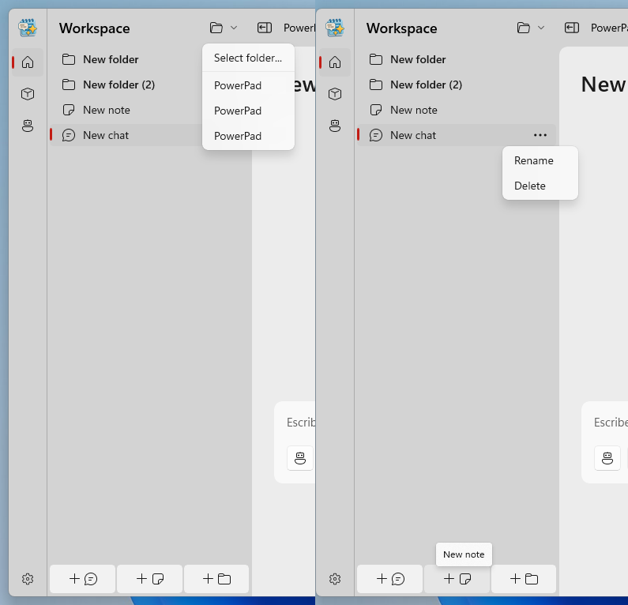
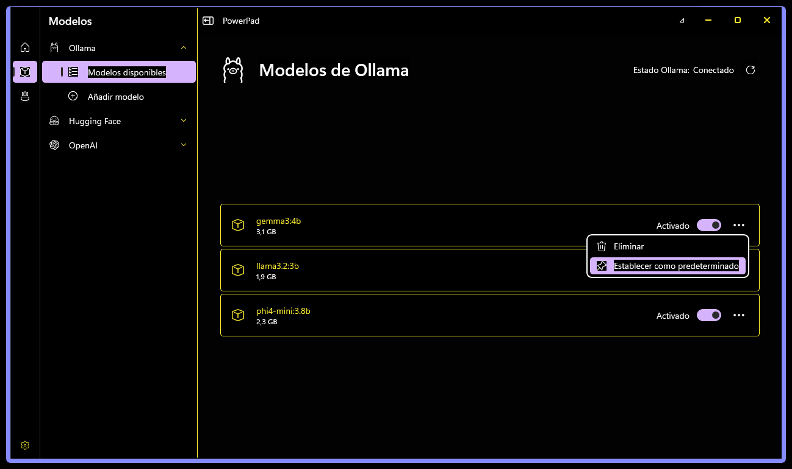
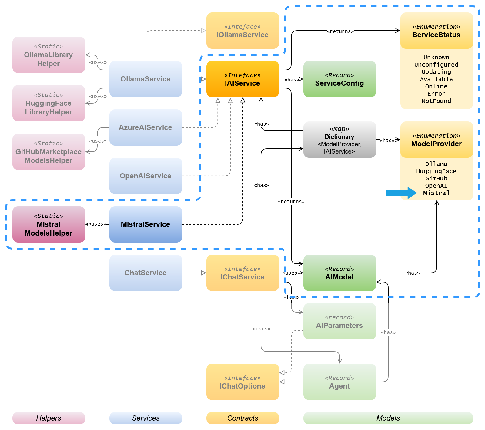

## 8.1. Resumen de logros y aportes del proyecto

El desarrollo de PowerPad ha sido, ante todo, un ejercicio de aprendizaje aplicado. Desde el inicio, supuso para mí un reto técnico considerable: diseñar y construir una aplicación de escritorio moderna que integrara modelos de inteligencia artificial generativa de forma local, accesible y funcional. A lo largo del proceso, me enfrenté a decisiones arquitectónicas complejas, como la adopción del patrón MVVM o la incorporación de principios como SOLID, que no solo estructuraron mejor el proyecto, sino que me permitieron afianzar conocimientos clave de ingeniería de software.

Más allá de las funcionalidades conseguidas, lo más valioso ha sido enfrentarme a problemas reales de integración, modularidad y experiencia de usuario. La conexión con motores como Ollama, la gestión de modelos y agentes personalizados, o la automatización de tareas complejas para usuarios no técnicos, me obligaron a buscar soluciones que equilibraran complejidad técnica y simplicidad de uso. Muchas de estas decisiones fueron iterativas, y en algunos casos experimentales, pero contribuyeron a formar una base que, aunque aún en evolución, puede servir como punto de partida para futuras mejoras o proyectos similares.

PowerPad no pretende ser una solución definitiva, sino más bien una herramienta de exploración. Su diseño prioriza la apertura, la privacidad local y la posibilidad de ampliación, y espero que pueda resultar útil no solo para quienes busquen usarla, sino también como referencia para otros estudiantes o desarrolladores interesados en este campo. En ese sentido, este proyecto ha sido para mí un puente entre la teoría aprendida durante la carrera y su aplicación práctica en un entorno real, y confío en que pueda inspirar más caminos en esa dirección.

## 8.2. Limitaciones encontradas y aprendizajes

1. **Adopción de nuevas tecnologías de interfaz (WinUI 3):**

    Aunque cuento con varios años de experiencia trabajando en el *stack* tecnológico de Microsoft, nunca antes había desarrollado un proyecto utilizando WinUI. Esto supuso una curva de aprendizaje notable, ya que tuve que familiarizarme con los mecanismos de enlace de datos (*binding*), las posibilidades de personalización de controles y la integración con .NET 8. Si bien esto aportó una visión fresca sobre cómo abordar la experiencia de usuario en aplicaciones de escritorio modernas, también supuso invertir más tiempo del previsto en depuración y refactorización de la interfaz hasta alcanzar los niveles deseados de usabilidad y estabilidad.

2. **Implementación y aplicación del patrón MVVM:**

    Acostumbrado a trabajar principalmente en *backend*, mi contacto previo con MVVM era bastante superficial. Adoptar este patrón ha resultado transformador, ya que me ha permitido entender y aplicar una separación rigurosa de la lógica de presentación y de negocio. De todas formas, adaptar mi forma de programar, especialmente en temas como la gestión de los *viewmodels*, el uso de comandos y la gestión de la comunicación desacoplada entre componentes, ha representado un reto importante. Este proceso me ha servido para mejorar mis habilidades de diseño de aplicaciones y sentar una base sólida para futuras aplicaciones de escritorio.

3. **Gestión eficiente del sistema de archivos local:**

    Uno de los objetivos principales de PowerPad era asegurar una gestión segura de documentos y carpetas. Para lograr una estructura jerárquica, soportar operaciones como el renombrado, ordenación, movimiento y eliminación, y reflejar estos cambios en el almacenamiento físico, tuve que diseñar un sistema que garantizara consistencia y rendimiento. Sin trabajar con bases de datos, la implementación fue especialmente desafiante. Este apartado, además de ser uno de los que más complejidad ha aportado al desarrollo, me ha permitido profundizar en una gestión eficiente de recursos en .NET.

4. **Evolución tecnológica y obsolescencia potencial:**

    El terreno de la inteligencia artificial generativa y sus herramientas asociadas evoluciona a una velocidad vertiginosa. Esta realidad ha supuesto la continua revisión tanto de mi planteamiento como de las bibliotecas y *frameworks* usados en el proyecto. En varias ocasiones sentí cierto temor a que la solución quedara rápidamente desfasada respecto a nuevas tendencias o lanzamientos. Sin embargo, la experiencia ha sido muy enriquecedora, ya que me obligó a estar atento a las actualizaciones de las dependencias y a mantener una arquitectura lo suficientemente flexible y modular, orientada a la adaptabilidad. Gracias a esto, he aprendido cómo el diseño anticipa y mitiga la obsolescencia, además de valorar la importancia de la actualización continua y el aprendizaje permanente.

5. **Profundización conceptual en inteligencia artificial generativa:**

    A pesar de contar con cierta experiencia profesional utilizando Azure OpenAI, este proyecto me ha permitido ampliar mis conocimientos a otros proveedores y modelos, además de revisar y profundizar en los principios teóricos y prácticos de la IA generativa. Esta aproximación más académica y global ha enriquecido mi comprensión sobre esta tecnología. Además, explorar la ejecución local frente al uso en la nube me ha hecho reflexionar sobre cuestiones de arquitectura, privacidad y eficiencia energética que no había planteado anteriormente.

## 8.3. Propuestas de mejoras y líneas de investigación futura

El desarrollo de PowerPad ha abierto múltiples oportunidades de mejora y ampliación. Durante el proceso, han surgido diversas iniciativas que, aunque en algunos casos ya han comenzado a explorarse en ramas experimentales del repositorio, requieren de un desarrollo más exhaustivo para su integración definitiva. Otras ideas surgen desde la reflexión sobre las limitaciones actuales del proyecto, así como el análisis de tendencias tecnológicas y desarrollo de software multiplataforma. En este apartado, presento una serie de propuestas y líneas de trabajo futuro que considero relevantes para seguir avanzando en la mejora continua del proyecto. El objetivo es proporcionar una visión adecuada de cómo PowerPad puede evolucionar, adaptarse a las necesidades de nuevos usuarios y, al mismo tiempo, explorar nuevas fronteras en cuanto a integración con otros servicios, accesibilidad, internacionalización y optimización de la experiencia de usuario.

### 8.3.1. Pruebas unitarias

Se trata de la incorporación de pruebas unitarias al proyecto, una práctica esencial para garantizar la estabilidad y robustez del desarrollo a medida que PowerPad crece en funcionalidades y complejidad. Esta propuesta está iniciada en la rama `next` del repositorio anexo.

El objetivo principal de esta mejora es facilitar el mantenimiento del código a largo plazo, detectar errores de forma temprana y reducir regresiones en futuras versiones. Gracias al diseño modular y la aplicación de principios SOLID, gran parte de la lógica de negocio está desacoplada de la interfaz gráfica, lo que permite probar los componentes de forma aislada.

En el entorno de desarrollo de **Visual Studio** (CITA ENLACE HERRAMIENTA), la creación de pruebas unitarias es directa. A modo de ejemplo, se ha añadido la clase `ChatServiceTests.cs` para cubrir las pruebas de la clase `ChatService.cs`. Este tipo de pruebas se colocan habitualmente en un proyecto separado (`PowerPad.Core.Tests`) que referencia al proyecto principal (`PowerPad.Core`). Para crear una clase de pruebas, se puede:

1. Hacer clic derecho sobre el archivo original (`ChatService.cs`).
2. Seleccionar la opción **"Crear pruebas unitarias..."** (disponible si se tienen instaladas las herramientas de pruebas de Visual Studio).
3. Elegir el marco de pruebas (el ejemplo se ha realizado con MSTestv2 **(INCLUIR CITA)**) y confirmar.

Una vez creada la clase de pruebas, se definen métodos decorados con atributos como `[TestMethod]`, y se utilizan mecanismos como *mocks* o *stubs* si el componente tiene dependencias externas. A continuación se muestra un ejemplo de prueba del método `GetChatResponse` de `ChatService`.

```csharp
/// <summary>
/// Tests that GetChatResponse calls the correct methods and returns the expected result.
/// </summary>
[TestMethod()]
public void GetChatResponseTest()
{
    // Arrange
    var messages = new List<ChatMessage> { new(ChatRole.User, "Hello") };
    var model = new AIModel("test-model", ModelProvider.OpenAI, null);
    var parameters = new AIParameters { Temperature = 0.7f };

    _mockAIService!.Setup(s => s.ChatClient(It.IsAny<AIModel>(), out It.Ref<IEnumerable<string>>.IsAny!))
        .Returns(_mockChatClient!.Object);

    _mockChatClient.Setup(c => c.GetStreamingResponseAsync(It.IsAny<IList<ChatMessage>>(), It.IsAny<ChatOptions>(), It.IsAny<CancellationToken>()))
        .Returns(AsyncEnumerable.Empty<ChatResponseUpdate>());

    // Act
    var result = _chatService!.GetChatResponse(messages, model, parameters);

    // Assert
    Assert.IsNotNull(result);
    _mockAIService.Verify(s => s.ChatClient(It.IsAny<AIModel>(), out It.Ref<IEnumerable<string>>.IsAny!), Times.Once);
    _mockChatClient.Verify(c => c.GetStreamingResponseAsync(It.IsAny<IList<ChatMessage>>(), It.IsAny<ChatOptions>(), It.IsAny<CancellationToken>()), Times.Once);
}
```

### 8.3.2. Localización

El objetivo de la localización es permitir que la aplicación esté disponible en más de un idioma, o al menos facilitar la incorporación de nuevos idiomas en el futuro sin modificar el código fuente. Esta propuesta también está iniciada en la rama `next` del repositorio anexo., utilizando la biblioteca [**WinUI3Localizer**](https://github.com/altimesh/winui3localizer) (QUITAR EL LINK Y AÑADIR CITA ENLACE). La localización es especialmente útil en una aplicación como PowerPad, pensada para ser distribuida de forma abierta, y con potencial interés en entornos donde el idioma pueda ser una barrera de adopción. 

Como primer paso, se ha comenzado la migración de las cadenas estáticas de texto del control `WorkspaceControl` a archivos de recursos `.resw` (**Figura 8.1**). Esta migración permite separar el contenido textual de la lógica y diseño, y aprovechar el sistema de localización dinámico de WinUI 3.

1. **Agregar los archivos de recurso**:  Se crean dos archivos de recursos en la carpeta `Strings`: `Strings\es-ES\Resources.resw` y `Strings\en-US\Resources.resw`. Cada archivo contiene las mismas claves (`Uid`) con el texto correspondiente a cada idioma.
2. **Referenciar el namespace en el XAML**:  En el archivo `.xaml` del control a traducir (por ejemplo `WorkspaceControl.xaml`), se añade el namespace de la biblioteca: `xmlns:l="using:WinUI3Localizer.Markup"`
3. **Asignar identificadores a los elementos**: A cada elemento de la interfaz que tenga texto, se le añade un identificador Uid utilizando el markup extension proporcionado por la biblioteca, por ejemplo:  `l:Uids.Uid="NewChatButton"`
4. **Definir los textos en los archivos .resw**: En los archivos de recursos se añade la clave `NewChatButton.Text` con el texto traducido. Por ejemplo, en  `Strings\es-ES\Resources.resw` se crea `NewChatButton.Text = Nuevo chat` y en `Strings\en-US\Resources.resw` se crea `NewChatButton.Text = New chat`.

Al ejecutarse la aplicación, la biblioteca seleccionaría automáticamente el idioma correspondiente al del sistema operativo del usuario, y actualiza las cadenas sin necesidad de recargar la UI manualmente. Si se quiere añadir nuevos idiomas, basta con crear un nuevo fichero de recurso, sin necesidad de modificar ningún otro código de la aplicación.



### 8.3.3. Accesibilidad

PowerPad incluye soporte básico de accesibilidad al incluir la compatibilidad con temas de alto contraste definidos por el sistema operativo. Esto permite que la interfaz se adapte automáticamente a configuraciones visuales especiales, facilitando su uso por personas con baja visión. En la siguiente imagen se muestra un ejemplo de la interfaz en un sistema operativo con modo de alto contraste (**Figura 8.2**).


Además, WinUI 3 es compatible con tecnologías asistidas como el Narrador de Windows (INCLUIR CITA). Para ello, se propone evolucionar la interfaz con propiedades de automatización (Microsoft UI Automation, INCLUIR CITA) en los controles de la interfaz, que permiten describir su propósito. Esto permitiría que usuario que utilizan esta función de Windows recibir descripciones precisas de las funciones disponibles en pantalla y acceder a las mismas. Por ejemplo, para un botón de guardar se puede añadir:

```xml
<Button Content="Guardar"
        AutomationProperties.Name="Botón Guardar"
        AutomationProperties.HelpText="Guarda los cambios del documento actual" />
```

### 8.3.4. Soporte a nuevo proveedor de IA: Mistral

**Mistral** (CITA EXISTENTE) es un proveedor europeo de modelos de lenguaje generativo que ofrece tanto opciones gratuitas como comerciales mediante una API *OpenAI-compatible* (CITA MISTRAL API). Este último aspecto es especialmente relevante, ya que permite reutilizar buena parte de la lógica ya implementada en `OpenAIService`, minimizando el esfuerzo necesario para su integración. La inclusión de Mistral no solo ampliaría la oferta de modelos disponibles, sino que fortalecería la independencia tecnológica frente a los grandes proveedores actuales.

Gracias a la arquitectura modular basada en contratos comunes y a la inyección de dependencias, la incorporación de un nuevo servicio como Mistral resulta sencilla y poco intrusiva. Desde el punto de vista técnico, para añadir soporte a Mistral bastaría con crear una clase `MistralService` que implemente la interfaz `IAIService`, siguiendo el mismo patrón utilizado para otros proveedores. Esta clase se registraría en el contenedor de dependencias y se vincularía al nuevo valor del enumerado `ModelProvider.Mistral`, que podría añadirse fácilmente a la enumeración existente (**Figura 8.3**). Dado que PowerPad ya abstrae el acceso a los modelos, la configuración y la interacción mediante interfaces como `IChatClient`, no sería necesario modificar las páginas comunes de gestión (`AIModelsPageBase`, `AIAddModelPageBase`), ya que heredan comportamiento genérico basado en el proveedor seleccionado.

El sistema de configuración (`GeneralSettingsViewModel`) también está preparado para esta expansión: bastaría con añadir propiedades específicas para Mistral (`MistralEnabled`, `MistralConfig`) y conectarla con el mecanismo ya existente de detección de cambios y validación de conexión (`TestConnection`). Una vez validada la conexión, Mistral se añadiría automáticamente a la colección de proveedores disponibles (`AvailableProviders`), permitiendo su uso inmediato en la interfaz gráfica, y todo ello sin tener que reescribir grandes bloques de código.



### 8.3.5. Otras estrategias de expansión

#### Compatibilidad multiplataforma con Uno Platform

Aunque PowerPad ha sido construido sobre WinUI 3 para Windows, la adopción de **Uno Platform** (INCLUIR CITA) permitiría portar la aplicación a sistemas como Linux, macOS, Android, iOS e incluso WebAssembly. Uno se basa en los mismos principios y lenguajes (XAML y C#), ofreciendo compatibilidad directa con `Microsoft.UI.Xaml`, lo que facilita enormemente la migración. De hecho, gran parte del código actual podría mantenerse, siendo necesarios principalmente ajustes en paquetes NuGet, namespaces y componentes específicos de UI o servicios nativos.

Este enfoque permitiría que PowerPad mantenga una única base de código mientras se adapta visual y funcionalmente a distintos entornos, algo especialmente útil para usuarios que no trabajan exclusivamente en Windows. Además, al contar con soporte para renderizado nativo o vía Skia (ENLACE), Uno garantiza una experiencia visual consistente en todas las plataformas. Esta evolución respondería también al objetivo central del proyecto: ofrecer IA generativa local y controlada, accesible desde cualquier sistema.

https://platform.uno/docs/articles/get-started-winui3.html
#### Distribución en Microsoft Store

Otra vía lógica para extender el alcance del proyecto es su publicación oficial en la Microsoft Store (CITA ENLACE A MS STORE). Esto implicaría empaquetar PowerPad en formato MSIX (ya previsto en el proyecto actual) y completar el proceso de subida, incluyendo los metadatos requeridos como descripción, capturas, clasificación por edad, etc. Esta opción no solo mejora la visibilidad y confianza de la aplicación, sino que habilita actualizaciones automáticas, seguimiento de uso, y posibilidad de monetización mediante compras *in-app* o licencias.

El proceso de certificación es ágil y el esfuerzo técnico para la publicación inicial es moderado, gracias a la arquitectura modular y las buenas prácticas ya implementadas en el proyecto. Publicar PowerPad en la Store posicionaría la aplicación dentro del ecosistema oficial de Windows, facilitando su descubrimiento por parte de usuarios no técnicos y reforzando la percepción de calidad y seguridad. 

https://learn.microsoft.com/es-es/windows/apps/publish/

#### Mejoras funcionales

Durante el uso de PowerPad como usuario de pruebas, también se han identificado varias funcionalidades que podrían incorporarse en versiones futuras para mejorar la experiencia y eficiencia en el trabajo diario. Estas propuestas nacen de un uso real del entorno y tienen un impacto directo en la usabilidad, éstas son algunas de las más destacadas:

- **Buscador global y contextual**: Añadir un sistema de búsqueda tanto a nivel global (Workspace completo) como dentro de conversaciones y notas individuales, accesible mediante el acceso directo habitual del sistema operativo. Esto permitiría a los usuarios localizar rápidamente información específica sin necesidad de navegar manualmente por la estructura jerárquica.

- **Agrupación de contenido antiguo**: Implementar una funcionalidad que agrupe de forma automática las notas y conversaciones menos recientes de cada carpeta (y de la raíz del espacio de trabajo) bajo un encabezado colapsable como “Elementos antiguos”. Esta agrupación reduciría la carga visual y facilitaría el enfoque en el contenido más reciente o relevante. Otra opción alternativa es crear una jerarquía como: "semana pasada", "mes pasado" y finalmente "más antiguo".

- **Gestión de la papelera**: Incluir una sección específica dentro de la aplicación para visualizar, restaurar o eliminar definitivamente las notas y conversaciones borradas. Además, se podría permitir la eliminación automática de elementos tras un tiempo configurable, evitando acumulación innecesaria de datos. 

Estas mejoras, aunque de desarrollo relativamente sencillo, podrían representar un salto importante en términos de usabilidad y organización, especialmente para usuarios que gestionan grandes volúmenes de información.