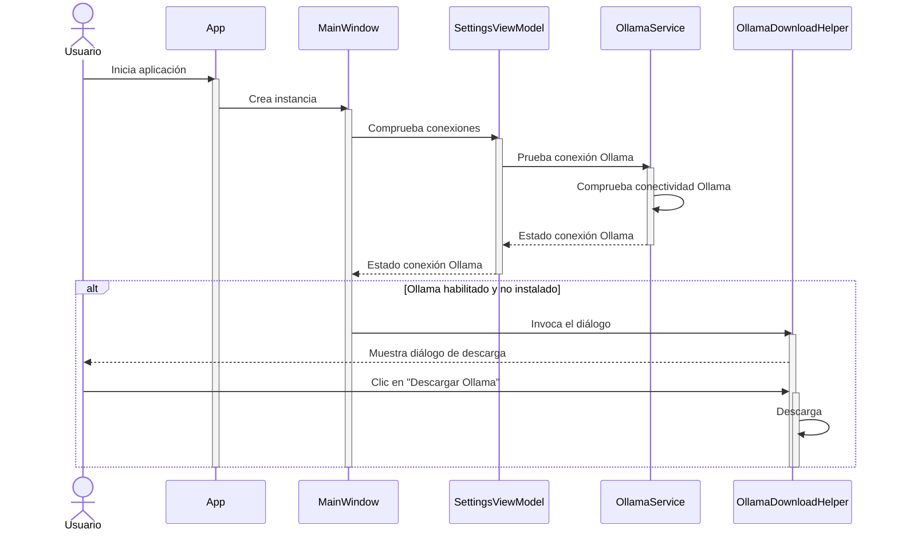
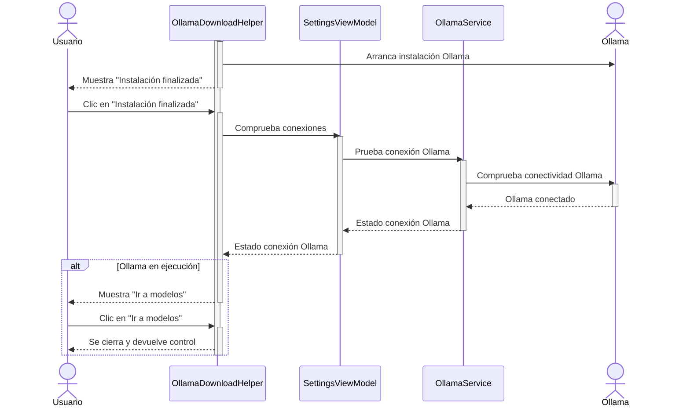
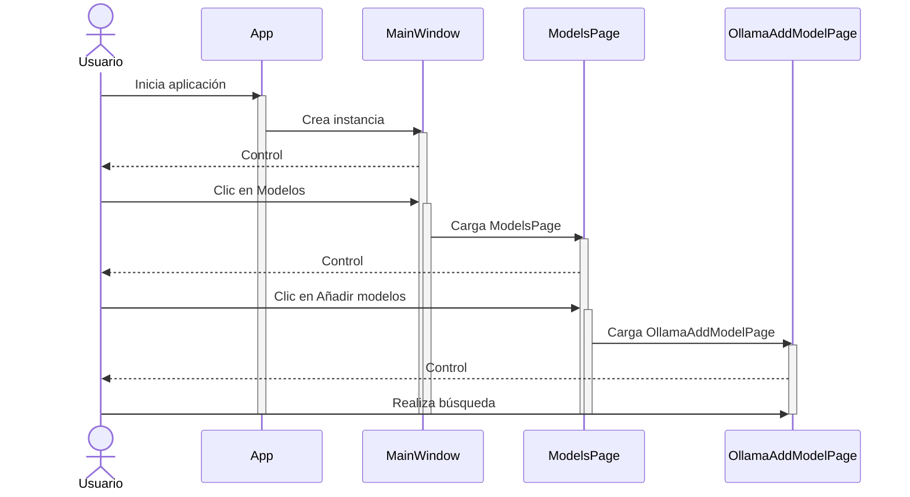
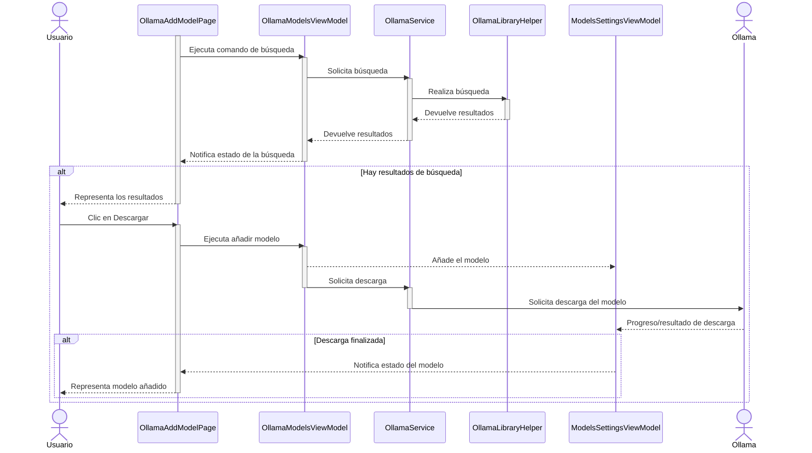

La presente sección recoge una serie de ejemplos prácticos y flujos de trabajo habituales en PowerPad, con el propósito de demostrar de manera práctica las funcionalidades implementadas y su aplicabilidad en escenarios reales. 
Cada caso de uso se describe de forma estructurada, detallando los pasos que debe seguir el usuario, los elementos visuales involucrados y la trazabilidad de las acciones a nivel de código. Además, se incluyen capturas de pantalla y las anotaciones técnicas más relevantes para cada caso.

## 12.1. Instalación de Ollama

#### Caso de uso
El usuario quiere instalar y utilizar Ollama, y por eso recurre a PowerPad que, además se servirle de interfaz gráfica para el uso de inteligencia artificial en local, también le facilita el acceso a la descarga, instalación y verificación del servicio de Ollama.

#### Pasos para el usuario

1. Usuario: Abre la aplicación PowerPad (sin haber instalado previamente Ollama).
	a. PowerPad: Aparece diálogo de descarga de Ollama.
2. Usuario: Pulsa el botón `Descargar Ollama`.
	b. PowerPad: Se inicia descarga de Ollama.
	c. PowerPad: Muestra progreso de descarga.
	d. PowerPad: Al finalizar la descarga, se inicia el instalador.
	e. PowerPad: El diálogo muestra botón de confirmación de la instalación.
3. Usuario: Finaliza el instalador independiente.
4. Usuario: Pulsa el botón `Instalación finalizada`
	f. PowerPad: Comprueba si el servicio de Ollama response.
	g. PowerPad: El diálogo muestra botón para acceder a la instalación de modelos.
5. Usuario: Pulsa el botón `Ir a modelos`

#### Interfaces implicados
    (pte)

#### Clases implicadas

- `App`: Clase principal de la aplicación.
- `MainWindow`: Ventana principal.
- `SettingsViewModel`: Comprueba y guarda los estados de conexión.
- `OllamaService`: Comprueba el estado del servicio de Ollama.
- `OllamaDownloadHelper`: Gestiona el diálogo y proceso de descarga/instalación.

#### Secuencia simplificada

**Parte 1**

- Usuario inicia `App`
- `App` crea instancia de `MainWindow`
- `MainWindow` comprueba el estado de las conexiones en `SettingsViewModel`
- `SettingsViewModel` prueba la conexión de Ollama con `OllamaService`
- `OllamaService` comprueba la conectividad de Ollama
- *Si Ollama está habilitado y no está instalado*: `MainWindow` invoca el diálogo de instalación a `OllamaDownloadHelper`
- `OllamaDownloadHelper` muestra al usuario el diálogo de descarga de Ollama
- *Si usuario hace clic en* `Descargar Ollama`: `OllamaDownloadHelper` inicia la descarga

**Parte 2**

- *Cuando la descarga ha finalizado*: `OllamaDownloadHelper` arranca el instalador de Ollama y muestra botón `Instalación finalizada`
- *Si usuario completa instalación y hace clic en* `Instalación finalizada`: `OllamaDownloadHelper` comprueba el estado del servicio en `SettingsViewModel`
- `SettingsViewModel` prueba la conexión de Ollama con `OllamaService`
- `OllamaService` comprueba la conectividad de Ollama
- *Si Ollama está en ejecución*: `OllamaDownloadHelper` muestra botón `Ir a modelos`
- *Si usuario hace clic en* `Ir a modelos`: `OllamaDownloadHelper` se cierra y devuelve el control a `MainWindow`

## 12.2. Añadir modelo de IA a Ollama

#### Caso de uso
El usuario quiere añadir un modelo a Ollama para poder utilizarlo a través de Powerpad para sus conversaciones y edición de texto asistido por inteligencia artificial de forma local.

#### Pasos para el usuario

1. Usuario: Abre la aplicación PowerPad.
	a. PowerPad: Muestra la ventana principal.
2. Usuario: Pulsa sobre `Modelos`.
	b. PowerPad: Muestra la página de modelos disponibles de Ollama.
3. Usuario: Pulsa sobre `Añadir modelos`.
	c. PowerPad: Muestra la página de añadir modelos de Ollama.
4. Usuario: Escribe el nombre del modelo buscado.
	d. PowerPad: Muestra los resultados de la búsqueda.
5. Usuario: Pulsa sobre el botón de descarga en el modelo deseado.
	e. PowerPad: Inicia la descarga.
	f. PowerPad: Muestra el progreso de la descarga.
	g. PowerPad: Muestra el modelo como añadido.
6. Usuario: Pulsa sobre `Workspace`

#### Interfaces implicados
(ESPACIO PARA CAPTURAS)

#### Clases implicadas

- `App`: Clase principal de la aplicación.
- `MainWindow`: Ventana principal.
- `ModelsPage`: Página que muestra las opciones de gestión de modelos.
- `OllamaAddModelPage`: Página para buscar y añadir nuevos modelos de Ollama.
- `OllamaModelsViewModel`: Gestiona la lógica de modelos de Ollama y el estado de los mismos.
- `OllamaService`: Gestiona la comunicación con servicio de Ollama.
- `OllamaLibraryHelper`: Realiza operaciones de búsqueda sobre la biblioteca de modelos de Ollama.
- `ModelsSettingsViewModel`: Gestiona la configuración y el estado de los modelos.

#### Secuencia simplificada

**Parte 1**

- Usuario inicia `App`
- `App` crea instancia de `MainWindow`
- Usuario hace clic en `Modelos` en `MainWindow`
- `MainWindow` carga `ModelsPage`
- Usuario hace clic en `Añadir modelos` en `ModelsPage`
- `ModelsPage` carga `OllamaAddModelPage`
- Usuario realiza búsqueda en `OllamaAddModelPage`

**Parte 2**

- `OllamaAddModelPage` ejecuta comando de búsqueda en `OllamaModelsViewModel`
- `OllamaModelsViewModel` solicita búsqueda en `OllamaService`
- `OllamaService` realiza búsqueda a través de `OllamaLibraryHelper`
- `OllamaLibraryHelper` devuelve resultados a `OllamaService`
- `OllamaService` devuelve resultados a `OllamaModelsViewModel`
- `OllamaModelsViewModel` notifica cambios en estado de la búsqueda a `OllamaAddModelPage`
- *Si hay resultados de búsqueda*: `OllamaAddModelPage` representa los resultados
- *Si el usuario hace clic en* `Descargar`: `OllamaAddModelPage` ejecuta comando de añadir modelo en `OllamaModelsViewModel`
- `OllamaModelsViewModel` añade el modelo a `ModelsSettingsViewModel`
- `OllamaModelsViewModel` solicita descarga en `OllamaService`
- `OllamaService` solicita a `Ollama` la descarga del modelo
- `OllamaService` notifica actualizaciones de la descarga al modelo en `ModelsSettingsViewModel`
- *Cuando la descarga ha finalizado*: `ModelsSettingsViewModel` notifica cambios en estado del modelo a `OllamaAddModelPage`
- `OllamaAddModelPage` representa el modelo como añadido
- *Si usuario hace clic en* `Workspace`: `MainWindow` carga `WorkspacePage`

## 12.3. Creación de un agente