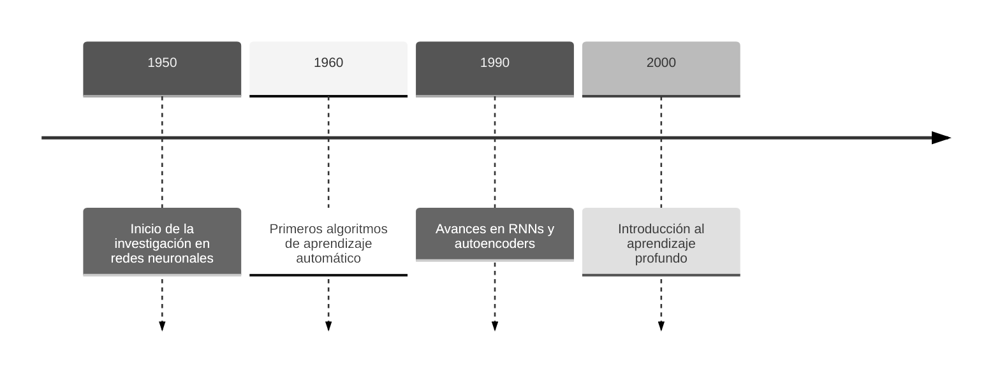
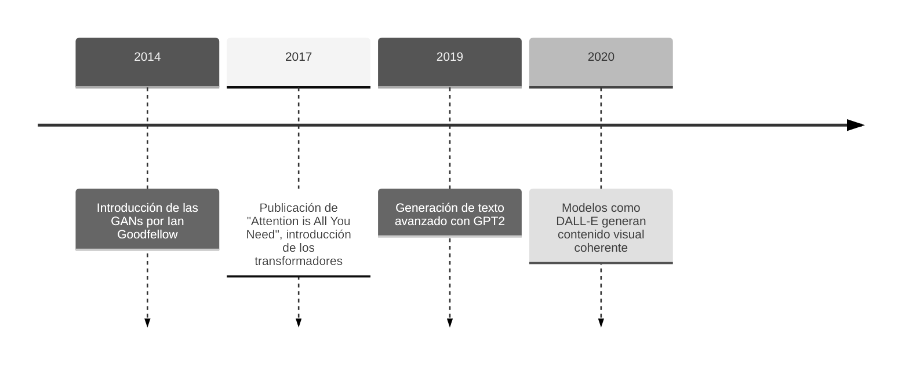
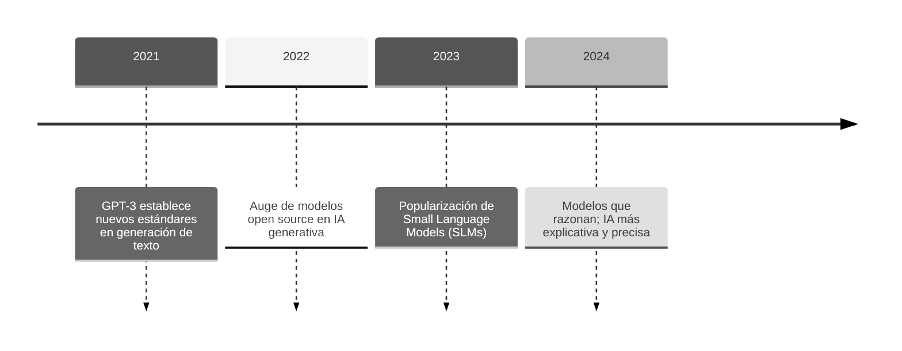

## 3.1 Conceptos de IA Generativa

### 3.1.1 Historia y Evolución de la IA Generativa

La Inteligencia Artificial Generativa ha tenido un proceso evolutivo largo y fascinante, marcado por hitos importantes en el aprendizaje automático y la creación de distintos modelos computacionales. Desde los primeros pasos en las décadas de 1950 y 1960, hasta los sofisticados modelos actuales basados en transformadores (_transformers_), la IA Generativa ha redefinido profundamente cómo producimos contenido textual, visual y multimedia, automatizando procesos y ampliando las capacidades creativas.

A lo largo de este recorrido, tecnologías clave como las redes neuronales recurrentes (RNNs), las redes generativas antagónicas (GANs) o los _transformers_ han sido responsables de algunos de los mayores avances en esta disciplina. Cada una de estas etapas ha supuesto innovaciones significativas que han aumentado las posibilidades de aplicación de esta tecnología.

#### De los 50 a los 2000s: Primeros pasos

-   **1950: Inicio de la investigación en redes neuronales**
    Surge la idea de emular el cerebro humano mediante algoritmos artificiales. Los primeros modelos, como el perceptrón, establecen la base para el desarrollo de redes más complejas.

-   **1960: Primeros algoritmos de aprendizaje automático**
    Se elaboran los primeros algoritmos diseñados para aprender patrones a partir de muestras de datos, un hito crucial para el aprendizaje automático. Destacan conceptos como descenso del gradiente.

-   **1990: Avances en RNNs y _autoencoders_**
    Las redes neuronales recurrentes (RNNs) permitieron manejar datos secuenciales, como texto y audio. Por otro lado, los _autoencoders_ introdujeron formas eficientes de compresión y reconstrucción de datos, imprescindibles en aplicaciones como el reconocimiento de imágenes.

-   **2000: Introducción al aprendizaje profundo**
    Con el aumento de la capacidad computacional y la disponibilidad de grandes volúmenes de datos, se hicieron populares las arquitecturas de redes de aprendizaje profundo (_Deep Learning_). Algoritmos como el _Deep Belief Network_ y las primeras aplicaciones de convoluciones en visión por computadora (_CNNs_) abren el camino para las redes modernas.

#### De 2011 a 2020: Surgen los modelos generativos

-   **2014: Introducción de las GANs por Ian Goodfellow**
    Las Redes Generativas Antagónicas (GANs) fueron una revolución para la generación de contenido al utilizar un par de redes que compiten entre sí: una generadora y una discriminadora.

-   **2017: Publicación de "Attention is All You Need", introducción de los transformadores**
    Este artículo presentó el modelo de transformadores, basado en mecanismos de atención que priorizan las relaciones contextuales de los datos. Este hito marcó un antes y un después en el procesamiento de lenguaje natural (NLP).

-   **2019: Generación de texto avanzado con GPT2**
    _OpenAI_ introduce GPT-2, un modelo con capacidad para generar texto coherente y relevante en diferentes contextos. Este modelo mostró el verdadero potencial de la arquitectura _transformer_ para tareas de generación de texto a gran escala.

-   **2020: Modelos como _DALL-E_ generan contenido visual coherente**
    _DALL-E_ (Open AI) combina el procesamiento del lenguaje y la generación de imágenes para crear representaciones visuales basadas en descripciones, mostrando por primera vez una integración única entre texto y contenido visual generado.

#### De 2021 a la actualidad: El BOOM de la IA Generativa

-   **2021: GPT-3 establece nuevos estándares en generación de texto**
    GPT-3, con 175 mil millones de parámetros, lleva las capacidades de generación de texto a un nivel nunca visto antes, destacando por su habilidad para contextualizar, interpretar y crear contenido coherente y específico.

-   **2022: Auge de modelos open source en IA generativa**
    Modelos como **BLOOM** (BigScience) o **Stable Diffusion** (Runway) contribuyeron a la democratización de la IA generativa, ofreciendo alternativas personalizables y locales a las soluciones comerciales, una aportación importante para la investigación. Muchos otros modelos open source surgieron desde entonces.

-   **2023: Popularización de Small Language Models (SLMs)**
    Los SLMs, como **TinyLlama** y otras variantes compactas de **LLaMA**, o **Phi-2** (Microsoft), ganaron popularidad por su capacidad de ofrecer buenos resultados con menor consumo de recursos. Se popularizaron técnicas como la destilación del conocimiento, que permiten entrenar modelos pequeños a partir de modelos grandes, reteniendo gran parte de su capacidad a un menor coste.

-   **2024: Modelos que razonan: IA explicativa y precisa**
    Modelos como **o1** (OpenAI) y avances en **Claude 3** (Anthropic) producen un punto de inflexión en el razonamiento contextual y explicable, ya que no solo generan contenido, sino que emplean tiempo en razonar de forma interna antes de responder. Estas soluciones representan un paso importante hacia contenidos más seguros y confiables.

>Sources:
>https://www.qualcomm.com/news/onq/2024/02/>the-rise-of-generative-ai-timeline-of-breakthrough-innovations
>https://www.datacamp.com/blog/top-small-language-models + https://arxiv.org/pdf/>2409.15790
>https://timeline.the-blueprint.ai/
>https://nhlocal.github.io/AiTimeline/

### 3.1.2 Principios de Modelos Generativos

Los modelos generativos se basan en aprender patrones y características a partir de datos existentes para luego crear contenido nuevo que sea coherente y relevante. A lo largo de los años, se han desarrollado distintas técnicas, arquitecturas y enfoques que han marcado hitos importantes en este campo. En este apartado, veremos algunos de los conceptos más destacados.

#### Embeddings

Para que los modelos generativos puedan "entender" datos como texto o incluso imágenes, es necesario convertir esa información en representaciones numéricas (vectores). En el caso del lenguaje, esto se logra a través de los llamados _embeddings_. Estas son básicamente representaciones vectoriales de palabras o tokens (unidades mínimas de texto), donde cada dimensión refleja alguna característica semántica o contextual. En otras palabras, si dos palabras tienen significados similares, sus embeddings estarán más "cerca" en el espacio vectorial.

#### Tokens

Los _tokens_ son la unidad mínima de texto que procesa un determinado modelo de lenguaje. Dependiendo del enfoque, un token puede representar una palabra completa, una parte de una palabra (por ejemplo, "auto", "re", "mente") o incluso una sola letra o signo. La forma en que se realiza esta segmentación puede influir mucho en la eficiencia y precisión del modelo. Por ejemplo, en arquitecturas como los *transformers*, optimizar la segmentación de tokens resulta esencial para que el modelo entienda el contexto de forma adecuada y no se pierda en secuencias demasiado largas o ambiguas. 

(Posible diagrama con diferentes métodos de tokenización / mismo texto en fragmentos distintos)

#### Transformers

Un _transformer_ es un modelo o arquitectura de aprendizaje profundo desarrollado por científicos trabajadores de _Google_ y publicados en el artículo de investigación _Attention is All You Need_. Su novedad reside en el mecanismo de atención, que permite detectar y priorizar las partes más relevantes del texto de entrada. Gracias a este enfoque, se logra una comprensión del contexto mucho más profunda que con arquitecturas anteriores.

(diagrama de atención de un transformer para aclarar cómo funciona).

#### Redes Generativas Antagónicas (GANs)

Las Redes Generativas Antagónicas están formadas por dos redes neuronales que trabajan de forma competitiva: el generador produce contenido (por ejemplo, una imagen), mientras que el discriminador intenta distinguir si lo que ve es real o generado. Esta especie de juego de "tira y afloja" impulsa la red generadora a mejorar, resultando en creaciones cada vez más realistas. Gracias a esta técnica, se ha dado un salto enorme en la calidad de imágenes y videos sintéticos.

#### Aprendizaje por Difusión

El aprendizaje por difusión se basa en ir transformando gradualmente información estructurada mediante la difusión de ruido aleatorio (datos sin sentido), para luego revertir ese proceso "limpiando" la información y generando imágenes de mayor calidad. Es una técnica que permite un gran control sobre el resultado, sobre todo cuando se genera una imagen a partir de una descripción de texto.

#### Destilación del Conocimiento

La destilación del conocimiento es el procedimiento mediante el cual un modelo de gran tamaño (maestro) transfiere sus aprendizajes a un modelo más pequeño (estudiante). Al comprimir la información, se puede seguir manteniendo la mayor parte de la capacidad del modelo original, pero reduciendo el coste computacional. En la práctica, esto se ha convertido en una estrategia esencial para desplegar modelos en dispositivos con menos recursos como ordenadores personales o incluso dispositivos móviles.

#### Fine-Tuning

El _fine-tuning_ aprovecha el conocimiento adquirido por un modelo preentrenado y lo adapta a un dominio o tarea específica, reduciendo costos y tiempo de entrenamiento en comparación con empezar desde cero. 

En el desarrollo de software, el _fine-tuning_ adquiere gran relevancia al facilitar la personalización de modelos generativos para necesidades puntuales, como automatizar flujos de trabajo empresariales, diseñar interfaces a medida o codificar las reglas de negocio de una forma específica, convirtiéndose así en un recurso esencial para incorporar la IA generativa como asistente activo en cada fase del desarrollo.

(ilustración del concepto asistentes especializados del proyecto)

>Sources:
>https://www.ibm.com/mx-es/think/topics/diffusion-models
>https://www.ibm.com/es-es/topics/knowledge-distillation

## 3.2. Aplicaciones Conversacionales

Las aplicaciones conversacionales han transformado profundamente la forma en la que los usuarios interactúan con la tecnología. Desde los sistemas básicos de respuesta automática hasta los actuales asistentes avanzados impulsados por modelos de lenguaje, su evolución ha sido marcada por la búsqueda de interacciones más naturales, personalizadas y eficientes. Hoy en día, estas aplicaciones no solo generan texto, sino que también comprenden el contexto, ejecutan acciones específicas y permiten generar y editar contenido de forma colaborativa.

### **Definición y Contexto Histórico**

Las aplicaciones conversacionales son sistemas diseñados para interactuar mediante lenguaje natural, ya sea escrito o hablado. Sus primeros antecedentes se remontan a los años 60 con programas como **ELIZA**, un chatbot que simulaba a una psicoterapeuta mediante reglas simples y respuestas predefinidas. Sin embargo, estos sistemas eran limitados y carecían de comprensión real.

El verdadero salto cualitativo ocurrió con la introducción de técnicas avanzadas de **aprendizaje profundo** y la aparición de arquitecturas como **transformers**, que revolucionaron el procesamiento del lenguaje natural. Gracias a estos avances, hoy en día existen diversas aplicaciones conversacionales que abarcan desde asistentes virtuales, chatbots de atención al cliente, e incluso empiezan a surgir interfaces conversacionales integradas en diversas aplicaciones como Copilot dentro del ecosistema Microsoft.

### **Principales Aplicaciones Actuales**

-   **ChatGPT (OpenAI)**: Ha sido clave en la democratización del acceso a los modelos generativos avanzados. Sus capacidades de razonamiento contextual permiten responder preguntas complejas, ofrecer soporte técnico y facilitar la creación de contenido creativo.

-   **Gemini (Google)**: En su intento por competir en el mercado, Google ha desarrollado un modelo que no solo genera texto, sino que también se integra con el ecosistema de aplicaciones de Google. Esto facilita tareas como búsquedas mejoradas o asistencia en la edición de documentos.

-   **Claude (Anthropic)**: Este asistente destaca por su enfoque en la **seguridad y la ética**, con capacidades diseñadas para minimizar la generación de respuestas erróneas o perjudiciales. Su razonamiento explicativo permite ofrecer respuestas justificadas y confiables.

-   **Otras aplicaciones**: Otras herramientas similares que han cobrado importancia recientemente son DeepSeek (startup China que impresionó al mundo con un modelo de razonamiento de bajo coste en enero de 2025), herramientas conversacionales integradas en aplicaciones como GitHub Copilot (integrada en herramientas de programación), Copilot de Microsoft o Grok de xAI.
   

### **Características Esenciales de las Aplicaciones Conversacionales Modernas**

1.  **Conversación Dinámica y Persistente**\
    Las aplicaciones actuales son capaces de mantener conversaciones fluidas y recordar el contexto. Por ejemplo, en herramientas como ChatGPT, es posible retomar temas anteriores sin necesidad de repetir información, lo que mejora la coherencia y la experiencia del usuario.

2.  **Agentes Especializados**\
    Un aspecto clave es la creación de agentes personalizados mediante **prompts predefinidos**. Estos agentes son configuraciones del modelo adaptadas a tareas concretas mediante instrucciones específicas, como el análisis de textos legales, la detección de errores gramaticales, la generación de resúmenes, traducción de textos, etc.

    *(Incluir un diagrama mostrando cómo un único modelo puede generar múltiples agentes a partir de diferentes instrucciones)*

3.  **Interfaces de Edición Conversacional**\
    Inspiradas en herramientas como **Copilot** y **Notion AI**, estas interfaces van más allá del chat tradicional, permitiendo al usuario interactuar directamente sobre documentos. Por ejemplo, se pueden solicitar correcciones, ampliaciones de contenido, mejora en el formato.

4.  **Búsqueda y Acceso a Bases de Conocimiento**\
    Los sistemas modernos se integran con diversas fuentes externas, como bases de datos internas o búsquedas web. Este tipo de integración es esencial en entornos empresariales, donde la disponibilidad de información relevante puede agilizar procesos críticos.

### Nuevas Tendencias

* **Razonamiento y Ediciones Contextualizadas**

La investigación en modelos avanzados, como **o1** y **o3** (OpenAI) y **DeepSeek R1**, sugiere que las futuras aplicaciones conversacionales no se limitarán a generar respuestas inmediatas. En cambio, incorporarán capacidades de razonamiento previas a la generación del texto, lo que permitirá ofrecer respuestas más precisas y argumentadas. Además, los sistemas de edición colaborativa en tiempo real harán que la interacción entre usuarios y modelos sea más fluida y personalizada.

* **Privacidad con Aplicaciones Locales**

Impulsados por una demanda cada vez mayor por parte de los usuarios por tener un mayor control sobre sus datos y garantizar la privacidad, las aplicaciones conversacionales locales están experimentando últimamente un gran crecimiento. A diferencia de los servicios en la nube, estas aplicaciones permiten ejecutar los modelos de lenguaje directamente en ordenadores y dispositivos domésticos, eliminando la necesidad de transmitir información personal a servidores externos. Este enfoque proporciona beneficios claros: desde una **confidencialidad reforzada** hasta la eliminación de la dependencia de una conexión a internet, ya que estas aplicaciones se ejecutan **fuera de línea**.

En los últimos años, han surgido proyectos innovadores que han sentado las bases para el desarrollo de aplicaciones conversacionales locales, como **llama.cpp**, un proyecto que ha sido fundamental para permitir la **ejecución eficiente de grandes modelos** de lenguaje, como **LLaMA**, en hardware común. Por otro lado, **Ollama** se destaca por proporcionar un interfaz sencillo para gestionar modelos locales mediante líneas de comando o llamadas API, simplificando el proceso de integración, convirtiéndose en una alternativa atractiva para desarrolladores.

Además, la aparición de **NPUs** _(Neural Processing Units)_ en ordenadores personales y dispositivos móviles está acelerando esta transformación tecnológica. Diseñadas para optimizar el procesamiento de tareas relacionadas con la IA, las NPUs ofrecen una ejecución más eficiente y menos demandante en cuanto a consumo energético frente a los procesadores convencionales. Empresas como **Apple**, **Intel**, **AMD** y **Qualcomm**, ya han integrado esta tecnología. Este avance no solo mejora el rendimiento, sino que también refuerza la privacidad y personalización en aplicaciones conversacionales, señalando una evolución significativa hacia la adopción local de inteligencia artificial.

Todas estas novedades abren camino a una nueva tendencia para aplicaciones conversacionales que desean combinar personalización, rendimiento, privacidad y compatibilidad con la ejecución fuera de línea.

## 3.3. Revisión de Soluciones Existentes

La evolución de los modelos de lenguaje a gran escala ha dado lugar a la aparición de numerosas herramientas y plataformas que permiten su uso en distintos entornos. Desde soluciones en la nube hasta herramientas que posibilitan la ejecución de modelos localmente, cada una ofrece ventajas y limitaciones según el caso de uso. En esta sección, se presentan las principales soluciones actuales, su enfoque y una comparativa de sus capacidades en términos de privacidad, accesibilidad y funcionalidad.

### 3.3.1. Herramientas Conversacionales en la Nube

Las plataformas en la nube han dominado el espacio de la inteligencia artificial generativa debido a su accesibilidad y escalabilidad. Estas soluciones permiten a los usuarios interactuar con modelos de lenguaje sin necesidad de preocuparse por la infraestructura, ya que el procesamiento se realiza en servidores remotos.

Algunas de las soluciones más destacadas incluyen:

-   **ChatGPT (OpenAI)**: Modelo basado en la arquitectura GPT, accesible desde la web y aplicaciones móviles. Ofrece respuestas contextuales avanzadas, acceso a modelos recientes y funciones de memoria en la versión Plus.
-   **Gemini (Google)**: Alternativa de Google con integración en su ecosistema, capaz de realizar tareas avanzadas como la búsqueda en tiempo real y el análisis de información en documentos.
-   **Claude (Anthropic)**: Diseñado con un enfoque en la seguridad y la ética, optimizado para respuestas confiables y explicaciones claras.
-   **DeepSeek (DeepSeek)** (INCLUIR INFO DE DEEPSEEK)
-   **Copilot (Microsoft)**: (INCLUIR INFO DE COPILOT)

Si bien estos modelos ofrecen capacidades avanzadas, dependen completamente de la conectividad a internet y pueden plantear preocupaciones sobre la privacidad de los datos del usuario.

(Incluir algunas imágenes de interfaz y logos de estas herramientas)

### 3.3.2. Herramientas para Ejecutar LLMs Localmente

La necesidad de privacidad y autonomía ha impulsado el desarrollo de herramientas que permiten ejecutar modelos de IA en dispositivos locales. La mayoría de estas soluciones se basan en **llama.cpp**, un framework en C/C++ optimizado para la ejecución de modelos en hardware doméstico. Sobre esta base, surgió **Ollama**, que “eleva” a llama.cpp al ofrecer una gestión simplificada de modelos, una API de alto nivel y funciones adicionales (como la configuración de un servidor local) que facilitan la integración con diversos clientes y UIs. En esencia, Ollama actúa como un “wrapper” que abstrae la complejidad técnica de llama.cpp para que los desarrolladores puedan enfocarse en la interacción con la IA sin preocuparse por los detalles de bajo nivel.

(Incluir algo de info de Hugging Face y su contribución al abrir espacio al trabajo compartido sobre modelos open source y su descarga para ejecución en local)
  
  
#### Interfaces para Ollama

-   **Open WebUI**: Proporciona una interfaz rica en funciones para ejecutar modelos locales con integración de técnicas como RAG y búsqueda web.
-   **Enchanted**: Aplicación nativa para macOS con integración optimizada para sistemas Apple.
-   **Hollama**: (COMPLETAR)
-   **LibreChat**: (COMPLETAR)

#### Otras herramientas basadas en llama.cpp

-   **LM Studio**: Aplicaciones de escritorio enfocadas en gestionar y ejecutar modelos en formato GGUF, con opciones de personalización y compatibilidad con múltiples arquitecturas. - NO SON OPENSOURCE
-   **Msty**: (COMPLETAR, similar a LM Studio)
-   **GPT4All**: Proporciona una experiencia similar a ChatGPT pero completamente local, con modelos optimizados para ejecución en CPU y GPU.
-   **Jan.ai**: Alternativa open source con una interfaz optimizada y un enfoque en la eficiencia del procesamiento en hardware de consumo. Utiliza cortex.cpp, que a su vez está basado en llama.cpp.
-   **AnythingLLM**: (COMPLETAR)
-   **vLLM**: (???? no sé si esto va aqui, creo que no usa llama.cpp) Enfocado en la velocidad de inferencia, optimiza el uso de la memoria RAM y el cómputo paralelo en CPU y GPU.

El uso de estas herramientas permite el control total sobre los datos, evitando la necesidad de depender de servidores externos. Sin embargo, la experiencia puede verse limitada por las capacidades del hardware disponible en cada equipo.

### 3.3.3. Herramientas de Productividad

Las herramientas de IA no solo se limitan a la generación de texto, sino que también han sido integradas en flujos de trabajo para mejorar la productividad y la automatización. Algunas de las soluciones más utilizadas incluyen:

-   **Copilot en Windows**: Extiende la IA a herramientas como Word, Excel y Teams, ofreciendo asistencia en redacción, análisis de datos y generación de contenido.
-   **Copilot+ PC**: Una nueva clase de PC Windows 11 con IA que son impulsados por una unidad de procesamiento neuronal (NPU). Se trata de funciones disponibles exclusivamente en Copilot+ PC para acelerar la productividad y creatividad. Incluye Cocreator, Windows Studio Effects, superresolución automática, subtítulos en directo...
-   **GitHub Copilot**: Asistente de programación basado en modelos de OpenAI, integrado en entornos de desarrollo para sugerencias de código en tiempo real.

Estas son solo algunas herramientas diseñadas para mejorar la eficiencia en distintos ámbitos, pero dependen en gran medida de la conectividad a la nube y pueden presentar limitaciones en cuanto a la personalización y privacidad.

### **3.3.4. Comparativa de Enfoques, Ventajas y Limitaciones**

Frente a las soluciones existentes, el proyecto que proponemos integra en una sola aplicación múltiples funcionalidades que actualmente no están combinadas en ningún competidor. Entre sus características diferenciadoras se incluyen:

-   **Cliente de escritorio sencillo y accesible**, sin necesidad de configuraciones complejas.
-   **Gestión de conversaciones y edición de notas enriquecida**, permitiendo una interacción fluida con modelos de IA dentro de un bloc de notas.
-   **Soporte completo para la ejecución y gestión de modelos con Ollama**, facilitando la descarga y actualización de modelos locales.
-   **Compatibilidad con servidores privados o en la nube**, permitiendo al usuario elegir un enfoque mixto, con almacenamiento de conversaciones y notas en local, pero utilizando procesamiento en red privada o en la nube.
-   **Accesos directos a agentes preconfigurados**, que pueden ejecutarse sin salir del contexto actual, optimizando la productividad mediante una accesos directos.
-   **Búsqueda en documentos y bases de conocimiento**, permitiendo consultas en archivos sin necesidad de abandonar la aplicación.

Con esta propuesta, se busca ofrecer una alternativa equilibrada entre **potencia, privacidad y facilidad de uso**, adaptándose a diferentes necesidades sin imponer limitaciones tecnológicas o de acceso.