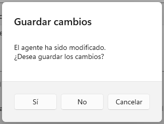
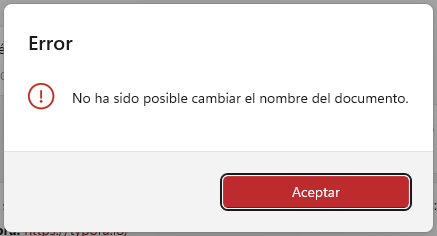
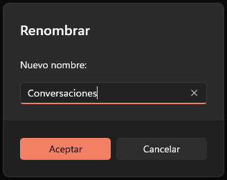
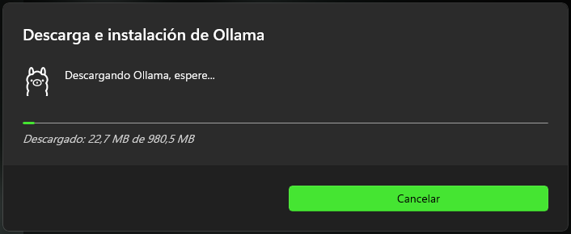
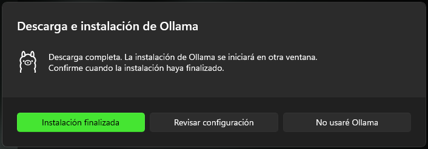
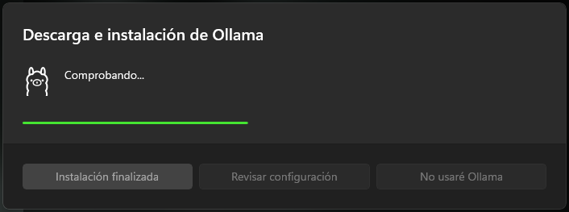
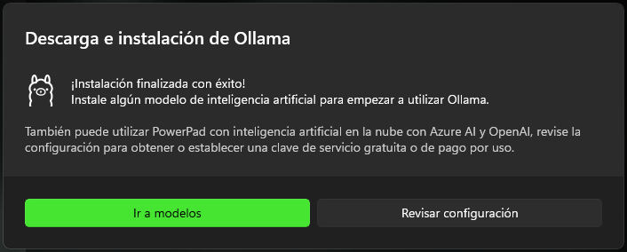

## F.4. Conversores

En WinUI, los conversores son clases cuya utilidad es servir de intermediario en los enlaces de datos con la interfaz (`Data Binding`), permitiendo especificar la lógica de conversión entre el valor del modelo y el tipo de la propiedad de destino a la que se pretende enlazar. Esta conversión puede ser unidireccional o bidireccional, permitiendo en este último caso actualizar el modelo a partir del valor establecido en la propiedad.

### F.4.1 Conversores numéricos

#### IntToDoubleConverter:

- Convierte valores entre `int` y `double`.
- `Convert`: Transforma un `int` a `double`; retorna 0.0 si el valor no es `int`.
- `ConvertBack`: Transforma un `double` a `int`; retorna 0 si el valor no es `double`.

#### FloatToDoubleConverter:

- Convierte valores entre `float` y `double`.
- `Convert`: Transforma un `float` a `double`; retorna 0.0 si el valor no es `float`.
- `ConvertBack`: Transforma un `double` a `float`; retorna 0.0f si el valor no es `double`.

### F.4.2 Conversores de ServiceStatus

#### ServiceStatusToColorBrushConverter:

- Convierte valores de `ServiceStatus` a un `SolidColorBrush` correspondiente.
- `Convert`: Transforma un valor `ServiceStatus` en un color visual (`SolidColorBrush`). Devuelve un color específico según el estado (`Orange` para `Unconfigured`, `Updating`, `Available`; `Green` para `Online`; `Red` para `Error` y `NotFound`; color por defecto para otros casos).
- `ConvertBack`: No implementado; lanza `NotImplementedException`.

#### ServiceStatusToStringConverter:

- Convierte valores de `ServiceStatus` a su representación en cadena.
- `Convert`: Transforma un valor `ServiceStatus` en una cadena descriptiva. Si el parámetro es `true`, añade información adicional según el estado (por ejemplo, "(espere)" para Updating).
- **Parámetro `parameter`**: Si es `true`, añade información adicional a la cadena según el estado.
- `ConvertBack`: No implementado; lanza `NotImplementedException`.

#### ServiceStatusToBoolConverter:

- Convierte valores de `ServiceStatus` a un booleano que indica si coincide con un estado especificado.
- `Convert`: Devuelve `true` si el valor `ServiceStatus` coincide con el especificado en el parámetro; de lo contrario, `false`.
- **Parámetro `parameter`**: Estado `ServiceStatus` (como cadena) con el que comparar el valor.
- `ConvertBack`: No implementado; lanza `NotImplementedException`.

#### ServiceStatusToBoolNegationConverter:

- Convierte valores de `ServiceStatus` a un booleano que indica si NO coincide con un estado especificado.
- `Convert`: Devuelve `true` si el valor `ServiceStatus` NO coincide con el especificado en el parámetro; de lo contrario, `false`.
- **Parámetro `parameter`**: Estado `ServiceStatus` (como cadena) con el que comparar el valor.
- `ConvertBack`: No implementado; lanza `NotImplementedException`.

#### ServiceStatusToVisibilityConverter:

- Convierte valores de `ServiceStatus` a un valor de `Visibility`.
- `Convert`: Devuelve `Visibility.Visible` si el valor `ServiceStatus` coincide con el especificado en el parámetro; de lo contrario, `Visibility.Collapsed`.
- **Parámetro `parameter`**: Estado `ServiceStatus` (como cadena) con el que comparar el valor.
- `ConvertBack`: No implementado; lanza `NotImplementedException`.

#### ServiceStatusToVisibilityNegationConverter:

- Convierte valores de `ServiceStatus` a un valor de `Visibility` negado.
- `Convert`: Devuelve `Visibility.Visible` si el valor `ServiceStatus` NO coincide con el especificado en el parámetro; de lo contrario, `Visibility.Collapsed`.
- **Parámetro `parameter`**: Estado `ServiceStatus` (como cadena) con el que comparar el valor.
- `ConvertBack`: No implementado; lanza `NotImplementedException`.

### F.4.2 Otros conversores

#### AIModelToSourceConverter:

- Convierte una instancia de `AIModelViewModel` en el recurso para icono asociado.
- `Convert`: Devuelve el recurso para icono correspondiente al modelo.
- `ConvertBack`: No implementado; lanza `NotImplementedException`.

#### BooleanToFontWeightConverter:

- Convierte un valor booleano en un `FontWeight` correspondiente.
- `Convert`: Devuelve `FontWeights.SemiBold` si el valor es `true`; en caso contrario, `FontWeights.Normal`.
- `ConvertBack`: No implementado; lanza `NotImplementedException`.

## F.5. Helpers

Los helpers son un conjunto de clases estáticas que agrupan funcionalidades con un propósito específico, como la conversión de imágenes a codificación Base64 o la gestión de combinaciones de teclas en el sistema operativo (`HotKeys`). En este apartado también se incluyen las clases helper encargadas de generar diálogos útiles y reutilizables dentro de PowerPad.

### F.5.1 Diálogos

#### DialogHelper







**Descripción general:**

`DialogHelper` es una clase auxiliar que extiende `ContentDialog` y proporciona una interfaz reutilizable para mostrar diferentes tipos de diálogos en la aplicación, como cuadros de entrada, confirmación y alertas. Su objetivo es centralizar y simplificar la creación y gestión de diálogos modales, permitiendo personalizar títulos, mensajes, botones y comportamientos según el contexto. Se utiliza para interactuar con el usuario en operaciones que requieren confirmación, entrada de datos o notificación de eventos importantes.

**Estructura visual simplificada:**

```xml
<ContentDialog
    x:Class="PowerPad.WinUI.Dialogs.DialogHelper"
    x:Name="ContentDialog">
    <StackPanel>
        <Grid>
            <FontIcon x:Name="Icon"/>
            <TextBlock x:Name="Message"/>
        </Grid>
        <TextBox x:Name="TextBox"/>
    </StackPanel>
</ContentDialog>
```

**Código simplificado:**

```csharp
public partial class DialogHelper : ContentDialog
{
    private const string LABEL_OK = "Aceptar";
    private const string LABEL_CANCEL = "Cancelar";
    private const string LABEL_YES = "Sí";
    private const string LABEL_NO = "No";

    private bool _accepted;

    public static async Task<string?> Input( ... ) { ... }
    public static async Task<ContentDialogResult> Confirm( ... ) { ... }
    public static async Task Alert( ... ) { ... }

    private DialogHelper(Action<DialogHelper> formatter) { ... }
    private void TextBox_KeyDown( ... ) { ... }
    private void ContentDialog_PrimaryButtonClick( ... ) { ... }
}
```

**Constantes:**

- `LABEL_OK`: Etiqueta predeterminada para el botón de aceptar ("Aceptar").
- `LABEL_CANCEL` Etiqueta predeterminada para el botón de cancelar ("Cancelar").
- `LABEL_YES`: Etiqueta predeterminada para el botón de sí ("Sí").
- `LABEL_NO`: Etiqueta predeterminada para el botón de no ("No").

**Elementos visuales:**

- `Icon`: Icono visual que puede mostrar información o advertencias en el diálogo.
- `Message`: Bloque de texto que muestra el mensaje principal del diálogo.
- `TextBox`: Caja de texto para entrada de datos por parte del usuario (visible solo en diálogos de entrada).

**Otras propiedades:**

- `_accepted`: Indica si el usuario aceptó la acción en el diálogo.

**Métodos públicos:**

- `static Task<string?> Input(XamlRoot xamlRoot, string title, string message, string? currentValue, string primaryButtonText = "Aceptar", string secondaryButtonText = "Cancelar")`: Muestra un cuadro de diálogo de entrada al usuario, permitiendo capturar un valor de texto. Devuelve el valor ingresado si el usuario acepta, o `null` si cancela.
- `static Task<ContentDialogResult> Confirm(XamlRoot xamlRoot, string title, string message, string primaryButtonText = "Sí", string secondaryButtonText = "No", bool showCancel = false)`: Muestra un cuadro de diálogo de confirmación al usuario, permitiendo elegir entre opciones como Sí/No y opcionalmente Cancelar. Devuelve el resultado de la interacción.
- `static Task Alert(XamlRoot xamlRoot, string title, string message, string primaryButtonText = "Aceptar")`: Muestra un cuadro de diálogo de alerta al usuario, con un icono informativo y un botón de aceptación.

**Otros métodos relevantes:**

- `DialogHelper(Action<DialogHelper> formatter)`: Constructor privado que inicializa el cuadro de diálogo aplicando una acción de configuración personalizada.
- `void TextBox_KeyDown(object sender, KeyRoutedEventArgs eventArgs)`: Maneja el evento `KeyDown` del `TextBox` para procesar las teclas `Enter` (aceptar) y `Escape` (cancelar) en el cuadro de diálogo de entrada.
- `void ContentDialog_PrimaryButtonClick(ContentDialog sender, ContentDialogButtonClickEventArgs eventArgs)`: Maneja el evento de clic en el botón primario del cuadro de diálogo, marcando la aceptación de la acción.

**Notas adicionales:**

- El control de aceptación se realiza mediante la variable privada `_accepted`, que determina si el usuario confirmó la acción.
- El método `Input` enfoca y selecciona automáticamente el texto del `TextBox` para mejorar la experiencia de usuario.

#### OllamaDownloadHelper










**Descripción general:**

`OllamaDownloadHelper` es un cuadro de diálogo especializado en gestionar la descarga e instalación de la aplicación Ollama. Se utiliza en la aplicación PowerPad para asistir al usuario cuando Ollama no está presente en el sistema, permitiendo descargar el instalador, mostrar el progreso, manejar errores y verificar la instalación. Una vez finalizado permite al usuario ir a la configuración de modelos.

**Estructura visual simplificada:**

```xml
<ContentDialog
    x:Class="PowerPad.WinUI.Dialogs.OllamaDownloadHelper"
    x:Name="ContentDialog">
    <StackPanel>
        <Grid>
            <ImageIcon />
            <TextBlock x:Name="Message" Grid.Column="1"
                Text="Parece que Ollama no está instalado en su equipo.&#10;Necesita Ollama para ejecutar modelos de inteligencia artificial localmente.&#10;¿Quiere descargarlo e instalarlo ahora?" />
        </Grid>
        <TextBlock x:Name="MessageAux" Grid.Column="1"
            Text="También puede utilizar PowerPad con inteligencia artificial en la nube con Azure AI y OpenAI, revise la configuración para obtener o establecer una clave de servicio gratuita o de pago por uso." />
        <ProgressBar x:Name="ProgressBar" />
        <TextBlock x:Name="DownloadInfoText" />
    </StackPanel>
</ContentDialog>
```

**Código simplificado:**

```csharp
public partial class OllamaDownloadHelper : ContentDialog
{
    private const string OLLAMA_DOWNLOAD_URL = "https://ollama.com/download/OllamaSetup.exe";
    private const int BUFFER_SIZE = 8192;

    private readonly string _tempFilePath;
    private readonly FileSizeToFriendlyStringConverter _fileSizeConverter;
    private CancellationTokenSource? _cts;
    private bool _isDownloading;
    private bool _downloadCompleted;
    private bool _tryInstallationAgain;
    private bool _installationCompleted;

    public static async Task<ContentDialogResult> ShowAsync(XamlRoot xamlRoot) { ... }

    private OllamaDownloadHelper(XamlRoot xamlRoot) { ... }
    private void Reset() { ... }
    private async void OnPrimaryButtonClick(object _, ContentDialogButtonClickEventArgs eventArgs) { ... }
    private async Task DownloadFileAsync() { ... }
    private void ContentDialog_Closed( ... ) { ... }
}
```

**Constantes:**

- `OLLAMA_DOWNLOAD_URL`: URL de descarga del instalador de Ollama.
- `BUFFER_SIZE` Tamaño del búfer para la descarga de archivos.

**Elementos visuales:**

- `Message`: `TextBlock` que muestra el mensaje principal al usuario sobre la necesidad de instalar Ollama y el estado del proceso.
- `MessageAux`: `TextBlock` secundario con información sobre alternativas de IA en la nube.
- `ProgressBar`: Barra de progreso que indica el avance de la descarga del instalador.
- `DownloadInfoText`: `TextBlock` que muestra información detallada sobre el progreso de la descarga (tamaño descargado, total, etc.).
- `ImageIcon`: Icono visual representando a Ollama.

**Otras propiedades:**

- `_tempFilePath`: Ruta temporal donde se guarda el instalador descargado.
- `_fileSizeConverter`: Conversor para mostrar el tamaño de archivo de forma legible.
- `_cts`: Permite cancelar la descarga en curso.
- `_isDownloading`: Indica si actualmente se está descargando el archivo.
- `_downloadCompleted`: Indica si la descarga se ha completado.
- `_tryInstallationAgain`: Indica si se debe intentar la instalación nuevamente tras un fallo.
- `_installationCompleted`: Indica si la instalación se ha completado correctamente.

**Métodos públicos:**

- `static Task<ContentDialogResult> ShowAsync(XamlRoot xamlRoot)`: Muestra el cuadro de diálogo de descarga e instalación de Ollama de forma asíncrona, asociándolo al XamlRoot proporcionado. Devuelve el resultado del diálogo.

**Otros métodos relevantes:**

- `void Reset()`: Restaura el cuadro de diálogo a su estado inicial, reiniciando textos, botones y visibilidad de controles.
- `async void OnPrimaryButtonClick(object, ContentDialogButtonClickEventArgs eventArgs)`: Maneja el evento de clic en el botón principal del diálogo. Gestiona el flujo de descarga, instalación, cancelación y comprobación del estado de Ollama, así como el manejo de errores y actualización de la interfaz.
- `async Task DownloadFileAsync()`: Descarga el instalador de Ollama de manera asíncrona, mostrando el progreso en la barra correspondiente y actualizando la información de descarga.
- `void ContentDialog_Closed(ContentDialog, ContentDialogClosedEventArgs)`: Maneja el evento de cierre del diálogo, liberando los recursos asociados a la cancelación de tareas.

**Notas adicionales:**

- El diálogo gestiona automáticamente la descarga del instalador de Ollama, verifica el espacio en disco antes de descargar y permite cancelar la descarga en curso.
- El archivo temporal descargado se elimina en caso de cancelación o tras la instalación exitosa, si es posible.
- El flujo contempla la comprobación del estado del servicio Ollama tras la instalación y permite reintentar la instalación si no se detecta correctamente o ir a la configuración de modelos en el caso de que se haya completado con éxito.

### F.5.2 Utilidades

En este apartado incluiremos las principales clases de utilidad de PowerPad.

#### BackdropHelper

**Descripción general:**

Clase estática que proporciona métodos auxiliares para gestionar y configurar el fondo del sistema (`System Backdrop`) en la aplicación PowerPad. Permite aplicar efectos acrílicos al fondo de la ventana principal y gestionar su configuración y liberación de recursos.

**Código simplificado:**

```csharp
public static class BackdropHelper
{
    private static DesktopAcrylicController? _acrylicController;
    private static SystemBackdropConfiguration? _configurationSource;

    public static void SetBackdrop(bool setAcrylicBackDrop, ApplicationTheme? appTheme, Window window, Page mainPage) { ... }
    public static void DisposeController() { ... }
}
```

**Propiedades principales:**

- `_acrylicController`: Controlador estático privado para gestionar el efecto acrílico sobre la ventana.
- `_configurationSource`: Configuración estática privada para el fondo del sistema.

**Métodos públicos:**

- `SetBackdrop(bool setAcrylicBackDrop, ApplicationTheme? appTheme, Window window, Page mainPage)`: Configura y aplica el fondo del sistema (acrílico o color sólido) a la ventana principal, según los parámetros indicados.
- `DisposeController()`: Libera los recursos asociados al controlador acrílico.

**Notas adicionales:**

- El método `SetBackdrop` comprueba si el acrílico es soportado antes de aplicarlo.
- El método `DisposeController` debe llamarse para liberar recursos cuando el fondo acrílico ya no sea necesario.

#### EditorManagerHelper

**Descripción general:**

Clase estática auxiliar que proporciona métodos para la gestión de instancias de editores en la aplicación, incluyendo el guardado automático y la limpieza de editores inactivos. Facilita la administración centralizada de los editores asociados a los documentos, optimizando recursos y asegurando la persistencia de los cambios.

**Código simplificado:**

```csharp
public static class EditorManagerHelper
{
    public static Dictionary<FolderEntryViewModel, EditorControl> Editors { get; set; }
    public static void AutoSaveEditors() { ... }
}
```

**Propiedades principales:**

- `Editors`: Diccionario estático que asocia instancias de `EditorControl` con sus correspondientes `FolderEntryViewModel`. Permite acceder y gestionar todos los editores abiertos en la aplicación.

**Métodos públicos:**

- `AutoSaveEditors()`: Guarda automáticamente todos los editores con cambios pendientes y elimina aquellos editores inactivos que no han sido guardados en los últimos 10 minutos.

**Notas adicionales:**

- El método `AutoSaveEditors` realiza tanto el guardado automático como la limpieza de recursos, eliminando y liberando editores inactivos para optimizar el uso de memoria.

#### NameGeneratorHelper

**Descripción general:**

La clase estática `NameGeneratorHelper` proporciona métodos auxiliares para la generación de nombres de carpetas y documentos, así como para la generación de nombres basada en IA a partir del contenido de archivos. Está diseñada para facilitar la creación de nombres predeterminados y personalizados de forma automática y consistente.

**Código simplificado:**

```csharp
public static class NameGeneratorHelper
{
    private const string NEW_FOLDER_NAME = "Nueva carpeta";
    private const int GENERATE_NAME_TIMEOUT = 10000;
    private const int MAX_NAME_LENGHT = 100;
    private static readonly Dictionary<DocumentType, string> NEW_DOCUMENT_NAMES = new()
    {
        { DocumentType.Note, "Nueva nota" },
        { DocumentType.Chat, "Nuevo chat" }
    };
    private static readonly Agent NAME_GENERATOR_AGENT = new()
    {
        Name = "NameGenerator",
        Prompt = "Your task is to generate a title for the given content. Please provide ONLY a short concise and relevant title for a computer document without any explanations or greetings. Try to keep the title under 50 characters.",
        MaxOutputTokens = 100,
        Temperature = 0.1f,
        TopP = 1
    };

    public static async Task<string?> Generate(string fileContent) { ... }
    public static string NewFolderName() => NEW_FOLDER_NAME;
    public static string NewDocumentName(DocumentType type) => NEW_DOCUMENT_NAMES[type];
    public static bool CheckNewNamePattern(string name) { ... }
}
```

**Constantes:**

- `NEW_FOLDER_NAME`: Nombre predeterminado para nuevas carpetas.
- `GENERATE_NAME_TIMEOUT`: Tiempo máximo de espera para la generación de nombre por IA (milisegundos).
- `MAX_NAME_LENGHT`: Longitud máxima permitida para los nombres generados.
- `NEW_DOCUMENT_NAMES`: Diccionario con los nombres predeterminados para cada tipo de documento.
- `NAME_GENERATOR_AGENT`: Configuración del agente IA utilizado para la generación de nombres.

**Métodos públicos:**

- `Task<string?> Generate(string fileContent)`: Genera un nombre para un archivo basado en su contenido utilizando IA. Devuelve el nombre generado o `null` si falla la generación.
- `string NewFolderName()`: Devuelve el nombre predeterminado para una nueva carpeta.
- `string NewDocumentName(DocumentType type)`: Devuelve el nombre predeterminado para un nuevo documento según su tipo.
- `bool CheckNewNamePattern(string name)`: Verifica si un nombre coincide con el patrón de nombres de nuevos documentos.

**Notas adicionales:**

- El método `Generate` utiliza servicios de IA y puede devolver `null` en caso de error o `timeout`. Para ello hace uso de un agente configurado de forma interna cuya responsabilidad es generar nombres de archivos a partir de su contenido.
- Los nombres generados se limpian de caracteres inválidos y extensiones, y se limitan en longitud para asegurar compatibilidad con el sistema de archivos.
- La clase estática no requiere instanciación y está pensada para ser utilizada directamente desde cualquier parte de la aplicación.

#### HotKeyHelper

**Descripción general:**

La clase estática `HotKeyHelper` proporciona métodos auxiliares para registrar, desregistrar y manejar combinaciones de teclas globales (hotkeys) en PowerPad. Permite asociar atajos de teclado (como `Ctrl+Shift+C` y `Ctrl+Shift+Espacio`) a una ventana específica, detectar su activación y ejecutar acciones como simular combinaciones de teclas o mostrar ventanas emergentes.

**Código simplificado:**

```csharp
public static class HotKeyHelper
{
    private const byte VK_C = 0x43;
    private const byte VK_V = 0x56;
    private const byte VK_SPACE = 0x20;
    private const uint WM_HOTKEY = 0x0312;
    private const byte VK_CONTROL = 0x11;
    private const uint KEYEVENTF_KEYDOWN = 0x0000;
    private const int HOTKEY_C = 1;
    private const int HOTKEY_SPACE = 2;

    private static PopupWindow? _popupWindow;
    private static bool _registered;

    public static void Register(Window window, bool register) { ... }
	public static void SimulateCtrlC() { ... }
    public static void SimulateCtrlV() { ... }

    private static async void OnWindowMessageReceived(object? _, WindowMessageEventArgs eventArgs) { ... }
}
```

**Constantes:**

- `VK_C`, `VK_V`, `VK_SPACE`: Constantes que representan los códigos de teclas para 'C', 'V' y espacio.
- `WM_HOTKEY`: Constante para el identificador de mensaje de hotkey de Windows.
- `VK_CONTROL`: Constante para el código de la tecla Control.
- `KEYEVENTF_KEYDOWN`: Constante para indicar el evento de pulsación de tecla.
- `HOTKEY_C`, `HOTKEY_SPACE`: Identificadores internos para las combinaciones de teclas registradas.

**Propiedades principales:**

- `_popupWindow`: Referencia a la ventana emergente utilizada para mostrar información al activar un hotkey.
- `_registered`: Indica si los hotkeys ya han sido registrados.

**Métodos públicos:**

- `Register(Window window, bool register)`: Registra o desregistra los hotkeys globales para la ventana especificada. Lanza una excepción si falla el registro.
- `SimulateCtrlC()`: Simula la combinación de teclas `Ctrl+C` mediante eventos de teclado a nivel de sistema.
- `SimulateCtrlV()`: Simula la combinación de teclas `Ctrl+V` mediante eventos de teclado a nivel de sistema.

**Otros métodos relevantes:**

- `OnWindowMessageReceived(WindowMessageEventArgs eventArgs)`: Método privado y asíncrono que maneja los mensajes de ventana, detecta la activación de los hotkeys y ejecuta las acciones asociadas (simulación de `Ctrl+C`, mostrar ventana emergente, etc.).

**Notas adicionales:**

- El método `Register` utiliza `PInvoke` para interactuar con la API de Windows y puede lanzar una excepción `COMException` si el registro de hotkeys falla.
- El método `OnWindowMessageReceived` es asíncrono y puede interactuar con el portapapeles y la interfaz de usuario.

#### Base64ImageHelper

**Descripción general:**

La clase estática `Base64ImageHelper` proporciona métodos auxiliares para la codificación y decodificación de imágenes en formato Base64, facilitando la conversión entre cadenas Base64 e imágenes (`BitmapImage`) y la selección de imágenes desde el sistema de archivos para convertirlas a Base64. Se utiliza principalmente para elegir y mostrar los iconos personalizados de los agentes.

**Código simplificado:**

```csharp
public static class Base64ImageHelper
{
    private const ulong DEFAULT_SIZE = 48;

    public static BitmapImage LoadImageFromBase64(string base64String, double size = DEFAULT_SIZE) { ... }

    public static async Task<string?> PickImageToBase64(XamlRoot xamlRoot) { ... }
}
```

**Constantes:**

- `DEFAULT_SIZE`: Constante privada que define el tamaño por defecto (48 x 48 píxeles) para el redimensionamiento de imágenes.

**Métodos públicos:**

- `LoadImageFromBase64(string base64String, double size = DEFAULT_SIZE)`: Convierte una cadena Base64 en un objeto `BitmapImage`, redimensionando la imagen si se especifica un tamaño diferente al predeterminado.
- `PickImageToBase64(XamlRoot xamlRoot)`: Abre un selector de archivos para elegir una imagen, la redimensiona y la convierte en una cadena Base64. Devuelve `null` si no se selecciona ninguna imagen.

**Notas adicionales:**

- El método `PickImageToBase64` limita el tamaño del archivo de imagen a 200 KB y muestra un mensaje de error si se supera este límite.
- El redimensionamiento de imágenes se realiza para asegurar que la imagen resultante tenga un tamaño máximo definido por `DEFAULT_SIZE`.
- El método `LoadImageFromBase64` puede lanzar excepciones si la cadena Base64 no es válida o si ocurre un error durante la creación de la imagen.

## F.6 Clase principal de aplicación

#### App

**Descripción general:**

La clase `App` representa la clase principal de una aplicación WinUI3. En PowerPad es responsable de la inicialización de servicios, la configuración de la inyección de dependencias, el almacenamiento de configuración de la aplicación y la gestión de la ventana principal. Además, define los recursos globales de la aplicación, incluyendo estilos y diccionarios de recursos.

**Estructura visual simplificada:**

```xml
<Application xmlns:local="using:PowerPad.WinUI">
    <Application.Resources>
        <ResourceDictionary>
            <ResourceDictionary.MergedDictionaries>
                <XamlControlsResources />
                <ResourceDictionary Source="Styles/GeneralStyles.xaml" />
            </ResourceDictionary.MergedDictionaries>
        </ResourceDictionary>
    </Application.Resources>
</Application>
```

**Código simplificado:**

```csharp
public partial class App : Application
{
    private static IServiceProvider _serviceProvider;
    private static IConfigStore _appConfigStore;
    private static MainWindow _window;

    public App() { ... }

    protected override void OnLaunched(LaunchActivatedEventArgs args) { ... }
    private static void InitializeServiceCollection() { ... }
    private static void InitializeMainWindow() { ... }
    public static MainWindow? MainWindow => _window;
    public static T Get<T>(object? key = null) where T : notnull { ... }
}
```

**Elementos visuales:**

- `Application.Resources`: Diccionario de recursos globales de la aplicación.
- `ResourceDictionary.MergedDictionaries`: Colección de diccionarios de recursos combinados.
- `ResourceDictionary Source="Styles/GeneralStyles.xaml"`: Diccionario de estilos personalizados.

**ViewModels:**

No los utiliza, pero sí inicializa a partir de la configuración almacenada los siguientes ViewModel:

- `SettingsViewModel`: ViewModel para la configuración general de la aplicación.
- `WorkspaceViewModel`: ViewModel para la gestión del espacio de trabajo.
- `AgentsCollectionViewModel`: ViewModel para la colección de agentes IA.

**Otras propiedades:**

- `_serviceProvider`: Proveedor de servicios para la inyección de dependencias.
- `_appConfigStore`: Almacén de configuración principal de la aplicación.
- `_window`: Ventana principal de la aplicación.
- `MainWindow`: Propiedad de solo lectura que expone la ventana principal.

**Métodos públicos:**

- `App()`: Inicializa la aplicación, configura los servicios y aplica el tema visual según la configuración.
- `static T Get<T>(object? key = null)`: Recupera una instancia de servicio del tipo especificado desde el proveedor de servicios de la aplicación. Si se proporciona una clave, obtiene el servicio asociado a dicha clave, facilitando la gestión de servicios con diferentes implementaciones. Ofrece la capacidad de inversión de control (IoC) a PowerPad, facilitando el uso del proveedor de servicios.

**Otros métodos relevantes:**

- `protected override void OnLaunched(LaunchActivatedEventArgs args)`: Maneja el evento de lanzamiento de la aplicación e inicializa la ventana principal.
- `static void InitializeServiceCollection()`: Inicializa la colección de servicios y configura la inyección de dependencias, incluyendo la inicialización del almacén de configuración de la aplicación.
- `static void InitializeMainWindow()`: Inicializa y activa la ventana principal de la aplicación.