## F.3 Componentes

Para la implementación de las distintas funcionalidades de PowerPad se han desarrollado varios componentes reutilizables que se analizarán en este apartado. Un componente reutilizable puede ser desde un control de usuario simple, como una caja de edición de texto personalizada, hasta grupos de varios controles que se reutilizan de forma conjunta.

### F.3.1 Explorador del espacio de trabajo

#### WorkspaceControl

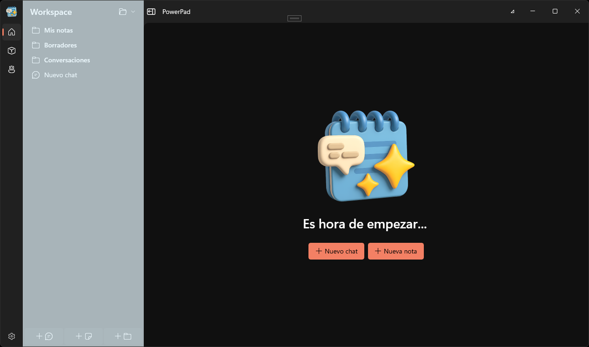

##### Descripción general:

`WorkspaceControl` es un control de usuario que proporciona la interfaz visual y lógica para gestionar y navegar por el espacio de trabajo de la aplicación. Permite visualizar, crear, renombrar y eliminar carpetas, chats y notas, así como cambiar entre diferentes espacios de trabajo. Utiliza una vista de tipo árbol (TreeView) para mostrar la estructura de carpetas y documentos, y expone eventos para notificar cuando un elemento es invocado. Utiliza el `WorkspaceViewModel` para la gestión de datos y comandos.

##### Estructura visual simplificada:

```xml
<UserControl x:Class="PowerPad.WinUI.Components.WorkspaceControl">
    <Grid>
        <Grid>
            <TextBlock Text="Workspace"/>
            <DropDownButton x:Name="OpenWorkspaceBtn">
				<FontIcon Glyph="&#xE838;"/>
                <DropDownButton.Flyout>
                    <MenuFlyout x:Name="WorkspaceMenu">
                        <MenuFlyoutItem Text="Seleccionar carpeta..."/>
                        <MenuFlyoutSeparator/>
                    </MenuFlyout>
                </DropDownButton.Flyout>
            </DropDownButton>
        </Grid>
        <ScrollViewer Grid.Row="1">
            <TreeView Name="TreeView" ItemsSource="{x:Bind _workspace.Root.Children}">
                <TreeView.ItemTemplate>
                    <DataTemplate x:DataType="vmfilesystem:FolderEntryViewModel">
                        <TreeViewItem ItemsSource="{x:Bind Children}">
                            <Grid>
                                <FontIcon Glyph="{x:Bind Glyph, Mode=OneWay}"/>
                                <TextBlock Grid.Column="1" Text="{x:Bind Name}"/>
                                <Button Grid.Column="2"/>
                            </Grid>
                        </TreeViewItem>
                    </DataTemplate>
                </TreeView.ItemTemplate>
            </TreeView>
        </ScrollViewer>
        <Grid Grid.Row="2">
            <Button x:Name="NewChatButton"/>
            <Button x:Name="NewNoteButton" Grid.Column="1"/>
            <Button x:Name="NewFolderButton" Grid.Column="2"/>
        </Grid>
    </Grid>
</UserControl>
```

##### Código simplificado:

```csharp
public partial class WorkspaceControl : UserControl, IRecipient<FolderEntryCreated>, IRecipient<FolderEntryChanged>
{
    private static WorkspaceControl? _activeInstance = null;
    private static readonly object _lock = new();
    private readonly WorkspaceViewModel _workspace;
    private readonly List<MenuFlyoutItem> _menuFlyoutItems;

    public event EventHandler<WorkspaceControlItemInvokedEventArgs>? ItemInvoked;

    public WorkspaceControl() { ... }
    public static void SetActiveInstance(WorkspaceControl instance) { ... }
    public void Receive(FolderEntryCreated message) { ... }
    public void Receive(FolderEntryChanged message) { ... }

    private void UpdateWorkspacesMenu() { ... }
    private void TreeView_ItemInvoked( ... ) { ... }
    private void TreeView_DragItemsCompleted( ... ) { ... }
    private void NewChatButton_Click( ... ) { ... }
    private void NewNoteButton_Click( ... ) { ... }
    private void NewFolderButton_Click( ... ) { ... }
    private FolderEntryViewModel? GetParentForNewElement() { ... }
    private async void RenameFlyoutItem_Click( ... ) { ... }
    private async void DeleteFlyoutItem_Click( ... ) { ... }
    private async void OpenFolderFlyoutItem_Click( ... ) { ... }
    private void OpenRecentlyFlyoutItem_Click( ... ) { ... }
    private static FolderEntryViewModel? FindFolderEntryByPathRecursive( ... ) { ... }
    private void TreeView_Loaded( ... ) { ... }
    private void TreeView_PointerPressed( ... ) { ... }
    private void TreeView_KeyDown( ... ) { ... }
    private void ClearSelection() => ClearSelection(_workspace.Root.Children);
    private static void ClearSelection( ... ) { ... }
    private void TreeView_SelectionChanged( ... ) { ... }
    private void MoreButton_Click( ... ) { ... }
}
```

##### Elementos visuales:

- `OpenWorkspaceBtn`: Botón desplegable para cambiar el espacio de trabajo actual.
- `WorkspaceMenu`: Menú contextual asociado al botón para seleccionar o abrir espacios de trabajo recientes.
- `TreeView`: Árbol que muestra la jerarquía de carpetas y documentos del espacio de trabajo.
- `NewChatButton`: Botón para crear un nuevo chat.
- `NewNoteButton`: Botón para crear una nueva nota.
- `NewFolderButton`: Botón para crear una nueva carpeta.
- `MenuFlyoutItem` (dentro de TreeViewItem.ContextFlyout): Opciones de renombrar y eliminar.
- `FontIcon`: Iconos visuales en botones y elementos del árbol.
- `TextBlock`: Título y nombres de carpetas/documentos.
- `Button` (dentro de TreeViewItem): Botón de opciones adicionales para cada elemento seleccionado.
- `ScrollViewer`: Contenedor con scroll para el árbol de navegación.

##### ViewModels:

- `_workspace`: Instancia de `WorkspaceViewModel` que gestiona el estado y comandos del espacio de trabajo.

##### Otras propiedades:

- `_activeInstance` (estática, privada): Referencia a la instancia activa de `WorkspaceControl`.
- `_lock` (estática, privada): Objeto para sincronización de acceso a la instancia activa.
- `_menuFlyoutItems` (privada): Lista de elementos de menú dinámicos para espacios de trabajo recientes.

##### Eventos:

- `ItemInvoked`: Evento público que se dispara cuando se invoca un elemento del espacio de trabajo (al abrir un documento).

##### Métodos públicos:

- `static void SetActiveInstance(WorkspaceControl instance)`: Establece la instancia activa de `WorkspaceControl` y la registra para recibir mensajes relacionados con la creación y modificación de entradas en carpetas.
- `void Receive(FolderEntryCreated message)`: Recibe un mensaje indicando que se ha creado una nueva entrada en la carpeta, limpia la selección, selecciona la nueva entrada y, si es un documento, actualiza el documento actual y lanza el evento `ItemInvoked`.
- `void Receive(FolderEntryChanged message)`: Recibe un mensaje indicando que una entrada de carpeta ha cambiado. Si el nombre ha cambiado y la entrada seleccionada es un documento, actualiza la ruta del documento actualmente abierto.

##### Otros métodos relevantes:

- `void UpdateWorkspacesMenu()`: Actualiza el menú de workspaces recientes en la interfaz, eliminando los anteriores y añadiendo los actuales.
- `void TreeView_ItemInvoked(TreeViewItemInvokedEventArgs eventArgs)`: Maneja el evento cuando se invoca un elemento en el árbol, abriendo el documento si corresponde o expandiendo/colapsando la carpeta.
- `void TreeView_DragItemsCompleted(TreeViewDragItemsCompletedEventArgs eventArgs)`: Gestiona la finalización de una operación de arrastrar y soltar en el árbol, ejecutando el comando de mover entrada si corresponde.
- `void NewChatButton_Click()`: Maneja el evento de clic para crear un nuevo documento de chat en la carpeta seleccionada o raíz.
- `void NewNoteButton_Click()`: Maneja el evento de clic para crear una nueva nota en la carpeta seleccionada o raíz.
- `void NewFolderButton_Click()`: Maneja el evento de clic para crear una nueva carpeta en la ubicación seleccionada o raíz.
- `FolderEntryViewModel? GetParentForNewElement()`: Obtiene la carpeta padre adecuada para crear un nuevo elemento, considerando la selección actual en el árbol.
- `async void RenameFlyoutItem_Click(object sender)`: Maneja el evento de renombrar una carpeta o documento, mostrando un diálogo para el nuevo nombre y ejecutando el comando de renombrado.
- `async void DeleteFlyoutItem_Click(object sender)`: Maneja el evento de eliminar una carpeta o documento, mostrando un diálogo de confirmación y ejecutando el comando de eliminación.
- `async void OpenFolderFlyoutItem_Click()`: Maneja el evento de abrir una carpeta mediante el diálogo del sistema operativo para elegir una carpeta, ejecutando el comando para abrir el workspace y actualizando el menú.
- `void OpenRecentlyFlyoutItem_Click(object sender)`: Maneja el evento de abrir un workspace reciente, ejecutando el comando correspondiente y actualizando el menú.
- `static FolderEntryViewModel? FindFolderEntryByPathRecursive(IEnumerable<FolderEntryViewModel> entries, string path)`: Busca recursivamente una entrada de carpeta por su ruta, expandiendo las carpetas necesarias en el proceso. Esto permite que, al abrir la aplicación, el documento actual sea visible independientemente de que se encuentre en subcarpetas.
- `void TreeView_Loaded()`: Maneja el evento de carga del árbol, seleccionando y mostrando el documento actual si existe.
- `void TreeView_PointerPressed(PointerRoutedEventArgs eventArgs)`: Maneja el evento de pulsación de puntero en el árbol, limpiando la selección si no es un clic derecho.
- `void TreeView_KeyDown(KeyRoutedEventArgs eventArgs)`: Maneja el evento de pulsación de tecla en el árbol, limpiando la selección si se pulsa Escape.
- `void ClearSelection()`: Limpia la selección de todas las entradas de carpeta en el workspace.
- `static void ClearSelection(IEnumerable<FolderEntryViewModel> entries)`: Limpia recursivamente la selección de las entradas de carpeta proporcionadas.
- `void TreeView_SelectionChanged(TreeViewSelectionChangedEventArgs eventArgs)`: Maneja el evento de cambio de selección en el árbol, asegurando que el elemento seleccionado sea visible.
- `void MoreButton_Click(object sender)`: Muestra el menú contextual de un elemento del árbol al pulsar el botón de "más opciones".

##### Notas adicionales:

- Los métodos asíncronos que muestran diálogos gestionan errores mostrando alertas al usuario en caso de fallo en operaciones críticas como renombrar o eliminar.
- El control asegura que solo una instancia activa reciba mensajes relevantes, evitando conflictos en la gestión del workspace.

#### EditorManager

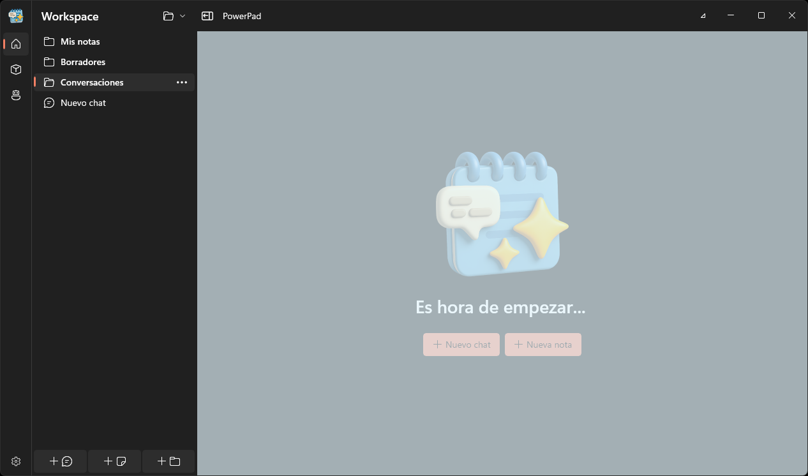

##### Descripción general:

`EditorManager` es un control de usuario que actúa como gestor principal de los editores en la aplicación PowerPad. Su función es administrar la visualización y gestión de editores para documentos tipo chat y notas, permitiendo abrir, cerrar y alternar entre diferentes documentos. Además, gestiona la instancia activa del editor, responde a eventos de eliminación de documentos y realiza auto-guardado periódico de los editores abiertos. Se integra con el sistema de mensajería para reaccionar ante cambios en los modelos subyacentes.

##### Estructura visual simplificada:

```xml
<UserControl x:Class="PowerPad.WinUI.Components.EditorManager">
    <Grid>
        <StackPanel x:Name="Landing">
            <Image>
				<BitmapImage UriSource="...Landing.png" />
            </Image>
            <TextBlock Text="Es hora de empezar..." />
            <StackPanel Orientation="Horizontal">
                <Button x:Name="NewChatButton">
                    <StackPanel Orientation="Horizontal">
                        <FontIcon Glyph="&#xE710;" />
                        <TextBlock Text="Nuevo chat" />
                    </StackPanel>
                </Button>
                <Button x:Name="NewNoteButton">
                    <StackPanel Orientation="Horizontal">
                        <FontIcon Glyph="&#xE710;" />
                        <TextBlock Text="Nueva nota" />
                    </StackPanel>
                </Button>
            </StackPanel>
        </StackPanel>
        <Grid x:Name="EditorGrid" />
    </Grid>
</UserControl>
```

##### Código simplificado:

```csharp
public partial class EditorManager : UserControl, IRecipient<FolderEntryDeleted>
{
    private const long AUTO_SAVE_INTERVAL = 3000;

    private static EditorManager? _activeInstance = null;
    private static readonly object _lock = new();
    private readonly WorkspaceViewModel _workspace;
    private readonly DispatcherTimer _timer;
    private EditorControl? _currentEditor;

    public EditorManager() { ... }
    public static void SetActiveInstance(EditorManager instance) { ... }
    public void OpenFile(FolderEntryViewModel? document) { ... }
    public void Receive(FolderEntryDeleted message) { ... }

    private void NewChatButton_Click( ... ) { ... }
    private void NewNoteButton_Click( ... ) { ... }
    private void UserControl_Unloaded( ... ) { ... }
}
```

##### Constantes:

- `AUTO_SAVE_INTERVAL`: Constante privada que define el intervalo de auto-guardado en milisegundos.

##### Elementos visuales:

- `Landing`: Panel principal mostrado cuando no hay ningún documento abierto. Contiene una imagen, un mensaje y dos botones de acción.
- `EditorGrid`: Contenedor donde se alojan los controles de edición activos (editores de chat o notas).
- `NewChatButton`: Botón para crear un nuevo chat.
- `NewNoteButton`: Botón para crear una nueva nota.
- `Image`: Imagen decorativa de bienvenida.
- `TextBlock`: Texto de bienvenida.
- `StackPanel`: Contenedores para organizar los elementos visuales y botones.
- `FontIcon`: Iconos en los botones.

##### ViewModels:

- `_workspace`: Instancia de `WorkspaceViewModel` utilizada para ejecutar comandos relacionados con la creación de nuevos documentos.

##### Otras propiedades:

- `_activeInstance`: Instancia estática privada que mantiene la referencia al `EditorManager` activo.
- `_lock`: Objeto privado utilizado para sincronización de acceso a la instancia activa.
- `_timer`: Temporizador privado para gestionar el auto-guardado periódico.
- `_currentEditor`: Referencia privada al editor actualmente activo en la interfaz.

##### Métodos públicos:

- `static void SetActiveInstance(EditorManager instance)`: Establece la instancia activa de `EditorManager`, registrando y desregistrando la recepción de mensajes.
- `void OpenFile(FolderEntryViewModel? document)`: Abre un archivo en el editor. Si el documento es nulo, cierra el archivo actual y muestra la pantalla de inicio.
- `void Receive(FolderEntryDeleted message)`: Maneja la recepción de un mensaje indicando que una entrada de carpeta ha sido eliminada, cerrando y eliminando el editor correspondiente si está abierto.

##### Otros métodos relevantes:

- `void NewChatButton_Click(RoutedEventArgs)`: Maneja el evento de clic para crear un nuevo documento de chat.
- `void NewNoteButton_Click(RoutedEventArgs)`: Maneja el evento de clic para crear una nueva nota.
- `void UserControl_Unloaded(RoutedEventArgs)`: Maneja el evento de descarga del control de usuario, desactivando y eliminando el editor actual si existe.

##### Notas adicionales:

- El control utiliza un temporizador (`DispatcherTimer`) para realizar auto-guardado periódico de los editores abiertos a través del helper `EditorManagerHelper`.
- El control alterna entre una vista de bienvenida ("Landing") y el área de edición según si hay un documento abierto o no.

### F.3.2 Editores

#### EditorControl

##### Descripción general:

Clase base abstracta para controles de editor en una aplicación WinUI3. Proporciona la funcionalidad central y define el contrato para la gestión de contenido, el estado del editor y la liberación de recursos. Es utilizada como base para implementar editores concretos que gestionan texto o notas, integrando capacidades de guardado, seguimiento de cambios y control de foco.

##### Código simplificado:

```csharp
public abstract class EditorControl : UserControl, IEditorContract, IDisposable
{
    public bool IsActive { get; set; } = true;
    public abstract bool IsDirty { get; }
    public abstract DateTime LastSaveTime { get; }
    public abstract string GetContent(bool plainText = false);
    public abstract void SetContent(string content);
    public abstract void SetFocus();
    public abstract void AutoSave();
    public abstract int WordCount();
    public void Dispose() { ... }
    protected abstract void Dispose(bool disposing);
}
```

##### Propiedades principales:

- `IsActive`: Indica si el editor está activo. Permite habilitar o deshabilitar la interacción con el editor.
- `IsDirty`: Indica si el contenido del editor tiene cambios no guardados.
- `LastSaveTime`: Marca temporal de la última operación de guardado del contenido.

##### Métodos públicos:

- `GetContent(bool plainText = false)`: Obtiene el contenido del editor, con opción de devolverlo como texto plano.
- `SetContent(string content)`: Establece el contenido del editor.
- `SetFocus()`: Establece el foco en el control del editor.
- `AutoSave()`: Guarda automáticamente el contenido actual del editor.
- `WordCount()`: Calcula y devuelve el número de palabras en el contenido del editor.
- `Dispose()`: Libera los recursos utilizados por el control del editor.

##### Otros métodos relevantes:

- `Dispose(bool disposing)`: Libera los recursos no administrados y, opcionalmente, los recursos administrados. Método protegido y abstracto que debe ser implementado por las clases derivadas.

#### ChatEditorControl

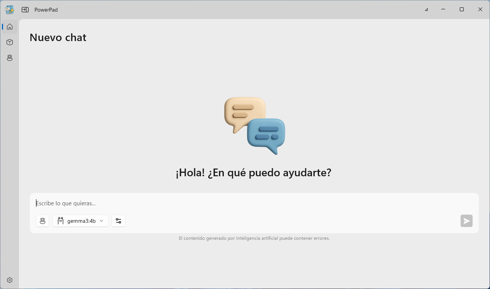

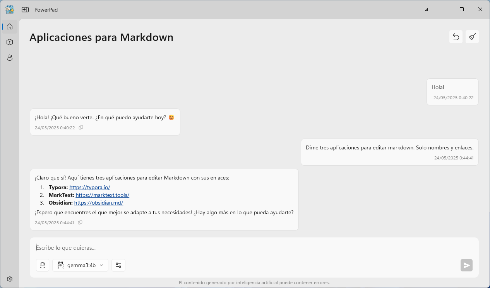


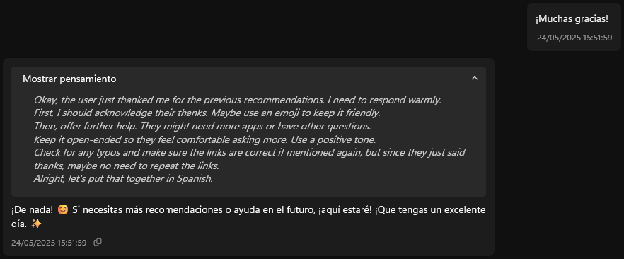

##### Descripción general:

`ChatEditorControl` es un control personalizado de WinUI3 que implementa la edición y visualización de documentos de chat en la aplicación PowerPad. Permite gestionar conversaciones con modelos de IA, mostrando mensajes de usuario y asistente, y proporciona funcionalidades como edición del nombre del documento, eliminación de mensajes, copiado de contenido, y control de parámetros del modelo IA. Se integra con los ViewModels de documento y chat para mantener la lógica desacoplada de la interfaz.

##### Estructura visual simplificada:

```xml
<local:EditorControl
    x:Class="PowerPad.WinUI.Components.Editors.ChatEditorControl">
    <Grid>
        <Grid>
            <controls:EditableTextBlock x:Name="EditableTextBlock" Value="{x:Bind _document.Name}" />
            <StackPanel Grid.Column="1">
                <Button x:Name="UndoButton" />
                <Button x:Name="CleanButton" />
            </StackPanel>
        </Grid>
        <Grid Grid.Row="1" x:Name="ChatGrid">
            <Grid x:Name="Landing">
                <StackPanel x:Name="LandingContent">
                    <Image />
                    <TextBlock Text="¡Hola! ¿En qué puedo ayudarte?"/>
                </StackPanel>
            </Grid>
            <ListView
                x:Name="InvertedListView"
                ItemsSource="{x:Bind _chat.Messages}"
                x:DataType="vmchat:MessageViewModel">
				<DataTemplate x:Key="UserDataTemplate">
					<tkcontrols:MarkdownTextBlock Text="{x:Bind Content}" />
					<TextBlock Text="{x:Bind DateTime}" />
				</DataTemplate>
				<DataTemplate x:Key="AssistantDataTemplate">
					<TextBlock Text="{x:Bind LoadingMessage}" />
					<Expander>
						<TextBlock Text="{x:Bind Reasoning}" />
					</Expander>
					<tkcontrols:MarkdownTextBlock Text="{x:Bind Content}" />
					<StackPanel Orientation="Horizontal">
						<TextBlock Text="{x:Bind DateTime}" />
						<HyperlinkButton Tag="{x:Bind}" Click="CopyButton_Click">
							<FontIcon Glyph="&#xE8C8;" />
						</HyperlinkButton>
					</StackPanel>
					<InfoBar Message="{x:Bind ErrorMessage}" />
				</DataTemplate>
			</ListView>
            <controls:ChatControl
                x:Name="ChatControl" />
        </Grid>
    </Grid>
</local:EditorControl>
```

##### Código simplificado:

```csharp
public partial class ChatEditorControl : EditorControl
{
    private DocumentViewModel _document;
    private ChatViewModel? _chat;

    public override bool IsDirty { get => _document.Status == DocumentStatus.Dirty; }
    public override DateTime LastSaveTime { get => _document.LastSaveTime; }

    public ChatEditorControl(Document document) { ... }
    public override string GetContent(bool plainText = false) { ... }
    public override void SetContent(string content) { ... }
    public override void SetFocus() { ... }
    public override void AutoSave() { ... }
    public override int WordCount() { ... }

    private void EditableTextBlock_Edited( ... ) { ... }
    private void InvertedListView_Loaded( ... ) { ... }
    private T? FindElement<T>(DependencyObject element) where T : DependencyObject { ... }
    private void UpdateLandingVisibility(bool showLanding) { ... }
    private void ItemsStackPanel_SizeChanged( ... ) { ... }
    private async void ChatControl_SendButtonClicked( ... ) { ... }
    private void ChatControl_ChatOptionsChanged( ... ) { ... }
    private void ChatControl_ParametersVisibilityChanged( ... ) { ... }
    private async void CopyButton_Click( ... ) { ... }
    private async void UndoButton_Click( ... ) { ... }
    private async void CleanButton_Click( ... ) { ... }
    protected override void Dispose(bool disposing) { ... }
}
```

##### Elementos visuales:

- `EditableTextBlock`: Campo editable para el nombre del documento.
- `UndoButton`: Botón para eliminar el último mensaje y respuesta.
- `CleanButton`: Botón para eliminar toda la conversación.
- `Landing`: Grid que contiene la pantalla de bienvenida/inicial del chat.
- `LandingContent`: StackPanel con imagen y mensaje de bienvenida.
- `InvertedListView`: ListView que muestra los mensajes del chat, usando un selector de plantillas.
- `ChatControl`: Control personalizado para enviar mensajes y ajustar parámetros del chat.
- `UserDataTemplate`: DataTemplate para mostrar mensajes del usuario.
- `AssistantDataTemplate`: DataTemplate para mostrar mensajes del asistente, incluyendo razonamiento, errores y botones de copiado.
- `Expander`: Muestra el razonamiento del asistente, para los modelos que lo permiten.
- `InfoBar`: Barra de información para mostrar errores en mensajes del asistente.

##### ViewModels:

- `_document`: Instancia de `DocumentViewModel`, representa el documento de chat actual.
- `_chat`: Instancia de `ChatViewModel`, representa la conversación actual, mensajes, modelo IA, parámetros y agente.

##### Otras propiedades:

- `IsDirty`: Indica si el documento tiene cambios sin guardar.
- `LastSaveTime`: Fecha/hora de la última vez que se guardó el documento.

##### Métodos públicos:

- `override string GetContent(bool plainText = false)`: Obtiene el contenido del chat en formato texto plano o serializado en JSON.
- `override void SetContent(string content)`: Establece el contenido del chat a partir de una cadena, deserializándolo si es necesario.
- `override void SetFocus()`: Establece el foco en el control de entrada del chat.
- `override void AutoSave()`: Realiza el guardado automático del documento.
- `override int WordCount()`: Devuelve el número total de palabras en los mensajes del chat.
- `override void Dispose(bool disposing)`: Libera los recursos utilizados por el control y suscripciones a eventos.

##### Otros métodos relevantes:

- `void EditableTextBlock_Edited()`: Maneja el evento de edición del nombre del documento, intentando renombrarlo y mostrando un mensaje de error si falla.
- `void InvertedListView_Loaded()`: Maneja la carga del ListView invertido, suscribiendo el evento de cambio de tamaño del panel de ítems.
- `T? FindElement<T>(DependencyObject element) where T : DependencyObject`: Busca recursivamente un elemento hijo de un tipo específico en el árbol visual.
- `void UpdateLandingVisibility(bool showLanding)`: Actualiza la visibilidad de la página de bienvenida y los controles asociados según el estado de la conversación.
- `void ItemsStackPanel_SizeChanged()`: Ajusta el padding del ListView en función de la visibilidad de la barra de scroll vertical.
- `async void ChatControl_SendButtonClicked()`: Maneja el envío de un mensaje, actualizando la interfaz y gestionando el scroll automático.
- `void ChatControl_ChatOptionsChanged(ChatOptionsChangedEventArgs eventArgs)`: Actualiza las opciones del chat (modelo, parámetros, agente) y marca el documento como modificado.
- `void ChatControl_ParametersVisibilityChanged(bool parametersPanelVisible)`: Cambia la visibilidad del contenido de bienvenida según la visibilidad del panel de parámetros.
- `async void CopyButton_Click(object sender)`: Copia el contenido de un mensaje al portapapeles y muestra una notificación visual temporal.
- `async void UndoButton_Click()`: Solicita confirmación y elimina el último mensaje y respuesta del asistente, actualizando el estado del documento.
- `async void CleanButton_Click()`: Solicita confirmación y elimina toda la conversación, actualizando el estado del documento.

##### Notas adicionales:

- El método `SetContent` maneja la deserialización del contenido del chat y muestra un mensaje de error si el proceso falla.
- El control gestiona la visibilidad de elementos de la interfaz (como la página de bienvenida y botones de acción) en función del estado de la conversación.
- Los métodos que interactúan con la interfaz de usuario utilizan `DispatcherQueue` para asegurar la ejecución en el hilo adecuado.

#### TextEditorControl

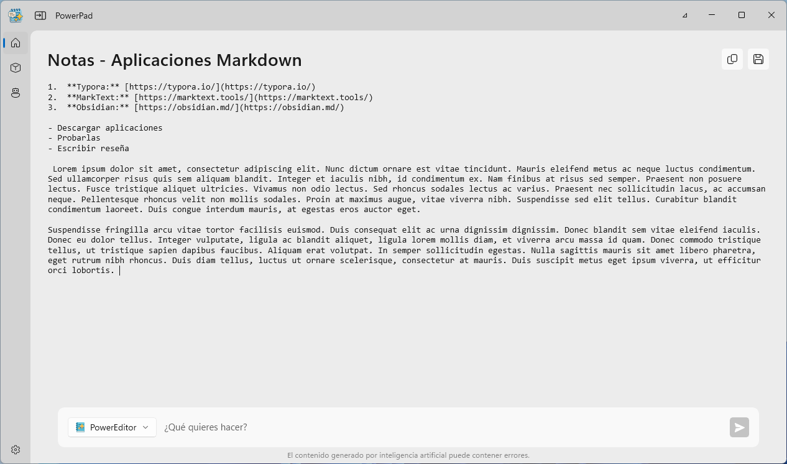

##### Descripción general:

`TextEditorControl` es un control personalizado para la edición de texto en la aplicación PowerPad. Permite editar, copiar, deshacer, rehacer y guardar notas, así como interactuar con un agente de IA para modificar o enriquecer el contenido textual. Incorpora funcionalidades de gestión de documentos, integración con el portapapeles y soporte para comandos y estados del documento.

##### Estructura visual simplificada:

```xml
<local:EditorControl x:Class="PowerPad.WinUI.Components.Editors.TextEditorControl">
    <Grid>
        <Grid>
            <controls:EditableTextBlock
                x:Name="EditableTextBlock"
                Value="{x:Bind _document.Name}" />
            <StackPanel Grid.Column="1">
                <Button x:Name="UndoButton" />
                <Button x:Name="RedoButton" />
                <Button x:Name="CopyBtn" />
                <Button
                    x:Name="SaveBtn"
                    IsEnabled="{x:Bind _document.CanSave}"
                    Command="{x:Bind _document.SaveCommand}" />
            </StackPanel>
        </Grid>
        <controls:IntegratedTextBox
            x:Name="TextEditor"
            Grid.Row="1" />
        <controls:NoteAgentControl
            x:Name="AgentControl"
            Grid.Row="2" />
    </Grid>
</local:EditorControl>
```

##### Código simplificado:

```csharp
public partial class TextEditorControl : EditorControl
{
    private DocumentViewModel _document;

    public override bool IsDirty { get => _document.Status == DocumentStatus.Dirty; }
    public override DateTime LastSaveTime { get => _document.LastSaveTime; }

    public TextEditorControl(Document document) { ... }
    public override string GetContent(bool plainText = false) { ... }
    public override void SetContent(string content) { ... }
    public override void SetFocus() { ... }
	public override void AutoSave() { ... }
    public override int WordCount() { ... }

	private void EditableTextBlock_Edited( ... ) { ... }
    private async void CopyBtn_Click( ... ) { ... }
    private async void AgentControl_SendButtonClicked( ... ) { ... }
    private void UndoButton_Click( ... ) { ... }
    private void RedoButton_Click( ... ) { ... }
    private void TextEditor_SizeChanged( ... ) { ... }
    private T? FindElement<T>(DependencyObject element) where T : DependencyObject { ... }
    protected override void Dispose(bool disposing) { ... }
}
```

##### Elementos visuales:

- `EditableTextBlock`: Campo de texto editable para el nombre del documento.
- `UndoButton`: Botón para deshacer cambios en el contenido.
- `RedoButton`: Botón para rehacer cambios deshechos previamente.
- `CopyBtn`: Botón para copiar el contenido del editor al portapapeles.
- `SaveBtn`: Botón para guardar el documento.
- `TextEditor`: Control de edición de texto principal `IntegratedTextBox`.
- `AgentControl`: Control para interacción con el agente de IA `NoteAgentControl`.

##### ViewModels:

- `_document`: Instancia de `DocumentViewModel`, representa el documento actual. Gestiona el estado, comandos y datos del documento.

##### Otras propiedades:

- `IsDirty`: Indica si el documento tiene cambios sin guardar.
- `LastSaveTime`: Fecha/hora de la última vez que se guardó el documento.

##### Métodos públicos:

- `override string GetContent(bool plainText = false)`: Obtiene el contenido del editor, siempre en texto plano al tratarse de una nota.
- `override void SetContent(string content)`: Establece el contenido del editor de texto y actualiza el estado del botón de copiar.
- `override void SetFocus()`: Establece el foco de entrada en el editor de texto.
- `override void AutoSave()`: Realiza el guardado automático del documento.
- `override int WordCount()`: Devuelve el número total de palabras en el editor de texto.
- `override void Dispose(bool disposing)`: Libera los recursos utilizados por el control y suscripciones a eventos.

##### Otros métodos relevantes:

- `void EditableTextBlock_Edited()`: Maneja el evento de edición del nombre del documento, intentando renombrarlo y mostrando un mensaje de error si falla.
- `async void CopyBtn_Click(object sender)`: Copia el texto actual del editor al portapapeles y muestra un mensaje visual de confirmación.
- `async void AgentControl_SendButtonClicked()`: Envía el texto (o la selección) al agente de IA, actualiza el contenido según la respuesta y gestiona posibles errores mostrando alertas.
- `void UndoButton_Click()`: Restaura el contenido anterior del documento (deshacer).
- `void RedoButton_Click()`: Restaura el contenido posterior del documento (rehacer).
- `void TextEditor_SizeChanged()`: Ajusta el padding del editor de texto en función de la visibilidad de la barra de scroll vertical.
- `T? FindElement<T>(DependencyObject element) where T : DependencyObject`: Busca recursivamente un elemento hijo de un tipo específico dentro del árbol visual.

##### Notas adicionales:

- Los métodos que interactúan con la interfaz de usuario utilizan `DispatcherQueue` para asegurar la ejecución en el hilo adecuado.

#### AgentEditorControl

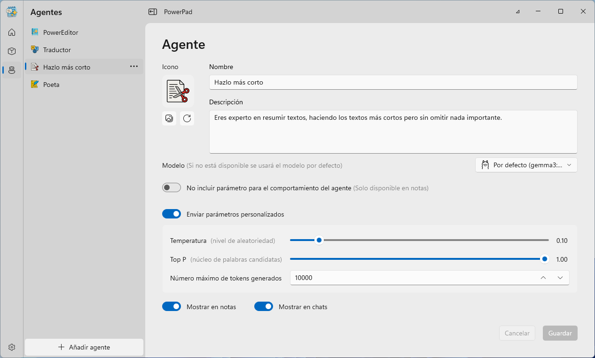

##### Descripción general:

`AgentEditorControl` es un control de usuario utilizado para editar las propiedades y configuraciones de un agente de IA dentro de la aplicación PowerPad. Permite modificar el nombre, icono, modelo de IA, parámetros personalizados y visibilidad del agente en notas y chats, proporcionando una interfaz visual avanzada y validaciones para la edición segura de agentes.

##### Estructura visual simplificada:

Debido a la complejidad del componente, se incluye solamente un extracto de ejemplo con algunos controles de usuario.
```xml
<UserControl x:Class="PowerPad.WinUI.Components.Editors.AgentEditorControl">
    <Grid>
        <StackPanel>
            <TextBlock Text="Agente"/>
        </StackPanel>
        <ScrollViewer x:Name="ScrollViewer" Grid.Row="1">
			<StackPanel x:Name="AgentForm">
				<Grid>
					<StackPanel>
						<TextBlock Text="Icono" />
						<controls:AgentIconControl AgentIcon="{x:Bind _agent.Icon}" />
						<StackPanel Orientation="Horizontal">
							<Button x:Name="SelectImageButton"/>
							<Button x:Name="RandomIconButton"/>
						</StackPanel>
					</StackPanel>
					<StackPanel Grid.Column="1">
						<TextBox x:Name="AgentNameTextBox" Text="{x:Bind _agent.Name}" />
						<TextBox x:Name="AgentPromptTextBox" Text="{x:Bind _agent.Prompt}" />
					</StackPanel>
				</Grid>
				<Grid>
					<TextBlock Text="Modelo (Si no está disponible se usará el modelo por defecto)" />
					<controls:ModelSelector x:Name="ModelSelector" Grid.Column="1" />
				</Grid>
				<Expander x:Name="PromptParameterExpander">
					...
				</Expander>
				<Expander x:Name="AIParametersExpander">
					...
				</Expander>
				<StackPanel Orientation="Horizontal">
					<ToggleSwitch IsOn="{x:Bind _agent.ShowInNotes}"/>
					<ToggleSwitch IsOn="{x:Bind _agent.ShowInChats}"/>
				</StackPanel>
			</StackPanel>
        </ScrollViewer>
        <StackPanel Grid.Row="2" Orientation="Horizontal">
            <Button x:Name="CancelButton"/>
            <Button x:Name="SaveButton"/>
        </StackPanel>
    </Grid>
</UserControl>
```

##### Código simplificado:

```csharp
public partial class AgentEditorControl : UserControl, IDisposable
{
    private readonly SettingsViewModel _settings;
    private readonly AgentsCollectionViewModel _agentsCollection;
    private readonly AgentViewModel _agent;
    private readonly AgentViewModel _originalAgent;
    private readonly XamlRoot _xamlRoot;

    public AgentEditorControl(AgentViewModel agent, XamlRoot xamlRoot) { ... }
    public async Task<bool> ConfirmClose() { ... }

    private async void SelectImageButton_Click( ... ) { ... }
    private void RandomIconButton_Click( ... ) { ... }
    private void Agent_PropertyChanged( ... ) { ... }
    private void SaveButton_Click( ... ) { ... }
    private async void CancelButton_Click( ... ) { ... }
    private void ModelSelector_SelectedModelChanged( ... ) { ... }
    private void PromptParameterSwitch_Toggled( ... ) { ... }
    private void AIParametersSwitch_Toggled( ... ) { ... }
    private void AgentNameTextBox_TextChanging( ... ) { ... }
    private void AgentPromptTextBox_TextChanging( ... ) { ... }
    private void ScrollViewer_SizeChanged( ... ) => UpdateScrollViewerMargin();
    private void UpdateScrollViewerMargin() { ... }
    public void Dispose() { ... }
    protected virtual void Dispose(bool disposing) { ... }
}
```

##### Elementos visuales:

- `ScrollViewer`: Contenedor principal desplazable para el formulario de edición.
- `AgentForm`: StackPanel que agrupa todos los campos de edición del agente.
- `TextBlock`: Muestra el título "Agente".
- `controls:AgentIconControl`: Control personalizado para mostrar el icono del agente.
- `SelectImageButton`: Botón para seleccionar una imagen como icono.
- `RandomIconButton`: Botón para generar un icono aleatorio.
- `AgentNameTextBox`: TextBox para editar el nombre del agente.
- `AgentPromptTextBox`: TextBox para editar la descripción o prompt del agente.
- `controls:ModelSelector`: Selector de modelo de IA asociado al agente.
- `PromptParameterExpander`: Expander para mostrar/ocultar controles de parámetro de prompt.
- `PromptParameterSwitch`: ToggleSwitch para activar/desactivar el parámetro de prompt.
- `AIParametersExpander`: Expander para mostrar/ocultar controles de parámetros de IA.
- `AIParametersSwitch`: ToggleSwitch para activar/desactivar parámetros personalizados de IA.
- `Slider`: Para ajustar temperatura y Top P.
- `NumberBox`: Para ajustar el número máximo de tokens generados.
- `ToggleSwitch`: Controla si el agente se muestra en notas o en chats.
- `CancelButton`: Botón para cancelar los cambios.
- `SaveButton`: Botón para guardar los cambios.

##### ViewModels:

- `_settings`: Instancia de `SettingsViewModel` para acceder a la configuración global.
- `_agentsCollection`: Instancia de `AgentsCollectionViewModel` para acceder a la colección de agentes y utilidades.
- `_agent`: Instancia de `AgentViewModel` que representa el agente en edición (copia editable).
- `_originalAgent`: Instancia de `AgentViewModel` que representa el agente original (para restaurar o comparar cambios).

##### Otras propiedades:

- `_xamlRoot`: Referencia a `XamlRoot` para la ubicación de diálogos.

##### Métodos públicos:

- `Task<bool> ConfirmClose()`: Confirma si el usuario desea cerrar el editor, mostrando un diálogo para guardar cambios si es necesario. Devuelve `true` si se puede cerrar, `false` en caso contrario.
- `void Dispose()`: Libera los recursos utilizados por el control, en esta implementación no realiza ninguna acción.

##### Otros métodos relevantes:

- `void SelectImageButton_Click()`: Gestiona el evento de selección de imagen para el icono del agente con la ayuda de la clase `Base64ImageHelper`.
- `void RandomIconButton_Click()`: Gestiona el evento de generación de un icono aleatorio para el agente.
- `void Agent_PropertyChanged()`: Gestiona los cambios en las propiedades del agente, habilitando los botones de Guardar y Cancelar.
- `void SaveButton_Click()`: Guarda los cambios realizados en el agente y deshabilita los botones de Guardar y Cancelar.
- `void CancelButton_Click()`: Cancela los cambios realizados, restaurando los valores originales del agente tras confirmación del usuario.
- `void ModelSelector_SelectedModelChanged()`: Gestiona el cambio del modelo de IA seleccionado.
- `void PromptParameterSwitch_Toggled()`: Alterna la visibilidad y el estado de los controles de parámetro de prompt.
- `void AIParametersSwitch_Toggled()`: Alterna la visibilidad y el estado de los controles de parámetros de IA.
- `void AgentNameTextBox_TextChanging()`: Gestiona los cambios de texto en el campo de nombre del agente, habilitando los botones de Guardar y Cancelar si hay cambios.
- `void AgentPromptTextBox_TextChanging()`: Gestiona los cambios de texto en el campo de descripción del agente, habilitando los botones de Guardar y Cancelar si hay cambios.
- `void ScrollViewer_SizeChanged()`: Gestiona los cambios de tamaño del ScrollViewer y llama `UpdateScrollViewerMargin()`.
- `void UpdateScrollViewerMargin()`: Actualiza el margen del formulario del agente en función de la visibilidad y el ancho de la ventana.

##### Notas adicionales:

- El control utiliza enlaces bidireccionales (`x:Bind`) para sincronizar los datos entre la interfaz y el modelo de vista del agente.
- Los diálogos de confirmación para guardar o cancelar cambios utilizan el helper `DialogHelper` y el `XamlRoot` proporcionado para el posicionamiento adecuado en la interfaz.
- El control crea una copia del agente para que la edición se pueda revertir o confirmar al finalizar la edición.

### F.3.3. Gestión de modelos

#### AvailableModelsRepeater

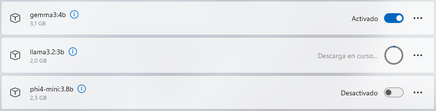

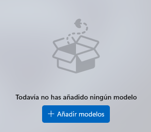

##### Descripción general:

`AvailableModelsRepeater` es un control de usuario diseñado para mostrar y gestionar una lista de modelos de IA disponibles en la aplicación. Permite visualizar los modelos, acceder a información detallada, activar/desactivar modelos, eliminarlos, establecer uno como predeterminado y añadir nuevos modelos.

##### Estructura visual simplificada:

```xml
<UserControl x:Class="PowerPad.WinUI.Components.AvailableModelsRepeater">
    <Grid>
        <ScrollViewer x:Name="ModelsScrollViewer">
			<StackPanel>
				<ItemsRepeater ItemsSource="{x:Bind Models, Mode=OneWay}">
					<DataTemplate x:DataType="vmai:AIModelViewModel">
						<tkcontrols:SettingsCard x:Name="ModelsExpander">
							<tkcontrols:SettingsCard.Header>
								<TextBlock Text="{x:Bind CardName}"/>
								<HyperlinkButton Tag="{x:Bind}" Click="HyperlinkButton_Click"/>
							</tkcontrols:SettingsCard.Header>
							<tkcontrols:SettingsCard.Description>
								<StackPanel Visibility="{x:Bind Size}">
									<TextBlock Text="{x:Bind Size}"/>
								</StackPanel>
							</tkcontrols:SettingsCard.Description>
							<StackPanel>
								<ToggleSwitch IsOn="{x:Bind Enabled}"/>
								<TextBlock Visibility="{x:Bind Downloading}" Text="Descarga en curso..."/>
								<muxc:ProgressRing Value="{x:Bind Progress}"/>
								<Button>
									<MenuFlyout>
										<MenuFlyoutItem Tag="{x:Bind}" Click="OnDeleteClick"/>
										<MenuFlyoutItem Tag="{x:Bind}" Click="OnSetDefaultClick"/>
									</MenuFlyout>
								</Button>
							</StackPanel>
						</tkcontrols:SettingsCard>
					</DataTemplate>
				</ItemsRepeater>
			</StackPanel>
        </ScrollViewer>
        <StackPanel>
            <controls:Label Text="Todavía no has añadido ningún modelo"/>
            <Button x:Name="AddModelsButton" Click="AddModelsButton_Click">
                <StackPanel>
                    <TextBlock Text="Añadir modelos"/>
                </StackPanel>
            </Button>
        </StackPanel>
        <controls:ModelInfoViewer
			x:Name="ModelInfoViewer"
			VisibilityChanged="ModelInfoViewer_VisibilityChanged"/>
    </Grid>
</UserControl>
```

##### Código simplificado:

```csharp
public partial class AvailableModelsRepeater : UserControl
{
    public ObservableCollection<AIModelViewModel> Models { get; set; }
    public static readonly DependencyProperty ModelsProperty =
        DependencyProperty.Register(...);

    public bool ModelsEmpty { get; set; }
    public static readonly DependencyProperty ModelsEmptyProperty =
        DependencyProperty.Register(...);

    public event EventHandler<AIModelClickEventArgs>? DeleteClick;
    public event EventHandler<AIModelClickEventArgs>? SetDefaultClick;
    public event EventHandler? AddButtonClick;
    public event EventHandler<ModelInfoViewerVisibilityEventArgs>? ModelInfoViewerVisibilityChanged;

    public AvailableModelsRepeater() { this.InitializeComponent(); }
    public void CloseModelInfoViewer() => ModelInfoViewer.Hide();

    private void OnDeleteClick( ... ) { ... }
    private void OnSetDefaultClick( ... ) { ... }
    private void HyperlinkButton_Click( ... ) { ... }
    private void ModelInfoViewer_VisibilityChanged( ... ) { ... }
    private void AddModelsButton_Click( ... ) { ... }
}
```

##### Propiedades de dependencia:

- `Models`: Colección observable de modelos de IA a mostrar en el control.
- `ModelsEmpty`: Indica si la colección de modelos está vacía, utilizado para mostrar mensajes o controles alternativos.

##### Elementos visuales:

- `ModelsScrollViewer`: ScrollViewer que contiene la lista de modelos cuando existen elementos.
- `ItemsRepeater`: Control que repite visualmente cada modelo de la colección.
- `SettingsCard`: Tarjeta visual personalizada para mostrar información y acciones de cada modelo.
- `HyperlinkButton`: Botón para mostrar información adicional del modelo.
- `ToggleSwitch`: Permite activar o desactivar un modelo.
- `ProgressRing`: Indicador de progreso para descargas de modelos.
- `Button`: Botón de opciones adicionales (eliminar, establecer como predeterminado).
- `StackPanel`: Panel mostrado cuando no hay modelos disponibles, incluye imagen, texto y botón para añadir modelos.
- `AddModelsButton`: Botón para añadir nuevos modelos.
- `ModelInfoViewer`: Control para mostrar información detallada de un modelo.

##### ViewModels:

- `Models`: Colección observable de instancias de `AIModelViewModel`, cada una representa un modelo de IA con sus propiedades y estado.

##### Eventos:

- `DeleteClick`: Se produce al hacer clic en la opción de eliminar un modelo.
- `SetDefaultClick`: Se produce al hacer clic en la opción de establecer un modelo como predeterminado.
- `AddButtonClick`: Se produce al hacer clic en el botón para añadir modelos.
- `ModelInfoViewerVisibilityChanged`: Se produce cuando cambia la visibilidad del visor de información del modelo.

##### Métodos públicos:

- `void CloseModelInfoViewer()`: Cierra el visor de información del modelo.

##### Otros métodos relevantes:

- `void OnDeleteClick(object? sender)`: Maneja el evento de clic en el botón de eliminar para un modelo y lanza el evento `DeleteClick`.
- `void OnSetDefaultClick(object? sender)`: Maneja el evento de clic en el botón para establecer un modelo como predeterminado y lanza el evento `SetDefaultClick`. Si el modelo no está habilitado, lo habilita.
- `void HyperlinkButton_Click(object sender)`: Maneja el evento de clic en el botón de hipervínculo para mostrar la información del modelo en el visor correspondiente.
- `void ModelInfoViewer_VisibilityChanged(object sender, ModelInfoViewerVisibilityEventArgs eventArgs)`: Maneja el evento de cambio de visibilidad del visor de información del modelo, alternando la visibilidad del listado de modelos y lanzando el evento `ModelInfoViewerVisibilityChanged`.
- `void AddModelsButton_Click()`: Maneja el evento de clic en el botón para añadir modelos y lanza el evento `AddButtonClick`.

##### Notas adicionales:

- El control utiliza propiedades de dependencia (`DependencyProperty`) para `Models` y `ModelsEmpty`, permitiendo su uso en enlaces de datos (binding) en XAML.

#### SearchModelsResultRepeater

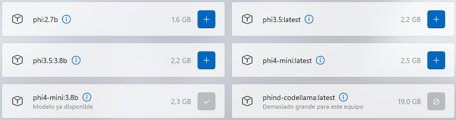

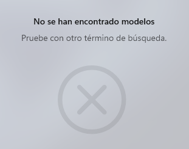

##### Descripción general:

`SearchModelsResultRepeater` es un control de usuario diseñado para mostrar una lista de modelos de IA resultados de una búsqueda y permitir la interacción con cada resultado (como añadirlo o consultar información adicional). Presenta diferentes estados visuales según si se está buscando, si la búsqueda no arroja resultados o si hay modelos disponibles.

##### Estructura visual simplificada:

```xml
<UserControl x:Class="PowerPad.WinUI.Components.SearchModelsResultRepeater">
    <Grid>
        <StackPanel Orientation="Vertical">
			<muxc:ProgressRing IsActive="{x:Bind SearchingFlag}" />
			<TextBlock Text="Buscando..." />
		</StackPanel>
		<ScrollView x:Name="ModelsScrollViewer">
			<ItemsRepeater ItemsSource="{x:Bind Models, Mode=OneWay}">
				<DataTemplate x:DataType="vmai:AIModelViewModel">
					<tkcontrols:SettingsCard>
						<tkcontrols:SettingsCard.Header>
							<TextBlock Text="{x:Bind CardName}"/>
							<HyperlinkButton Tag="{x:Bind}" Click="HyperlinkButton_Click"/>
						</tkcontrols:SettingsCard.Header>
						<tkcontrols:SettingsCard.Description>
							<StackPanel Orientation="Horizontal">
								<TextBlock Text="Descarga en curso..." />
								<TextBlock Text="Modelo ya disponible" />
								<TextBlock Text="Demasiado grande para este equipo" />
							</StackPanel>
						</tkcontrols:SettingsCard.Description>
						<StackPanel Orientation="Horizontal">
							<TextBlock Text="{x:Bind Size}" />
							<Button Tag="{x:Bind}" />
							<muxc:ProgressRing Value="{x:Bind Progress}" />
						</StackPanel>
					</tkcontrols:SettingsCard>
				</DataTemplate>
			</ItemsRepeater>
		</ScrollView>
        <StackPanel>
            <TextBlock Text="No se han encontrado modelos" />
            <TextBlock Text="Pruebe con otro término de búsqueda." />
            <FontIcon />
        </StackPanel>
        <controls:ModelInfoViewer x:Name="ModelInfoViewer" />
    </Grid>
</UserControl>
```

##### Código simplificado:

```csharp
public partial class SearchModelsResultRepeater : UserControl
{
    public ObservableCollection<AIModelViewModel> Models { get; set; }
    public static readonly DependencyProperty ModelsProperty =
        DependencyProperty.Register(...);

    public bool SearchingFlag { get; set; }
    public static readonly DependencyProperty SearchingFlagProperty =
        DependencyProperty.Register(...);

    public bool SearchEmpty { get; set; }
    public static readonly DependencyProperty SearchEmptyProperty =
        DependencyProperty.Register(...);

    public event EventHandler<AIModelClickEventArgs>? AddModelClick;
    public event EventHandler<ModelInfoViewerVisibilityEventArgs>? ModelInfoViewerVisibilityChanged;

    public SearchModelsResultRepeater() { ... }
    public void CloseModelInfoViewer() { ... }

    private void OnAddModelClick( ... ) { ... }
    private void HyperlinkButton_Click( ... ) { ... }
    private void ModelInfoViewer_VisibilityChanged( ... ) { ... }
}
```

##### Propiedades de dependencia:

- `Models`: Colección observable de modelos de IA a mostrar en el control.
- `SearchingFlag`: Indica si una operación de búsqueda está en curso.
- `SearchEmpty`: Indica si el resultado de la búsqueda está vacío.

##### Elementos visuales:

- `MainContent`: SwitchPresenter que alterna entre el estado de búsqueda y los resultados.
- `ModelsScrollViewer`: ScrollView que contiene la lista de modelos encontrados.
- `ItemsRepeater`: Control que repite visualmente los modelos de IA.
- `StackPanel`: Contenedores para organizar elementos vertical y horizontalmente.
- `ProgressRing`: Indicador visual de progreso de búsqueda o descarga.
- `TextBlock`: Muestra textos informativos y de estado.
- `HyperlinkButton`: Botón para mostrar más información sobre un modelo.
- `Button`: Botones para añadir modelos o mostrar estados.
- `FontIcon`: Iconos visuales para botones y estados.
- `ModelInfoViewer`: Control personalizado para mostrar información detallada de un modelo.

##### ViewModels:

- `Models`: Colección de instancias de `AIModelViewModel`, representa los modelos de IA mostrados en la vista.

##### Eventos:

- `AddModelClick`: Se produce cuando se hace clic en el botón "Añadir modelo".
- `ModelInfoViewerVisibilityChanged`: Se produce cuando cambia la visibilidad del visor de información del modelo.

##### Métodos públicos:

- `void CloseModelInfoViewer()`: Cierra el visor de información del modelo.

##### Otros métodos relevantes:

- `void OnAddModelClick(object? sender)`: Maneja el evento de clic del botón "Añadir modelo", disparando el evento `AddModelClick` con el modelo correspondiente.
- `void HyperlinkButton_Click(object sender)`: Maneja el evento de clic del botón de hipervínculo para mostrar información adicional del modelo seleccionado en el visor de información.
- `void ModelInfoViewer_VisibilityChanged(object sender, ModelInfoViewerVisibilityEventArgs eventArgs)`: Maneja el evento de cambio de visibilidad del visor de información del modelo, alternando la visibilidad del listado de modelos y lanzando el evento `ModelInfoViewerVisibilityChanged`.

##### Notas adicionales:

- Las propiedades `Models`, `SearchingFlag` y `SearchEmpty` están implementadas como dependencias (`DependencyProperty`) para permitir el enlace de datos en XAML.
- El control utiliza plantillas y convertidores para gestionar la presentación visual de los modelos, su estado de descarga y la interacción con el usuario.

#### ModelInfoViewer

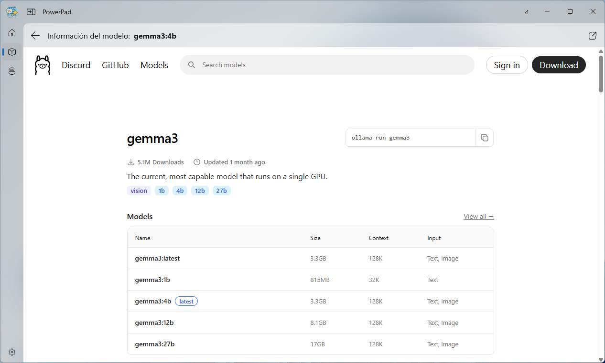

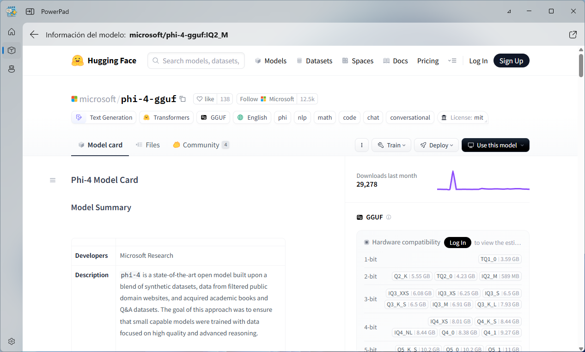

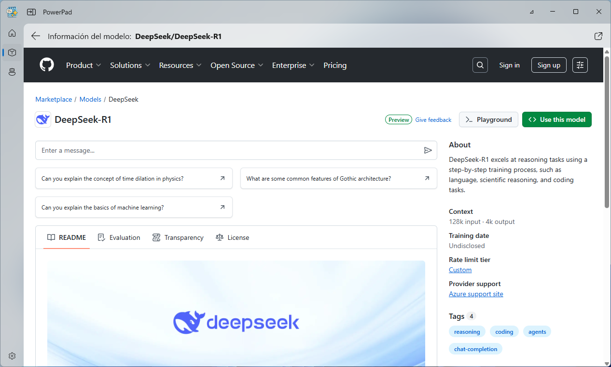

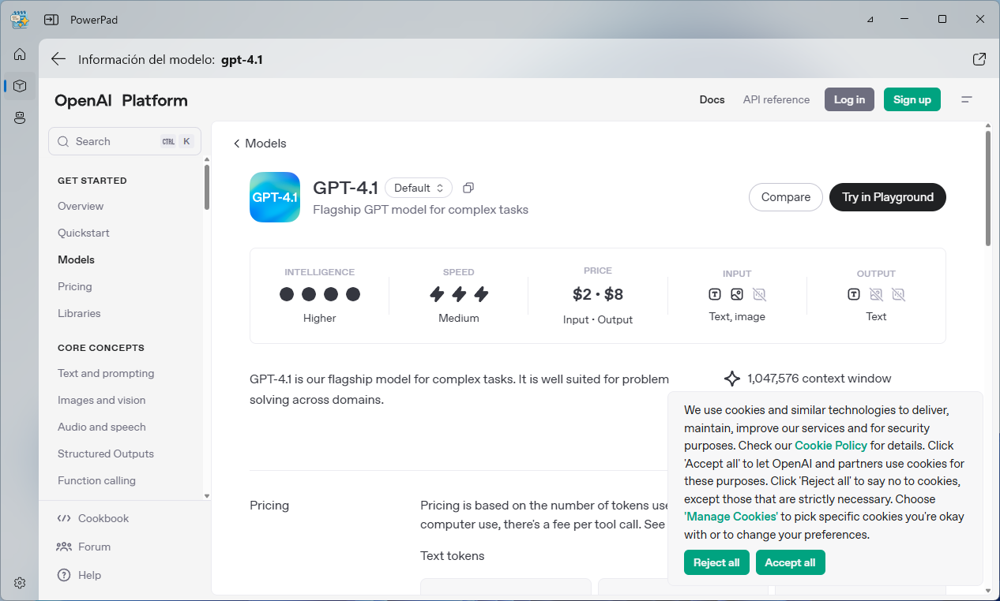

##### Descripción general:

`ModelInfoViewer` es un control de usuario diseñado para mostrar información detallada sobre un modelo de IA dentro de la aplicación. Presenta una interfaz visual que incluye un título, controles de navegación y un visor web (`WebView2`) para mostrar contenido externo relacionado con el modelo. Permite abrir la información en el navegador predeterminado y gestiona la visibilidad del control, mostrando un indicador de carga mientras se inicializa el contenido web. Es utilizado para proporcionar al usuario detalles adicionales sobre los modelos de IA manejados en PowerPad.

##### Estructura visual simplificada:

```xml
<UserControl x:Class="PowerPad.WinUI.Components.Controls.ModelInfoViewer">
    <Grid>
		<Button Click="CloseButton_Click" ToolTipService.ToolTip="Volver">
			<FontIcon />
		</Button>
		<TextBlock Text="Información del modelo:" Grid.Column="1" />
		<TextBlock x:Name="TitleTextBlock" Grid.Column="2" />
		<Button Grid.Column="3"
			Click="OpenInBrowserButton_Click"
			ToolTipService.ToolTip="Abrir en el navegador">
			<FontIcon />
		</Button>
	</Grid>
	<Grid Grid.Row="1">
		<ProgressRing x:Name="LoadingSpinner" />
		<WebView2 x:Name="WebView" />
    </Grid>
</UserControl>
```

##### Código simplificado:

```csharp
public partial class ModelInfoViewer : UserControl
{
    public event EventHandler<ModelInfoViewerVisibilityEventArgs>? VisibilityChanged;

    public ModelInfoViewer() { ... }

    private void WebView_CoreWebView2Initialized(WebView2 _, CoreWebView2InitializedEventArgs __) { ... }
    public void Show(string title, string url) { ... }
    public void Hide() { ... }
    private void CloseButton_Click( ... ) ( ... )
    private void WebView_NavigationCompleted( ... ) { ... }
    private void OnVisibilityChanged( ... ) { ... }
    private async void OpenInBrowserButton_Click( ... ) { ... }
    private async void WebView_NavigationStarting( ... ) { ... }
    private void WebView_PermissionRequested( ... ) { ... }
}
```

##### Elementos visuales:

- `Button`: Botón para cerrar el panel y ocultar el control.
- `FontIcon`: Ícono visual dentro del botón de cerrar.
- `TextBlock`: Muestra el texto "Información del modelo:".
- `TextBlock`: Muestra el título dinámico del modelo.
- `Button`: Botón para abrir la URL actual en el navegador predeterminado.
- `FontIcon`: Ícono visual dentro del botón para abrir en navegador.
- `ProgressRing`: Indicador de carga mientras se inicializa el contenido web.
- `WebView2`: Control para mostrar contenido web relacionado con el modelo.

##### Eventos:

- `VisibilityChanged`: Evento que se dispara cuando cambia la visibilidad del control. Permite notificar a otros componentes sobre la visualización u ocultamiento del panel de información.

##### Métodos públicos:

- `void Show(string title, string url)`: Muestra el control con el título y la URL especificados, cargando la información del modelo en el componente WebView2.
- `void Hide()`: Oculta el control y restablece su estado visual.

##### Otros métodos relevantes:

- `void WebView_CoreWebView2Initialized()`: Maneja la inicialización del componente CoreWebView2, registrando el evento de solicitud de permisos.
- `void CloseButton_Click()`: Maneja el evento de clic del botón de cierre para ocultar el control.
- `void WebView_NavigationCompleted()`: Maneja la finalización de la navegación en WebView2, mostrando el contenido y ocultando el indicador de carga.
- `void OnVisibilityChanged()`: Maneja los cambios en la propiedad de visibilidad del control, notificando mediante el evento `VisibilityChanged`.
- `async void OpenInBrowserButton_Click()`: Abre la URL actual en el navegador predeterminado y oculta el control.
- `async void WebView_NavigationStarting(CoreWebView2NavigationStartingEventArgs eventArgs)`: Cancela la navegación en WebView2 y abre la URL en el navegador predeterminado.
- `void WebView_PermissionRequested(CoreWebView2PermissionRequestedEventArgs eventArgs)`: Maneja las solicitudes de permisos en WebView2, denegando todas las solicitudes automáticamente, para evitar diálogos adicionales durante la visualización.

##### Notas adicionales:

- Al intentar navegar a una nueva URL desde el WebView2, la navegación se cancela y la URL se abre en el navegador externo, evitando la navegación interna dentro del control.

### F.3.4 Controles de IA

#### ChatControl


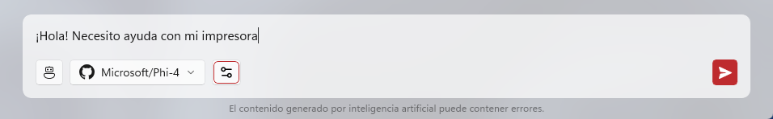

##### Descripción general:

`ChatControl` es un control de usuario diseñado para gestionar interacciones de chat con modelos de inteligencia artificial en PowerPad. Permite seleccionar modelos y agentes de IA, configurar parámetros personalizados, enviar mensajes y visualizar respuestas en tiempo real. El control implementa lógica para alternar entre agentes y modelos, gestionar la visibilidad de paneles de parámetros, controlar el flujo de mensajes y manejar eventos relacionados con la interacción del usuario y la configuración del chat.

##### Estructura visual simplificada:

```xml
<UserControl x:Class="PowerPad.WinUI.Components.Controls.ChatControl">
	<StackPanel>
		<Grid x:Name="ParametersPanel" Visibility="Collapsed">
			<ToggleSwitch x:Name="EnableParametersSwitch">
				<ToggleSwitch.OnContent>
					<TextBlock Text="Enviar parámetros personalizados"/>
				</ToggleSwitch.OnContent>
				<ToggleSwitch.OffContent>
					<TextBlock Text="No enviar parámetros personalizados"/>
					<TextBlock Text="(Se envían parámetros predeterminados)" Visibility="{x:Bind _settings.Models.SendDefaultParameters, Mode=OneWay}"/>
				</ToggleSwitch.OffContent>
			</ToggleSwitch>
			<Button x:Name="CloseParametersButton"/>
			<local:ChatControlParameters x:Name="ControlDefaultParamters" Parameters="{x:Bind _settings.Models.DefaultParameters}"/>
			<local:ChatControlParameters x:Name="ControlCustomParamters" Parameters="{x:Bind _parameters}"/>
		</Grid>
		<Grid>
			<local:IntegratedTextBox x:Name="ChatInputBox"/>
			<Grid>
				<StackPanel Orientation="Horizontal">
					<Button x:Name="AgentToggleButton"/>
					<local:AgentSelector x:Name="AgentSelector"/>
					<local:ModelSelector x:Name="ModelSelector"/>
					<ToggleButton x:Name="ParametersButton">
						<local:ButtonIcon x:Name="ParametersIcon"/>
					</ToggleButton>
				</StackPanel>
				<StackPanel>
					<Button x:Name="SendButton">
						<FontIcon />
					</Button>
					<Button x:Name="StopButton">
						<FontIcon />
					</Button>
				</StackPanel>
			</Grid>
		</Grid>
		<TextBlock Text="El contenido generado por inteligencia artificial puede contener errores."/>
	</StackPanel>
	<muxc:InfoBar Content="No hay modelos disponibles, revise la configuración."/>
	<StackPanel>
		<StackPanel Orientation="Horizontal">
			<muxc:ProgressRing/>
			<TextBlock Text="Inicializando..."/>
		</StackPanel>
	</StackPanel>
</UserControl>
```

##### Código simplificado:

```csharp
public partial class ChatControl : UserControl, IDisposable
{
    private const double LOADING_ANIMATION_INTERVAL = 200;
    private static readonly string[] THINK_START_TAG = ["<think>", "<thought>"];
    private static readonly string[] THINK_END_TAG = ["</think>", "</thought>"];

    private readonly IChatService _chatService;
    private readonly SettingsViewModel _settings;
    private readonly DispatcherTimer _loadingAnimationTimer;
    private readonly AIParametersViewModel _parameters;
    private CancellationTokenSource? _cts;
    private int _loadingStep = 0;
    private Action? _finalizeChatAction;
    private ICollection<MessageViewModel>? _messageList;
    private MessageViewModel? _lastUserMessage;
    private MessageViewModel? _lastAssistantMessage;
    private AIModelViewModel? _selectedModel;
    private bool _sendParameters;
    private AgentViewModel? _selectedAgent;
    private bool _useAgents;

    public event EventHandler<RoutedEventArgs>? SendButtonClicked;
    public event EventHandler<ChatOptionsChangedEventArgs>? ChatOptionsChanged;
    public event EventHandler<bool>? ParametersVisibilityChanged;

    public ChatControl() { ... }
    public void InitializeParameters(AIModelViewModel? model, AIParametersViewModel? parameters, Guid? agentId) { ... }
    public void SetFocus() { ... }
    public void StartStreamingChat(ICollection<MessageViewModel> messageList, Action? endAction) { ... }

    private void OnEnabledChanged( ... ) { ... }
    private void SelectedModel_Changed( ... ) { ... }
    private void SelectedAgent_Changed( ... ) { ... }
    private void AgentToggleButton_Click( ... ) { ... }
    private void UpdateChatButtonsLayout() { ... }
    private void ChatInputBox_TextChanged( ... ) { ... }
    private void SendBtn_Click( ... ) { ... }
    private void FinalizeChat() { ... }
    private void StopBtn_Click( ... ) { ... }
    private void ChatInputBox_KeyDown( ... ) { ... }
    private void ParametersButton_Click( ... ) { ... }
    private void EnableParametersSwitch_Toggled( ... ) { ... }
    private void ToggleParameterVisibility() { ... }
    private void CloseParametersButton_Click( ... ) { ... }
    private void Parameters_PropertyChanged( ... ) => OnChatOptionsChanged();
    private void OnChatOptionsChanged() { ... }
    private void LoadingAnimationTimer_Tick( ... ) { ... }
    public void Dispose() { ... }
    protected virtual void Dispose(bool disposing) { ... }
}
```

##### Elementos visuales:

- `ParametersPanel`: Panel que contiene la configuración de parámetros personalizados para el modelo de IA.
- `EnableParametersSwitch`: Interruptor para activar/desactivar el envío de parámetros personalizados.
- `CloseParametersButton`: Botón para cerrar el panel de parámetros.
- `ControlDefaultParamters`: Control para mostrar los parámetros predeterminados del modelo.
- `ControlCustomParamters`: Control para mostrar los parámetros personalizados editables.
- `ChatInputBox`: Caja de texto integrada para escribir mensajes en el chat.
- `AgentToggleButton`: Botón para alternar el uso de agentes de IA.
- `AgentSelector`: Selector visual para elegir un agente de IA.
- `ModelSelector`: Selector visual para elegir un modelo de IA.
- `ParametersButton`: Botón para mostrar/ocultar el panel de parámetros.
- `ParametersIcon`: Icono del botón de parámetros.
- `SendButton`: Botón para enviar mensajes en el chat.
- `StopButton`: Botón para detener el streaming de mensajes/respuestas.
- `TextBlock` (varios): Mensajes informativos y advertencias.
- `muxc:InfoBar`: Barra informativa cuando no hay modelos disponibles.
- `muxc:ProgressRing`: Indicador de carga durante la inicialización.

##### ViewModels:

- `_settings`: Instancia de `SettingsViewModel` que contiene la configuración global y de modelos.
- `_parameters`: Instancia de `AIParametersViewModel` para los parámetros personalizados del modelo.
- `_selectedModel`: Instancia de `AIModelViewModel` que representa el modelo de IA seleccionado.
- `_selectedAgent`: Instancia de `AgentViewModel` que representa el agente seleccionado.

##### Constantes:

- `LOADING_ANIMATION_INTERVAL`: Constante para el intervalo de animación de carga.
- `THINK_START_TAG`, `THINK_END_TAG`: Etiquetas para identificar razonamientos en la respuesta de IA.

##### Otras propiedades:

- `_chatService`: Servicio de chat para gestionar la comunicación con la IA.
- `_loadingAnimationTimer`: Temporizador para animación de carga.
- `_cts`: Token de cancelación para operaciones asíncronas.
- `_loadingStep`: Paso actual de la animación de carga.
- `_finalizeChatAction`: Acción a ejecutar al finalizar el chat.
- `_messageList`: Lista de mensajes del chat.
- `_lastUserMessage`: Último mensaje enviado por el usuario.
- `_lastAssistantMessage`: Última respuesta del asistente de IA.
- `_sendParameters`: Indica si se envían parámetros personalizados.
- `_useAgents`: Indica si se está usando un agente de IA.

##### Eventos:

- `SendButtonClicked`: Se produce cuando se pulsa el botón de enviar.
- `ChatOptionsChanged`: Se produce cuando cambian las opciones del chat (modelo, parámetros o agente).
- `ParametersVisibilityChanged`: Se produce cuando cambia la visibilidad del panel de parámetros.

##### Métodos públicos:

- `void InitializeParameters(AIModelViewModel? model, AIParametersViewModel? parameters, Guid? agentId)`: Inicializa los parámetros del control de chat, incluyendo el modelo de IA, los parámetros personalizados y el agente seleccionado.
- `void SetFocus()`: Establece el foco en la caja de entrada del chat.
- `void StartStreamingChat(ICollection<MessageViewModel> messageList, Action? endAction)`: Inicia el streaming de mensajes en el chat y actualiza la interfaz de usuario en consecuencia.
- `void Dispose()`: Libera los recursos utilizados por el control ChatControl.

##### Otros métodos relevantes:

- `void OnEnabledChanged(DependencyPropertyChangedEventArgs eventArgs)`: Maneja el evento cuando cambia el estado de habilitación del control, actualizando la interfaz de los selectores de modelo y parámetros.
- `void SelectedModel_Changed()`: Maneja el evento cuando cambia el modelo seleccionado, actualizando las opciones del chat.
- `void SelectedAgent_Changed()`: Maneja el evento cuando cambia el agente seleccionado, actualizando las opciones del chat y el estado del botón de envío.
- `void AgentToggleButton_Click()`: Alterna el uso de agentes y actualiza la disposición de los botones del chat.
- `void UpdateChatButtonsLayout()`: Actualiza la disposición de los botones del chat según el estado de uso de agentes.
- `void ChatInputBox_TextChanged()`: Maneja el evento de cambio de texto en la caja de entrada del chat, habilitando o deshabilitando el botón de envío según corresponda.
- `void SendBtn_Click(RoutedEventArgs eventArgs)`: Maneja el evento de clic en el botón de envío, disparando el evento SendButtonClicked.
- `void FinalizeChat()`: Finaliza la sesión de chat, reseteando la interfaz y liberando recursos asociados.
- `void StopBtn_Click()`: Maneja el evento de clic en el botón de detener, cancelando la sesión de chat actual y finalizándola.
- `void ChatInputBox_KeyDown(KeyRoutedEventArgs eventArgs)`: Maneja el evento de pulsación de tecla en el cuadro de entrada de parámetros, permitiendo el envío con `Enter` o la inserción de saltos de línea con `Shift`+`Enter`.
- `void ParametersButton_Click()`: Alterna la visibilidad del panel de parámetros y actualiza el estado de la interfaz.
- `void EnableParametersSwitch_Toggled()`: Alterna la visibilidad de los parámetros personalizados y actualiza las opciones del chat.
- `void ToggleParameterVisibility()`: Alterna la visibilidad entre los parámetros predeterminados y personalizados, y actualiza el estilo visual del botón de parámetros.
- `void CloseParametersButton_Click(object sender, RoutedEventArgs eventArgs)`: Maneja el evento de clic en el botón de cerrar el panel de parámetros, ocultando dicho panel.
- `void Parameters_PropertyChanged()`: Maneja los cambios en las propiedades de los parámetros, actualizando las opciones del chat.
- `void OnChatOptionsChanged()`: Invoca el evento ChatOptionsChanged con las opciones actuales del chat.
- `void LoadingAnimationTimer_Tick()`: Maneja el evento de tick del temporizador de animación de carga, actualizando el mensaje de carga del asistente.
- `void Dispose(bool disposing)`: Libera los recursos utilizados por el control, diferenciando si la llamada proviene de `Dispose()`.

##### Notas adicionales:

- El método `StartStreamingChat` gestiona la actualización en tiempo real de los mensajes del asistente, incluyendo el manejo de razonamientos intermedios y la animación de carga.

#### ChatControlParameters

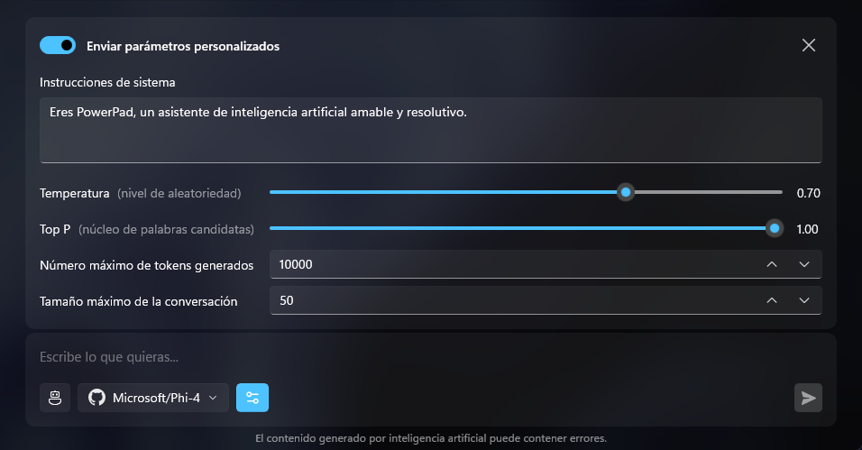

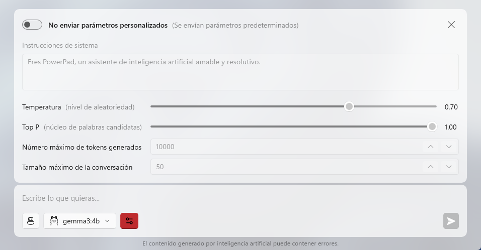

##### Descripción general:

Este control de usuario (`ChatControlParameters`) permite configurar los parámetros principales de interacción con modelos de IA en la interfaz de chat. Proporciona controles visuales para ajustar instrucciones del sistema, temperatura, Top P, número máximo de tokens generados y tamaño máximo de la conversación, facilitando la personalización del comportamiento del modelo IA por parte del usuario. Está diseñado para integrarse en aplicaciones WinUI3 siguiendo el patrón MVVM.

##### Estructura visual simplificada:

```xml
<UserControl x:Class="PowerPad.WinUI.Components.Controls.ChatControlParameters">
    <StackPanel>
        <TextBox x:Name="SystemPromptTextBox" Text="{x:Bind Parameters.SystemPrompt}" />
        <Grid>
            <StackPanel>
                <TextBlock Text="Temperatura" />
                <TextBlock Text="(nivel de aleatoriedad)" />
            </StackPanel>
            <Slider Grid.Column="1" Value="{x:Bind Parameters.Temperature" />
            <TextBlock Grid.Column="2" Text="{x:Bind Parameters.Temperature" />
            <StackPanel Grid.Row="1">
                <TextBlock Text="Top P" />
                <TextBlock Text="(núcleo de palabras candidatas)" />
            </StackPanel>
            <Slider Grid.Row="1" Grid.Column="1" Value="{x:Bind Parameters.TopP" />
            <TextBlock Grid.Row="1" Grid.Column="2" Text="{x:Bind Parameters.TopP}" />
            <TextBlock Grid.Row="2" Text="Número máximo de tokens generados" />
            <NumberBox Grid.Row="2" Grid.Column="1" Value="{x:Bind Parameters.MaxOutputTokens}" />
            <TextBlock Grid.Row="3" Text="Tamaño máximo de la conversación" />
            <NumberBox Grid.Row="3" Grid.Column="1" Value="{x:Bind Parameters.MaxConversationLength}" />
        </Grid>
    </StackPanel>
</UserControl>
```

##### Código simplificado:

```csharp
public partial class ChatControlParameters : UserControl
{
    public AIParametersViewModel Parameters{ get; set; }
    public static readonly DependencyProperty ParametersProperty =
        DependencyProperty.Register(...);

    public ChatControlParameters() { ... }
}
```

##### Propiedades de dependencia:

- `Parameters`: `AIParametersViewModel` que contiene los parámetros configurables de IA para el chat.

##### Elementos visuales:

- `SystemPromptTextBox`: Caja de texto para ingresar instrucciones de sistema para el modelo IA.
- `Slider`: Control deslizante para ajustar el nivel de aleatoriedad (temperatura) del modelo.
- `Slider`: Control deslizante para ajustar el núcleo de palabras candidatas (Top P).
- `NumberBox`: Selector numérico para definir el límite de tokens generados por respuesta.
- `NumberBox`: Selector numérico para definir el tamaño máximo de la conversación.
- `TextBlock`: Etiquetas y descripciones para cada parámetro configurable.

##### Notas adicionales:

- El control utiliza enlaces bidireccionales (`x:Bind`) y convertidores personalizados para adaptar los valores entre la interfaz y el modelo de vista (`AIParametersViewModel`).

#### NoteAgentControl

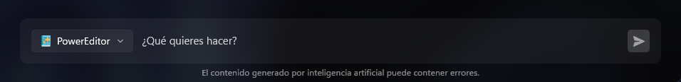


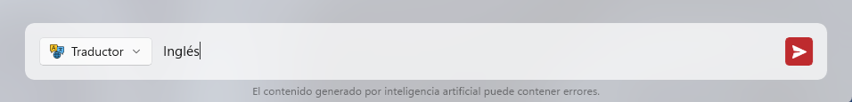

##### Descripción general:

`NoteAgentControl` es un control de usuario (UserControl) diseñado para gestionar la interacción con agentes de inteligencia artificial en el contexto de edición de notas. Permite seleccionar un agente, enviarle instrucciones o parámetros, visualizar el progreso de la operación y mostrar mensajes informativos o de error. El control adapta su interfaz según la disponibilidad de modelos IA y el estado de la operación, integrándose con el patrón MVVM y servicios de la aplicación.

##### Estructura visual simplificada:

```xml
<UserControl x:Class="PowerPad.WinUI.Components.Controls.NoteAgentControl">
	<StackPanel>
		<StackPanel x:Name="AgentPanel">
			<Grid>
				<StackPanel>
					<local:AgentSelector x:Name="AgentSelector" />
				</StackPanel>
				<local:IntegratedTextBox x:Name="PromptParameterInputBox" Grid.Column="1" />
				<StackPanel Grid.Column="2">
					<muxc:ProgressRing x:Name="AgentProgress" />
					<Button x:Name="SendButton">
						<FontIcon />
					</Button>
					<Button x:Name="StopButton">
						<FontIcon />
					</Button>
				</StackPanel>
			</Grid>
			<TextBlock Text="El contenido generado por inteligencia artificial puede contener errores." />
		</StackPanel>
		<muxc:InfoBar x:Name="InfoBar" />
	</StackPanel>
	<muxc:InfoBar Content="No hay modelos disponibles, revise la configuración."/>
	<StackPanel>
		<StackPanel Orientation="Horizontal">
			<muxc:ProgressRing/>
			<TextBlock Text="Inicializando..."/>
		</StackPanel>
	</StackPanel>
</UserControl>
```

##### Código simplificado:

```csharp
public partial class NoteAgentControl : UserControl, IDisposable
{
    private readonly IChatService _chatService;
    private readonly SettingsViewModel _settings;
    private CancellationTokenSource? _cts;
    private AgentViewModel? _selectedAgent;

    public event EventHandler<RoutedEventArgs>? SendButtonClicked;

    public NoteAgentControl() { ... }
    public void SetFocus() { ... }
    public async Task StartAgentAction(string input, StringBuilder output, Action<Exception> exceptionAction) { ... }

    private void UpdateVisibility() { ... }
    private void SelectedAgent_Changed( ... ) { ... }
    private void UpdateParameterInputBox() { ... }
    private void PromptParameterInputBox_TextChanged( ... ) { ... }
    private void SendBtn_Click( ... ) { ... }
    private void FinalizeAgentAction() { ... }
    private void StopBtn_Click( ... ) { ... }
    private void PromptParameterInputBox_KeyDown( ... ) { ... }
    public void Dispose() { ... }
    protected virtual void Dispose(bool disposing) { ... }
}
```

##### Elementos visuales:

- `AgentSelector`: Control personalizado para seleccionar el agente IA.
- `PromptParameterInputBox`: Cuadro de texto para introducir parámetros o instrucciones para el agente.
- `AgentProgress`: Indicador visual de progreso `ProgressRing` durante la operación con el agente.
- `SendButton`: Botón para enviar la instrucción al agente.
- `StopButton`: Botón para detener la operación en curso.
- `muxc:InfoBar`: Barra informativa cuando no hay modelos disponibles.
- `muxc:ProgressRing`: Indicador de carga durante la inicialización.

##### ViewModels:

- `_settings`: Instancia de `SettingsViewModel` que contiene la configuración global y de modelos.
- `_selectedAgent`: Instancia de `AgentViewModel` que representa el agente actualmente seleccionado.

##### Otras propiedades:

- `_chatService`: Servicio de chat para gestionar la comunicación con la IA.
- `_cts`: Token de cancelación para operaciones asíncronas.

##### Eventos:

- `SendButtonClicked`: Evento público que se dispara cuando el usuario hace clic en el botón de enviar.

##### Métodos públicos:

- `void SetFocus()`: Establece el foco en el elemento de entrada adecuado según la configuración del agente seleccionado.
- `Task StartAgentAction(string input, StringBuilder output, Action<Exception> exceptionAction)`: Inicia de forma asíncrona una acción para el agente seleccionado, enviando el texto de entrada y gestionando la respuesta del agente. Permite manejar excepciones a través de una acción proporcionada.
- `void Dispose()`: Libera los recursos utilizados por el control.

##### Otros métodos relevantes:

- `void UpdateVisibility()`: Actualiza la visibilidad de los elementos de la interfaz de usuario en función del agente seleccionado.
- `void SelectedAgent_Changed()`: Maneja el evento cuando cambia el agente seleccionado, actualizando la visibilidad y el cuadro de entrada de parámetros.
- `void UpdateParameterInputBox()`: Actualiza el cuadro de entrada de parámetros según la configuración del agente seleccionado.
- `void PromptParameterInputBox_TextChanged()`: Maneja el evento de cambio de texto en el cuadro de entrada de parámetros, habilitando o deshabilitando el botón de envío según el contenido.
- `void SendBtn_Click(RoutedEventArgs eventArgs)`: Maneja el evento de clic en el botón de envío, disparando el evento `SendButtonClicked`.
- `void FinalizeAgentAction()`: Finaliza la acción del agente restableciendo el estado de la interfaz de usuario.
- `void StopBtn_Click()`: Maneja el evento de clic en el botón de detener, cancelando la operación en curso y finalizando la acción del agente.
- `void PromptParameterInputBox_KeyDown(KeyRoutedEventArgs eventArgs)`: Maneja el evento de pulsación de tecla en el cuadro de entrada de parámetros, permitiendo el envío con `Enter` o la inserción de saltos de línea con `Shift`+`Enter`.
- `void Dispose(bool disposing)`: Libera los recursos utilizados por el control, diferenciando si la llamada proviene de `Dispose()`.

##### Notas adicionales:

- El control gestiona la visibilidad y el estado de los elementos de la interfaz de usuario en función de la disponibilidad de agentes y la configuración seleccionada.

### F.3.5 Controles individuales

#### IntegratedTextBox

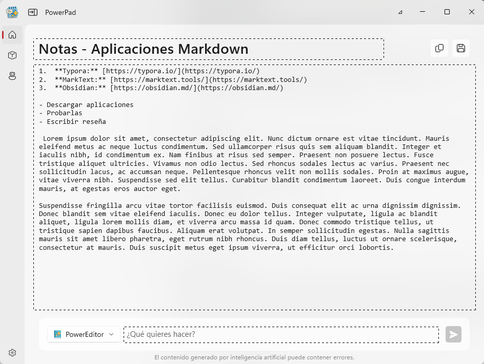

##### Descripción general:

`IntegratedTextBox` es un control personalizado que extiende el control `TextBox` de WinUI3. Su objetivo principal es proporcionar una caja de texto sin bordes ni fondo, de modo que queda integrada en su elemento contenedor. Permite forzar el color del texto mediante una propiedad de dependencia y actualiza automáticamente el color del texto según el estado del control (habilitado, solo lectura, deshabilitado). Además, ajusta estilos visuales para eliminar bordes y fondos, y desactiva la corrección ortográfica.

##### Estructura visual simplificada:

No aplica.

##### Código simplificado:

```csharp
public class IntegratedTextBox : TextBox
{
    public Brush? ForcedForeground { get; set; }
    public static readonly DependencyProperty ForcedForegroundProperty =
        DependencyProperty.Register(...);

    public IntegratedTextBox() { ... }
    private void UpdateForeground( ... ) { ... }
}
```

##### Propiedades de dependencia:

- `ForcedForeground`: Permite establecer un pincel personalizado para el color del texto, sobrescribiendo el comportamiento por defecto.

##### Otras propiedades:

- `DefaultStyleKey`: Define la clave de estilo por defecto para el control.
- `Resources`: Colección de recursos locales del control, utilizada para definir estilos y colores.
- `IsSpellCheckEnabled`: Indica si la corrección ortográfica está habilitada (establecida en `false` en el constructor).

#### EditableTextBlock

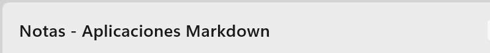

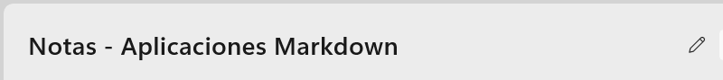

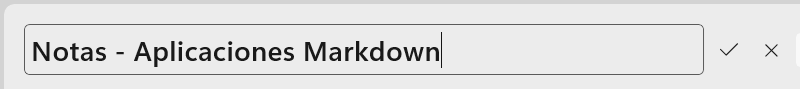

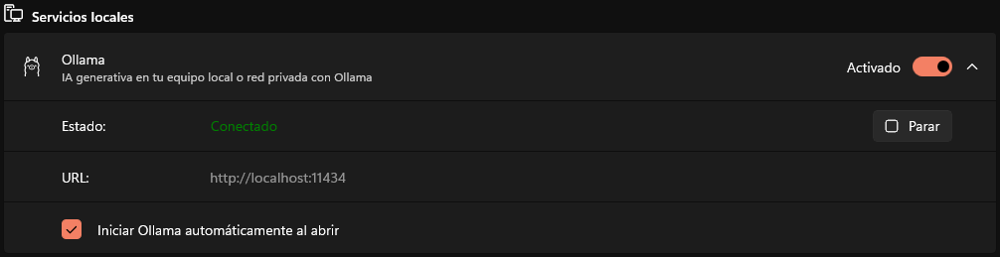


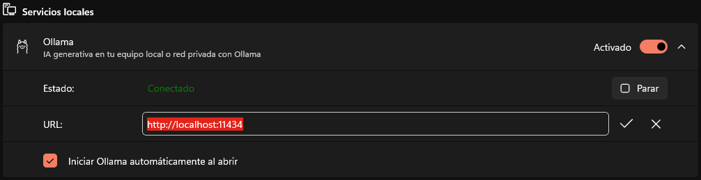

##### Descripción general:

`EditableTextBlock` es un control personalizado de WinUI3 que permite mostrar y editar texto de manera interactiva, con soporte para modo de contraseña (enmascarado), texto de marcador de posición (placeholder), y confirmación de cambios al perder el foco. Incluye botones para editar, confirmar y cancelar, y gestiona visualmente el estado de edición y la apariencia del borde.

##### Estructura visual simplificada:

```xml
<UserControl x:Class="PowerPad.WinUI.Components.Controls.EditableTextBlock">
    <Grid>
        <Border x:Name="Border">
            <local:IntegratedTextBox
                x:Name="IntegratedTextBox"
                FontSize="{x:Bind FontSize}"
                FontWeight="{x:Bind FontWeight}"
                ForcedForeground="{x:Bind ForcedForeground}"
                PlaceholderText="{x:Bind PlaceholderText, Mode=OneWay}" />
        </Border>
        <Button x:Name="EditButton" Grid.Column="1" />
        <StackPanel Grid.Column="1">
            <Button x:Name="ConfirmButton" />
            <Button x:Name="CancelButton" />
        </StackPanel>
    </Grid>
</UserControl>
```

##### Código simplificado:

```csharp
public partial class EditableTextBlock : UserControl
{
    private readonly EditableTextBlockState _state;
    private bool _focus;
    private bool _pointerOver;

    public string? Value { get; set; }
    public static readonly DependencyProperty ValueProperty =
        DependencyProperty.Register(...);

    public bool ConfirmOnLostFocus { get; set; }
    public static readonly DependencyProperty ConfirmOnLostFocusProperty =
        DependencyProperty.Register(...);

    public bool PasswordMode { get; set; }
    public static readonly DependencyProperty PasswordModeProperty =
        DependencyProperty.Register(...);

    public string? PlaceholderText { get; set; }
    public static readonly DependencyProperty PlaceholderTextProperty =
        DependencyProperty.Register(...);

    public Brush? ForcedForeground { get; set; }
    public static readonly DependencyProperty ForcedForegroundProperty =
        DependencyProperty.Register(...);

    public event EventHandler? Edited;

    public EditableTextBlock() { ... }
    public void EnterEditMode() { ... }

    private void IntegratedTextBox_KeyDown( ... ) { ... }
    private void IntegratedTextBox_LostFocus( ... ) { ... }
    private void Confirm() { ... }
    private void Cancel() { ... }
    private void Button_Click( ... ) { ... }
    private static string MaskedValue(string? value) { ... }
    private void UserControl_PointerEntered( ... ) { ... }
    private void UserControl_PointerExited( ... ) { ... }
    private void EditButton_GotFocus( ... ) { ... }
    private void EditButton_LostFocus( ... ) { ... }
    private void UpdateEditButtonOpacity() { ... }
}
```

##### Propiedades de dependencia:

- `Value`: Texto mostrado y editado en el control.
- `ConfirmOnLostFocus`: Indica si se debe confirmar el texto al perder el foco.
- `PasswordMode`: Indica si el texto debe mostrarse en modo contraseña (enmascarado).
- `PlaceholderText`: Texto de marcador de posición cuando el control está vacío.
- `ForcedForeground`: Pincel para forzar el color del texto.

##### Elementos visuales:

- `Border`: Borde que rodea el área de edición, se muestra en modo edición.
- `IntegratedTextBox`: Caja de texto integrada para mostrar y editar el contenido.
- `EditButton`: Botón para activar el modo de edición.
- `ConfirmButton`: Botón para confirmar los cambios realizados en el texto.
- `CancelButton`: Botón para cancelar la edición y restaurar el valor anterior.
- `FontIcon`: Iconos visuales para editar, confirmar y cancelar.

##### ViewModels:

- `_state`: Instancia de `EditableTextBlockState`, clase interna para gestión del estado.

##### Otras propiedades:

- `_focus`: Indica si el botón de edición tiene el foco.
- `_pointerOver`: Indica si el puntero está sobre el control.

##### Eventos:

- `Edited`: Se dispara cuando el texto es editado y confirmado.

##### Métodos públicos:

- `void EnterEditMode()`: Entra en modo edición, permitiendo al usuario modificar el texto.

##### Otros métodos relevantes:

- `void IntegratedTextBox_KeyDown(KeyRoutedEventArgs eventArgs)`: Maneja el evento KeyDown del cuadro de texto integrado, permitiendo confirmar o cancelar la edición mediante las teclas `Enter` o `Escape`.
- `void IntegratedTextBox_LostFocus()`: Maneja el evento LostFocus del cuadro de texto integrado, confirmando la edición si está habilitada la opción ConfirmOnLostFocus.
- `void Confirm()`: Confirma el texto actual y sale del modo edición, actualizando el valor y lanzando el evento Edited.
- `void Cancel()`: Cancela la edición y revierte el texto al valor anterior.
- `void Button_Click(object sender)`: Maneja los clics en los botones de editar, confirmar y cancelar, ejecutando la acción correspondiente.
- `static string MaskedValue(string? value)`: Devuelve una versión enmascarada del texto (con puntos) para el modo contraseña.
- `void UserControl_PointerEntered()`: Maneja el evento PointerEntered para actualizar la opacidad del botón de edición.
- `void UserControl_PointerExited()`: Maneja el evento PointerExited para actualizar la opacidad del botón de edición.
- `void EditButton_GotFocus()`: Maneja el evento GotFocus del botón de edición, actualizando su opacidad.
- `void EditButton_LostFocus()`: Maneja el evento LostFocus del botón de edición, actualizando su opacidad.
- `void UpdateEditButtonOpacity()`: Actualiza la opacidad del botón de edición según el estado de foco y puntero.

##### Notas adicionales:

- La propiedad `Value` se sincroniza con el contenido del cuadro de texto y puede ser enmascarada si `PasswordMode` está activo.
- El comportamiento visual (visibilidad y opacidad de botones) se gestiona dinámicamente según el estado interno y la interacción del usuario.

#### Label

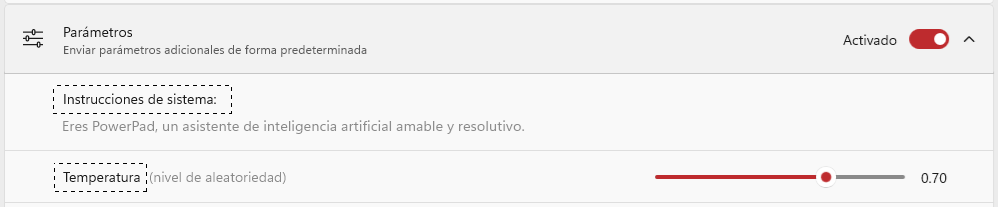

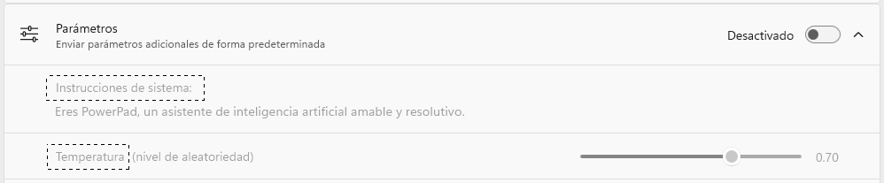

##### Descripción general:

Este control personalizado `Label` es un componente visual reutilizable para aplicaciones WinUI3, que muestra texto y ajusta dinámicamente el color del texto (Foreground) dependiendo de si el control está habilitado o deshabilitado. Está diseñado para integrarse en interfaces y proporciona una experiencia visual coherente con el estado de habilitación del control.

##### Estructura visual simplificada:

```xml
<UserControl x:Class="PowerPad.WinUI.Components.Controls.Label">
    <TextBlock x:Name="TextBlock" Text="{x:Bind Text, Mode=OneWay}"/>
</UserControl>
```

##### Código simplificado:

```csharp
public partial class Label : UserControl
{
    private Brush? _previousForegroundBrush;

    public string? Text { get; set;}
    public static readonly DependencyProperty TextProperty =
        DependencyProperty.Register(...);

    public Label() { this.InitializeComponent(); }

    private void Label_IsEnabledChanged( ... ) => UpdateForeground();
    private void Label_Loaded( ... ) => UpdateForeground();
    private void UpdateForeground() { ... }
}
```

##### Propiedades de dependencia:

- `Text`: Define el contenido de texto que se muestra en el control Label.

##### Elementos visuales:

- `TextBlock`: Muestra el texto definido por la propiedad `Text` y actualiza su color según el estado de habilitación del control.

##### Otras propiedades:

- `_previousForegroundBrush`: Almacena el pincel de primer plano original para restaurarlo cuando el control vuelve a estar habilitado.

##### Eventos:

- `IsEnabledChanged`: Se utiliza para detectar cambios en el estado de habilitación y actualizar el color del texto.
- `Loaded`: Se utiliza para inicializar el color del texto cuando el control se carga por primera vez.

##### Otros métodos relevantes:

- `void Label_IsEnabledChanged()`: Maneja el evento IsEnabledChanged para llamar a `UpdateForeground()`.
- `void Label_Loaded()`: Maneja el evento Loaded para para llamar a `UpdateForeground()` cuando el control se carga por primera vez.
- `void UpdateForeground()`: Actualiza el color del primer plano (Foreground) del control Label en función de si el control está habilitado o deshabilitado.

##### Notas adicionales:

- El control utiliza enlace unidireccional para la propiedad Text hacia el TextBlock interno.
- El color del primer plano se restaura al valor anterior si el control vuelve a estar habilitado, y se establece a un color de recurso específico (`TextFillColorDisabledBrush`) cuando está deshabilitado.

#### ModelSelector

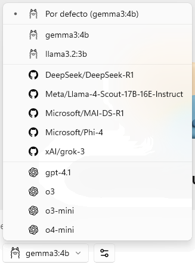

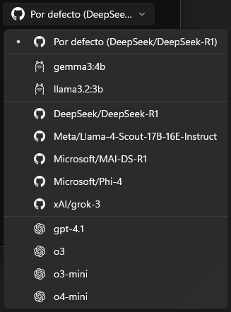

##### Descripción general:

El control `ModelSelector` es un control reutilizable que permite seleccionar un modelo de IA desde un menú desplegable (flyout). Está diseñado para integrarse en PowerPad y facilitar la gestión visual y lógica de la selección de modelos, mostrando el modelo actual y permitiendo cambiarlo dinámicamente. El control se conecta a los ViewModels de configuración y modelos, actualizando su interfaz en respuesta a cambios en la disponibilidad de proveedores o modelos, y permite mostrar el modelo por defecto como opción principal.

##### Estructura visual simplificada:

```xml
<UserControl x:Class="PowerPad.WinUI.Components.Controls.ModelSelector">
    <Grid>
        <DropDownButton x:Name="ModelButton">
            <DropDownButton.Flyout>
                <MenuFlyout x:Name="ModelFlyoutMenu"/>
            </DropDownButton.Flyout>
            <DropDownButton.Content>
                <StackPanel Orientation="Horizontal">
                    <local:ButtonIcon x:Name="ModelIcon"/>
                    <TextBlock x:Name="ModelName"/>
                </StackPanel>
            </DropDownButton.Content>
        </DropDownButton>
    </Grid>
</UserControl>
```

##### Código simplificado:

```csharp
public sealed partial class ModelSelector : UserControl, IDisposable
{
    private const double DEBOURCE_INTERVAL = 200;

    private readonly SettingsViewModel _settings;
    private readonly DispatcherTimer _debounceTimer;

    public bool ShowDefaultOnButtonContent { get; set; }
    public static readonly DependencyProperty ShowDefaultOnButtonContentProperty =
        DependencyProperty.Register(...);

    public AIModelViewModel? SelectedModel { get; private set; }

    public event EventHandler? SelectedModelChanged;

    public ModelSelector() { ... }
    public void Initialize(AIModelViewModel? model) { ... }
    public void UpdateEnabledLayout(bool newValue) { ... }

    private void Select(AIModelViewModel? model) { ... }
    private void UpdateCheckedItemMenu() { ... }
    private void DebounceTimer_Tick( ... ) ( ... )
    private void Models_PropertyChanged( ... ) ( ... )
    private void RegenerateFlyoutMenu() { ... }
    private void ModelItem_Click( ... ) ( ... )
    private void UpdateButtonContent() { ... }
    private void DefaultModel_Changed( ... ) ( ... )
    public void Dispose() { ... }
}
```

##### Constantes:

- `DEBOURCE_INTERVAL`: Constante privada que define el intervalo de *debounce* en milisegundos.

##### Propiedades de dependencia:

- `ShowDefaultOnButtonContent`: Indica si se debe mostrar el modelo por defecto en el contenido del botón.

##### Elementos visuales:

- `ModelButton`: Botón desplegable principal que muestra el modelo seleccionado y abre el menú de selección.
- `ModelFlyoutMenu`: Menú desplegable (flyout) que contiene la lista de modelos disponibles y el modelo por defecto.
- `ModelIcon`: Icono visual que representa el proveedor del modelo seleccionado.
- `ModelName`: Texto que muestra el nombre del modelo seleccionado.

##### ViewModels:

- `_settings`: Instancia de `SettingsViewModel` utilizada para acceder a la configuración general y la lista de modelos.
- `SelectedModel`: Instancia de `AIModelViewModel` que representa el modelo actualmente seleccionado.

##### Otras propiedades:

- `_debounceTimer`: Temporizador interno para evitar actualizaciones excesivas del menú.

##### Eventos:

- `SelectedModelChanged`: Evento que se dispara cuando cambia el modelo seleccionado.

##### Métodos públicos:

- `void Initialize(AIModelViewModel? model)`: Inicializa el control estableciendo como seleccionado el modelo de IA especificado (si procede), configurando el menú desplegable y suscripciones a eventos de cambios en los modelos y proveedores.
- `void UpdateEnabledLayout(bool newValue)`: Actualiza el diseño visual del control y del icono según el estado habilitado o deshabilitado.
- `void Dispose()`: Libera los recursos utilizados por el control y elimina las suscripciones a eventos para evitar fugas de memoria.

##### Otros métodos relevantes:

- `void Select(AIModelViewModel? model)`: Selecciona el modelo de IA especificado, actualiza el menú y el contenido del botón.
- `void UpdateCheckedItemMenu()`: Actualiza el estado marcado de los elementos en el menú desplegable para reflejar el modelo seleccionado.
- `void DebounceTimer_Tick()`: Maneja el evento de temporizador para regenerar el menú desplegable tras un intervalo de espera (debounce).
- `void Models_PropertyChanged()`: Maneja los cambios en la disponibilidad de modelos o proveedores, reiniciando el temporizador de debounce.
- `void RegenerateFlyoutMenu()`: Regenera el menú desplegable con los modelos y proveedores disponibles, incluyendo la opción por defecto.
- `void ModelItem_Click(object sender)`: Maneja el evento de selección de un modelo en el menú, actualizando el modelo seleccionado y el contenido del botón.
- `void UpdateButtonContent()`: Actualiza el contenido visual del botón según el modelo seleccionado o el modelo por defecto.
- `void DefaultModel_Changed()`: Maneja los cambios en el modelo por defecto, actualizando el menú y el contenido del botón si corresponde.

##### Notas adicionales:

- Utiliza un temporizador de *debounce* para evitar regeneraciones excesivas del menú ante cambios rápidos en los modelos o proveedores.
- El evento `SelectedModelChanged` notifica a otros componentes cuando el modelo seleccionado cambia.

#### AgentSelector

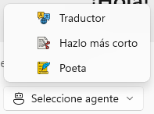

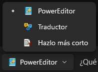

##### Descripción general:

El control `AgentSelector` es un componente visual reutilizable que permite al usuario seleccionar un agente de IA disponible, filtrando la lista de agentes según el tipo de documento (nota o chat). Presenta un botón desplegable que muestra los agentes disponibles en un menú tipo flyout, permitiendo seleccionar uno y reflejando la selección tanto visualmente como a nivel de datos. Está diseñado para integrarse en el interfaz y facilitar la interacción con los agentes en conversaciones y edición de notas.

##### Estructura visual simplificada:

```xml
<UserControl x:Class="PowerPad.WinUI.Components.Controls.AgentSelector">
    <Grid>
        <DropDownButton x:Name="AgentButton">
            <DropDownButton.Flyout>
                <MenuFlyout x:Name="AgentFlyoutMenu"/>
            </DropDownButton.Flyout>
            <DropDownButton.Content>
                <StackPanel>
                    <local:AgentIconControl x:Name="AgentIconControl"/>
                    <TextBlock x:Name="AgentName" Text="Seleccione"/>
                </StackPanel>
            </DropDownButton.Content>
        </DropDownButton>
    </Grid>
</UserControl>
```

##### Código simplificado:

```csharp
public sealed partial class AgentSelector : UserControl, IDisposable
{
    private readonly AgentsCollectionViewModel _agentsCollection;
    private bool _selectFirstAgent;

    public DocumentType DocumentType { get; set; }
    public static readonly DependencyProperty DocumentTypeProperty =
        DependencyProperty.Register(...);

    public AgentViewModel? SelectedAgent { get; private set; }

    public event EventHandler? SelectedAgentChanged;

    public AgentSelector() { ... }
    public void Initialize(AgentViewModel? agent, bool selectFirstAgent = false) { ... }
    public void ShowMenu() { ... }
    private void Select(AgentViewModel? agent) { ... }
    private void UpdateCheckedItemMenu() { ... }
    private void Agents_AgentsAvailabilityChanged( ... ) { ... }
    private void RegenerateFlyoutMenu() { ... }
    private IEnumerable<AgentViewModel> GetEnabledAgents() { ... }
    private void AgentItem_Click( ... ) { ... }
    private void UpdateButtonContent() { ... }
    public void Dispose() { ... }
}
```

##### Propiedades de dependencia:

- `DocumentType`: Especifica el tipo de documento (nota o chat) para filtrar los agentes mostrados en el selector.

##### Elementos visuales:

- `AgentButton`: Botón desplegable principal que muestra el agente seleccionado y permite abrir el menú de selección.
- `AgentFlyoutMenu`: Menú desplegable (flyout) que contiene la lista de agentes disponibles como elementos seleccionables.
- `AgentIconControl`: Control visual que muestra el icono del agente seleccionado.
- `AgentName`: TextBlock que muestra el nombre del agente seleccionado.

##### ViewModels:

- `_agentsCollection`: Instancia de `AgentsCollectionViewModel` que proporciona la colección de agentes disponibles y notifica cambios en su disponibilidad.
- `SelectedAgent`: Propiedad que representa el agente actualmente seleccionado, de tipo `AgentViewModel`.

##### Otras propiedades:

- `_selectFirstAgent`: Indica si se debe seleccionar automáticamente el primer agente disponible si no se proporciona uno.

##### Eventos:

- `SelectedAgentChanged`: Se dispara cuando el agente seleccionado cambia.

##### Métodos públicos:

- `void Initialize(AgentViewModel? agent, bool selectFirstAgent = false)`: Inicializa el control con un agente específico y, opcionalmente, selecciona el primer agente disponible si no se proporciona ninguno.
- `void ShowMenu()`: Muestra el menú desplegable para la selección de agentes.
- `void Dispose()`: Libera los recursos utilizados por el control y desuscribe los eventos asociados.

##### Otros métodos relevantes:

- `void Select(AgentViewModel? agent)`: Selecciona el agente especificado y actualiza la interfaz de usuario en consecuencia.
- `void UpdateCheckedItemMenu()`: Actualiza el estado de selección de los elementos del menú en el menú desplegable.
- `void Agents_AgentsAvailabilityChanged()`: Maneja los cambios en la disponibilidad de los agentes y actualiza el menú.
- `void RegenerateFlyoutMenu()`: Regenera el menú desplegable en función de los agentes habilitados y el tipo de documento.
- `IEnumerable<AgentViewModel> GetEnabledAgents()`: Recupera la lista de agentes habilitados según el tipo de documento actual.
- `void AgentItem_Click(object sender)`: Maneja el evento de clic sobre un elemento del menú de agentes, seleccionando el agente correspondiente y actualizando el botón.
- `void UpdateButtonContent()`: Actualiza el contenido visual del botón para reflejar el agente seleccionado.

##### Notas adicionales:

- El evento `SelectedAgentChanged` notifica a otros componentes cuando el agente seleccionado cambia.
- La propiedad de dependencia `DocumentType` determina qué tipos de agentes se mostrarán en el menú desplegable.

#### ButtonIcon

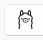  
 

_Representación visual de un icono de botón SVG habilitado y deshabilitado_

##### Descripción general:

El control `ButtonIcon` es un UserControl personalizado que muestra un icono configurable y ajusta su opacidad automáticamente según su estado habilitado o deshabilitado. Es útil para representar botones visuales con iconografía en formato SVG en interfaces WinUI3, ya que, por defecto, el color de una imagen SVG no se modifica al habilitar o deshabilitar el control que la contiene, lo que no es consistente con el comportamiento de otros elementos o iconos basados en fuentes.

##### Estructura visual simplificada:

```xml
<UserControl x:Class="PowerPad.WinUI.Components.Controls.ButtonIcon">
    <Grid>
        <ImageIcon Height="{x:Bind Height}" Source="{x:Bind Source}" />
    </Grid>
</UserControl>
```

##### Código simplificado:

```csharp
public partial class ButtonIcon : UserControl
{
    private readonly float ENABLED_OPACITY = 0.9f;
    private readonly float DISABLED_OPACITY = 0.5f;

    public ImageSource? Source { get; set; }
    public static readonly DependencyProperty SourceProperty =
        DependencyProperty.Register(...);

    public ButtonIcon() { ... }
    public void UpdateEnabledLayout(bool newValue) => Opacity = newValue ? ENABLED_OPACITY : DISABLED_OPACITY;
}
```

##### Constantes:

- `ENABLED_OPACITY`: Valor de opacidad cuando el botón está habilitado (0.9).
- `DISABLED_OPACITY`: Valor de opacidad cuando el botón está deshabilitado (0.5).

##### Propiedades de dependencia:

- `Source`: Define la fuente de la imagen que se mostrará como icono en el botón.

##### Elementos visuales:

- `ImageIcon`: Control de imagen que muestra el icono, su altura y fuente se enlazan a las propiedades del control.

##### Métodos públicos:

- `void UpdateEnabledLayout(bool newValue)`: Fuerza la actualización de la opacidad del control en función de su estado habilitado o deshabilitado.

##### Notas adicionales:

- La propiedad `Source` está implementada como una DependencyProperty, lo que permite su enlace en XAML y su uso en estilos y plantillas.

#### AgentIconControl

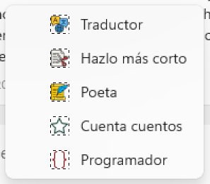

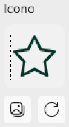

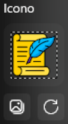

##### Descripción general:

`AgentIconControl` es un control personalizado de usuario diseñado para mostrar el icono de un agente, el cual puede representarse mediante una imagen en Base64 o un glifo de fuente. El control ajusta dinámicamente su contenido y tamaño según las propiedades establecidas, permitiendo una visualización flexible y coherente de iconos en la interfaz de usuario.

##### Estructura visual simplificada:

```xml
<UserControl x:Class="PowerPad.WinUI.Components.Controls.AgentIconControl">
    <Grid>
        <Image x:Name="ImageIcon"/>
        <FontIcon x:Name="FontIcon"/>
    </Grid>
</UserControl>
```

##### Código simplificado:

```csharp
public partial class AgentIconControl : UserControl
{
    public AgentIcon AgentIcon { get; set; }
    public static readonly DependencyProperty AgentIconProperty =
        DependencyProperty.Register(...);

    public double Size { get; set; }
    public static readonly DependencyProperty SizeProperty =
        DependencyProperty.Register(...);

    public AgentIconControl() { ... }
    private void AgentIconChanged( ... ) { ... }
    private void IconSizeChanged( ... ) { ... }
}
```

##### Propiedades de dependencia:

- `AgentIcon`: Define el objeto que especifica el tipo y la fuente del icono a mostrar.
- `Size`: Especifica el tamaño (alto y ancho) del icono.

##### Elementos visuales:

- `ImageIcon`: Imagen utilizada para mostrar un icono basado en una imagen en Base64.
- `FontIcon`: Icono de fuente utilizado para mostrar un glifo como icono.

##### Métodos relevantes:

- `void AgentIconChanged()`: Callback invocado cuando la propiedad AgentIcon cambia. Actualiza la visibilidad y el contenido del icono mostrado según el tipo de icono (imagen Base64 o glifo de fuente).
- `void IconSizeChanged()`: Callback invocado cuando la propiedad Size cambia. Actualiza las dimensiones del control y de los elementos hijos (ImageIcon y FontIcon) para reflejar el nuevo tamaño.