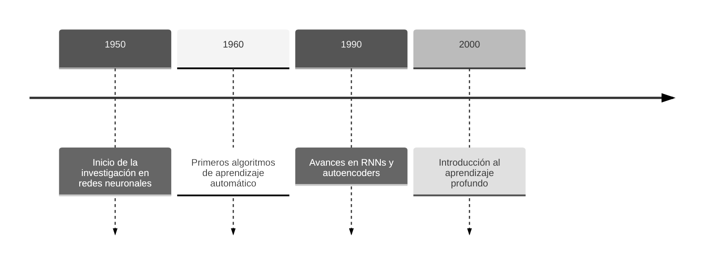
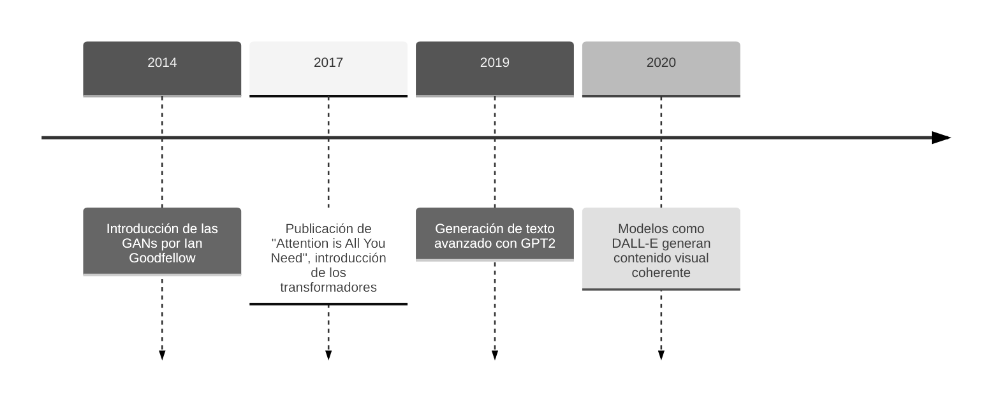
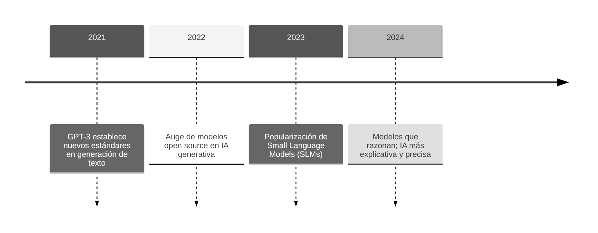

## 3.1 Conceptos de IA Generativa

### 3.1.1 Historia y Evolución de la IA Generativa

La Inteligencia Artificial Generativa ha tenido un proceso evolutivo largo y fascinante, marcado por hitos importantes en el aprendizaje automático y la creación de distintos modelos computacionales. Desde los primeros pasos en las décadas de 1950 y 1960, hasta los sofisticados modelos actuales basados en transformadores (_transformers_), la IA Generativa ha redefinido profundamente cómo producimos contenido textual, visual y multimedia, automatizando procesos y ampliando las capacidades creativas.

A lo largo de este recorrido, tecnologías clave como las redes neuronales recurrentes (RNNs), las redes generativas antagónicas (GANs) o los _transformers_ han sido responsables de algunos de los mayores avances en esta disciplina. Cada una de estas etapas ha supuesto innovaciones significativas que han aumentado las posibilidades de aplicación de esta tecnología.

#### De los 50 a los 2000s: Primeros pasos

-   **1950: Inicio de la investigación en redes neuronales**
    Surge la idea de emular el cerebro humano mediante algoritmos artificiales. Los primeros modelos, como el perceptrón, establecen la base para el desarrollo de redes más complejas.

-   **1960: Primeros algoritmos de aprendizaje automático**
    Se elaboran los primeros algoritmos diseñados para aprender patrones a partir de muestras de datos, un hito crucial para el aprendizaje automático. Destacan conceptos como descenso del gradiente.

-   **1990: Avances en RNNs y _autoencoders_**
    Las redes neuronales recurrentes (RNNs) permitieron manejar datos secuenciales, como texto y audio. Por otro lado, los _autoencoders_ introdujeron formas eficientes de compresión y reconstrucción de datos, imprescindibles en aplicaciones como el reconocimiento de imágenes.

-   **2000: Introducción al aprendizaje profundo**
    Con el aumento de la capacidad computacional y la disponibilidad de grandes volúmenes de datos, se hicieron populares las arquitecturas de redes de aprendizaje profundo (_Deep Learning_). Algoritmos como el _Deep Belief Network_ y las primeras aplicaciones de convoluciones en visión por computadora (_CNNs_) abren el camino para las redes modernas.

#### De 2011 a 2020: Surgen los modelos generativos

-   **2014: Introducción de las GANs por Ian Goodfellow**
    Las Redes Generativas Antagónicas (GANs) fueron una revolución para la generación de contenido al utilizar un par de redes que compiten entre sí: una generadora y una discriminadora.

-   **2017: Publicación de "Attention is All You Need", introducción de los transformadores**
    Este artículo presentó el modelo de transformadores, basado en mecanismos de atención que priorizan las relaciones contextuales de los datos. Este hito marcó un antes y un después en el procesamiento de lenguaje natural (NLP).

-   **2019: Generación de texto avanzado con GPT2**
    _OpenAI_ introduce GPT-2, un modelo con capacidad para generar texto coherente y relevante en diferentes contextos. Este modelo mostró el verdadero potencial de la arquitectura _transformer_ para tareas de generación de texto a gran escala.

-   **2020: Modelos como _DALL-E_ generan contenido visual coherente**
    _DALL-E_ (Open AI) combina el procesamiento del lenguaje y la generación de imágenes para crear representaciones visuales basadas en descripciones, mostrando por primera vez una integración única entre texto y contenido visual generado.

#### De 2021 a la actualidad: El BOOM de la IA Generativa

-   **2021: GPT-3 establece nuevos estándares en generación de texto**
    GPT-3, con 175 mil millones de parámetros, lleva las capacidades de generación de texto a un nivel nunca visto antes, destacando por su habilidad para contextualizar, interpretar y crear contenido coherente y específico.

-   **2022: Auge de modelos open source en IA generativa**
    Modelos como **BLOOM** (BigScience) o **Stable Diffusion** (Runway) contribuyeron a la democratización de la IA generativa, ofreciendo alternativas personalizables y locales a las soluciones comerciales, una aportación importante para la investigación. Muchos otros modelos open source surgieron desde entonces.

-   **2023: Popularización de Small Language Models (SLMs)**
    Los SLMs, como **TinyLlama** y otras variantes compactas de **LLaMA**, o **Phi-2** (Microsoft), ganaron popularidad por su capacidad de ofrecer buenos resultados con menor consumo de recursos. Se popularizaron técnicas como la destilación del conocimiento, que permiten entrenar modelos pequeños a partir de modelos grandes, reteniendo gran parte de su capacidad a un menor coste.

-   **2024: Modelos que razonan: IA explicativa y precisa**
    Modelos como **o1** (OpenAI) y avances en **Claude 3** (Anthropic) producen un punto de inflexión en el razonamiento contextual y explicable, ya que no solo generan contenido, sino que emplean tiempo en razonar de forma interna antes de responder. Estas soluciones representan un paso importante hacia contenidos más seguros y confiables.

>Sources:
>https://www.qualcomm.com/news/onq/2024/02/>the-rise-of-generative-ai-timeline-of-breakthrough-innovations
>https://www.datacamp.com/blog/top-small-language-models + https://arxiv.org/pdf/>2409.15790
>https://timeline.the-blueprint.ai/
>https://nhlocal.github.io/AiTimeline/

### 3.1.2 Principios de Modelos Generativos

Los modelos generativos se basan en aprender patrones y características a partir de datos existentes para luego crear contenido nuevo que sea coherente y relevante. A lo largo de los años, se han desarrollado distintas técnicas, arquitecturas y enfoques que han marcado hitos importantes en este campo. En este apartado, veremos algunos de los conceptos más destacados.

#### Embeddings

Para que los modelos generativos puedan "entender" datos como texto o incluso imágenes, es necesario convertir esa información en representaciones numéricas (vectores). En el caso del lenguaje, esto se logra a través de los llamados _embeddings_. Estas son básicamente representaciones vectoriales de palabras o tokens (unidades mínimas de texto), donde cada dimensión refleja alguna característica semántica o contextual. En otras palabras, si dos palabras tienen significados similares, sus embeddings estarán más "cerca" en el espacio vectorial.

#### Tokens

Los _tokens_ son la unidad mínima de texto que procesa un determinado modelo de lenguaje. Dependiendo del enfoque, un token puede representar una palabra completa, una parte de una palabra (por ejemplo, "auto", "re", "mente") o incluso una sola letra o signo. La forma en que se realiza esta segmentación puede influir mucho en la eficiencia y precisión del modelo. Por ejemplo, en arquitecturas como los *transformers*, optimizar la segmentación de tokens resulta esencial para que el modelo entienda el contexto de forma adecuada y no se pierda en secuencias demasiado largas o ambiguas. 

(Posible diagrama con diferentes métodos de tokenización / mismo texto en fragmentos distintos)

#### Transformers

Un _transformer_ es un modelo o arquitectura de aprendizaje profundo desarrollado por científicos trabajadores de _Google_ y publicados en el artículo de investigación _Attention is All You Need_. Su novedad reside en el mecanismo de atención, que permite detectar y priorizar las partes más relevantes del texto de entrada. Gracias a este enfoque, se logra una comprensión del contexto mucho más profunda que con arquitecturas anteriores.

(diagrama de atención de un transformer para aclarar cómo funciona).

#### Redes Generativas Antagónicas (GANs)

Las Redes Generativas Antagónicas están formadas por dos redes neuronales que trabajan de forma competitiva: el generador produce contenido (por ejemplo, una imagen), mientras que el discriminador intenta distinguir si lo que ve es real o generado. Esta especie de juego de "tira y afloja" impulsa la red generadora a mejorar, resultando en creaciones cada vez más realistas. Gracias a esta técnica, se ha dado un salto enorme en la calidad de imágenes y videos sintéticos.

#### Aprendizaje por Difusión

El aprendizaje por difusión se basa en ir transformando gradualmente información estructurada mediante la difusión de ruido aleatorio (datos sin sentido), para luego revertir ese proceso "limpiando" la información y generando imágenes de mayor calidad. Es una técnica que permite un gran control sobre el resultado, sobre todo cuando se genera una imagen a partir de una descripción de texto.

#### Destilación del Conocimiento

La destilación del conocimiento es el procedimiento mediante el cual un modelo de gran tamaño (maestro) transfiere sus aprendizajes a un modelo más pequeño (estudiante). Al comprimir la información, se puede seguir manteniendo la mayor parte de la capacidad del modelo original, pero reduciendo el coste computacional. En la práctica, esto se ha convertido en una estrategia esencial para desplegar modelos en dispositivos con menos recursos como ordenadores personales o incluso dispositivos móviles.

#### Fine-Tuning

El _fine-tuning_ aprovecha el conocimiento adquirido por un modelo preentrenado y lo adapta a un dominio o tarea específica, reduciendo costos y tiempo de entrenamiento en comparación con empezar desde cero. 

En el desarrollo de software, el _fine-tuning_ adquiere gran relevancia al facilitar la personalización de modelos generativos para necesidades puntuales, como automatizar flujos de trabajo empresariales, diseñar interfaces a medida o codificar las reglas de negocio de una forma específica, convirtiéndose así en un recurso esencial para incorporar la IA generativa como asistente activo en cada fase del desarrollo.

(ilustración del concepto asistentes especializados del proyecto)

>Sources:
>https://www.ibm.com/mx-es/think/topics/diffusion-models
>https://www.ibm.com/es-es/topics/knowledge-distillation

## 3.2 Principios y Ventajas del Enfoque Low Code

El enfoque Low Code ha ganado un lugar destacado en el panorama del desarrollo de aplicaciones actual, ofreciendo una alternativa rápida y accesible frente a los métodos de programación tradicionales. Aunque el concepto de herramientas de desarrollo visual no es nuevo, con orígenes que se remontan a aplicaciones como Microsoft Access en los años 90, el Low Code ha evolucionado significativamente en la última década, impulsado por la necesidad de facilitar la transformación digital en las organizaciones.

En lugar de depender exclusivamente de líneas de código, este paradigma se apoya en herramientas gráficas, procesos automáticos y componentes modulares que simplifican la creación de aplicaciones. Para las empresas, esto no solo representa una democratización en la construcción de soluciones, facilitando que equipos de negocio participen de forma más activa en el desarrollo, sino que también responde de forma más ágil a las demandas del mercado.

*(Sugerencia visual: una imagen comparativa entre desarrollo tradicional y Low Code, destacando el menor volumen de código frente a la interfaz gráfica y la velocidad en el proceso.)*

#### Principios Fundamentales

1.  **Reducir el código**
    Este enfoque redefine el desarrollo tradicional al delegar tareas repetitivas y sencillas, como la configuración de funcionalidades básicas, a herramientas automatizadas y componentes preconstruidos. Así, los desarrolladores pueden concentrar sus esfuerzos los verdaderos retos de la solución.
    
    *(Se podría incluir una infografía que muestre un diagrama comparando líneas de código en un proyecto tradicional vs. uno Low Code)*

2.  **Accesibilidad para usuarios no técnicos**
    Uno de los pilares más importantes del Low Code es su vocación de abrir la construcción de aplicaciones a profesionales de diferentes áreas. Al reducir la barrera técnica, perfiles de marketing, ventas u operaciones pueden involucrarse mucho más en los proyectos.

3.  **Modularidad y reutilización**
    Gracias a un enfoque modular, los componentes desarrollados se pueden reutilizar en distintas aplicaciones, manteniendo una mayor coherencia en la presentación y usabilidad.

4.  **Integración**
    Las plataformas Low Code facilitan la conexión con sistemas, servicios y bases de datos a través de conectores prediseñados. Esto suele ser común en ambos sentidos, tanto en la incorporación como en la exportación de la información almacenada.

#### Principales Ventajas

1.  **Rapidez y adaptabilidad**\
    La capacidad de construir aplicaciones con componentes prediseñados puede reducir hasta en un 70% los tiempos de desarrollo  (TODO: buscar cita!!!). También la capacidad de realizar cambios sin tener que reescribir grandes cantidades de código permite a las empresas responder rápidamente a nuevas exigencias. Todo esto se traduce en una reducción del _time to market_: las soluciones pasan del concepto a la realidad en mucho menor tiempo.
    
2.  **Democratización y colaboración**
    La accesibilidad para usuarios no técnicos potencia el trabajo multidisciplinar y la colaboración desde distintas áreas de la compañía, ofreciendo como resultado soluciones más alineadas con las necesidades reales del negocio.

3.  **Usabilidad**
    Aumentar la coherencia y reducir la complejidad de los desarrollos facilita y mejora la experiencia del usuario, algo importante sobre todo en entornos empresariales donde los mismos pueden manejar un gran número de aplicaciones distintas. 

4.  **Innovación y coste**\
    Al reducir los tiempos empleados por programadores altamente especializados y optimizar la entrega de soluciones, las empresas logran disminuir gastos relacionados tanto con el desarrollo como con el mantenimiento de las aplicaciones. Concentrar el esfuerzo técnico en tareas de mayor valor también permite el diseño de soluciones más innovadoras y en mantenimiento perfectivo, lo que se traduce en menos riesgo de obsolescencia.

5.  **Menor Índice de Errores**
    Con plantillas y validaciones automatizadas, el enfoque Low Code reduce los típicos fallos de la programación manual, garantizando aplicaciones más robustas y confiables, tanto para su explotación como para su mantenimiento posterior. 

6.  **Facilidad de integración**
    Las integraciones se llevan a cabo de forma rápida, reduciendo el riesgo de problemas de compatibilidad y los tiempos de configuración.

(Se podría añadir un diagrama al final que resuma el flujo de trabajo típico de un proyecto Low Code, mostrando el rol de cada participante y los pasos principales de diseño, desarrollo e integración.)

## 3.3 Plataformas Low Code Actuales y Limitaciones

#### Plataformas Destacadas

1.  **Microsoft Power Apps**
    Como parte del ecosistema de Microsoft, se integra con facilitad con otras herramientas de Microsoft 365. Para los equipos que ya están habituados a herramientas de este entorno, su adopción resulta bastante sencilla. Disponen de dos enfoques para la creación de aplicaciones, uno orientado al diseño visual y otro orientado a la generación de aplicaciones a partir del modelo.

2.  **OutSystems**
    Esta plataforma resalta por estar muy enfocada en la escalabilidad y en la construcción de aplicaciones de gran envergadura. Suele ofrecer una infraestructura robusta de integración y despliegue, especialmente cuando se trabaja en proyectos empresariales críticos.

3.  **Mendix**
    Mendix ofrece una experiencia de usuario personalizada a través de un potente editor visual con previsualización en tiempo real, permitiendo a los usuarios evaluar los cambios en las aplicaciones mientras las desarrollan. También destaca su compatibilidad con entornos multi-nube, lo que facilita el despliegue y la escalabilidad.

4.  **Appian**
    Está muy orientada a la automatización de procesos, destacando en contextos donde se busca agilizar flujos internos y reducir tiempos de ejecución. La facilidad con la que modela procesos de forma visual y coordina herramientas empresariales la ha posicionado como una opción líder para este propósito.
    
    (¿esquema visual de un proceso automatizado típico en Appian?)

5.  **Oracle APEX (Application Express)**
    En entornos Oracle, APEX es la opción Low Code más habitual, ya que permite crear aplicaciones seguras y escalables sin salir del ecosistema Oracle. Es especialmente útil si la gestión de datos es prioritaria, dado que APEX se integra a la perfección con la base de datos.

6.  **Otras plataformas**
    Junto a estas cinco plataformas principales, el panorama Low Code también incluye soluciones que se adaptan a distintas necesidades. Zoho Creator, por ejemplo, encaja muy bien en pequeñas empresas que buscan rapidez al desarrollar aplicaciones internas, Salesforce Lightning resulta útil para aquellas ya inmersas en el ecosistema Salesforce. Google AppSheet destaca por su integración con Google Workspace y la facilidad con la que convierte hojas de cálculo en aplicaciones operativas.

#### Limitaciones Comunes

1.  **Falta de Personalización**
    A pesar de que los sistemas Low Code facilitan la creación de aplicaciones, cuando surgen necesidades demasiado específicas es probable que haya que recurrir al desarrollo manual. Esto puede traer complicaciones si se requieren funcionalidades muy personalizadas que no encajan con la plataforma.

2.  **Dependencia del Proveedor**
    Muchas veces, las aplicaciones creadas en estos entornos están tan ligadas a la infraestructura del proveedor que resulta complejo o muy costoso migrarlas a otras plataformas. Esta dependencia puede convertirse en un obstáculo estratégico a largo plazo.

3.  **Curva de Aprendizaje Inicial**
    Aunque las herramientas Low Code prometen accesibilidad, no todos los usuarios técnicos o de negocio se adaptan al mismo ritmo. Algunas tienen interfaces muy completas que pueden abrumar al principio.

4.  **Costos Ocultos**
    Es frecuente encontrar planes "freemium" o tarifas básicas atractivas, pero en cuanto se requiere escalar el proyecto o añadir conectores avanzados, el precio puede subir de forma considerable.

5.  **Integración Limitada**
    Aunque muchas herramientas incluyen un abanico grande de conectores prediseñados, no siempre abarcan todas las soluciones externas que una organización podría necesitar. En casos así, hay que crear integraciones personalizadas, lo que supone más recursos y mayor complejidad técnica.

>Sources: Las propias webs de las plataformas, articulos comparativos, etc

## 3.4 IA Generativa en el Desarrollo de Software: Estudios y Casos

En los últimos años, la inteligencia artificial generativa se ha convertido en un pilar fundamental para impulsar la innovación en el desarrollo de software. Estas tecnologías no solo automatizan procesos como la generación de código o la producción de pruebas unitarias, sino que también actúan como compañeros de equipo con la capacidad de adaptarse al contexto de cada proyecto.

A lo largo de esta sección, se examinarán estudios importantes y ejemplos prácticos que reflejan la influencia de la IA generativa en el ciclo de vida del software, haciendo énfasis en sus ventajas y también en los desafíos que presenta.

#### Estudios destacados

  - **Incremento de Productividad:** Un informe de OpenAI sobre el uso de Codex mostró que los programadores podían ahorrar hasta un 30% de tiempo en tareas de codificación repetitivas al recibir sugerencias rápidas y precisas que agilizan el flujo de trabajo.
  
  Chen, M., Tworek, J., Jun, H., Yuan, Q., et al. (2021). *Evaluating Large Language Models Trained on Code*. [arXiv:2107.03374](https://arxiv.org/abs/2107.03374)

  - **Calidad del Código Generado:** Investigaciones de Microsoft Research y GitHub Copilot indican que la mayoría del código generado automáticamente es funcional, aunque no está exento de la necesidad de supervisión humana para evitar problemas lógicos o brechas de seguridad.

  GitHub. (2021). *GitHub Copilot: Your AI pair programmer*. Blog de GitHub-   Microsoft Research. (2021). *Copilot Research Overview*. [Microsoft Research Blog](https://www.microsoft.com/en-us/research/)

  - **Automatización de Pruebas:** Un equipo de Google DeepMind confirmó en uno de sus estudios que la IA generativa puede generar conjuntos de pruebas más exhaustivos que los diseñados de forma manual. Los resultados indican que estas herramientas cubren más casos de prueba e identifican errores que podrían pasar desapercibidos para un humano.

  Li, Y., et al. (2022). *Competition-Level Code Generation with AlphaCode*. [arXiv:2203.07814](https://arxiv.org/abs/2203.07814)
  (We reduced the false positive rates of our dataset by generating additional test cases...)

(¿infografía comparando la productividad con y sin IA generativa?)

#### Casos de uso reales

  - **GitHub Copilot**
  Herramienta impulsada por OpenAI y GitHub, diseñada para integrarse con editores como Visual Studio Code. Ofrece sugerencias de código basadas en el contexto, facilitando tareas como la implementación de funciones, la corrección de errores y la generación de documentación en código.

  - **DeepCode**
  Utiliza IA generativa para examinar grandes volúmenes de código en busca de vulnerabilidades. Proporciona recomendaciones específicas para corregir fallos, reforzando la seguridad y la calidad del proyecto.
  
  - **Tabnine**
  Sistema de autocompletado avanzado que emplea IA para entender el contexto y ofrecer sugerencias precisas en múltiples lenguajes. Simplifica la escritura de código, reduce errores comunes y agiliza la productividad.

  - **Cursor**
  Versión modificada de Visual Studio Code que incorpora funcionalidades de IA en tiempo real, como autocompletado y corrección de código. Ofrece explicaciones detalladas de fragmentos de código de gran complejidad.

Estos son solo algunos ejemplos. ya que el ecosistema de herramientas que aprovechan la inteligencia artificial generativa está en constante expansión. Herramientas como Amazon CodeWhisperer, Codeium, Replit Ghostwriter y otros servicios emergentes están surgiendo rápidamente para abordar distintas necesidades del desarrollo de software.

(¿logo de estas y otras herramientas?)

#### **Ventajas y Retos Identificados**

##### **Ventajas:**

  - **Aumento de productividad:** Al delegar a la IA las tareas más mecánicas, los desarrolladores se pueden centrar en aspectos estratégicos y de mayor complejidad.
  - **Accesibilidad para nuevos desarrolladores:** Herramientas como Copilot sirven de tutor virtual, lo que facilita la entrada al mundo de la programación.
  - **Reducción de errores:** Los modelos generativos suelen detectar patrones de error comunes e incluso proponer soluciones antes de que se conviertan en problemas mayores.

##### **Retos:**

  - **Seguridad del Código:** Es fundamental revisar el código sugerido por la IA para evitar vulnerabilidades críticas.
  - **Sesgos en los Modelos:** Dado que se entrenan con grandes volúmenes de datos, cualquier sesgo presente en los conjuntos de entrenamiento será replicado en la generación de código.
  - **Dependencia Tecnológica:** El uso excesivo de herramientas de IA podría disminuir la capacidad de los desarrolladores para resolver problemas de forma autónoma.

A pesar de los claros beneficios, estos desafíos destacan la importancia de establecer buenas prácticas y controles que vayan de la mano con la adopción de IA generativa en los equipos de desarrollo.