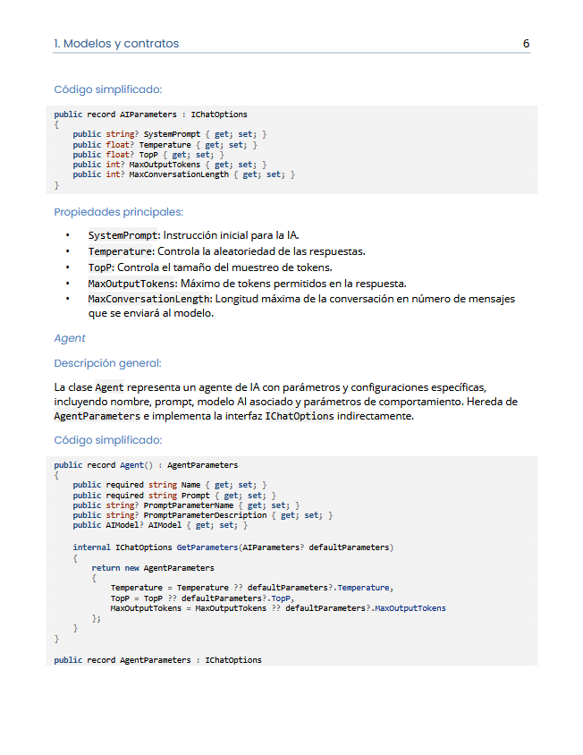

# Anexos

#### **Anexo I**: Documentación técnica de la solución

- Disponible en: https://gitlab.etsisi.upm.es/bj0666/powerpad/-/blob/main/Attachments/Anexo%20I%20-%20Documentaci%C3%B3n%20t%C3%A9cnica%20de%20la%20soluci%C3%B3n.pdf

#### **Anexo II**: Documentación generada por código

- Documentación completa: https://gitlab.etsisi.upm.es/bj0666/powerpad/-/tree/main/Attachments/doxygen
- Fichero ZIP: https://gitlab.etsisi.upm.es/bj0666/powerpad/-/blob/main/Attachments/doxygen.zip
- Indicaciones: Es necesario descomprimir el fichero completo localmente y acceder al índice en `index.html`.

#### **Anexo III**: Código fuente

- Dirección repositorio Git: https://gitlab.etsisi.upm.es/bj0666/powerpad.git
- Rama `main` (principal): https://gitlab.etsisi.upm.es/bj0666/powerpad/-/tree/main/
- Rama `next` (con ejemplos de pruebas unitarias y localización): https://gitlab.etsisi.upm.es/bj0666/powerpad/-/tree/next/
#### **Anexo IV**: Instalador

- Fichero MSIX: https://gitlab.etsisi.upm.es/bj0666/powerpad/-/blob/main/Attachments/PowerPad.WinUI_1.0.20.0_x64.msix
- Certificado autofirmado: https://gitlab.etsisi.upm.es/bj0666/powerpad/-/blob/main/Attachments/PowerPad.WinUI_TemporaryKey.pfx

(ELIMINAR ESTA MARCA)
